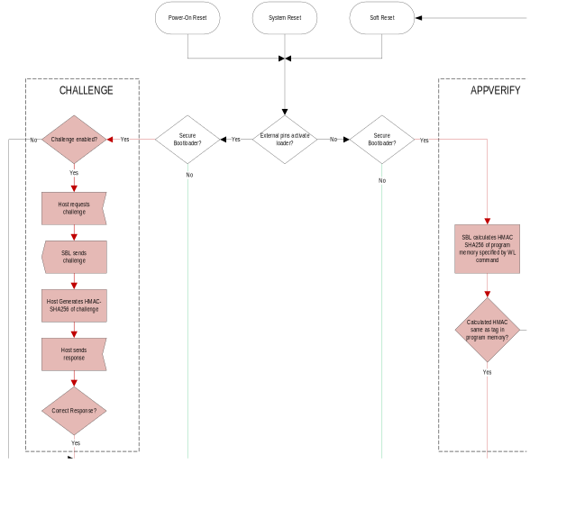

The ROM bootloader provides for program loading and verification. The physical interface between the external host and the bootloader defaults to the UART.

The secure bootloader (SBL) employs a hash-based message authentication code (HMAC SHA-256) to guarantee both the authenticity and downloaded program files and the integrity of internal program memory after each reset.

All versions of the bootloader provide the ability to block read/write
access to program memory.

Bootloader features:

-   Common functionality of the bootloader and secure bootloader
-   Checksum verification of the ROM image before further ROM execution.
-   SWD is disabled in LOCKED and PERMLOCKED states.
-   Programmable through the UART or SWD interface.
-   UART operates at 115200 bps.
-   LOCKED mode disables the SWD and disallows any change to flash through the bootloader.
-   Unlock erases all flash and secrets before unlocking SWD.
-   Optional PERMLOCKED state only allows for program validation lock.

Secure Bootloader (SBL) features:

-   Secure HMAC SHA-256 using secret key-based transactions.
-   The trusted secure boot provides automatic program memory verification and authentication before execution after every reset.
-   Integrity and authentication verification of program memory downloads
-   Optional challenge/response gating entry to the bootloader

## Instances

[Table 26‑1](#table26-1) shows the dedicated pins and features of the bootloader.

*Table 26-1: MAX78000 Bootloader Instances*

<table border="1" cellpadding="5" cellspacing="0">
<thead>
    <tr>
        <th rowspan="2">Part Number</th>
        <th colspan="2">Activation Pins</th>
        <th rowspan="2">Bootloader</th>
        <th rowspan="2">Secure Bootloader</th>
        <th rowspan="2">Flash Memory Page Size</th>
    </tr>
    <tr>
        <th>UART0 Receive</th>
        <th>SWDCLK</th>
    </tr>
</thead>
<tbody>
    <tr>
        <td>MAX78000EXG+</td>
        <td>P0.0</td>
        <td>P0.29</td>
        <td>Yes</td>
        <td>No</td>
        <td>8KB</td>
    </tr>
</tbody>
</table>

## Bootloader Operating States
Each bootloader supports the modes shown in [Table 26‑2](#table26-2). Each bootloader mode has a unique prompt.

*Table 26-2: The Bootloader Operating States and Prompts*

<table border="1" cellpadding="5" cellspacing="0">
<thead>
    <tr>
        <th>State</th>
        <th>Bootloader</th>
        <th>Secure Bootloader</th>
        <th>Recognized Commands</th>
        <th>Prompt</th>
    </tr>
</thead>
<tbody>
    <tr>
        <td><a href="#unlocked">UNLOCKED</a></td>
        <td>Yes</td>
        <td>Yes</td>
        <td>All Commands U/L/P</td>
        <td>
“ULDR&gt; “

        
&lt;0x55&gt; &lt;0x4C&gt; &lt;0x44&gt; &lt;0x52&gt; &lt;0x3E&gt;
        &lt;0x20&gt;
</td>
    </tr>
    <tr>
        <td><a href="#locked">LOCKED</a></td>
        <td>Yes</td>
        <td>Yes</td>
        <td>Only L/P</td>
        <td>
“LLDR&gt; “

        
&lt;0x4C&gt; &lt;0x4C&gt; &lt;0x44&gt; &lt;0x52&gt; &lt;0x3E&gt;
        &lt;0x20&gt;
</td>
    </tr>
    <tr>
        <td><a href="#permlocked">PERMLOCKED</a></td>
        <td>Yes</td>
        <td>Yes</td>
        <td>Only P</td>
        <td>
“PLLDR&gt; “

        
&lt;0x50&gt; &lt;0x4C&gt; &lt;0x4C&gt; &lt;0x44&gt; &lt;0x52&gt;
        &lt;0x3E&gt; &lt;0x20&gt;
</td>
    </tr>
    <tr>
        <td><a href="#challenge">CHALLENGE</a></td>
        <td>No</td>
        <td>Yes</td>
        <td>
<a href="#table26-25">GC – Get Challenge</a>

        
<a href="#table26-25">SR – Send Response</a>
</td>
        <td>
“CR&gt; “

        
&lt;0x43&gt; &lt;0x52&gt; &lt;0x3E&gt; &lt;0x20&gt;
</td>
    </tr>
    <tr>
        <td><a href="appverify">APPVERIFY</a></td>
        <td>No</td>
        <td>Yes</td>
        <td>N/A</td>
        <td>N/A</td>
    </tr>
</tbody>
</table>

The [LOCK - Lock Device](#table26-9) and [PLOCK - Permanent Lock](#table26-9) commands do not change the bootloader prompt or take effect until the bootloader is reset.

### UNLOCKED

The UNLOCKED state provides access to load secure keys and configuration
information. Program loading, verification, and status are available in
the UNLOCKED state. The SWD interface is available for use.

Transitioning from the LOCKED to UNLOCKED states erases all program
memory. In the SBL, it also clears the challenge/response and
application keys stored by the SBL.

The challenge and application keys can be erased by executing the Unlock
command while resetting the device in the UNLOCKED state. This
eliminates the need to transition through the LOCKED state.

### LOCKED

The LOCKED state disables access to program memory other than to verify
it. The application and challenge/response keys cannot be changed
without first changing to the UNLOCKED state.

For the SBL, if the optional challenge key is activated, the bootloader
starts in the CHALLENGE state. Successfully completing the
challenge/response transitions to the previous PERMLOCKED or LOCKED
state.

The application key should be configured before executing the [LOCK - Lock Device](#table26-9) command.

### PERMLOCKED

The PERMLOCKED state disables access to program memory other than to
verify it with a simple SHA-256 hash. The commands available in the
PERMLOCKED state are shown in [Table 26‑3](#table26-3).

*Table 26-3: PERMLOCK Command Summary*

<table border="1" cellpadding="5" cellspacing="0">
    <thead>
        <tr>
        <th>Command</th>
        </tr>
    </thead>
<tbody>
    <tr>
        <td><a href="#table26-12">H – Check Device</a></td>
    </tr>
    <tr>
        <td><a href="#table26-13">I – Get ID</a></td>
    </tr>
</tbody>
</table>

For the SBL, if the optional challenge key is activated, the bootloader
starts in the CHALLENGE state. Successfully completing the
challenge/response transitions to the previous PERMLOCKED state.

The application key should be configured before executing the [PLOCK - Permanent Lock](#table26-10) command.

### CHALLENGE (Secure Bootloader Only)
The CHALLENGE state provides an extra layer of security by requiring the
host to authenticate itself using the HMAC SHA-256 key before executing
any bootloader commands. If enabled, the device enters CHALLENGE mode
following a reset if the external bootloader pins are active. CHALLENGE
mode can be identified by the "CR\> " prompt.

The host first requests a 128-bit random number, the challenge, from the
bootloader in CHALLENGE mode. The host encrypts the challenge using the
mutually known HMAC SHA-256 key and sends the response back to the
bootloader. The correct response transitions from the CHALLENGE state to
the previous state of the bootloader. An incorrect response keeps the
bootloader in the CHALLENGE state. The host must request a new challenge
and send a response based on the new challenge. There is no limit to the
number of challenge attempts.

### APPVERIFY (Secure Bootloader only)
APPVERIFY is an internal state that describes how the SBL verifies the
integrity of program memory using a secret-key HMAC SHA-256 hash. It is
not directly accessible by the SBL command set. The SBL performs an
APPVERIFY in the following conditions:

-   When executing a secure boot
-   Immediately before executing the SBL [LOCK - Lock Device](#table26-9) command.
-   Immediately before executing the SBL [PLOCK - Permanent Lock](#table26-10) command.

Failure of the APPVERIFY process during a secure boot indicates
corrupted or tampered program memory and disables code execution. If the
SBL is in the LOCKED state, it can transition to the UNLOCKED state,
erasing the program memory and keys, enabling the device to be
reprogrammed. There is no recovery from a secure boot failure in the
PERMLOCKED state, and the device must be discarded.

Follow this procedure to initialize the SBL for the APPVERIFY:

1.  The host creates the Motorola® SREC file. See [Creating the Motorola SREC File](#creating-the-motorola-srec-file) for details.

2.  The host activates the SBL. See [Bootloader Activation](#bootloader-activation) for details.

3.  Ensure the device is in the UNLOCKED state.

4.  Execute the WL command with the length value calculated in step 1.

5.  Execute the L command to load the Motorola SREC file.

6.  Execute the V command to verify that the Motorola SREC file was correctly loaded.

7.  Execute the LK command to load the HMAC SHA-256 secret key.

8.  Execute the VK command to verify that the HMAC SHA-256 secret key was correctly loaded.

9.  Execute the AK command. The device automatically verifies program memory on all subsequent resets and attempts to execute the Lock and Plock commands.

Motorola is a registered trademark of Motorola Trademark Holding, LLC.

## Creating the Motorola SREC File
The Motorola SREC file must include the program bytes and the MAC
required for the APPVERIFY process. Address records must be 32-bit
aligned, and the length of each line must be a multiple of 4 bytes. Any
unused memory locations within the program must be defined with a
constant value.

The information here is presented for completeness; Maxim Integrated can
provide customers with a complete toolset for generating a Motorola SREC
file that meets the SBL requirements.

Note: The length of the Motorola SREC file is not the same as the code
length used for the WL command, as explained below.

The procedure for generating the SREC file is:

10. Define the 128-bit HMAC secret key.

11. Generate a binary image.

12. Pad the binary image with a constant value to the next 32-byte
    boundary. The address of the last pad byte is the code length
    argument for the WL command.

13. Calculate the 32-byte HMAC SHA-256 using the secret key over the
    length of the padded binary image.

14. Append the 32-byte HMAC SHA-256, calculated in step 4, to the
    binary image, after the last pad byte.

15. Generate the Motorola SREC file.

## Bootloader Activation

Perform the following sequence to activate the bootloader:

16. The host asserts the UART0 receive pin and SWDCLK pins low, as shown in [Table 26‑1](#table26-1).

17. The host asserts RSTN pin low.

18. The host deasserts the RSTN pin

19. Bootloader samples the UART0 receive and SWDCLK pins. If they are both low, the hardware activates the bootloader.

20. Bootloader performs its system initialization and configures the bootloader for 115200 bps.

21. The bootloader outputs the status prompt on the UART0 transmit pin. The prompt is unique for each bootloader state, as shown in [Table 26‑2](#table26-2).

22. The host releases the UART0 receive and SWDCLK pins once the host confirms the correct bootloader prompt.

23. The host begins the bootloader session by sending commands on the UART0 receive pin.

## Bootloader

The bootloader is invoked following a reset when the bootloader activation. The flow chart of the operation following a reset of the device is shown in [Figure 26‑1](#figure26-1). Features exclusive to the SBL are highlighted in red.

*Figure 26-1: MAX78000 Combined Bootloader Flow*

## Secure Bootloader
The secure version of the bootloader provides additional features for secure and authenticated loading. These features are highlighted in [Figure 26‑1](#figure26-1).

### Secure Boot
The SBL performs a [Secure Boot](#secure-boot) by entering the APPVERIFY state
following a reset in which the bootloader activation pins are not
active. Failure of the secure boot places the device in a reset loop to
prevent the execution of corrupted or tampered code. The SBL also enters
APPVERIFY before completing the [LOCK - Lock Device](#table26-9) or [PLOCK - Permanent Lock](#table26-10) commands to ensure that the correct program memory and
application key are loaded.

Failure of the secure boot forces the device into a continual reset state.

### Secure Challenge/Response Authentication
The optional secure Challenge/Response authentication provides an extra
layer of security by requiring the host to authenticate itself using the
mutual HMAC SHA-256 key before executing any bootloader commands. If the
challenge key is activated, the device enters CHALLENGE mode following a
reset if the external bootloader pins are active. The bootloader
displays the CHALLENGE mode prompt shown in [Table 26‑2](#table26-2).

Only two commands are available in the CHALLENGE state:

*Table 26-4: CHALLENGE Command Summary*

<table border="1" cellpadding="5" cellspacing="0">
<thead>
    <tr>
        <th>Command</th>
    </tr>
</thead>
<tbody>
    <tr>
        <td><a href="#table26-25">GC – Get Challenge</a></td>
    </tr>
    <tr>
        <td><a href="#table26-26">SR – Send Response</a></td>
    </tr>
</tbody>
</table>

The host first requests a 128-bit random number (the challenge) from the
bootloader. The host encrypts the challenge using the HMAC SHA-256 key
(the response) and sends it back to the bootloader. The correct response
transitions the bootloader from CHALLENGE mode to the LOCKED or
PERMLOCKED states, depending on the last state of the bootloader.

Follow this procedure to enable the Challenge/Response feature in the
UNLOCKED state:

24. The host generates the challenge/response HMAC SHA-256 secret
    key.

25. The host executes the LK command to load the challenge/response
    secret key. The key is sent in plaintext and should be done in a
    secure environment.

26. The host executes the VK command to verify that the
    challenge/response secret key was correctly loaded.

The Challenge/Response is required after the next device reset. It does
not affect the current operation until the next reset.

Follow this procedure to perform the Challenge/Response successfully:

27. The host executes the GC command.

28. Bootloader generates a 128-bit challenge and sends it to the
    host.

29. The host performs HMAC SHA-256 of the bootloader challenge to
    create the response.

30. The host executes the SR command with the calculated response.
    The SR command must be the first command sent to the bootloader
    after a GC command.

A correct response returns the prompt of the last bootloader state. An
incorrect response returns an error message, and the challenge/response
prompt again. The host can perform steps 1-3 again to request another
challenge from the bootloader. There is no limit on the number of
challenge/response attempts.

Following a successful response, the bootloader returns the prompt
appropriate to the last state of the SBL.

## Command Protocol

The bootloader presents a mode-specific prompt based on the current state of the loader, as shown in [Table 26‑2](#table26-2). The general format of commands is the ASCII character(s) of the command, followed by a \<CR\>\<LF\> which is hexadecimal \<0x0D\>\<0x0A\>. Commands with arguments always have a space (0x20) between the command mnemonic and the argument.

Commands arguments that are files always have the length specified in the file, so it is unnecessary to follow the file with a \<0x0D\>\<0x0A\>.

In general, arguments unrelated to security commands are prefixed with "0x" to denote hexadecimal input. Arguments for security commands, in general, are not prefixed with "0x".

Always refer to the command description for the required format of the command.

## General Commands

*Table 26-5: MAX78000 General Command Summary*

<table border="1" cellpadding="5" cellspacing="0">
<thead>
    <tr>
        <th>Command</th>
    </tr>
</thead>
<tbody>
    <tr>
    <td><a href="#table26-6">L-Load</a></em></td>
    </tr>
    <tr>
    <td><a href="#table26-7">P – Page Erase</a></td>
    </tr>
    <tr>
    <td><a href="#table26-8">V – Verify</a></td>
    </tr>
    <tr>
    <td><a href="#table26-9">LOCK – Lock Device</a></td>
    </tr>
    <tr>
    <td><a href="#table26-10">PLOCK – Permanent Lock</a></td>
    </tr>
    <tr>
    <td><a href="#table26-11">UNLOCK – Unlock Device</a></td>
    </tr>
    <tr>
    <td><a href="#table26-12">H – Check Device</a></td>
    </tr>
    <tr>
    <td><a href="#table26-13">I – Get ID</a></td>
    </tr>
    <tr>
    <td><a href="#table26-14">S – Status</a></td>
    </tr>
    <tr>
    <td><a href="#table26-15">Q – Quit</a></td>
    </tr>
</tbody>
</table>

### General Command Details

*Table 26-6: L - Load*

<table border="1" cellpadding="5" cellspacing="0">
<thead>
    <tr>
        <th>L - Load</th>
        <th>Load Motorola SREC File into Program Memory</th>
    </tr>
</thead>
<tbody>
    <tr>
        <td>Description</td>
        <td>Load a Motorola SREC formatted file into Flash program memory. See
        <a href="#creating-the-motorola-srec-file">Creating the Motorola SREC File</a> for the details of the format required for the SBL. After typing the L command, the bootloader responds with “Ready to load SREC,” then transmit the file. The end of the file is detected automatically, so there is no need to send &lt;0x0D&gt;&lt;0x0A&gt;at the end. The length reported by the success response of the padded image plus the 32-bytes of the HMAC is different than the length used for the WL command.</td>
    </tr>
    <tr>
        <td>Modes</td>
        <td>U</td>
    </tr>
    <tr>
        <td>Command</td>
        <td>
L&lt;0x0D&gt;&lt;0x0A&gt;

        
Ready to load SREC&lt;0x0D&gt;&lt;0x0A&gt;

        
[Motorola SREC File]
</td>
    </tr>
    <tr>
        <td>Response: Success</td>
        <td>
Load success, image loaded with the following parameters:&lt;0x0D&gt;&lt;0x0A&gt;

        
Base address: 0xnnnnnnnn&lt;0x0D&gt;&lt;0x0A&gt;

        
Length: 0xnnnnnnnn&lt;0x0D&gt;&lt;0x0A&gt;
</td>
    </tr>
    <tr>
        <td>Response: Failure</td>
        <td>Load failed.&lt;0x0D&gt;&lt;0x0A&gt;</td>
    </tr>
</tbody>
</table>

*Table 26-7: P – Page Erase*

<table border="1" cellpadding="5" cellspacing="0">
<thead>
<tr>
<th>P – Page Erase</th>
<th>Erase Page of Flash Program Memory</th>
</tr>
</thead>
<tbody>
<tr>
<td>Description</td>
<td>Erases a page of memory associated with the 32-bit input address.
Addresses must be aligned on the device-specific page boundaries.</td>
</tr>
<tr>
<td>Modes</td>
<td>U</td>
</tr>
<tr>
<td>Command</td>
<td>P 0xnnnnnnnn&lt;0x0D&gt;&lt;0x0A&gt;</td>
</tr>
<tr>
<td>Response: Success</td>
<td>Erase Page Address:
0xnnnnnnnn&lt;0x0D&gt;&lt;0x0A&gt;OK&lt;0x0D&gt;&lt;0x0A&gt;</td>
</tr>
<tr>
<td>Response: Failure</td>
<td>Bad page address input&lt;0x0D&gt;&lt;0x0A&gt; 
or 
Erase failed&lt;0x0D&gt;&lt;0x0A&gt; 
or 
Invalid Page Address: 0xnnnnnnnn&lt;0x0D&gt;&lt;0x0A&gt;</td>
</tr>
</tbody>
</table>

*Table 26-8: V – Verify*

<table border="1" cellpadding="5" cellspacing="0">
<thead>
<tr>
<th>V – Verify</th>
<th>Verify Flash Program Memory Against Motorola SREC File</th>
</tr>
</thead>
<tbody>
<tr>
<td>Description</td>
<td>Verifies the contents of flash program memory against a Motorola
SREC file.</td>
</tr>
<tr>
<td>Modes</td>
<td>U</td>
</tr>
<tr>
<td>Command</td>
<td>
V&lt;0x0D&gt;&lt;0x0A&gt;

Ready to verify SREC&lt;0x0D&gt;&lt;0x0A&gt;

[Motorola SREC File]
</td>
</tr>
<tr>
<td>Response: Success</td>
<td>
Verify success, image verified with the following parameters:
&lt;0x0D&gt;&lt;0x0A&gt;

Base address: 0xnnnnnnnn&lt;0x0D&gt;&lt;0x0A&gt;

Length: 0xnnnnnnnn&lt;0x0D&gt;&lt;0x0A&gt;
</td>
</tr>
<tr>
<td>Response: Failure</td>
<td>Verify failed.&lt;0x0D&gt;&lt;0x0A&gt;</td>
</tr>
</tbody>
</table>

*Table 26-9: LOCK – Lock Device*

<table border="1" cellpadding="5" cellspacing="0">
<thead>
<tr>
<th>LOCK – Lock Device</th>
<th>Lock Device</th>
</tr>
</thead>
<tbody>
<tr>
<td>Description</td>
<td>
Locks the device and disables SWD on the next device reset. See <a href="#locked">LOCKED</a> for a detailed description of this command.

The effects of the Lock command do not take effect until the next
time the device is reset. The bootloader continues to display the locked
prompt, but the <a href="#table26-14">S – Status</a> command shows that the Locked mode
is active. The Lock command should be followed by the Q command (which
generates a device reset) for the Lock command to take effect.

The SBL performs an APPVERIFY check before executing the Lock
command. Failure of the Lock command means that the APPVERIFY check
failed.
</td>
</tr>
<tr>
<td>Modes</td>
<td>U</td>
</tr>
<tr>
<td>Command</td>
<td>LOCK&lt;0x0D&gt;&lt;0x0A&gt;</td>
</tr>
<tr>
<td>Response: Success</td>
<td>OK&lt;0x0D&gt;&lt;0x0A&gt;</td>
</tr>
<tr>
<td>Response: Failure</td>
<td>Failed&lt;0x0D&gt;&lt;0x0A&gt;</td>
</tr>
</tbody>
</table>

*Table 26-10: PLOCK – Permanent Lock*

<table border="1" cellpadding="5" cellspacing="0">
<thead>
<tr>
<th>PLOCK – Permanent Lock</th>
<th>Permanently Lock Device</th>
</tr>
</thead>
<tbody>
<tr>
<td>Description</td>
<td>
Permanently locks the device if the argument matches the device ID.

The effects of the Plock command do not take effect until the next time the device is reset. The bootloader continues to display the LOCKED or UNLOCKED state prompt, but the <a href="#table26-14">S – Status</a> command shows the LOCKED or UNLOCKED state is active. The Lock command should be followed by the Q command (which generates a device reset) for the Lock command to take effect.

The SBL performs an APPVERIFY check before executing the Plock command. Failure of the Plock command means that the APPVERIFY check failed.
</td>
</tr>
<tr>
<td>Modes</td>
<td>U/L</td>
</tr>
<tr>
<td>Command</td>
<td>PLOCK &lt;USN&gt;&lt;0x0D&gt;&lt;0x0A&gt;</td>
</tr>
<tr>
<td>Response: Success</td>
<td>OK&lt;0x0D&gt;&lt;0x0A&gt;</td>
</tr>
<tr>
<td>Response: Failure</td>
<td>Failed&lt;0x0D&gt;&lt;0x0A&gt;</td>
</tr>
</tbody>
</table>

*Table 26-11: UNLOCK – Unlock Device*

<table border="1" cellpadding="5" cellspacing="0">
<thead>
<tr>
<th>UNLOCK – Unlock Device</th>
<th>Unlock Device</th>
</tr>
</thead>
<tbody>
<tr>
<td>Description</td>
<td>Changes the bootloader state to UNLOCKED if in the LOCKED state.
Erases all program memory and all bootloader keys. The SWD interface is
re-enabled.</td>
</tr>
<tr>
<td>Modes</td>
<td>U/L</td>
</tr>
<tr>
<td>Command</td>
<td>UNLOCK&lt;0x0D&gt;&lt;0x0A&gt;</td>
</tr>
<tr>
<td>Response: Success</td>
<td>None. The device automatically resets itself, and the bootloader
displays the UNLOCKED mode prompt the next time the bootloader is
activated.</td>
</tr>
<tr>
<td>Response: Failure</td>
<td>None.</td>
</tr>
</tbody>
</table>

*Table 26-12: H – Check Device*

<table border="1" cellpadding="5" cellspacing="0">
<thead>
<tr>
<th>H – Check Device</th>
<th>Perform SHA-256 Hash Over Memory Range</th>
</tr>
</thead>
<tbody>
<tr>
<td>Description</td>
<td>Performs a simple SHA-256 (not HMAC SHA-256) hash of bytes starting
at 32-bit address 0xnnnnnnnn to 0xmmmmmmmm. The minimum hash input size
is 512 bytes. The function returns a 32-byte hash value.</td>
</tr>
<tr>
<td>Modes</td>
<td>U/L/P</td>
</tr>
<tr>
<td>Command</td>
<td>H 0xnnnnnnnn 0xmmmmmmmm&lt;0x0D&gt;&lt;0x0A&gt;</td>
</tr>
<tr>
<td>Response: Success</td>
<td>yyyyyyyyyyyyyyyyyyyyyyyyyyyyyyyyyyyyyyyyyyyyyyyyyyyyyyyyyyyyyyyy&lt;0x0D&gt;&lt;0x0A&gt;</td>
</tr>
<tr>
<td>Response: Failure</td>
<td>&lt;0x0D&gt;&lt;0x0A&gt;</td>
</tr>
</tbody>
</table>

*Table 26-13: I – Get ID*

<table border="1" cellpadding="5" cellspacing="0">
<thead>
<tr>
<th>I – Get ID</th>
<th>Read Universal Serial Number</th>
</tr>
</thead>
<tbody>
<tr>
<td>Description</td>
<td>Returns the 13-byte USN of the device.</td>
</tr>
<tr>
<td>Modes</td>
<td>U/L/P</td>
</tr>
<tr>
<td>Command</td>
<td>
I&lt;0x0D&gt;&lt;0x0A&gt;

USN: nnnnnnnnnnnnnnnnnnnnnnnnnn&lt;0x0D&gt;&lt;0x0A&gt;
</td>
</tr>
<tr>
<td>Response: Success</td>
<td>None</td>
</tr>
<tr>
<td>Response: Failure</td>
<td>None</td>
</tr>
</tbody>
</table>

*Table 26-14: S – Status*

<table border="1" cellpadding="5" cellspacing="0">
<thead>
<tr>
<th>S – Status</th>
<th>Read Device Status</th>
</tr>
</thead>
<tbody>
<tr>
<td>Description</td>
<td>
Returns the state of the loader and the application key and challenge key features. This changes during the same session when the command is executed, unlike the prompt, which only changes after reset:

The Lock &lt;response&gt; is:

“Inactive” if the device is in the unlocked state. 
“Active” if the device is in the locked or permanent lock state.

The PLock &lt;response&gt; is:

“Inactive” if the device is in the unlocked or locked state. 
“Active” if the device is in the permanent lock state.

In addition, the SBL displays:

The Application Length &lt;response&gt; is:

“Not Set” if the Write Code Length command has not previously loaded a non-zero value 
“0xnnnnnnnn” is the previously entered value using the Write Code Length command.

The Application Key &lt;response&gt; is:

“None Inactive” if no application key has been loaded using the LK command. 
“Loaded Inactive” if the application key has been loaded, but the application key feature has not been activated by the AK command 
“Loaded Active” If the application key has been loaded and the application key feature has been activated.

The Challenge Key &lt;response&gt; is:

“None Inactive” if no challenge key has been loaded using the LK command. 
“Loaded Inactive” if the challenge key has been loaded, but the challenge key feature has not been activated by the AK command 
“Loaded Active” if the challenge key has been loaded and the challenge key feature has been activated.

</td>
</tr>
<tr>
<td>Modes</td>
<td>U</td>
</tr>
<tr>
<td>Command</td>
<td>S&lt;0x0D&gt;&lt;0x0A&gt; 

Status&lt;0x0D&gt;&lt;0x0A&gt;

Lock: &lt;response&gt;&lt;0x0D&gt;&lt;0x0A&gt; 
PLock: &lt;response&gt;&lt;0x0D&gt;&lt;0x0A&gt; 
Application Length: &lt;response&gt;&lt;0x0D&gt;&lt;0x0A&gt; 
Application Key: &lt;response&gt;&lt;0x0D&gt;&lt;0x0A&gt; 
Challenge Key: &lt;response&gt;&lt;0x0D&gt;&lt;0x0A&gt;

</td>
</tr>
<tr>
<td>Response: Success</td>
<td>None.</td>
</tr>
<tr>
<td>Response: Failure</td>
<td>None.</td>
</tr>
</tbody>
</table>

*Table 26-15: Q – Quit*

<table border="1" cellpadding="5" cellspacing="0">
<caption>
: Q – Quit
</caption>
<colgroup>
<col style="width: 17%" />
<col style="width: 82%" />
</colgroup>
<thead>
<tr>
<th><h5 id="q-quit">Q – Quit</h5></th>
<th>Quit Bootloader Session</th>
</tr>
</thead>
<tbody>
<tr>
<td>Description</td>
<td>Terminates the bootloader session and forces a reset of the
device.</td>
</tr>
<tr>
<td>Modes</td>
<td>U/L/P</td>
</tr>
<tr>
<td>Command</td>
<td>Q&lt;0x0D&gt;&lt;0x0A&gt;</td>
</tr>
<tr>
<td>Response: Success</td>
<td>None</td>
</tr>
<tr>
<td>Response: Failure</td>
<td>None</td>
</tr>
</tbody>
</table>

## Secure Commands

*Table 26-16: MAX78000 Secure Command Summary*

<table border="1" cellpadding="5" cellspacing="0">
<thead>
    <tr>
        <th>Command</th>
    </tr>
</thead>
<tbody>
<tr>
<td><a href="#table26-17">LK – Load Application Key</a></td>
</tr>
<tr>
<td><a href="#table26-18">LC – Load Challenge Key</a></td>
</tr>
<tr>
<td><a href="#table26-19">VK – Verify Application Key</a></td>
</tr>
<tr>
<td><a href="#table26-20">VC – Verify Challenge Key</a></td>
</tr>
<tr>
<td><a href="#table26-21">AK – Activate Application Key</a></td>
</tr>
<tr>
<td><a href="#table26-22">AC – Activate Challenge</a></td>
</tr>
<tr>
<td><a href="#table26-23">WL – Write Code Length</a></td>
</tr>
</tbody>
</table>

### Secure Command Details

*Table 26-17: LK – Load Application Key*

<table border="1" cellpadding="5" cellspacing="0">
<thead>
<tr>
<th>LK – Load Application Key</th>
<th>Load Application HMAC-SHA256 Key</th>
</tr>
</thead>
<tbody>
<tr>
<td>Description</td>
<td>Write 128-bit HMAC secret key to non-volatile memory.</td>
</tr>
<tr>
<td>Modes</td>
<td>U</td>
</tr>
<tr>
<td>Command</td>
<td>LK
yyyyyyyyyyyyyyyyyyyyyyyyyyyyyyyyyyyyyyyyyyyyyyyyyyyyyyyyyyyyyyyy&lt;0x0D&gt;&lt;0x0A&gt;</td>
</tr>
<tr>
<td>Response: Success</td>
<td>OK&lt;0x0D&gt;&lt;0x0A&gt;</td>
</tr>
<tr>
<td>Response: Failure</td>
<td>
Bad key input&lt;0x0D&gt;&lt;0x0A&gt;

or

Key already loaded&lt;0x0D&gt;&lt;0x0A&gt;
</td>
</tr>
</tbody>
</table>

*Table 26-18: LK – Load Challenge Key*

<table border="1" cellpadding="5" cellspacing="0">
<thead>
<tr>
<th>LC – Load Challenge Key</th>
<th>Load Challenge Key</th>
</tr>
</thead>
<tbody>
<tr>
<td>Description</td>
<td>Write 128-bit challenge key to non-volatile memory.</td>
</tr>
<tr>
<td>Modes</td>
<td>U</td>
</tr>
<tr>
<td>Command</td>
<td>LC
yyyyyyyyyyyyyyyyyyyyyyyyyyyyyyyyyyyyyyyyyyyyyyyyyyyyyyyyyyyyyyyy&lt;0x0D&gt;&lt;0x0A&gt;</td>
</tr>
<tr>
<td>Response: Success</td>
<td>OK&lt;0x0D&gt;&lt;0x0A&gt;</td>
</tr>
<tr>
<td>Response: Failure</td>
<td>
Bad key input&lt;0x0D&gt;&lt;0x0A&gt;

or

Key already loaded&lt;0x0D&gt;&lt;0x0A&gt;
</td>
</tr>
</tbody>
</table>

*Table 26-19: VK – Verify Application Key*

<table border="1" cellpadding="5" cellspacing="0">
<thead>
<tr>
<th>VK – Verify Application Key</th>
<th>VK – Verify Application Key</th>
</tr>
</thead>
<tbody>
<tr>
<td>Description</td>
<td>Verify the Application Key against a value provided by the host.</td>
</tr>
<tr>
<td>Modes</td>
<td>U</td>
</tr>
<tr>
<td>Command</td>
<td>VK
yyyyyyyyyyyyyyyyyyyyyyyyyyyyyyyyyyyyyyyyyyyyyyyyyyyyyyyyyyyyyyyy&lt;0x0D&gt;&lt;0x0A&gt;</td>
</tr>
<tr>
<td>Response: Success</td>
<td>OK&lt;0x0D&gt;&lt;0x0A&gt;</td>
</tr>
<tr>
<td>Response: Failure</td>
<td>
Bad key input&lt;0x0D&gt;&lt;0x0A&gt;

or

Error, no key loaded&lt;0x0D&gt;&lt;0x0A&gt;

or

Key Mismatch&lt;0x0D&gt;&lt;0x0A&gt;
</td>
</tr>
</tbody>
</table>

*Table 26-20: VC – Verify Challenge Key*

<table border="1" cellpadding="5" cellspacing="0">
<thead>
<tr>
<th>VC – Verify Challenge Key</th>
<th>VC – Verify Challenge Key</th>
</tr>
</thead>
<tbody>
<tr>
<td>Description</td>
<td>Verify the Challenge Key against a value provided by the host.</td>
</tr>
<tr>
<td>Modes</td>
<td>U</td>
</tr>
<tr>
<td>Command</td>
<td>VC
yyyyyyyyyyyyyyyyyyyyyyyyyyyyyyyyyyyyyyyyyyyyyyyyyyyyyyyyyyyyyyyy&lt;0x0D&gt;&lt;0x0A&gt;</td>
</tr>
<tr>
<td>Response: Success</td>
<td>OK&lt;0x0D&gt;&lt;0x0A&gt;</td>
</tr>
<tr>
<td>Response: Failure</td>
<td>
Bad key input&lt;0x0D&gt;&lt;0x0A&gt;

or

Error, no key loaded&lt;0x0D&gt;&lt;0x0A&gt;

or

Key Mismatch&lt;0x0D&gt;&lt;0x0A&gt;
</td>
</tr>
</tbody>
</table>

*Table 26-21: AK – Activate Application Key*

<table border="1" cellpadding="5" cellspacing="0">
<thead>
<tr>
<th>AK – Activate Application Key</th>
<th>Activate Application Key</th>
</tr>
</thead>
<tbody>
<tr>
<td>Description</td>
<td>Activate the application key. All application software loads must be
encrypted with the application key. The UNLOCK command deactivates the
application key.</td>
</tr>
<tr>
<td>Modes</td>
<td>U</td>
</tr>
<tr>
<td>Command</td>
<td>AK&lt;0x0D&gt;&lt;0x0A&gt;</td>
</tr>
<tr>
<td>Response: Success</td>
<td>OK&lt;0x0D&gt;&lt;0x0A&gt;</td>
</tr>
<tr>
<td>Response: Failure</td>
<td>
Key activate failed&lt;0x0D&gt;&lt;0x0A&gt;

or

Error, no key loaded&lt;0x0D&gt;&lt;0x0A&gt;
</td>
</tr>
</tbody>
</table>

*Table 26-22: AC – Activate Challenge Key*

<table border="1" cellpadding="5" cellspacing="0">
<thead>
<tr>
<th>AC – Activate Challenge Mode</th>
<th>Activate Challenge Mode</th>
</tr>
</thead>
<tbody>
<tr>
<td>Description</td>
<td>Activate CHALLENGE mode. All subsequent bootloader sessions in
LOCKED or PERMLOCKED states start in CHALLENGE mode. The “Key activate
failed” response indicates the device has already activated the
challenge/response feature. The host should use the SBL to re-enter the
UNLOCKED state to deactivate the challenge mode, re-enter the keys, and
activate the challenge mode again.</td>
</tr>
<tr>
<td>Modes</td>
<td>U</td>
</tr>
<tr>
<td>Command</td>
<td>AC&lt;0x0D&gt;&lt;0x0A&gt;</td>
</tr>
<tr>
<td>Response: Success</td>
<td>OK&lt;0x0D&gt;&lt;0x0A&gt;</td>
</tr>
<tr>
<td>Response: Failure</td>
<td>
Key activate failed&lt;0x0D&gt;&lt;0x0A&gt;

or

Error, no key loaded&lt;0x0D&gt;&lt;0x0A&gt;
</td>
</tr>
</tbody>
</table>

*Table 26-23: WL – Write Code Length*

<table border="1" cellpadding="5" cellspacing="0">
<thead>
<tr>
<th>WL – Write Code Length</th>
<th>Write Code Length</th>
</tr>
</thead>
<tbody>
<tr>
<td>Description</td>
<td>Write the length of the application software in bytes as calculated
in <a href="#creating-the-motorola-srec-file">Creating the Motorola SREC File</a>. The “Write length failed” response indicates the WL command was previously performed. The host should use the SBL to re-enter the UNLOCKED state to clear the WL value and repeat the command.</td>
</tr>
<tr>
<td>Modes</td>
<td>U</td>
</tr>
<tr>
<td>Command</td>
<td>WL 0xnnnnnnnn&lt;0x0D&gt;&lt;0x0A&gt;</td>
</tr>
<tr>
<td>Response: Success</td>
<td>Length set to: 0xnnnnnnnn&lt;0x0D&gt;&lt;0x0A&gt;</td>
</tr>
<tr>
<td>Response: Failure</td>
<td>
Bad length input&lt;0x0D&gt;&lt;0x0A&gt;

OR

Write length failed&lt;0x0D&gt;&lt;0x0A&gt;
</td>
</tr>
</tbody>
</table>

## Challenge/Response Commands

*Table 26-24: MAX78000 Challenge/Response Command Summary*

<table border="1" cellpadding="5" cellspacing="0">
<thead>
    <tr>
        <th>Register Name</th>
    </tr>
</thead>
<tbody>
<tr>
<td><a href="#table26-25">GC – Get Challenge</a></td>
</tr>
<tr>
<td><a href="#table26-26">SR – Send Response</a></td>
</tr>
</tbody>
</table>

### Challenge/Response Command Details

*Table 26-25: GC – Get Challenge*

<table border="1" cellpadding="5" cellspacing="0">
<thead>
<tr>
<th>GC – Get Challenge</th>
<th>Get Challenge</th>
</tr>
</thead>
<tbody>
<tr>
<td>Description</td>
<td>Bootloader generates a 16-byte hexadecimal ASCII challenge and transmits it to the host. The challenge is sent MSB first.</td>
</tr>
<tr>
<td>Modes</td>
<td>L/P</td>
</tr>
<tr>
<td>Command</td>
<td>GC&lt;0x0D&gt;&lt;0x0A&gt;</td>
</tr>
<tr>
<td>Response: Success</td>
<td>0123456789ABCDEF0123456789ABCDEF&lt;0x0D&gt;&lt;0x0A&gt;</td>
</tr>
<tr>
<td>Response: Failure</td>
<td>None</td>
</tr>
</tbody>
</table>

*Table 26-26: SR – Send Response*

<table border="1" cellpadding="5" cellspacing="0">
<thead>
<tr>
<th>SR – Send Response</th>
<th>Send Response</th>
</tr>
</thead>
<tbody>
<tr>
<td>Description</td>
<td>The host calculates HMAC SHA-256 on the 16-byte challenge and sends the 32-byte hexadecimal ASCII response to SBL. The response is sent MSB first.</td>
</tr>
<tr>
<td>Modes</td>
<td>L/P</td>
</tr>
<tr>
<td>Command</td>
<td>SR
0123456789ABCDEF0123456789ABCDEF0123456789ABCDEF0123456789ABCDEF&lt;0x0D&gt;&lt;0x0A&gt;</td>
</tr>
<tr>
<td>Response: Success</td>
<td>OK&lt;0x0D&gt;&lt;0x0A&gt;</td>
</tr>
<tr>
<td>Response: Failure</td>
<td>
Bad response input&lt;0x0D&gt;&lt;0x0A&gt;

Or

Verification failed&lt;0x0D&gt;&lt;0x0A&gt;

Or

Error, request challenge&lt;0x0D&gt;&lt;0x0A&gt;
</td>
</tr>
</tbody>
</table>