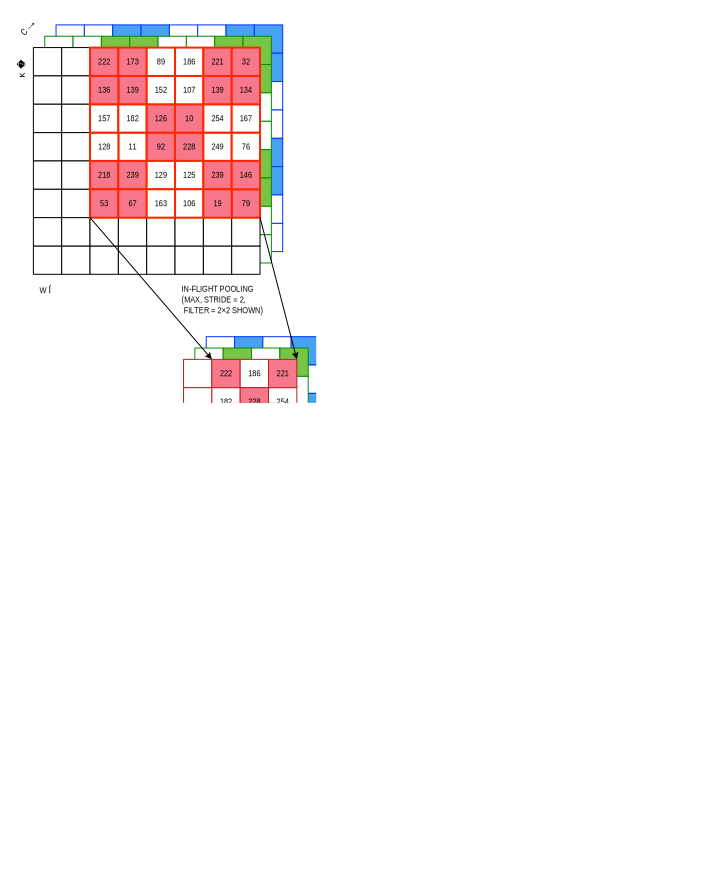
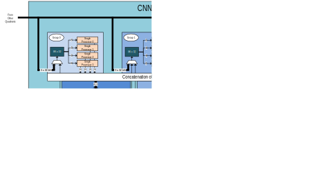

## Overview
The CNN accelerator consists of 64 parallel processors with 512KB of
SRAM-based storage. Each processor includes a pooling unit and a
convolutional engine with dedicated weight memory. Four processors share
one data memory. These are further organized into groups of 16
processors that share common controls. A group of 16 processors operates
as a slave to another group or independently. Data is read from SRAM
associated with each processor and written to any data memory located
within the accelerator. Any given processor has visibility of its
dedicated weight memory and to the data memory instance it shares with
the three others.

Maxim provides a complete toolset for the CNN, including model training
and synthesis on the Maxim Integrated AI GitHub repository. Refer to
<https://github.com/MaximIntegratedAI/MaximAI_Documentation> for a full
suite of tools and training available for the CNN.

The features of the CNN accelerator include:

-   512KB SRAM data storage:

    -   Configured as 8K×8-bit integers x64 channels or 32K×8-bit integers x4 channels for input layers
    -   Hardware load and unload assist.

-   64 parallel physical channel processors:

    -   Organized as 4×16 processors.
    -   8-bit integer data path with an option for 32-bit integers on the output layer
    -   Per-channel processor enable/disable.
    -   Expandable to 1024 parallel logical channel processors.

-   1×1 or 3×3 2D kernel sizes
-   Configurable 1D kernel size to 1×9
-   Full resolution sum-of-products arithmetic for 1024 8-bit integer channels
-   Operating frequency up to 50MHz.
-   Nominal 1 output channel per clock, maximum 4 output channels per clock (pass through).
-   Configurable input layer image size:

    -   32K pixels, 16 channels, non-streaming.
    -   8K pixels, 4 channels, non-streaming.
    -   1024×1024 pixels, 4 channels, streaming.

-   Hidden layers:

    -   Up to 8K 8-bit integer data per channel, x64 channels, non-streaming.
    -   8K bytes can be split equally across 1 to 16 logical channels, non-streaming.
    -   1M 8-bit integer data per channel, x64 channels, streaming.
    -   1M bytes can be split equally across eight layers, streaming.

-   Optional interrupt on CNN completion.
-   User-accessible BIST on all SRAM storage
-   User-accessible zeroization of all SRAM storage
-   Single-step operation with full data SRAM access for CNN operation debug.
-   Flexible power management:

    -   Independent x16 processor supply enables.
    -   Independent x16 processor mask retention enables.
    -   Independent x16 data path clock enables.
    -   Active Arm peripheral bus clock gating with per x16 processor override
    -   CNN clock frequency scaling (divide by 2, 4, 8, 16).
    -   Chip-level voltage control for performance power optimization.

-   Configurable weight storage:

    -   SRAM-based weight storage with selectable data retention
    -   Configurable from 442,368 8-bit integer weights to 3.538M 1-bit logical weights:

        -   Organized as 768×9×64 8-bit integer weights to 768×72×64 1-bit logical weights.
        -   Can be configured on a per-layer basis.

    -   Programmable per x16 processor weight RAM start address, start pointer, and mask count.
    -   Optional weight load hardware assist for packed weight storage.

-   32 independently configurable layer groups:

    -   Each group can contain element-wise, and/or pooling, and/or convolution operations for a minimum of 32 and a maximum of 96 layers.
    -   Processor and mask enables (16 channels)
    -   Input data format
    -   Per-layer data streaming:

        -   Stream start - relative to prior stream
        -   Dual-stream processing delay counters - 1 column, 1 row
            delta counter
        -   Data SRAM circular buffer size

    -   Input data size (row, column)
    -   Row and column padding 0 to 4 bytes
    -   Number of input channels 1 to 1024
    -   Kernel bit width size (1, 2, 4, 8)
    -   Kernel SRAM start pointer and count
    -   Inflight input image pooling:

        -   Pool mode - none, maximum or average
        -   Pool size - 1x1 to 16x16

    -   Stride - 1 row, 1 column to 4 rows, 4 columns
    -   Data SRAM read pointer base address
    -   Data SRAM write pointer configuration:

        -   Base address
        -   Independent offsets for output channel storage in SRAM
        -   Programmable stride increment offset

    -   Bias - 2048 8-bit integers
    -   Pre-activation output scaling from 0 to ±15-bits
    -   Output activation: none (implicit clipping), ReLU, absolute value
    -   Pass through: 8-bit or 32-bit integers
    -   Element-wise operations (add, subtract, xor, or) with optional convolution - up to 16 elements
    -   Deconvolution (upscaling)
    -   Flattening for MLP processing

A typical CNN operation consists of pooling followed by a convolution. While these are traditionally expressed as separate layers, pooling can be done "in-flight" on the MAX78000 for greater efficiency.

The accelerator is optimized for convolutions with in-flight pooling on
a sequence of layers to minimize data movement. The MAX78000 also
supports in-flight element-wise operations, pass-through layers, and
1‑D convolutions without element-wise operations. [Figure 27‑1](#figure27-1) shows a
high-level diagram of the MAX78000\'s convolutional neural network flow.

*Figure 27‑1: CNN Overview*

## Instances
There is one instance of the CNN. The CNN contains four CNNx16 processor
quadrants, generically referred to as CNNx16_n. Each CNNx16_n processor
quadrant contains sixteen processors grouped in four groups of four.
These groups are labeled group 0 to group 3 in the CNNx16_ processor
quadrant block diagram and are referred to as CNNx16_n_q0 to CNNx16_n_q3
in the documentation.

### Block Diagram
[Figure 27‑2](#figure27-2) shows a block diagram of a single CNNx16 Processor
Quadrant. The MAX78000 includes four CNNx16 processor quadrants. The
processor groups are labeled in [Figure 27‑2](#figure27-2) as Group 0 to Group 3.

*Figure 27‑2: CNNx16_n Processor Quadrant Block Diagram*

## Memory Configuration
The CNN includes four CNNx16 processor arrays, and each processor array
includes 128KB of SRAM, 110KB of mask RAM (MRAM), 512B of bias RAM
(BRAM), and 98KB of tornado RAM (TRAM). [Figure 27‑3](#figure27-3) shows the APB
mapping for the CNN and the Quad CNNx16n processor arrays.

*Figure 27‑3: CNN Global and Quad CNNx16n Processor Array APB Memory Map*

### CNNx16_n TRAM Details
Each CNNx16 processor array includes 98KB of Tornado RAM (TRAM);
however, the memory allocated to this region spans 256KB addressable
memory. The TRAM is arranged as 16 blocks of 16KB of addressable memory
space; however, only 6,144B of each of these 16 blocks contains TRAM.
The TRAM is organized as 3,072×16-bits and due to memory alignment it
consumes 12KB space within the allocated 16KB.

[Table 27‑1](#table27-1), [Table 27‑2](#table27-2), [Table 27‑3](#table27-3), and [Table 27‑4](#table27-4) show each of the four CNNx16 Processor Array's TRAM start address and the valid TRAM end address for the 16 TRAM blocks. Memory addresses between the *Valid TRAM Block End Address* and the *Block End Address* are invalid memory addresses and are not used.

*Table 27-1: CNNx16 Processor Array 0 TRAM Mapping Details (APB Accessible)*

<table border="1" cellpadding="5" cellspacing="0">
<thead>
    <tr>
        <th>CNN Quadrant#</th>
        <th>MRAM Block</th>
        <th>Size</th>
        <th>Allocated Size</th>
        <th>MRAM Block Start Address</th>
        <th>Valid MRAM Block End Address</th>
        <th>Block End Address</th>
    </tr>
</thead>
<tbody>
    <tr>
    <td rowspan="16">CNNx16_0</td>
    <td>0</td>
    <td>6,912B</td>
    <td>16KB</td>
    <td>0x5018 0000</td>
    <td>0x5018 2FFF</td>
    <td>0x5018 3FFF</td>
    </tr>
    <tr>
    <td>1</td>
    <td>6,912B</td>
    <td>16KB</td>
    <td>0x5018 4000</td>
    <td>0x5018 6FFF</td>
    <td>0x5018 7FFF</td>
    </tr>
    <tr>
    <td>2</td>
    <td>6,912B</td>
    <td>16KB</td>
    <td>0x5018 8000</td>
    <td>0x5018 AFFF</td>
    <td>0x5018 BFFF</td>
    </tr>
    <tr>
    <td>3</td>
    <td>6,912B</td>
    <td>16KB</td>
    <td>0x5018 C000</td>
    <td>0x5018 EFFF</td>
    <td>0x5018 FFFF</td>
    </tr>
    <tr>
    <td>4</td>
    <td>6,912B</td>
    <td>16KB</td>
    <td>0x5019 0000</td>
    <td>0x5019 2FFF</td>
    <td>0x5019 3FFF</td>
    </tr>
    <tr>
    <td>5</td>
    <td>6,912B</td>
    <td>16KB</td>
    <td>0x5019 4000</td>
    <td>0x5019 6FFF</td>
    <td>0x5019 7FFF</td>
    </tr>
    <tr>
    <td>6</td>
    <td>6,912B</td>
    <td>16KB</td>
    <td>0x5019 8000</td>
    <td>0x5019 AFFF</td>
    <td>0x5019 BFFF</td>
    </tr>
    <tr>
    <td>7</td>
    <td>6,912B</td>
    <td>16KB</td>
    <td>0x5019 C000</td>
    <td>0x5019 EFFF</td>
    <td>0x5019 FFFF</td>
    </tr>
    <tr>
    <td>8</td>
    <td>6,912B</td>
    <td>16KB</td>
    <td>0x501A 0000</td>
    <td>0x501A 2FFF</td>
    <td>0x501A 3FFF</td>
    </tr>
    <tr>
    <td>9</td>
    <td>6,912B</td>
    <td>16KB</td>
    <td>0x501A 4000</td>
    <td>0x501A 6FFF</td>
    <td>0x501A 7FFF</td>
    </tr>
    <tr>
    <td>10</td>
    <td>6,912B</td>
    <td>16KB</td>
    <td>0x501A 8000</td>
    <td>0x501A AFFF</td>
    <td>0x501A BFFF</td>
    </tr>
    <tr>
    <td>11</td>
    <td>6,912B</td>
    <td>16KB</td>
    <td>0x501A C000</td>
    <td>0x501A EFFF</td>
    <td>0x501A FFFF</td>
    </tr>
    <tr>
    <td>12</td>
    <td>6,912B</td>
    <td>16KB</td>
    <td>0x501B 0000</td>
    <td>0x501B 2FFF</td>
    <td>0x501B 3FFF</td>
    </tr>
    <tr>
    <td>13</td>
    <td>6,912B</td>
    <td>16KB</td>
    <td>0x501B 4000</td>
    <td>0x501B 6FFF</td>
    <td>0x501B 7FFF</td>
    </tr>
    <tr>
    <td>14</td>
    <td>6,912B</td>
    <td>16KB</td>
    <td>0x501B 8000</td>
    <td>0x501B AFFF</td>
    <td>0x501B BFFF</td>
    </tr>
    <tr>
    <td>15</td>
    <td>6,912B</td>
    <td>16KB</td>
    <td>0x501B C000</td>
    <td>0x501B EFFF</td>
    <td>0x501B FFFF</td>
    </tr>
</tbody>
</table>

*Table 27-2: CNNx16 Processor Array 1 TRAM Mapping Details (APB Accessible)*

<table border="1" cellpadding="5" cellspacing="0">
<thead>
    <tr>
        <th>CNN Quadrant#</th>
        <th>MRAM Block</th>
        <th>Size</th>
        <th>Allocated Size</th>
        <th>MRAM Block Start Address</th>
        <th>Valid MRAM Block End Address</th>
        <th>Block End Address</th>
    </tr>
</thead>
<tbody>
    <tr>
    <td rowspan="16">CNNx16_1</td>
    <td>0</td>
    <td>6,912B</td>
    <td>16KB</td>
    <td>0x5058 0000</td>
    <td>0x5058 2FFF</td>
    <td>0x5058 3FFF</td>
    </tr>
    <tr>
    <td>1</td>
    <td>6,912B</td>
    <td>16KB</td>
    <td>0x5058 4000</td>
    <td>0x5058 6FFF</td>
    <td>0x5058 7FFF</td>
    </tr>
    <tr>
    <td>2</td>
    <td>6,912B</td>
    <td>16KB</td>
    <td>0x5058 8000</td>
    <td>0x5058 AFFF</td>
    <td>0x5058 BFFF</td>
    </tr>
    <tr>
    <td>3</td>
    <td>6,912B</td>
    <td>16KB</td>
    <td>0x5058 C000</td>
    <td>0x5058 EFFF</td>
    <td>0x5058 FFFF</td>
    </tr>
    <tr>
    <td>4</td>
    <td>6,912B</td>
    <td>16KB</td>
    <td>0x5059 0000</td>
    <td>0x5059 2FFF</td>
    <td>0x5059 3FFF</td>
    </tr>
    <tr>
    <td>5</td>
    <td>6,912B</td>
    <td>16KB</td>
    <td>0x5059 4000</td>
    <td>0x5059 6FFF</td>
    <td>0x5059 7FFF</td>
    </tr>
    <tr>
    <td>6</td>
    <td>6,912B</td>
    <td>16KB</td>
    <td>0x5059 8000</td>
    <td>0x5059 AFFF</td>
    <td>0x5059 BFFF</td>
    </tr>
    <tr>
    <td>7</td>
    <td>6,912B</td>
    <td>16KB</td>
    <td>0x5059 C000</td>
    <td>0x5059 EFFF</td>
    <td>0x5059 FFFF</td>
    </tr>
    <tr>
    <td>8</td>
    <td>6,912B</td>
    <td>16KB</td>
    <td>0x505A 0000</td>
    <td>0x505A 2FFF</td>
    <td>0x505A 3FFF</td>
    </tr>
    <tr>
    <td>9</td>
    <td>6,912B</td>
    <td>16KB</td>
    <td>0x505A 4000</td>
    <td>0x505A 6FFF</td>
    <td>0x505A 7FFF</td>
    </tr>
    <tr>
    <td>10</td>
    <td>6,912B</td>
    <td>16KB</td>
    <td>0x505A 8000</td>
    <td>0x505A AFFF</td>
    <td>0x505A BFFF</td>
    </tr>
    <tr>
    <td>11</td>
    <td>6,912B</td>
    <td>16KB</td>
    <td>0x505A C000</td>
    <td>0x505A EFFF</td>
    <td>0x505A FFFF</td>
    </tr>
    <tr>
    <td>12</td>
    <td>6,912B</td>
    <td>16KB</td>
    <td>0x505B 0000</td>
    <td>0x505B 2FFF</td>
    <td>0x505B 3FFF</td>
    </tr>
    <tr>
    <td>13</td>
    <td>6,912B</td>
    <td>16KB</td>
    <td>0x505B 4000</td>
    <td>0x505B 6FFF</td>
    <td>0x505B 7FFF</td>
    </tr>
    <tr>
    <td>14</td>
    <td>6,912B</td>
    <td>16KB</td>
    <td>0x505B 8000</td>
    <td>0x505B AFFF</td>
    <td>0x505B BFFF</td>
    </tr>
    <tr>
    <td>15</td>
    <td>6,912B</td>
    <td>16KB</td>
    <td>0x505B C000</td>
    <td>0x505B EFFF</td>
    <td>0x505B FFFF</td>
    </tr>
</tbody>
</table>

*Table 27-3: CNNx16 Processor Array 2 TRAM Mapping Details (APB Accessible)*

<table border="1" cellpadding="5" cellspacing="0">
<thead>
    <tr>
        <th>CNN Quadrant#</th>
        <th>MRAM Block</th>
        <th>Size</th>
        <th>Allocated Size</th>
        <th>Start Address</th>
        <th>Valid MRAM Block End Address</th>
        <th>Block End Address</th>
    </tr>
</thead>
<tbody>
    <tr>
    <td rowspan="16">CNNx16_2</td>
    <td>0</td>
    <td>6,912B</td>
    <td>16KB</td>
    <td>0x5098 0000</td>
    <td>0x5098 2FFF</td>
    <td>0x5098 3FFF</td>
    </tr>
    <tr>
    <td>1</td>
    <td>6,912B</td>
    <td>16KB</td>
    <td>0x5098 4000</td>
    <td>0x5098 6FFF</td>
    <td>0x5098 7FFF</td>
    </tr>
    <tr>
    <td>2</td>
    <td>6,912B</td>
    <td>16KB</td>
    <td>0x5098 8000</td>
    <td>0x5098 AFFF</td>
    <td>0x5098 CFFF</td>
    </tr>
    <tr>
    <td>3</td>
    <td>6,912B</td>
    <td>16KB</td>
    <td>0x5098 C000</td>
    <td>0x5098 EFFF</td>
    <td>0x5098 FFFF</td>
    </tr>
    <tr>
    <td>4</td>
    <td>6,912B</td>
    <td>16KB</td>
    <td>0x5099 0000</td>
    <td>0x5099 2FFF</td>
    <td>0x5099 3FFF</td>
    </tr>
    <tr>
    <td>5</td>
    <td>6,912B</td>
    <td>16KB</td>
    <td>0x5099 4000</td>
    <td>0x5099 6FFF</td>
    <td>0x5099 7FFF</td>
    </tr>
    <tr>
    <td>6</td>
    <td>6,912B</td>
    <td>16KB</td>
    <td>0x5099 8000</td>
    <td>0x5099 AFFF</td>
    <td>0x5099 BFFF</td>
    </tr>
    <tr>
    <td>7</td>
    <td>6,912B</td>
    <td>16KB</td>
    <td>0x5099 C000</td>
    <td>0x5099 EFFF</td>
    <td>0x5099 FFFF</td>
    </tr>
    <tr>
    <td>8</td>
    <td>6,912B</td>
    <td>16KB</td>
    <td>0x509A 0000</td>
    <td>0x509A 2FFF</td>
    <td>0x509A 3FFF</td>
    </tr>
    <tr>
    <td>9</td>
    <td>6,912B</td>
    <td>16KB</td>
    <td>0x509A 4000</td>
    <td>0x509A 6FFF</td>
    <td>0x509A 7FFF</td>
    </tr>
    <tr>
    <td>10</td>
    <td>6,912B</td>
    <td>16KB</td>
    <td>0x509A 8000</td>
    <td>0x509A AFFF</td>
    <td>0x509A BFFF</td>
    </tr>
    <tr>
    <td>11</td>
    <td>6,912B</td>
    <td>16KB</td>
    <td>0x509A C000</td>
    <td>0x509A 3FFF</td>
    <td>0x509A FFFF</td>
    </tr>
    <tr>
    <td>12</td>
    <td>6,912B</td>
    <td>16KB</td>
    <td>0x509B 0000</td>
    <td>0x509B 2FFF</td>
    <td>0x509B 3FFF</td>
    </tr>
    <tr>
    <td>13</td>
    <td>6,912B</td>
    <td>16KB</td>
    <td>0x509B 4000</td>
    <td>0x509B 6FFF</td>
    <td>0x509B 7FFF</td>
    </tr>
    <tr>
    <td>14</td>
    <td>6,912B</td>
    <td>16KB</td>
    <td>0x509B 8000</td>
    <td>0x509B AFFF</td>
    <td>0x509B BFFF</td>
    </tr>
    <tr>
    <td>15</td>
    <td>6,912B</td>
    <td>16KB</td>
    <td>0x509B C000</td>
    <td>0x509B EFFF</td>
    <td>0x509B FFFF</td>
    </tr>
</tbody>
</table>

*Table 27-4: CNNx16 Processor Array 3 TRAM Mapping Details (APB Accessible)*

<table border="1" cellpadding="5" cellspacing="0">
<thead>
    <tr>
        <th>CNN Quadrant#</th>
        <th>MRAM Block</th>
        <th>Size</th>
        <th>Allocated Size</th>
        <th>Memory Start Address</th>
        <th>Valid MRAM Block End Address</th>
        <th>Block End Address</th>
    </tr>
</thead>
<tbody>
    <tr>
    <td rowspan="16">CNNx16_3</td>
    <td>0</td>
    <td>6,912B</td>
    <td>16KB</td>
    <td>0x50D8 0000</td>
    <td>0x50D8 2FFF</td>
    <td>0x50D8 3FFF</td>
    </tr>
    <tr>
    <td>1</td>
    <td>6,912B</td>
    <td>16KB</td>
    <td>0x50D8 4000</td>
    <td>0x50D8 6FFF</td>
    <td>0x50D8 7FFF</td>
    </tr>
    <tr>
    <td>2</td>
    <td>6,912B</td>
    <td>16KB</td>
    <td>0x50D8 8000</td>
    <td>0x50D8 AFFF</td>
    <td>0x50D8 CFFF</td>
    </tr>
    <tr>
    <td>3</td>
    <td>6,912B</td>
    <td>16KB</td>
    <td>0x50D8 C000</td>
    <td>0x50D8 EFFF</td>
    <td>0x50D8 FFFF</td>
    </tr>
    <tr>
    <td>4</td>
    <td>6,912B</td>
    <td>16KB</td>
    <td>0x50D9 0000</td>
    <td>0x50D9 2FFF</td>
    <td>0x50D9 3FFF</td>
    </tr>
    <tr>
    <td>5</td>
    <td>6,912B</td>
    <td>16KB</td>
    <td>0x50D9 4000</td>
    <td>0x50D9 6FFF</td>
    <td>0x50D9 7FFF</td>
    </tr>
    <tr>
    <td>6</td>
    <td>6,912B</td>
    <td>16KB</td>
    <td>0x50D9 8000</td>
    <td>0x50D9 AFFF</td>
    <td>0x50D9 BFFF</td>
    </tr>
    <tr>
    <td>7</td>
    <td>6,912B</td>
    <td>16KB</td>
    <td>0x50D9 C000</td>
    <td>0x50D9 EFFF</td>
    <td>0x50D9 FFFF</td>
    </tr>
    <tr>
    <td>8</td>
    <td>6,912B</td>
    <td>16KB</td>
    <td>0x50DA 0000</td>
    <td>0x50DA 2FFF</td>
    <td>0x50DA 3FFF</td>
    </tr>
    <tr>
    <td>9</td>
    <td>6,912B</td>
    <td>16KB</td>
    <td>0x50DA 4000</td>
    <td>0x50DA 6FFF</td>
    <td>0x50DA 7FFF</td>
    </tr>
    <tr>
    <td>10</td>
    <td>6,912B</td>
    <td>16KB</td>
    <td>0x50DA 8000</td>
    <td>0x50DA AFFF</td>
    <td>0x50DA BFFF</td>
    </tr>
    <tr>
    <td>11</td>
    <td>6,912B</td>
    <td>16KB</td>
    <td>0x50DA C000</td>
    <td>0x50DA EFFF</td>
    <td>0x50DA FFFF</td>
    </tr>
    <tr>
    <td>12</td>
    <td>6,912B</td>
    <td>16KB</td>
    <td>0x50DB 0000</td>
    <td>0x50DB 2FFF</td>
    <td>0x50DB 3FFF</td>
    </tr>
    <tr>
    <td>13</td>
    <td>6,912B</td>
    <td>16KB</td>
    <td>0x50DB 4000</td>
    <td>0x50DB 6FFF</td>
    <td>0x50DB 7FFF</td>
    </tr>
    <tr>
    <td>14</td>
    <td>6,912B</td>
    <td>16KB</td>
    <td>0x50DB 8000</td>
    <td>0x50DB AFFF</td>
    <td>0x50DB BFFF</td>
    </tr>
    <tr>
    <td>15</td>
    <td>6,912B</td>
    <td>16KB</td>
    <td>0x50DB C000</td>
    <td>0x50DB EFFF</td>
    <td>0x50DB FFFF</td>
    </tr>
</tbody>
</table>

### CNNx16_n MRAM Details
Each CNNx16 processor array includes 110KB of MRAM; however, the memory allocated to this region spans 256KB address space. The MRAM is arranged as 16 blocks of 16KB of addressable memory space; however, only the first 6,912B of each of these 16 blocks contains usable MRAM. Each MRAM instance is organized as 768×72-bits. The MRAM uses 128-bits of address space for each 72-bits of MRAM. Due to memory alignment it consumes 12KB space within the allocated 16KB.

The following tables below ([Table 27-5](#table27-5), [Table 27-6](#table27-6), [Table 27-7](#table27-7), and [Table 27-8](#table27-8)) show each of the four CNNx16 Processor Array's MRAM start address and the valid MRAM end address for the 16 MRAM blocks. Memory addresses between the Valid MRAM Block End Address and the Block End Address are invalid memory addresses and are not used.

*Table 27-5: CNNx16 Processor Array 0 MRAM Mapping Details (APB Accessible)*

<table border="1" cellpadding="5" cellspacing="0">
<thead>
    <tr>
        <th>CNN Quadrant#</th>
        <th>MRAM Block</th>
        <th>Size</th>
        <th>Allocated Size</th>
        <th>MRAM Block Start Address</th>
        <th>Valid MRAM Block End Address</th>
        <th>Block End Address</th>
    </tr>
</thead>
<tbody>
    <tr>
    <td rowspan="16">CNNx16_0</td>
    <td>0</td>
    <td>6,912B</td>
    <td>16KB</td>
    <td>0x5018 0000</td>
    <td>0x5018 2FFF</td>
    <td>0x5018 3FFF</td>
    </tr>
    <tr>
    <td>1</td>
    <td>6,912B</td>
    <td>16KB</td>
    <td>0x5018 4000</td>
    <td>0x5018 6FFF</td>
    <td>0x5018 7FFF</td>
    </tr>
    <tr>
    <td>2</td>
    <td>6,912B</td>
    <td>16KB</td>
    <td>0x5018 8000</td>
    <td>0x5018 AFFF</td>
    <td>0x5018 BFFF</td>
    </tr>
    <tr>
    <td>3</td>
    <td>6,912B</td>
    <td>16KB</td>
    <td>0x5018 C000</td>
    <td>0x5018 EFFF</td>
    <td>0x5018 FFFF</td>
    </tr>
    <tr>
    <td>4</td>
    <td>6,912B</td>
    <td>16KB</td>
    <td>0x5019 0000</td>
    <td>0x5019 2FFF</td>
    <td>0x5019 3FFF</td>
    </tr>
    <tr>
    <td>5</td>
    <td>6,912B</td>
    <td>16KB</td>
    <td>0x5019 4000</td>
    <td>0x5019 6FFF</td>
    <td>0x5019 7FFF</td>
    </tr>
    <tr>
    <td>6</td>
    <td>6,912B</td>
    <td>16KB</td>
    <td>0x5019 8000</td>
    <td>0x5019 AFFF</td>
    <td>0x5019 BFFF</td>
    </tr>
    <tr>
    <td>7</td>
    <td>6,912B</td>
    <td>16KB</td>
    <td>0x5019 C000</td>
    <td>0x5019 EFFF</td>
    <td>0x5019 FFFF</td>
    </tr>
    <tr>
    <td>8</td>
    <td>6,912B</td>
    <td>16KB</td>
    <td>0x501A 0000</td>
    <td>0x501A 2FFF</td>
    <td>0x501A 3FFF</td>
    </tr>
    <tr>
    <td>9</td>
    <td>6,912B</td>
    <td>16KB</td>
    <td>0x501A 4000</td>
    <td>0x501A 6FFF</td>
    <td>0x501A 7FFF</td>
    </tr>
    <tr>
    <td>10</td>
    <td>6,912B</td>
    <td>16KB</td>
    <td>0x501A 8000</td>
    <td>0x501A AFFF</td>
    <td>0x501A BFFF</td>
    </tr>
    <tr>
    <td>11</td>
    <td>6,912B</td>
    <td>16KB</td>
    <td>0x501A C000</td>
    <td>0x501A EFFF</td>
    <td>0x501A FFFF</td>
    </tr>
    <tr>
    <td>12</td>
    <td>6,912B</td>
    <td>16KB</td>
    <td>0x501B 0000</td>
    <td>0x501B 2FFF</td>
    <td>0x501B 3FFF</td>
    </tr>
    <tr>
    <td>13</td>
    <td>6,912B</td>
    <td>16KB</td>
    <td>0x501B 4000</td>
    <td>0x501B 6FFF</td>
    <td>0x501B 7FFF</td>
    </tr>
    <tr>
    <td>14</td>
    <td>6,912B</td>
    <td>16KB</td>
    <td>0x501B 8000</td>
    <td>0x501B AFFF</td>
    <td>0x501B BFFF</td>
    </tr>
    <tr>
    <td>15</td>
    <td>6,912B</td>
    <td>16KB</td>
    <td>0x501B C000</td>
    <td>0x501B EFFF</td>
    <td>0x501B FFFF</td>
    </tr>
</tbody>
</table>

*Table 27‑6: CNNx16 Processor Array 1 MRAM Mapping Details (APB Accessible)*

<table border="1" cellpadding="5" cellspacing="0">
<thead>
    <tr>
        <th>CNN Quadrant#</th>
        <th>MRAM Block</th>
        <th>Size</th>
        <th>Allocated Size</th>
        <th>MRAM Block Start Address</th>
        <th>Valid MRAM Block End Address</th>
        <th>Block End Address</th>
    </tr>
</thead>
<tbody>
    <tr>
    <td rowspan="16">CNNx16_1</td>
    <td>0</td>
    <td>6,912B</td>
    <td>16KB</td>
    <td>0x5058 0000</td>
    <td>0x5058 2FFF</td>
    <td>0x5058 3FFF</td>
    </tr>
    <tr>
    <td>1</td>
    <td>6,912B</td>
    <td>16KB</td>
    <td>0x5058 4000</td>
    <td>0x5058 6FFF</td>
    <td>0x5058 7FFF</td>
    </tr>
    <tr>
    <td>2</td>
    <td>6,912B</td>
    <td>16KB</td>
    <td>0x5058 8000</td>
    <td>0x5058 AFFF</td>
    <td>0x5058 BFFF</td>
    </tr>
    <tr>
    <td>3</td>
    <td>6,912B</td>
    <td>16KB</td>
    <td>0x5058 C000</td>
    <td>0x5058 EFFF</td>
    <td>0x5058 FFFF</td>
    </tr>
    <tr>
    <td>4</td>
    <td>6,912B</td>
    <td>16KB</td>
    <td>0x5059 0000</td>
    <td>0x5059 2FFF</td>
    <td>0x5059 3FFF</td>
    </tr>
    <tr>
    <td>5</td>
    <td>6,912B</td>
    <td>16KB</td>
    <td>0x5059 4000</td>
    <td>0x5059 6FFF</td>
    <td>0x5059 7FFF</td>
    </tr>
    <tr>
    <td>6</td>
    <td>6,912B</td>
    <td>16KB</td>
    <td>0x5059 8000</td>
    <td>0x5059 AFFF</td>
    <td>0x5059 BFFF</td>
    </tr>
    <tr>
    <td>7</td>
    <td>6,912B</td>
    <td>16KB</td>
    <td>0x5059 C000</td>
    <td>0x5059 EFFF</td>
    <td>0x5059 FFFF</td>
    </tr>
    <tr>
    <td>8</td>
    <td>6,912B</td>
    <td>16KB</td>
    <td>0x505A 0000</td>
    <td>0x505A 2FFF</td>
    <td>0x505A 3FFF</td>
    </tr>
    <tr>
    <td>9</td>
    <td>6,912B</td>
    <td>16KB</td>
    <td>0x505A 4000</td>
    <td>0x505A 6FFF</td>
    <td>0x505A 7FFF</td>
    </tr>
    <tr>
    <td>10</td>
    <td>6,912B</td>
    <td>16KB</td>
    <td>0x505A 8000</td>
    <td>0x505A AFFF</td>
    <td>0x505A BFFF</td>
    </tr>
    <tr>
    <td>11</td>
    <td>6,912B</td>
    <td>16KB</td>
    <td>0x505A C000</td>
    <td>0x505A EFFF</td>
    <td>0x505A FFFF</td>
    </tr>
    <tr>
    <td>12</td>
    <td>6,912B</td>
    <td>16KB</td>
    <td>0x505B 0000</td>
    <td>0x505B 2FFF</td>
    <td>0x505B 3FFF</td>
    </tr>
    <tr>
    <td>13</td>
    <td>6,912B</td>
    <td>16KB</td>
    <td>0x505B 4000</td>
    <td>0x505B 6FFF</td>
    <td>0x505B 7FFF</td>
    </tr>
    <tr>
    <td>14</td>
    <td>6,912B</td>
    <td>16KB</td>
    <td>0x505B 8000</td>
    <td>0x505B AFFF</td>
    <td>0x505B BFFF</td>
    </tr>
    <tr>
    <td>15</td>
    <td>6,912B</td>
    <td>16KB</td>
    <td>0x505B C000</td>
    <td>0x505B EFFF</td>
    <td>0x505B FFFF</td>
    </tr>
</tbody>
</table>

*Table 27‑7: CNNx16 Processor Array 2 MRAM Mapping Details (APB Accessible)*

<table border="1" cellpadding="5" cellspacing="0">
<thead>
    <tr>
        <th>CNN Quadrant#</th>
        <th>MRAM Block</th>
        <th>Size</th>
        <th>Allocated Size</th>
        <th>Start Address</th>
        <th>Valid MRAM Block End Address</th>
        <th>Block End Address</th>
    </tr>
</thead>
<tbody>
    <tr>
    <td rowspan="16">CNNx16_2</td>
    <td>0</td>
    <td>6,912B</td>
    <td>16KB</td>
    <td>0x5098 0000</td>
    <td>0x5098 2FFF</td>
    <td>0x5098 3FFF</td>
    </tr>
    <tr>
    <td>1</td>
    <td>6,912B</td>
    <td>16KB</td>
    <td>0x5098 4000</td>
    <td>0x5098 6FFF</td>
    <td>0x5098 7FFF</td>
    </tr>
    <tr>
    <td>2</td>
    <td>6,912B</td>
    <td>16KB</td>
    <td>0x5098 8000</td>
    <td>0x5098 AFFF</td>
    <td>0x5098 CFFF</td>
    </tr>
    <tr>
    <td>3</td>
    <td>6,912B</td>
    <td>16KB</td>
    <td>0x5098 C000</td>
    <td>0x5098 EFFF</td>
    <td>0x5098 FFFF</td>
    </tr>
    <tr>
    <td>4</td>
    <td>6,912B</td>
    <td>16KB</td>
    <td>0x5099 0000</td>
    <td>0x5099 2FFF</td>
    <td>0x5099 3FFF</td>
    </tr>
    <tr>
    <td>5</td>
    <td>6,912B</td>
    <td>16KB</td>
    <td>0x5099 4000</td>
    <td>0x5099 6FFF</td>
    <td>0x5099 7FFF</td>
    </tr>
    <tr>
    <td>6</td>
    <td>6,912B</td>
    <td>16KB</td>
    <td>0x5099 8000</td>
    <td>0x5099 AFFF</td>
    <td>0x5099 BFFF</td>
    </tr>
    <tr>
    <td>7</td>
    <td>6,912B</td>
    <td>16KB</td>
    <td>0x5099 C000</td>
    <td>0x5099 EFFF</td>
    <td>0x5099 FFFF</td>
    </tr>
    <tr>
    <td>8</td>
    <td>6,912B</td>
    <td>16KB</td>
    <td>0x509A 0000</td>
    <td>0x509A 2FFF</td>
    <td>0x509A 3FFF</td>
    </tr>
    <tr>
    <td>9</td>
    <td>6,912B</td>
    <td>16KB</td>
    <td>0x509A 4000</td>
    <td>0x509A 6FFF</td>
    <td>0x509A 7FFF</td>
    </tr>
    <tr>
    <td>10</td>
    <td>6,912B</td>
    <td>16KB</td>
    <td>0x509A 8000</td>
    <td>0x509A AFFF</td>
    <td>0x509A BFFF</td>
    </tr>
    <tr>
    <td>11</td>
    <td>6,912B</td>
    <td>16KB</td>
    <td>0x509A C000</td>
    <td>0x509A 3FFF</td>
    <td>0x509A FFFF</td>
    </tr>
    <tr>
    <td>12</td>
    <td>6,912B</td>
    <td>16KB</td>
    <td>0x509B 0000</td>
    <td>0x509B 2FFF</td>
    <td>0x509B 3FFF</td>
    </tr>
    <tr>
    <td>13</td>
    <td>6,912B</td>
    <td>16KB</td>
    <td>0x509B 4000</td>
    <td>0x509B 6FFF</td>
    <td>0x509B 7FFF</td>
    </tr>
    <tr>
    <td>14</td>
    <td>6,912B</td>
    <td>16KB</td>
    <td>0x509B 8000</td>
    <td>0x509B AFFF</td>
    <td>0x509B BFFF</td>
    </tr>
    <tr>
    <td>15</td>
    <td>6,912B</td>
    <td>16KB</td>
    <td>0x509B C000</td>
    <td>0x509B EFFF</td>
    <td>0x509B FFFF</td>
    </tr>
</tbody>
</table>

*Table 27‑8: CNNx16 Processor Array3 MRAM Mapping Details (APB Accessible)*

<table border="1" cellpadding="5" cellspacing="0">
<thead>
    <tr>
        <th>CNN Quadrant#</th>
        <th>MRAM Block</th>
        <th>Size</th>
        <th>Allocated Size</th>
        <th>Memory Start Address</th>
        <th>Valid MRAM Block End Address</th>
        <th>Block End Address</th>
    </tr>
</thead>
<tbody>
    <tr>
    <td rowspan="16">CNNx16_3</td>
    <td>0</td>
    <td>6,912B</td>
    <td>16KB</td>
    <td>0x50D8 0000</td>
    <td>0x50D8 2FFF</td>
    <td>0x50D8 3FFF</td>
    </tr>
    <tr>
    <td>1</td>
    <td>6,912B</td>
    <td>16KB</td>
    <td>0x50D8 4000</td>
    <td>0x50D8 6FFF</td>
    <td>0x50D8 7FFF</td>
    </tr>
    <tr>
    <td>2</td>
    <td>6,912B</td>
    <td>16KB</td>
    <td>0x50D8 8000</td>
    <td>0x50D8 AFFF</td>
    <td>0x50D8 CFFF</td>
    </tr>
    <tr>
    <td>3</td>
    <td>6,912B</td>
    <td>16KB</td>
    <td>0x50D8 C000</td>
    <td>0x50D8 EFFF</td>
    <td>0x50D8 FFFF</td>
    </tr>
    <tr>
    <td>4</td>
    <td>6,912B</td>
    <td>16KB</td>
    <td>0x50D9 0000</td>
    <td>0x50D9 2FFF</td>
    <td>0x50D9 3FFF</td>
    </tr>
    <tr>
    <td>5</td>
    <td>6,912B</td>
    <td>16KB</td>
    <td>0x50D9 4000</td>
    <td>0x50D9 6FFF</td>
    <td>0x50D9 7FFF</td>
    </tr>
    <tr>
    <td>6</td>
    <td>6,912B</td>
    <td>16KB</td>
    <td>0x50D9 8000</td>
    <td>0x50D9 AFFF</td>
    <td>0x50D9 BFFF</td>
    </tr>
    <tr>
    <td>7</td>
    <td>6,912B</td>
    <td>16KB</td>
    <td>0x50D9 C000</td>
    <td>0x50D9 EFFF</td>
    <td>0x50D9 FFFF</td>
    </tr>
    <tr>
    <td>8</td>
    <td>6,912B</td>
    <td>16KB</td>
    <td>0x50DA 0000</td>
    <td>0x50DA 2FFF</td>
    <td>0x50DA 3FFF</td>
    </tr>
    <tr>
    <td>9</td>
    <td>6,912B</td>
    <td>16KB</td>
    <td>0x50DA 4000</td>
    <td>0x50DA 6FFF</td>
    <td>0x50DA 7FFF</td>
    </tr>
    <tr>
    <td>10</td>
    <td>6,912B</td>
    <td>16KB</td>
    <td>0x50DA 8000</td>
    <td>0x50DA AFFF</td>
    <td>0x50DA BFFF</td>
    </tr>
    <tr>
    <td>11</td>
    <td>6,912B</td>
    <td>16KB</td>
    <td>0x50DA C000</td>
    <td>0x50DA EFFF</td>
    <td>0x50DA FFFF</td>
    </tr>
    <tr>
    <td>12</td>
    <td>6,912B</td>
    <td>16KB</td>
    <td>0x50DB 0000</td>
    <td>0x50DB 2FFF</td>
    <td>0x50DB 3FFF</td>
    </tr>
    <tr>
    <td>13</td>
    <td>6,912B</td>
    <td>16KB</td>
    <td>0x50DB 4000</td>
    <td>0x50DB 6FFF</td>
    <td>0x50DB 7FFF</td>
    </tr>
    <tr>
    <td>14</td>
    <td>6,912B</td>
    <td>16KB</td>
    <td>0x50DB 8000</td>
    <td>0x50DB AFFF</td>
    <td>0x50DB BFFF</td>
    </tr>
    <tr>
    <td>15</td>
    <td>6,912B</td>
    <td>16KB</td>
    <td>0x50DB C000</td>
    <td>0x50DB EFFF</td>
    <td>0x50DB FFFF</td>
    </tr>
</tbody>
</table>

## CNN Global Registers (CNN)
See [Table 3-3](memory-register-mapping-access.md#apb-peripheral-base-address-map) for the base address of this peripheral/module. There is one instance of the CNN in the MAX78000. The global CNN registers are shown in [Table 27-9](#table27-9). See [Table 1-1](index.md#table1-1-field-access-definitions) for an explanation of the read and write access of each field. Unless specified otherwise, all fields are reset on a system reset, soft reset, POR, and the peripheral-specific resets.

*Table 27-9: Global CNN Register Summary*

<table border="1" cellpadding="5" cellspacing="0">
<thead>
    <tr>
        <th>Offset</th>
        <th>Register</th>
        <th>Description</th>
    </tr>
</thead>
<tbody>
    <tr>
    <td>[0x0000]</td>
    <td><a href="#table27-10">CNN_FIF0_CTRL</a></td>
    <td>CNN FIFO Control Register</td>
    </tr>
    <tr>
    <td>[0x0004]</td>
    <td><a href="#table27-11">CNN_FIF0_STAT</a></td>
    <td>CNN FIFO Status Register</td>
    </tr>
    <tr>
    <td>[0x0008]</td>
    <td><a href="#table27-12">CNN_FIFO_WR0</a></td>
    <td>CNN FIFO 0 Write Register</td>
    </tr>
    <tr>
    <td>[0x000C]</td>
    <td><a href="#table27-13">CNN_FIFO_WR1</a></td>
    <td>CNN FIFO 1 Write Register</td>
    </tr>
    <tr>
    <td>[0x0010]</td>
    <td><a href="#table27-14">CNN_FIFO_WR2</a></td>
    <td>CNN Fast FIFO 2 Write Register</td>
    </tr>
    <tr>
    <td>[0x0014]</td>
    <td><a href="#table27-15">CNN_FIFO_WR3</a></td>
    <td>CNN FIFO 3 Write Register</td>
    </tr>
    <tr>
    <td>[0x1000]</td>
    <td><a href="#table27-16">CNN_AOD_CTRL</a></td>
    <td>CNN AoD Control Register</td>
    </tr>
</tbody>
</table>

### Global CNN Register Details

*Table 27-10: CNN FIFO Control Register*

<table border="1" cellpadding="5" cellspacing="0">
<thead>
    <tr>
        <th colspan="3">CNN FIFO Control</th>
        <th colspan="1">CNN_FIF0_CTRL</th>
        <th>[0x0000]</th>
    </tr>
    <tr>
        <th>Bits</th>
        <th>Field</th>
        <th>Access</th>
        <th>Reset</th>
        <th>Description</th>
    </tr>
</thead>
<tbody>
    <tr>
        <td>31:28</td>
        <td>almost_empty_int_en</td>
        <td>R/W</td>
        <td>0</td>
        <td><strong>FIFO Almost Empty Interrupt Enable</strong>  Each bit of this field maps to one of the CNNx16_n quadrants. Bit 3 maps to CNNx16_n_q3, bit 2 maps to CNNx16_n_q2, bit 1 maps to CNNx16_n_q1, and bit 0 maps to CNNx16_n_q0. Set this field to 1 to enable an interrupt event based on the <a href="#table27-10">CNN_FIF0_CTRL</a>.<em>empty_thresh</em> flag. Enable the interrupt for all quadrants by setting this field to 0b1111.
</td>
    </tr>
    <tr>
        <td>27:24</td>
        <td>almost_full_int_en</td>
        <td>R/W</td>
        <td>0</td>
        <td><strong>FIFO Almost Full Interrupt Enable</strong>  Each bit of this field maps to one of the CNNx16_n quadrants. Bit 3 maps to CNNx16_n_q3, bit 2 maps to CNNx16_n_q2, bit 1 maps to CNNx16_n_q1, and bit 0 maps to CNNx16_n_q0. Set this field to 1 to enable an interrupt event based on the FIFO almost full threshold flag, <a href="#table27-10">CNN_FIF0_CTRL</a>.<em>full_thresh</em>. Enable the interrupt for all quadrants by setting this field to 0b1111.</td>
    </tr>
    <tr>
        <td>23:20</td>
        <td>empty_int_en</td>
        <td>R/W</td>
        <td>0</td>
        <td><strong>FIFO Empty Interrupt Enable</strong>  Each bit of this field maps to one of the CNNx16_n quadrants. Bit 3 maps to CNNx16_n_q3, bit 2 maps to CNNx16_n_q2, bit 1 maps to CNNx16_n_q1, and bit 0 maps to CNNx16_n_q0. Set this field to 1 to enable an interrupt event based on the FIFO empty flag. Enable the interrupt for all quadrants by setting this field to 0b1111</td>
    </tr>
    <tr>
        <td>19:16</td>
        <td>full_int_en</td>
        <td>R/W</td>
        <td>0</td>
        <td><strong>FIFO Full Interrupt Enable</strong> Each bit of this field maps to one of the CNNx16_n quadrants. Bit 3 maps to CNNx16_n_q3, bit 2 maps to CNNx16_n_q2, bit 1 maps to
        CNNx16_n_q1, and bit 0 maps to CNNx16_n_q0. Set this field to 1 to enable an interrupt event based on the FIFO full flag. Enable the interrupt for all quadrants by setting this field to 0b1111.</td>
    </tr>
    <tr>
        <td>15:12</td>
        <td>fifo_en</td>
        <td>R/W</td>
        <td>0</td>
        <td><strong>Per FIFO Enable</strong>  Set this field to 1 to enable the corresponding FIFO for the specified CNNx16_n quadrant. Each bit of this field maps to one of the CNNx16_n quadrants. Bit 3 maps to CNNx16_n_q3, Bit 2 maps to CNNx16_n_q2, Bit1 maps to CNNx16_n_q1 and Bit 0 maps to CNNx16_n_q0.
        
<em>Note: Unused FIFOs must be disabled.</em>
</td>
    </tr>
    <tr>
        <td>11</td>
        <td>fifo_cpl</td>
        <td>R/W</td>
        <td>0</td>
        <td><strong>FIFO Coupling</strong>  Setting this bit to 1 forces the FIFOs to operate in lockstep. Data available status is dependent on all FIFOs having identical write pointer values.
            

            0: FIFOs are not coupled 
            1: FIFOs are coupled and operate in lockstep
            

        </td>
    </tr>
    <tr>
        <td>10</td>
        <td>-</td>
        <td>RO</td>
        <td>0</td>
        <td><strong>Reserved</strong></td>
    </tr>
    <tr>
        <td>9:7</td>
        <td>empty_thresh</td>
        <td>R/W</td>
        <td>0</td>
        <td><strong>FIFO Almost Empty Threshold</strong>  If the difference between the write and read pointer (read_pointer - write_pointer) falls below this number of bytes, the almost empty flag is set.
        
0 to 7: Sets the FIFO Almost Empty Threshold to the value written.
</td>
    </tr>
    <tr>
        <td>6:5</td>
        <td>-</td>
        <td>RO</td>
        <td>0</td>
        <td><strong>Reserved</strong></td>
    </tr>
    <tr>
        <td>4:2</td>
        <td>full_thresh</td>
        <td>R/W</td>
        <td>0</td>
        <td><strong>FIFO Almost Full Threshold</strong>  This flag is set if the difference between the write and read pointer (read_pointer - write_pointer) exceeds this number of bytes, the almost full flag is set.
        

        0 to 7: Sets the FIFO Almost Full Threshold to the value written.

        </td>
    </tr>
    <tr>
    <td>1:0</td>
    <td>rdy_sel</td>
    <td>R/W</td>
    <td>b11</td>
    <td><strong>APB Wait State Selection</strong>  This field determines the number of wait states added during an APB access.
    

    0b00: 0 wait states 
    0b01: 1 wait state 
    0b10: 2 wait states 
    0b11: 3 wait states

    
<em>Note: Write operations load the data one clock before the end of the cycle.</em>

    

    </td>
    </tr>
</tbody>
</table>

*Table 27‑11:CNN FIFO Status Register*

<table border="1" cellpadding="5" cellspacing="0">
<thead>
    <tr>
        <th colspan="3">CNN FIFO Status</th>
        <th colspan="1">CNN_FIF0_STAT</th>
        <th>[0x0004]</th>
    </tr>
    <tr>
        <th>Bits</th>
        <th>Field</th>
        <th>Access</th>
        <th>Reset</th>
        <th>Description</th>
    </tr>
</thead>
<tbody>
    <tr>
        <td>31:22</td>
        <td>-</td>
        <td>RO</td>
        <td>0</td>
        <td><strong>Reserved</strong></td>
    </tr>
    <tr>
    <td>21</td>
    <td>rptr_eq</td>
    <td>R</td>
    <td>0</td>
    <td><strong>FIFO Read Pointers Equal</strong>  This bit is set when all active FIFO read pointers are equal.
    </td>
    </tr>
    <tr>
    <td>20</td>
    <td>wptr_eq</td>
    <td>R</td>
    <td>0</td>
    <td><strong>FIFO Write Pointers Equal</strong>  This bit is set when all active FIFO write pointers are equal.
    </td>
    </tr>
    <tr>
    <td>19</td>
    <td>fifos_almost_empty</td>
    <td>R</td>
    <td>0</td>
    <td><strong>Aggregate FIFO Almost Empty Status</strong>  This field is a logical OR of individual FIFO almost empty statuses.
    </td>
    </tr>
    <tr>
    <td>18</td>
    <td>fifos_almost_full</td>
    <td>R</td>
    <td>0</td>
    <td><strong>Aggregate FIFO Almost Full Status</strong>  This field is a logical AND of individual FIFO almost full statuses.
    </td>
    </tr>
    <tr>
        <td>17</td>
        <td>fifos_empty</td>
        <td>R</td>
        <td>0</td>
        <td><strong>Aggregate FIFO Empty Status</strong>  This field is a logical OR of individual FIFO empty statuses.
        </td>
    </tr>
    <tr>
        <td>16</td>
        <td>fifos_full</td>
        <td>R</td>
        <td>0</td>
        <td><strong>Aggregate FIFO Full Status</strong>  This field is a logical AND of individual FIFO full statuses.
        </td>
    </tr>
    <tr>
        <td>15:12</td>
        <td>almost_empty</td>
        <td>R</td>
        <td>0</td>
        <td><strong>Per FIFO Almost Empty Status</strong>  If a bit in this field reads 1, the corresponding FIFO is almost empty. Each bit corresponds to a FIFO with almost_empty[0] mapped to CNNx16_n FIFO0. This status is persistent until the condition changes or until software disables the FIFO.
        </td>
    </tr>
    <tr>
        <td>11:8</td>
        <td>almost_full</td>
        <td>R</td>
        <td>0</td>
        <td><strong>Per FIFO Almost Full Status</strong>  If a bit in this field reads 1, the corresponding FIFO is almost full. Each bit corresponds to a FIFO with almost_full[0] mapped to CNNx16_n FIFO0. This status is persistent until the condition changes or until software disables the FIFO.
</td>
    </tr>
    <tr>
        <td>7:4</td>
        <td>empty</td>
        <td>R</td>
        <td>0</td>
        <td><strong>Per FIFO Empty Status</strong> If a bit in this field reads 1, the corresponding FIFO is empty. Each bit corresponds to a FIFO with empty[0] mapped to CNNx16_n FIFO0. This status is persistent until the condition changes or until software disables the FIFO.</td>
    </tr>
    <tr>
        <td>3:0</td>
        <td>full</td>
        <td>R</td>
        <td>0</td>
        <td><strong>Per FIFO Full Status</strong>  If a bit in this field reads 1, the corresponding FIFO is full. Each bit corresponds to a FIFO with full[0] mapped to CNNx16_n FIFO0. The status is persistent until the condition changes or until software disables the FIFO.
</td>
    </tr>
</tbody>
</table>

*Table 27‑12: CNN FIFO 0 Write Register*

<table border="1" cellpadding="5" cellspacing="0">
<thead>
    <tr>
        <th colspan="3">CNN FIFO 0 Write</th>
        <th colspan="1">CNN_FIFO_WR0</th>
        <th>[0x0008]</th>
    </tr>
    <tr>
        <th>Bits</th>
        <th>Field</th>
        <th>Access</th>
        <th>Reset</th>
        <th>Description</th>
    </tr>
</thead>
<tbody>
    <tr>
        <td>31:0</td>
        <td>data</td>
        <td>R/W</td>
        <td>0</td>
        <td><strong>FIFO 0 Data</strong>  CNNx16_n FIFO 0 data register.
        </td>
    </tr>
</tbody>
</table>

*Table 27‑13: CNN FIFO 1 Write Register*

<table border="1" cellpadding="5" cellspacing="0">
<thead>
    <tr>
        <th colspan="3">CNN FIFO 1 Write</th>
        <th colspan="1">CNN_FIFO_WR1</th>
        <th>[0x000C]</th>
    </tr>
    <tr>
        <th>Bits</th>
        <th>Field</th>
        <th>Access</th>
        <th>Reset</th>
        <th>Description</th>
    </tr>
</thead>
<tbody>
    <tr>
        <td>31:0</td>
        <td>data</td>
        <td>R/W</td>
        <td>0</td>
        <td><strong>FIFO 1 Data</strong>  CNNx16_n FIFO 2 data register.
        </td>
    </tr>
</tbody>
</table>

*Table 27‑14: CNN FIFO 2 Write Register*

<table border="1" cellpadding="5" cellspacing="0">
<thead>
    <tr>
        <th colspan="3">CNN FIFO 2 Write</th>
        <th colspan="1">CNN_FIFO_WR2</th>
        <th>[0x0010]</th>
    </tr>
    <tr>
        <th>Bits</th>
        <th>Field</th>
        <th>Access</th>
        <th>Reset</th>
        <th>Description</th>
    </tr>
</thead>
<tbody>
    <tr>
        <td>31:0</td>
        <td>data</td>
        <td>R/W</td>
        <td>0</td>
        <td><strong>FIFO 2 Data</strong>  CNNx16_n FIFO 2 data register.
        </td>
    </tr>
</tbody>
</table>

*Table 27‑15: CNN FIFO 3 Write Register*

<table border="1" cellpadding="5" cellspacing="0">
<thead>
    <tr>
        <th colspan="3">CNN FIFO 3 Write</th>
        <th colspan="1">CNN_FIFO_WR3</th>
        <th>[0x0014]</th>
    </tr>
    <tr>
        <th>Bits</th>
        <th>Field</th>
        <th>Access</th>
        <th>Reset</th>
        <th>Description</th>
    </tr>
</thead>
<tbody>
    <tr>
        <td>31:0</td>
        <td>data</td>
        <td>R/W</td>
        <td>0</td>
        <td><strong>FIFO 3 Data</strong>  CNNx16_n FIFO 3 data register.</td>
    </tr>
</tbody>
</table>

*Table 27‑16: CNN Always On Domain Control Register*

<table border="1" cellpadding="5" cellspacing="0">
<thead>
    <tr>
        <th colspan="3">CNN Always On Domain Control</th>
        <th colspan="1">CNN_AOD_CTRL</th>
        <th>[0x1000]</th>
    </tr>
    <tr>
        <th>Bits</th>
        <th>Field</th>
        <th>Access</th>
        <th>Reset</th>
        <th>Description</th>
    </tr>
</thead>
<tbody>
    <tr>
        <td>31:20</td>
        <td>-</td>
        <td>RO</td>
        <td>0</td>
        <td><strong>Reserved</strong></td>
    </tr>
    <tr>
        <td>19:16</td>
        <td>rm</td>
        <td>R/W</td>
        <td>0</td>
        <td><strong>MRAM Read Margin MSB</strong>  Each bit of this field maps to one of the four CNNx16_n quadrants. Bit 0 maps to CNNx16_n_q0, Bit 1 maps to CNNx16_n_q1, bit 2 maps to CNNx16_n_q2, and bit 3 maps to CNNx16_n_q3.
        </td>
    </tr>
    <tr>
        <td>15:12</td>
        <td>pd</td>
        <td>R/W</td>
        <td>0</td>
        <td><strong>MRAM Power Down Enable</strong> 
        Each bit of this field maps to a CNNx16_n quadrant. Setting the
        quadrant's bit position to 1 shuts down power to the MRAM in the
        CNNx16_n quadrant. Write 0b1111 to this field to power down all CNNx16_n
        quadrants' MRAM. When a CNNx16_n quadrant's MRAM is put into power down
        mode, the contents of the MRAM are <em>not</em> maintained.
        

        0: In any bit position, the corresponding CNNx16_n's MRAM is not in a
        power down state. 
        1: In any bit position, the corresponding CNNx16_n's MRAM is in a
        power down state.
        

        
<em>Note: This field is independent of the Low Power Mode settings. See
        Operating Modes for more information on the system's low-power modes and
        their effect on the CNN and CNNx16_n quadrant memories.</em>

        </td>
    </tr>
    <tr>
        <td>11:8</td>
        <td>dsleep</td>
        <td>R/W</td>
        <td>0</td>
        <td><strong>MRAM Deep Sleep Enable</strong>  Each bit of this field maps to a CNNx16_n quadrant. Setting the quadrant's bit position to 1 puts the specified CNNx16_n's MRAM in a deep sleep state. Write 0b1111 to this field to put all four of the CNNx16_n quadrant's MRAM in deep sleep mode. When a CNNx16_n quadrant's MRAM is in deep sleep, the contents of the MRAM are retained, but the memory cannot be accessed.
        

        0: In any bit position, the corresponding CNNx16_n's MRAM is not in deep sleep. 
        1: In any bit position, the corresponding CNNx16_n's MRAM is in deep sleep.

        
<em>Note: This field is independent of the Low Power Mode settings. See
        Operating Modes for more information on the system's low-power modes and
        their effect on the CNN and CNNx16_n quadrant memories.</em>

        </td>
    </tr>
    <tr>
        <td>7:2</td>
        <td>-</td>
        <td>RO</td>
        <td>0</td>
        <td><strong>Reserved</strong></td>
    </tr>
    <tr>
        <td>1:0</td>
        <td>rdy_sel</td>
        <td>R/W</td>
        <td>b11</td>
        <td><strong>APB Wait State Selection</strong>  This field determines the number of wait states added during an APB access.
        

        0: 0 wait states 
        1: 1 wait state 
        2: 2 wait states 
        3: 3 wait states
        

        
Note: Write operations load the data one clock before the end of the cycle.
</td>
    </tr>
</tbody>
</table>

## CNNx16 Processor Array (CNNx16_n) Registers
The CNN includes four ×16 Processor Arrays, referred to as CNNx16_n. Each processor array includes a dedicated FIFO interface allowing configuration, status, and write access to each of the four CNNx16_n's individual memory spaces. The table below shows the Base Address for each of the four CNNx16_n processor arrays.

*Table 27‑17: CNNx16_n Instances and Base Offset Address*

<table border="1" cellpadding="5" cellspacing="0">
<thead>
    <tr>
        <th>Base Offset Address</th>
        <th>Processor Array</th>
        <th>Description</th>
    </tr>
</thead>
<tbody>
    <tr>
        <td>[0x0010 0000]</td>
        <td>CNNx16_0</td>
        <td>CNN ×16 Processor Array 0</td>
    </tr>
    <tr>
        <td>[0x0050 0000]</td>
        <td>CNNx16_1</td>
        <td>CNN ×16 Processor Array 1</td>
    </tr>
    <tr>
        <td>[0x0090 0000]</td>
        <td>CNNx16_2</td>
        <td>CNN ×16 Processor Array 2</td>
    </tr>
    <tr>
        <td>[0x00D0 0000]</td>
        <td>CNNx16_3</td>
        <td>CNN ×16 Processor Array 3</td>
    </tr>
</tbody>
</table>

### CNNx16_n Instances and Base Offset Addresses
Table 27-17 shows the base address for each of the four CNNx16 processor arrays. Each CNNx16 processor array has its own independent set of registers shown in Table 27-18. The base address for a specific CNNx16_n processor array is calculated by adding the CNNx16_n base offset address to the global CNN base address shown in [Table 3-3](memory-register-mapping-access.md#apb-peripheral-base-address-map). Register names for a specific instance are defined by replacing "n" with the instance number. As an example, a register PERIPHERALn_CTRL resolves to PERIPHERAL0_CTRL and PERIPHERAL1_CTRL for instances 0 and 1, respectively.
See [Table 1-1](index.md#table1-1-field-access-definitions) for an explanation of the read and write access of each field. Unless specified otherwise, all fields are reset on a system reset, soft reset, POR, and the peripheral-specific resets.

*Table 27‑18: CNNx16_n Processor Array Registers*

<table border="1" cellpadding="5" cellspacing="0">
<thead>
    <tr>
        <th>Offset</th>
        <th>Register</th>
        <th>Description</th>
    </tr>
</thead>
<tbody>
    <tr>
    <td>[0x0000]</td>
    <td><a href="#table27-19">CNNx16_n_CTRL</a></td>
    <td>CNNx16_n Control Register</td>
    </tr>
    <tr>
    <td>[0x0004]</td>
    <td><a href="#table27-20">CNNx16_n_SRAM</a></td>
    <td>CNNx16_n SRAM Control Register</td>
    </tr>
    <tr>
    <td>[0x0008]</td>
    <td><a href="#table27-21">CNNx16_n_LCNT_MAX</a></td>
    <td>CNNx16_n Layer Count Maximum Register</td>
    </tr>
    <tr>
    <td>[0x000C]</td>
    <td><a href="#table27-22">CNNx16_n_TEST</a></td>
    <td>CNNx16_n SRAM Test Register</td>
    </tr>
    <tr>
    <td>[0x0990]</td>
    <td><a href="#table27-23">CNNx16_n_IFRM</a></td>
    <td>CNNx16_n Input FIFO Frame Size Register</td>
    </tr>
    <tr>
    <td>[0x1000]</td>
    <td><a href="#table27-24">CNNx16_n_MLAT</a></td>
    <td>CNNx16_n Mlator Data Register</td>
    </tr>
    <tr>
    <td>[0x0010]-[0x008C]</td>
    <td><a href="#table27-25">CNNx16_n_Ly_RCNT</a></td>
    <td>CNNx16_n_L<em>y</em> Row Count Register</td>
    </tr>
    <tr>
    <td>[0x0090]-[0x010C]</td>
    <td><a href="#table27-26">CNNx16_n_Ly_CCNT</a></td>
    <td>CNNx16_n_L<em>y</em> Column Count Register</td>
    </tr>
    <tr>
    <td>[0x0110]-[0x018C]</td>
    <td><a href="#table27-27">CNNx16_n_Ly_ONED</a></td>
    <td>CNNx16_n_L<em>y</em> One Dimensional Control Register</td>
    </tr>
    <tr>
    <td>[0x0190]-[0x020C]</td>
    <td><a href="#table27-28">CNNx16_n_Ly_PRCNT</a></td>
    <td>CNNx16_n_L<em>y</em> Pool Row Count Register</td>
    </tr>
    <tr>
    <td>[0x0210]-[0x028C]</td>
    <td><a href="#table27-29">CNNx16_n_Ly_PCCNT</a></td>
    <td>CNNx16_n_L<em>y</em> Pool Column Count Register</td>
    </tr>
    <tr>
    <td>[0x0290]-[0x030C]</td>
    <td><a href="#table27-30">CNNx16_n_Ly_STRIDE</a></td>
    <td>CNNx16_n_L<em>y</em> Stride Count Register</td>
    </tr>
    <tr>
    <td>[0x0310]-[0x038C]</td>
    <td><a href="#table27-31">CNNx16_n_Ly_WPTR_BASE</a></td>
    <td>CNNx16_n_L<em>y</em> Write Pointer Base Address Register</td>
    </tr>
    <tr>
    <td>[0x0390]-[0x040C]</td>
    <td><a href="#table27-32">CNNx16_n_Ly_WPTR_TOFF</a></td>
    <td>CNNx16_n_L<em>y</em> Write Pointer Timeslot Offset Register</td>
    </tr>
    <tr>
    <td>[0x0410]-[0x048C]</td>
    <td><a href="#table27-33">CNNx16_n_Ly_WPTR_MOFF</a></td>
    <td>CNNx16_n_L<em>y</em> Write Pointer Mask Offset Register</td>
    </tr>
    <tr>
    <td>[0x0490]-[0x050C]</td>
    <td><a href="#table27-34">CNNx16_n_Ly_WPTR_CHOFF</a></td>
    <td>CNNx16_n_L<em>y</em> Write Pointer Multi-Pass Channel Offset
    Register</td>
    </tr>
    <tr>
    <td>[0x0510]-[0x058C]</td>
    <td><a href="#table27-35">CNNx16_n_Ly_RPTR_BASE</a></td>
    <td>CNNx16_n_L<em>y</em> Read Pointer Base Address Register</td>
    </tr>
    <tr>
    <td>[0x0590]-[0x060C]</td>
    <td><a href="#table27-36">CNNx16_n_Ly_LCTRL0</a></td>
    <td>CNNx16_n_L<em>y</em> Layer Control 0 Register</td>
    </tr>
    <tr>
    <td>[0x0610]-[0x068C]</td>
    <td><a href="#table27-37">CNNx16_n_Ly_MCNT</a></td>
    <td>CNNx16_n_L<em>y</em> Mask Count Register</td>
    </tr>
    <tr>
    <td>[0x0690]-[0x070C]</td>
    <td><a href="#table27-38">CNNx16_n_Ly_TPTR</a></td>
    <td>CNNx16_n_L<em>y</em> TRAM Pointer Register</td>
    </tr>
    <tr>
    <td>[0x0710]-[0x078C]</td>
    <td><a href="#table27-39">CNNx16_n_Ly_EN</a></td>
    <td>CNNx16_n_L<em>y</em> Enable Register</td>
    </tr>
    <tr>
    <td>[0x0790]-[0x080F]</td>
    <td><a href="#table27-40">CNNx16_n_Ly_POST</a></td>
    <td>CNNx16_n_L<em>y</em> Post Processing Register</td>
    </tr>
    <tr>
    <td>[0x0A10]-[0x0A8C]</td>
    <td><a href="#table27-41">CNNx16_n_Ly_LCTRL1</a></td>
    <td>CNNx16_n_Ly Layer Control 1 Register</td>
    </tr>
    <tr>
    <td>[0x0810]-[0x082C]</td>
    <td><a href="#table27-42">CNNx16_n_Sz_STRM0</a></td>
    <td>CNNx16_n_S<em>z</em> Stream Control 0 Register</td>
    </tr>
    <tr>
    <td>[0x0890]-[0x08AC]</td>
    <td><a href="#table27-43">CNNx16_n_Sz_STRM1</a></td>
    <td>CNNx16_n_S<em>z</em> Stream Control 1 Register</td>
    </tr>
    <tr>
    <td>[0x0910]-[0x092C]</td>
    <td><a href="#table27-44">CNNx16_n_Sz_FBUF</a></td>
    <td>CNNx16_n_S<em>z</em> Stream Frame Buffer Size Register</td>
    </tr>
</tbody>
</table>

### CNN Per x16 Processor Register Details

*Table 27-19: CNNx16_n Control Register*

<table border="1" cellpadding="5" cellspacing="0">
<thead>
    <tr>
        <th colspan="3">CNNx16_n Control</th>
        <th colspan="1">CNNx16_n_CTRL</th>
        <th>[0x0000]</th>
    </tr>
    <tr>
        <th>Bits</th>
        <th>Field</th>
        <th>Access</th>
        <th>Reset</th>
        <th>Description</th>
    </tr>
</thead>
<tbody>
    <tr>
        <td>31</td>
        <td>qupac</td>
        <td>R/W</td>
        <td>0</td>
        <td><strong>QuPac Mode</strong>  The quad processors pack bit enables parallel processing of the same data by each of the 16 processors in the CNNx16_n.
        

        0: Normal processing mode 
        1: x16 parallel processing mode

        
<em>Note: FIFO mode must be enabled, <a href="#table27-19">CNNx16_n_CTRL</a>.ffifoen set to 1, prior to enabling QuPac mode.</em>
</td>
    </tr>
    <tr>
        <td>30</td>
        <td>timeshft</td>
        <td>R/W</td>
        <td>0</td>
        <td><strong>Pooling Stage Time Shift</strong>  When set, one wait state is added to the pooling stage to allow design time closure at a higher clock frequency.

        </td>
    </tr>
    <tr>
        <td>29:24</td>
        <td>fclk_dly</td>
        <td>R/W</td>
        <td>0</td>
        <td><strong>FIFO Clock Delay</strong>  This field selects the clock delay of the FIFO clock relative to the primary CNN clock. A setting of 0 adds in the minimum delay, and a value of 0x3F adds the maximum delay.
        </td>
    </tr>
    <tr>
        <td>23</td>
        <td>fifogrp</td>
        <td>R/W</td>
        <td>0</td>
        <td><strong>FIFO Group Output</strong>  Enables sending all "little data" channels to the first 4 processors. When this bit is not set, each byte of FIFO data is directed to the first little data channel of each CNNx16_n processor.
        </td>
    </tr>
    <tr>
        <td>22</td>
        <td>ffifo_en</td>
        <td>R/W</td>
        <td>0</td>
        <td><strong>Fast FIFO Enable</strong>  This field enables the tightly coupled data path between the MAX78000's CNN_TX fast FIFO and the CNN data SRAMs. The CNN_TX_FIFO is 32 bits wide, with 8 bits being dedicated to each of 4 channels. Channel routing is controlled by the state of the <a href="#table27-19">CNNx16_n_CTRL</a>.<em>fifogrp</em> control bit.
        </td>
    </tr>
    <tr>
        <td>21</td>
        <td>simple1b</td>
        <td>R/W</td>
        <td>0</td>
        <td><strong>Simple 1-Bit Weights</strong>  Enable simple logic for 1-bit weights. Setting this bit disables the wide accumulators used to calculate the convolution products and activates simple one-bit logic functions.
    </td>
    </tr>
    <tr>
        <td>20</td>
        <td>mexpress</td>
        <td>R/W</td>
        <td>0</td>
        <td><strong>Mask Memory Packed Memory Enable</strong>  Enable loading of the mask memories using packed data. With this bit set, a change in the state of the two least significant bits of the MRAM address triggers a reload of the address counter.
        </td>
    </tr>
    <tr>
        <td>19</td>
        <td>lilbuf</td>
        <td>R/W</td>
        <td>0</td>
        <td><strong>Stream Mode Circular Buffer Enable</strong>  Setting this bit restricts the associated read buffer's bounds to a circular buffer starting at the <em>CNNx16_n_Ly_RPTR_BASE</em> address and terminating at the <em>CNNx16_n_Sz_FBUF</em> address. When set, the circular buffer is used on all streaming layers.
        </td>
    </tr>
    <tr>
        <td>18:17</td>
        <td>mlatch_sel</td>
        <td>R/W</td>
        <td>0</td>
        <td><strong>SRAM Packed Channel Select</strong> Selects which of the four channels in the SRAM read data is packed.
        

        0: Selects channel 0, SRAM data bits 7:0 
        1: Selects channel 1 SRAM data bits 15:8 
        2: Selects channel 2 SRAM data bits 23:16 
        3: Select channel 3 SRAM data bits 31:24

        </td>
    </tr>
    <tr>
        <td>16</td>
        <td>mlat_ld</td>
        <td>R/W</td>
        <td>0</td>
        <td><strong>Mlator Load Data</strong> Writing the bit from a 0 to a 1 forces the
        <em>CNNx16_n_Ly_WPTR_BASE</em> address to be loaded into the Mlator
        address counter and selects the counter as the SRAM address source. SRAM
        reads are only possible when <a href="#table27-19">CNNx16_n_CTRL</a>.<em>cnn_en</em> is
        reset to 0.</td>
    </tr>
    <tr>
        <td>15</td>
        <td>fifo_en</td>
        <td>R/W</td>
        <td>0</td>
        <td><strong>CNNx16_n_FIFO Enable</strong>  When set, data for the first (input) layer is taken from the CNN_FIFO_WRn FIFO register. One 4 byte-wide FIFO is dedicated for each
        of the four processor arrays. The FIFOs are accessed through the APB memory map, and each can be used in a single byte-wide channel mode, a single 4 byte-wide channel mode, or 4 single byte-wide channel mode. The mode is determined by the data configuration written to the FIFO through the APB, the <a href="#table27-19">CNNx16_n_CTRL</a>.<em>bigdata</em>/<a href="#table27-19">CNNx16_n_CTRL</a>.<em>parallel</em> configuration, and the channel enables.
        </td>
    </tr>
    <tr>
    <td>14</td>
    <td>stream_en</td>
    <td>R/W</td>
    <td>0</td>
    <td><strong>Streaming Mode Enable</strong> When set, the streaming mode is enabled for the CNNx16_n processor array. Streaming behavior is defined by the <em>CNN×16_n Processor Stream Registers</em>
    
See <em>Streaming Mode Configuration</em> for additional information.

    
<em>Note: Unexpected behavior is likely when all four CNNx16_n processor
    arrays are not configured identically for streaming/non-streaming
    operation. Each CNN_x16_n processor array should be configured
    identically for streaming or non-streaming operation. See Streaming Mode
    Configuration for further details.</em>
</td>
    </tr>
    <tr>
    <td>13</td>
    <td>poolrnd</td>
    <td>R/W</td>
    <td>0</td>
    <td><strong>Average Pooling Enable</strong>  When this bit is set, and average pooling is enabled, pooled values are rounded up for remainders greater or equal to 0.5 and down for remainders less than 0.5.
    

    0: Average Pooling Disabled 
    1: Average Pooling Enabled

    </td>
    </tr>
    <tr>
        <td>12</td>
        <td>cnn_irq</td>
        <td>R/W</td>
        <td>0</td>
        <td><strong>CNN Interrupt Enable</strong>  This read/write bit indicates when the CNN interrupt request is active. It can be written to zero to reset the interrupt request. This interrupt signals the completion of CNN processing and should be masked in the interrupt control logic if not required. It can also be written to 1 to force an interrupt.
        

        0: CNN interrupt not active. 
        1: CNN interrupt active, write 0 to clear the CNN interrupt.

        </td>
    </tr>
    <tr>
        <td>11:9</td>
        <td>ext_sync</td>
        <td>R/W</td>
        <td>0</td>
        <td><strong>CNNx16_n External Sync Select</strong> 
        Each of these bits enable the external sync input from one of the
        CNN_x16_n processors. These bits allow the CNNx16_n processors to
        optionally operate in synchronization with one of the other CNNx16_n
        processors. In the general case, when all 64 processors are operating on
        a single convolution, CNNx16_0 processor 0 is selected by all four of
        the CNNx16_n's as the master byte setting <em>ext_sync </em>= 0b001.
        Combinations of processors can be configured as long as the groups are
        made up of sequential processors, without gaps.
        </td>
    </tr>
    <tr>
        <td>8</td>
        <td>oneshot</td>
        <td>R/W</td>
        <td>0</td>
        <td><strong>One Shot Layer Mode</strong> 
        With this bit set, only one layer is processed when the
        <a href="#table27-19">CNNx16_n_CTRL</a>.<em>cnn_en</em> bit is set. To advance to the
        next layer, the <a href="#table27-19">CNNx16_n_CTRL</a>.<em>cnn_en</em> bit must be reset
        to 0 and then set to 1. The low to high transition causes the CNN state
        machine to advance through the next layer. Memories can be interrogated
        between layers when <a href="#table27-19">CNNx16_n_CTRL</a>.<em>cnn_en</em> is 0.
        

        0: One-shot layer mode disabled 
        1: One-shot layer mode enabled

        </td>
    </tr>
    <tr>
        <td>7</td>
        <td>apbclk_en</td>
        <td>R/W</td>
        <td>0</td>
        <td><strong>APB Clock Always On</strong> 
        Setting this bit forces the APB clock always on. When this bit is set
        to 0, clocks are only generated to the APB registers during write
        operations.
        

        0: APB clocks are only on when APB register writes occur 
        1: APB clocks to the CNN APB registers is always on
        </td>
    </tr>
    <tr>
        <td>6</td>
        <td>bigdata</td>
        <td>R/W</td>
        <td>0</td>
        <td><strong>Big Data Enable</strong> 
        This bit globally selects the input data format that uses four data
        bytes per read for the groups of 4 processors. In other words, the four
        bytes allocated for a group of four processors is multiplexed to the
        first processor of the group.
        </td>
    </tr>
    <tr>
        <td>5</td>
        <td>pool_en</td>
        <td>R/W</td>
        <td>0</td>
        <td><strong>Pooling Enable</strong> This bit globally enables pooling for all layers.
        

        0: Global pooling disabled 
        1: Global pooling enabled for all layers.

        
<em>Note: If this bit is set and the <a href="#table27-19">CNNx16_n_CTRL</a>.calcmax bit is not set, the per-layer CNNx16_n_Ly_LCTRL0.maxpl_en bits are in
        effect.</em>
</td>
    </tr>
    <tr>
        <td>4</td>
        <td>calcmax</td>
        <td>R/W</td>
        <td>0</td>
        <td><strong>Max Pooling Enable</strong> This bit globally enables max pooling for all layers when the <a href="#table27-19">CNNx16_n_CTRL</a>.<em>pool_en</em> bit is set.
        
Note that this bit will be in effect, per layer, when the global CNNx16_n_CTRL.pool_en bit is 0, and the per-layer CNNx16_n_Ly_LCTRL0.pool_en bits are set.
</td>
    </tr>
    <tr>
        <td>3</td>
        <td>clk_en</td>
        <td>R/W</td>
        <td>0</td>
        <td><strong>Data Processing Clock Enable</strong> 
        
Setting this bit enables the clocks to the . This field <em>does
        not</em> affect the clocks to the APB registers. See the
       <a href="#table27-19">CNNx16_n_CTRL</a>.<em>apbclken</em> bit for the description of the
        APB clock behavior.

        
0: Clocks disabled to the Data Processing registers

        
1: Clocks enabled to the Data Processing registers
</td>
    </tr>
    <tr>
        <td>2:1</td>
        <td>rdy_sel</td>
        <td>R/W</td>
        <td>b11</td>
        <td><strong>APB Wait State Selection</strong>  This field determines the number of wait states added during an APB access.
        

        0b00: 0 wait states 
        0b01: 1 wait state 
        0b10: 2 wait states 
        0b11: 3 wait states

        
<em>Note: Write operations load the data one clock before the end of the cycle.
        </em>
</td>
    </tr>
    <tr>
        <td>0</td>
        <td>cnn_en</td>
        <td>R/W</td>
        <td>0</td>
        <td><strong>CNN Enable</strong> 
        Setting this bit to 1 initiates CNN processing. Processing is
        triggered by this field to 1. Software must set this field to 0 and back
        to 1 to perform subsequent CNN processing operations.
        

        0: CNN processing stopped 
        1: Start CNN processing
        

        
<em>Note: This field must be written to 0 before writing it to 1 for subsequent CNN processing to start.</em>

        </td>
    </tr>
</tbody>
</table>

*Table 27‑20: CNNx16_n SRAM Control Register*

<table border="1" cellpadding="5" cellspacing="0">
<thead>
    <tr>
        <th colspan="3">CNNx16_n SRAM Control</th>
        <th colspan="1">CNNx16_n_SRAM</th>
        <th>[0x0004]</th>
    </tr>
    <tr>
        <th>Bits</th>
        <th>Field</th>
        <th>Access</th>
        <th>Reset</th>
        <th>Description</th>
    </tr>
</thead>
<tbody>
<tr>
    <td>22</td>
    <td>lsbram</td>
    <td>R/W</td>
    <td>0</td>
    <td>
        <strong>Bias Memory Light Sleep</strong> 
        Setting this bit forces the bias memory into light sleep when the
        bias memory is not selected by the CNN system or the APB.
    </td>
</tr>
<tr>
    <td>21</td>
    <td>lstram</td>
    <td>R/W</td>
    <td>0</td>
    <td>
        <strong>TRAM Light Sleep</strong> 
        Setting this bit forces the TRAMs into light sleep when the TRAM is
        not selected by the CNN system or the APB.
    </td>
</tr>
<tr>
    <td>20</td>
    <td>lsmram</td>
    <td>R/W</td>
    <td>0</td>
    <td>
        <strong>MRAM Light Sleep</strong> 
        Setting this bit forces the MRAMs into light sleep when the MRAM is
        not selected by the CNN system or the APB.
    </td>
</tr>
<tr>
    <td>19</td>
    <td>lsdram</td>
    <td>R/W</td>
    <td>0</td>
    <td>
        <strong>Data RAM Light Sleep</strong> 
        Setting this bit forces the Data RAMs into light sleep when the SRAM
        is not selected by the CNN system or the APB.
    </td>
</tr>
<tr>
    <td>18:17</td>
    <td>-</td>
    <td>RO</td>
    <td>0</td>
    <td>Reserved</td>
</tr>
<tr>
    <td>16</td>
    <td>pd</td>
    <td>R/W</td>
    <td>0</td>
    <td>
        <strong>CNNx16_n Memory Power Down Enable</strong> 
        Set this field to 1 to put the CNNx16_n's SRAM, TRAM, MRAM, and bias
        memory into a power-down mode. All memory contents are lost in power
        downstate.
        

            0: CNNx16 memories are not powered down 
            1: Power down the CNNx16_n's memories
        

    </td>
</tr>
<tr>
    <td>15</td>
    <td>ds</td>
    <td>R/W</td>
    <td>0</td>
    <td><strong>CNNx16_n Memory Deep Sleep Enable</strong> 
    Set this field to 1 to put the CNNx16_n's SRAM, TRAM, MRAM, and bias
    memory into a deep sleep state. In deep sleep, the memories contents are
    retained, but peripheral logic is powered down, and the memory cannot be
    accessed. All memory outputs are set to output 0.
    

    0: Memories are not in deep sleep state. 
    1: Put the CNNx16_n's memories into a deep sleep state.
    

    
<em>Note: This field has no effect If the CNNx16_n_SRAM.pd field is set
    to 1 (memories powered down).</em>

    </td>
</tr>
<tr>
    <td>14</td>
    <td>-</td>
    <td>RO</td>
    <td>0</td>
    <td><strong>Reserved</strong></td>
</tr>
<tr>
    <td>13:11</td>
    <td>wpulse</td>
    <td>R/W</td>
    <td>0</td>
    <td><strong>Write Pulse Width</strong> 
    This field determines the bit line pulse width applied to the memory
    during writes.
    

    0b000: Use the minimum bit line pulse width 
    0b111: Use the maximum bit line pulse width
    

    
<em>Note: Values of wpulse between 0 and 7 incrementally set the bit line
    pulse width between the minimum and maximum values.</em>

    </td>
</tr>
<tr>
    <td>10</td>
    <td>wneg_en</td>
    <td></td>
    <td></td>
    <td><strong>Write Negative Voltage Enable</strong> 
    This bit enables the <em>CNNx16_n_SRAM</em>.<em>wneg_vol</em>. If
    this field is 0, the system controls the negative voltage applied to the
    bit lines.
    

    0: Write negative voltage time is controlled by the system. 
    1: Write negative voltage time is controlled by the setting in the
    <em>CNNx16_n_SRAM</em>.<em>wneg_vol</em> field.
    

    </td>
</tr>
<tr>
    <td>9:8</td>
    <td>wneg_vol</td>
    <td>R/W</td>
    <td>0</td>
    <td><strong>Write Negative Voltage</strong> 
    This field sets the SRAM negative voltage level applied to the bit
    lines. This field is only used when the
    <em>CNNx16_n_SRAM</em>.<em>wneg_en</em> field is set to 1.
    

    0: VDD – 80mV 
    1: VDD – 120mV 
    2: VDD – 180mV 
    3: VDD – 220mV
    

    </td>
</tr>
<tr>
    <td>7:6</td>
    <td>ra</td>
    <td>R/W</td>
    <td>0</td>
    <td><strong>Read Assist Voltage</strong> 
    This field controls the Read Assist value for the SRAM bit lines.
    

    0: VDD 
    1: VDD – 20mV 
    2: VDD – 40mV 
    3: VDD – 60mV
    

    
<em>These bits determine the WL underdrive (Read Assist) value. ra[1:0] =
    00 limits the WL voltage to VDD, ra[1:0] = 01 limits the WL to VDD-20mV,
    ra[1:0] = 10 limits WL to VDD-40mV, and ra[1:0] = 11 limits the WL
    voltage to VDD-60mV.</em>

    </td>
</tr>
<tr>
    <td>5:2</td>
    <td>rmargin</td>
    <td>R/W</td>
    <td>b0011</td>
    <td><strong>SRAM Read Margin</strong> 
    When <em>CNNx16_n_SRAM</em>.<em>rm_en</em> is set, this field
    determines the length of the memory access time.
    

    0b0000: Slowest SRAM access time 
    0b0001: 
    0b0010: 
    0b0011: Fastest SRAM access time (Reset Default) 
    0b0100-0b1111: Reserved
    

    
<em>Note: The value of this field has no effect unless the
    <a href="#table27-19">CNNx16_n_CTRL</a>.rm_en field is set to 1.</em>

    </td>
</tr>
<tr>
    <td>1</td>
    <td>rmargin_en</td>
    <td>R/W</td>
    <td>b1</td>
    <td><strong>SRAM Read Margin Enable</strong> 
    Set this field to 1 to use the SRAM Access Time setting in the
    <a href="#table27-19">CNNx16_n_CTRL</a>.<em>ram_acc_time</em> field.
    

    0: SRAM access time is set by the hardware 
    1: SRAM access time is controlled using the
    <a href="#table27-19">CNNx16_n_CTRL</a>.<em>ram_acc_time</em> field.
    

    </td>
</tr>
<tr>
    <td>0</td>
    <td>extacc</td>
    <td>R/W</td>
    <td>0</td>
    <td><strong>SRAM Extended Access Time Enable</strong> 
    Set this bit to 1 to enable SRAM access time maximum. Enabling longer
    SRAM access time increases the power consumption of the SRAM.
    

    0: SRAM Power Optimized, reduced performance 
    1: SRAM Extended Access, higher power
    

    
<em>Note, this setting can be used to extend access time but force the
    memories to consume additional power when active. This bit applies to
    all SRAMs in the CNNx16_n processor.</em>

    </td>
</tr>
</tbody>
</table>

*Table 27‑21: CNNx16_n Layer Count Maximum Register*

<table border="1" cellpadding="5" cellspacing="0">
<thead>
    <tr>
        <th colspan="3">CNNx16_n Layer Count Maximum</th>
        <th colspan="1">CNNx16_n_LCNT_MAX</th>
        <th>[0x0008]</th>
    </tr>
    <tr>
        <th>Bits</th>
        <th>Field</th>
        <th>Access</th>
        <th>Reset</th>
        <th>Description</th>
    </tr>
</thead>
<tbody>
    <tr>
        <td>31:5</td>
        <td>-</td>
        <td>RO</td>
        <td>0</td>
        <td><strong>Reserved</strong></td>
    </tr>
    <tr>
    <td>4:0</td>
    <td>lcnt</td>
    <td>R/W</td>
    <td>0</td>
    <td><strong>Layer Count Maximum</strong> 
    Set this field to the maximum layer number for processing by the
    CNNx16_n. When the CNNx16_n is enabled, processing starts at layer 0 and
    completes processing at the layer number set by this field.
    

    0-31: Set to the last layer for processing by the CNNx16_n.
    

    
<em>Note: The CNNx16_n must be inactive(<a href="#table27-19">CNNx16_n_CTRL</a>.cnn_en=0) when
    setting this field.</em>
</td>
    </tr>
</tbody>
</table>

*Table 27‑22: CNNx16_n SRAM Test Register*

<table border="1" cellpadding="5" cellspacing="0">
<thead>
    <tr>
        <th colspan="3">CNNx16_n SRAM Test</th>
        <th colspan="1">CNNx16_n_TEST</th>
        <th>[0x000C]</th>
    </tr>
    <tr>
        <th>Bits</th>
        <th>Field</th>
        <th>Access</th>
        <th>Reset</th>
        <th>Description</th>
    </tr>
</thead>
<tbody>
    <tr>
        <td>28</td>
        <td>zerodone</td>
        <td>R</td>
        <td>0</td>
        <td><strong>BIST Zeroization Complete</strong> 
        This field is set to 1 by hardware when any of the zero run bits are set to 1 by software, and the hardware completes the zeroization.
        
This bit is read only. Clear this bit by setting each of the zero run bits to 0.

        
1: BIST zeroization complete
</td>
    </tr>
    <tr>
        <td>27</td>
        <td>bistdone</td>
        <td>R</td>
        <td>0</td>
        <td><strong>BIST Run Complete</strong> 
        This field is set to 1 by hardware when any of the BIST run bits are
        set to 1 by software, and the hardware completes the BIST operation.
        
This bit is read only. Clear this bit by setting each of the BIST run bits to 0.

        
1: BIST operation complete
</td>
    </tr>
<tr>
    <td>26</td>
    <td>bistfail</td>
    <td>R</td>
    <td>0</td>
    <td>
        <strong>BIST Run Failure Detected</strong> 
        This field is set to 1 by hardware if a BIST run operation was run
        and a BIST failure occurred. 
        This bit is read-only. Clear this bit by setting each of the BIST run
        bits to 0.
        

            0: If the <em>CNNx16_n_TEST</em>.<em>bistdone</em> bit reads 1, this
            bit indicates no BIST failures were detected. 
            1: BIST failure detected
        

    </td>
</tr>
<tr>
    <td>25</td>
    <td>ballzdone</td>
    <td>R/W</td>
    <td>0</td>
    <td>
        <strong>BRAM Zeroization Complete</strong> 
        This field indicates an SRAM zeroization is completed. This field is
        reset by hardware when software writes the 
        <em>CNNx16_n_TEST</em>.<em>bzerorun</em> field to 0.
        

            1: BRAM zeroization complete
        

    </td>
</tr>
<tr>
    <td>24</td>
    <td>tallzdone</td>
    <td>R/W</td>
    <td>0</td>
    <td>
        <strong>TRAM Zeroization Complete</strong> 
        This field indicates a TRAM zeroization is completed. This field is
        reset by hardware when software writes the 
        <em>CNNx16_n_TEST</em>.<em>tzerorun</em> field to 0.
        

            1: TRAM zeroization complete
        

    </td>
</tr>
<tr>
    <td>23</td>
    <td>mallzdone</td>
    <td>R/W</td>
    <td>0</td>
    <td>
        <strong>MRAM Zeroization Complete</strong> 
        This field indicates an MRAM zeroization is completed. This field is
        reset by hardware when software writes the 
        <em>CNNx16_n_TEST</em>.<em>mzerorun</em> field to 0.
        

            1: MRAM zeroization complete
        

    </td>
</tr>
<tr>
    <td>22</td>
    <td>sallzdone</td>
    <td>R/W</td>
    <td>0</td>
    <td>
        <strong>SRAM Zeroization Complete</strong> 
        This field indicates an SRAM zeroization is completed. This field is
        reset by hardware when software writes the 
        <em>CNNx16_n_TEST</em>.<em>szerorun</em> field to 0.
        

            1: SRAM zeroization complete
        

    </td>
</tr>
<tr>
    <td>21</td>
    <td>ballbdone</td>
    <td>R/W</td>
    <td>0</td>
    <td>
        <strong>BRAM BIST Complete</strong> 
        This field indicates a BRAM BIST run is completed. This field is
        reset by hardware when software writes the 
        <em>CNNx16_n_TEST</em>.<em>bbistrun</em> field to 0.
        

            1: BRAM BIST complete
        

    </td>
</tr>
<tr>
    <td>20</td>
    <td>tallbdone</td>
    <td>R/W</td>
    <td>0</td>
    <td>
        <strong>TRAM BIST Complete</strong> 
        This field indicates a TRAM BIST run is completed. This field is
        reset by hardware when software writes the 
        <em>CNNx16_n_TEST</em>.<em>tbistrun</em> field to 0.
        

            1: TRAM BIST complete
        

    </td>
</tr>
<tr>
    <td>19</td>
    <td>mallbdone</td>
    <td>R/W</td>
    <td>0</td>
    <td>
        <strong>MRAM BIST Complete</strong> 
        This field indicates an MRAM BIST run is completed. This field is
        reset by hardware when software writes the 
        <em>CNNx16_n_TEST</em>.<em>mbistrun</em> field to 0.
        

            1: MRAM BIST complete
        

    </td>
</tr>
<tr>
    <td>18</td>
    <td>sallbdone</td>
    <td>R</td>
    <td>0</td>
    <td>
        <strong>SRAM BIST Complete</strong> 
        This field indicates an SRAM BIST run is completed. This field is
        reset by hardware when software writes the 
        <em>CNNx16_n_TEST</em>.<em>sbistrun</em> field to 0.
        

            1: SRAM BIST complete
        

    </td>
</tr>
<tr>
    <td>17</td>
    <td>ballbfail</td>
    <td>R</td>
    <td>0</td>
    <td>
        <strong>BRAM BIST Result</strong> 
        When a BRAM BIST operation was started by setting 
        <em>CNNx16_n_TEST</em>.<em>bbistrun</em> bit to 1, and the operation is
        completed by hardware (<em>CNNx16_n_TEST</em>.<em>ballbdone</em> is set
        to 1 by hardware), this field indicates the result of the BRAM BIST
        operation. Reset this field by writing a 0 to the 
        <em>CNNx16_n_TEST</em>.<em>bbistrun</em> field.
        

            0: BRAM BIST Passed 
            1: BRAM BIST Failed, indicating an error occurred in one of the BRAMs.
        

        
<em>Note: This field is only valid after a BRAM BIST operation has
        started and completed (CNNx16_n_TEST.ballbdone = 1).</em>

    </td>
</tr>
<tr>
    <td>16</td>
    <td>tallbfail</td>
    <td>R/W</td>
    <td>0</td>
    <td>
        <strong>TRAM BIST Result</strong> 
        When a TRAM BIST operation was started by setting 
        <em>CNNx16_n_TEST</em>.<em>tbistrun</em> bit to 1, and the operation is
        completed by hardware (<em>CNNx16_n_TEST</em>.<em>tallbdone</em> is set
        to 1 by hardware), this field indicates the result of the TRAM BIST
        operation. Reset this field by writing a 0 to the 
        <em>CNNx16_n_TEST</em>.<em>tbistrun</em> field.
        

            0: TRAM BIST Passed 
            1: TRAM BIST Failed, indicating an error occurred in one of the four SRAMs.
        

        
<em>Note: This field is only valid after a TRAM BIST operation has
        started and completes (CNNx16_n_TEST.tallbdone = 1).</em>

    </td>
</tr>
<tr>
    <td>15</td>
    <td>mallbfail</td>
    <td>RO</td>
    <td>0</td>
    <td>
        <strong>MRAM BIST Result</strong> 
        When a MRAM BIST operation was started by setting 
        <em>CNNx16_n_TEST</em>.<em>mbistrun</em> to 1, and the operation is
        completed by hardware (<em>CNNx16_n_TEST</em>.<em>mallbdone</em> is set
        by hardware to 1), this field indicates the result of the MRAM BIST
        operation. Reset this field by writing a 0 to the 
        <em>CNNx16_n_TEST</em>.<em>mbistrun</em> field.
        

            0: MRAM BIST Passed 
            1: MRAM BIST Failed, indicating an error occurred in one of the 16 MRAMs.
        

        
<em>Note: This field is only valid after a MRAM BIST operation has
        started and completed (CNNx16_n_TEST.mallbdone = 1).</em>

    </td>
</tr>
<tr>
    <td>14</td>
    <td>sallbfail</td>
    <td>RO</td>
    <td>0</td>
    <td>
        <strong>SRAM BIST Result</strong> 
        When an SRAM BIST operation was started by setting 
        <em>CNNx16_n_TEST</em>.<em>sbistrun</em> to 1, and the operation is 
        completed by hardware (<em>CNNx16_n_TEST</em>.<em>sallbdone</em> is set 
        by hardware to 1), this field indicates the result of the SRAM BIST 
        operation. Reset this field by writing a 0 to the 
        <em>CNNx16_n_TEST</em>.<em>sbistrun</em> field.
        

            0: SRAM BIST Passed 
            1: SRAM BIST Failed, indicating an error occurred in one of the four SRAMs.
        

        
<em>Note: This field is only valid after an SRAM BIST operation has 
        started and completed (CNNx16_n_TEST.sallbdone = 1).</em>

    </td>
</tr>
<tr>
    <td>13:8</td>
    <td>bistsel</td>
    <td>R/W</td>
    <td>0</td>
    <td>
        <strong>BIST Controller Status Selection</strong> 
        These bits select an individual BIST controller status to be reported 
        in the associated 32 bits of the memory read data bus. 
        <em>CNNx16_n_TEST</em>.<em>bistsel[5]</em> selects the SRAM or bias 
        memory BIST group controller statuses, with:
        <ul>
            <li><em>CNNx16_n_TEST</em>.<em>bistsel[2:0]</em> selecting the 
            individual SRAM/bias memory instance. 
            <em>CNNx16_n_TEST</em>.<em>bistsel[2:0]</em> = 100 selects the bias 
            memory instance.</li>
            <li>Control bit <em>CNNx16_n_TEST</em>.<em>bistsel[4]</em> selects 
            the MRAM BIST controller statuses, with 
            <em>CNNx16_n_TEST</em>.<em>bistsel[3:0]</em> selecting the individual 
            RAM instance.</li>
            <li>Control bit <em>CNNx16_n_TEST</em>.<em>bistsel[3]</em> selects 
            the TRAM BIST controller statuses, with 
            <em>CNNx16_n_TEST</em>.<em>bistsel[3:0]</em> selecting the individual 
            RAM instance.</li>
        </ul>
    </td>
</tr>
<tr>
    <td>7</td>
    <td>bramz</td>
    <td>R/W</td>
    <td>0</td>
    <td>
        <strong>BIAS Memory Zeroize</strong> 
        Setting this bit to 1 forces the BIST to initialize all Bias memory 
        locations to 0. Completion status can be found in the:
        <ul>
            <li><em>CNNx16_n_TEST</em>.<em>sallzdone</em></li>
            <li><em>CNNx16_n_TEST</em>.<em>zerodone</em></li>
        </ul>
        This bit must be written to 0 to reset the operation prior to writing 
        it to 1. Writing 1 consecutively does not run the memory zeroization 
        again.
    </td>
</tr>
<tr>
    <td>6</td>
    <td>bbistrun</td>
    <td>R/W</td>
    <td>0</td>
    <td>
        <strong>Run Bias Memory BIST</strong> 
        Setting this bit to 1 will run the BIST for all bias memory instances in the 
        <em>CNNx16_n</em> processor. The BIST will run to completion, and the status 
        is reported in:
        <ul>
            <li><em>CNNx16_n_TEST</em>.<em>ballbdone</em></li>
            <li><em>CNNx16_n_TEST</em>.<em>ballbfail</em></li>
            <li><em>CNNx16_n_TEST</em>.<em>bistdone</em></li>
            <li><em>CNNx16_n_TEST</em>.<em>bistfail</em></li>
        </ul>
        If more detailed status is required from the BIST execution, the 
        <em>CNNx16_n_TEST</em>.<em>bistsel</em> field can be used to extract status 
        from an individual BIST controller. 
        
This bit must be written to 0 to reset the BIST operation prior to writing it to 1. Writing 1 consecutively does not run the BIST again.

    </td>
</tr>
<tr>
    <td>5</td>
    <td>tramz</td>
    <td>R/W</td>
    <td>0</td>
    <td>
        <strong>TRAM Zeroize</strong> 
        Setting this bit to 1 will force the BIST to initialize all TRAM memory locations to 0. Completion status can be found in the 
        <em>CNNx16_n_TEST</em>.<em>tallzdone</em> and <em>CNNx16_n_TEST</em>.<em>zerodone</em> status bits. 
        This bit is edge-triggered and must be toggled from 0 to 1 to run the BIST.
    </td>
</tr>
<tr>
    <td>4</td>
    <td>tbistrun</td>
    <td>R/W</td>
    <td>0</td>
    <td>
        <strong>TRAM BIST Run</strong> 
        Setting this bit to 1 will run the BIST for all TRAM instances in the 
        <em>CNNx16_n</em> processor. The BIST will run to completion, and the status 
        is reported in:
        <ul>
            <li><em>CNNx16_n_TEST</em>.<em>tallbdone</em></li>
            <li><em>CNNx16_n_TEST</em>.<em>tallbfail</em></li>
            <li><em>CNNx16_n_TEST</em>.<em>bistdone</em></li>
            <li><em>CNNx16_n_TEST</em>.<em>bistfail</em></li>
        </ul>
        If more detailed status is required from the BIST execution, the 
        <em>CNNx16_n_TEST</em>.<em>bistsel</em> field can be used to extract status 
        from an individual BIST controller. 
        
This bit must be written to 0 to reset the BIST operation prior to writing it to 1. Writing 1 consecutively does not run the BIST again.

    </td>
</tr>
<tr>
    <td>3</td>
    <td>mramz</td>
    <td>R/W</td>
    <td>0</td>
    <td>
        <strong>MRAM Zeroize</strong> 
        Setting this bit to 1 will force the BIST to initialize all MRAM memory locations to 0. Completion status can be found in:
        <ul>
            <li><em>CNNx16_n_TEST</em>.<em>mallzdone</em></li>
            <li><em>CNNx16_n_TEST</em>.<em>zerodone</em></li>
        </ul>
        This bit must be written to 0 to reset the operation prior to writing it to 1. Writing 1 consecutively does not run the memory zeroization again.
    </td>
</tr>
<tr>
    <td>2</td>
    <td>mbistrun</td>
    <td>R/W</td>
    <td>0</td>
    <td>
        <strong>MRAM BIST Run</strong> 
        Setting this bit to 1 will run the BIST for all MRAM instances in the <em>CNNx16_n</em> processor. The BIST will run to completion, and the status is reported in:
        <ul>
            <li><em>CNNx16_n_TEST</em>.<em>mallbdone</em></li>
            <li><em>CNNx16_n_TEST</em>.<em>mallbfail</em></li>
            <li><em>CNNx16_n_TEST</em>.<em>bistdone</em></li>
            <li><em>CNNx16_n_TEST</em>.<em>bistfail</em></li>
        </ul>
        If more detailed status is required from the BIST execution, the <em>CNNx16_n_TEST</em>.<em>bistsel</em> field can be used to extract status from an individual BIST controller. 
        
This bit must be written to 0 to reset the BIST operation prior to writing it to 1. Writing 1 consecutively does not run the BIST again.

    </td>
</tr>
<tr>
    <td>1</td>
    <td>sramz</td>
    <td>R/W</td>
    <td>0</td>
    <td>
        <strong>SRAM Zeroize</strong> 
        Setting this bit to 1 will force the BIST to initialize all SRAM memory locations to 0. Completion status can be found in:
        <ul>
            <li><em>CNNx16_n_TEST</em>.<em>sallzdone</em></li>
            <li><em>CNNx16_n_TEST</em>.<em>zerodone</em></li>
        </ul>
        This bit must be written to 0 to reset the operation prior to writing it to 1. Writing 1 consecutively does not run the memory zeroization again.
    </td>
</tr>
<tr>
    <td>0</td>
    <td>sbistrun</td>
    <td>R/W</td>
    <td>0</td>
    <td>
        <strong>SRAM BIST Run</strong> 
        Setting this bit to 1 will run the BIST for all SRAM instances in the <em>CNNx16_n</em> processor. The BIST will run to completion, and the status is reported in:
        <ul>
            <li><em>CNNx16_n_TEST</em>.<em>sallbdone</em></li>
            <li><em>CNNx16_n_TEST</em>.<em>sallbfail</em></li>
            <li><em>CNNx16_n_TEST</em>.<em>bistdone</em></li>
            <li><em>CNNx16_n_TEST</em>.<em>bistfail</em></li>
        </ul>
        If more detailed status is required from the BIST execution, the <em>CNNx16_n_TEST</em>.<em>bistsel</em> field can be used to extract status from an individual BIST controller. 
        
This bit must be written to 0 to reset the BIST operation prior to writing it to 1. Writing 1 consecutively does not run the BIST again.

    </td>
</tr>
</tbody>
</table>

#### CNN×16_n Per Layer Registers (CNNx16_n_Ly)
Each of the four CNN×16 Processor Arrays supports up to 32 layers. Each layer is controlled using the CNNx16_n's Layer registers. Each layer includes one instance of each layer register. Each layer register is 32 bits wide (4 bytes). Register names for a given layer are defined by replacing "y" with the layer number ranging from 0 to 31 (32 layers maximum). The offset address of each layer's specific register is determined by the layer's base offset address and adding 4 times the layer number in hex. For example, for the CNNx16_n_Ly Row Count Register, the base offset address is [0x0010]. For layer 21, register CNNx16_n_L21_RCNT, the address offset is [0x0010] + (4 × 0x15) = [0x0064].

*Table 27-23: CNNx16_n_Ly Row Count Register*

<table border="1" cellpadding="5" cellspacing="0">
<thead>
    <tr>
        <th colspan="3">CNNx16_n_L<em>y</em> Row Count</th>
        <th colspan="1">CNNx16_n_Ly_RCNT</th>
        <th>[0x0010]-[0x008C]</th>
    </tr>
    <tr>
        <th>Bits</th>
        <th>Field</th>
        <th>Access</th>
        <th>Reset</th>
        <th>Description</th>
    </tr>
</thead>
<tbody>
<tr>
    <td>31:18</td>
    <td>-</td>
    <td>RO</td>
    <td>0</td>
    <td><strong>Reserved</strong></td>
</tr>
<tr>
    <td>17:16</td>
    <td>rcnt_pad</td>
    <td>R/W</td>
    <td>0</td>
    <td>
        <strong>Pad Rows</strong> 
        This field sets the number of pad rows included at the beginning and end of the frame. 
        
<strong>Note:</strong> The <em>CNNx16_n_Ly_RCNT.rcnt_max</em> is inclusive of two times this value, as the same number of pad rows are included at the beginning and end of the frame.

    </td>
</tr>
<tr>
    <td>15:10</td>
    <td>-</td>
    <td>RO</td>
    <td>0</td>
    <td><strong>Reserved</strong></td>
</tr>
<tr>
    <td>9:0</td>
    <td>rcnt_max</td>
    <td>R/W</td>
    <td>0</td>
    <td>
        <strong>Layer Row Count Maximum</strong> 
        This field sets the maximum row count to be processed. Processing begins with row 0 and completes when the processing of the row determined by this field is complete. 
        
Set this field to include two times the <em>CNNx16_n_Ly_RCNT.rcnt_pad</em> value.

        
<em>rcnt_max</em> = (2 × <em>rcnt_pad</em>) + number of rows - 1

        
<strong>Note:</strong> The value programmed into this field is the effective image row value, including pad, but excluding rows not processed due to stride restrictions.

    </td>
</tr>
</tbody>
</table>

*Table 27‑24: CNNx16_n_L<em>y</em> Column Count Register*

<table border="1" cellpadding="5" cellspacing="0">
<thead>
    <tr>
        <th colspan="3">CNNx16_n_L<em>y</em> Column Count</th>
        <th colspan="1">CNNx16_n_Ly_CCNT</th>
        <th>[0x0090]-[0x010C]</th>
    </tr>
    <tr>
        <th>Bits</th>
        <th>Field</th>
        <th>Access</th>
        <th>Reset</th>
        <th>Description</th>
    </tr>
</thead>
<tbody>
<tr>
    <td>31:18</td>
    <td>-</td>
    <td>RO</td>
    <td>0</td>
    <td><strong>Reserved</strong></td>
</tr>
<tr>
    <td>17:16</td>
    <td>ccnt_pad</td>
    <td>R/W</td>
    <td>0</td>
    <td>
        <strong>Layer Column Pad Count</strong> 
        This field determines the number of pad columns included at the beginning and end of the frame. Note that the <em>CNNx16_n_Ly_CCNT.ccnt_max</em> is inclusive of two times this value, as the same number of pad columns are included at the beginning and end of the row.
    </td>
</tr>
<tr>
    <td>15:10</td>
    <td>-</td>
    <td>RO</td>
    <td>0</td>
    <td>Reserved</td>
</tr>
<tr>
    <td>9:0</td>
    <td>ccnt_max</td>
    <td>R/W</td>
    <td>0</td>
    <td>
        <strong>Layer Column Count Maximum</strong> 
        When the CNN is enabled, these bits determine the maximum per-layer column count to be processed. Processing begins with column 0 and completes when the processing of the column determined by <em>CNNx16_n_Ly_CCNT.ccnt_max</em> is complete. The value programmed into this register, through the CNN APB interface, is the effective image column value, including pad, but excluding columns not processed due to stride restrictions.
    </td>
</tr>
</tbody>
</table>

*Table 27‑25: CNNx16_n_L<em>y</em> One Dimensional Control Register*

<table border="1" cellpadding="5" cellspacing="0">
<thead>
    <tr>
        <th colspan="3">CNNx16_n_L<em>y</em> One Dimensional Control</th>
        <th colspan="1">CNNx16_n_Ly_ONED</th>
        <th>[0x0110]-[0x018C]</th>
    </tr>
    <tr>
        <th>Bits</th>
        <th>Field</th>
        <th>Access</th>
        <th>Reset</th>
        <th>Description</th>
    </tr>
</thead>
<tbody>
<tr>
    <td>31:22</td>
    <td>-</td>
    <td>RO</td>
    <td>0</td>
    <td>Reserved</td>
</tr>
<tr>
    <td>21:18</td>
    <td>ewise_cnt</td>
    <td>R/W</td>
    <td>0</td>
    <td>
        <strong>Element-Wise Channel Count</strong> 
        Determines the number of element-wise channels to be processed.
        

        0: 1 channel 
        1: 2 channels 
        2: 3 channels 
        … 
        14: 15 channels 
        15: 16 channels

    </td>
</tr>
<tr>
    <td>17</td>
    <td>2d_conv</td>
    <td>R/W</td>
    <td>0</td>
    <td>
        <strong>2D Convolution of Element-Wise Result</strong> 
        Set this field to 1 to enable 2D convolution of the element-wise result. Standard 2D processing applies.
        

        0: 2D convolution disabled
        1: Enable 2D convolution

    </td>
</tr>
<tr>
    <td>16</td>
    <td>prepool</td>
    <td>R/W</td>
    <td>0</td>
    <td>
        <strong>Pre-Pooling of Input Data</strong> 
        Set this field to 1 to enable pre-pooling of the input data prior to the element-wise operation selected with <em>CNNx16_n_Ly_ONED.ewise_func</em>.
        

        0: Input data is not pre-pooled prior to the element-wise function.
        1: Pre-pooling of input data prior to element-wise operation enabled

    </td>
</tr>
<tr>
    <td>15:14</td>
    <td>ewise_func</td>
    <td>R/W</td>
    <td>0</td>
    <td>
        <strong>Element-Wise Function Select</strong> 
        Selects the element-wise function performed on the input data.
        

        0b00: Subtract
        0b01: Add
        0b10: Bitwise OR
        0b11: Bitwise XOR

    </td>
</tr>
<tr>
    <td>13</td>
    <td>ewise_en</td>
    <td>R/W</td>
    <td>0</td>
    <td>
        <strong>Element-Wise Enable</strong> 
        Set this field to 1 to enable the element-wise operations. Prior to enabling element-wise operations, both the <em>CNNx16_n_Ly_ONED.tscnt_max</em> field and the <em>CNNx16_n_Ly_POST.ts_en</em> fields must be set.
        

        0: Element-wise operation disabled 
        1: Enable element-wise operation

    </td>
</tr>
<tr>
    <td>12</td>
    <td>oned_en</td>
    <td>R/W</td>
    <td>0</td>
    <td>
        <strong>One Dimensional Processing Enable</strong> 
        Enables 1D input data processing. If the <em>CNNx16_n_Ly_RCNT.rcnt_max</em> field is non-zero, the row count is used to index the input image; otherwise, the column count, <em>CNNx16_n_Ly_CCNT.ccnt_max</em>, value is used.
    </td>
</tr>
<tr>
    <td>11:8</td>
    <td>oned_width</td>
    <td>R/W</td>
    <td>0</td>
    <td>
        <strong>One Dimensional Convolution Mask Width</strong> 
        One-dimensional convolution mask width (0-9 are valid values). A one-based value with a width > 0 enabling 1D convolution operation.
    </td>
</tr>
<tr>
    <td>7:4</td>
    <td>oned_sad</td>
    <td>R/W</td>
    <td>0</td>
    <td>
        <strong>One Dimensional Convolution Start Mask Address</strong> 
        One-dimensional convolution start mask address (offset within 9-byte mask width) used in conjunction with the mask start address (<em>CNNx16_n_Ly_MCNT.mcnt_sad</em>) to determine the 1D convolution mask starting address.
    </td>
</tr>
<tr>
    <td>3:0</td>
    <td>tscnt_max</td>
    <td>R/W</td>
    <td>0</td>
    <td>
        <strong>Maximum Time Slot Count</strong> 
        Maximum timeslot count register. When <em>CNNx16_n_Ly_POST.tsen</em> is set, this value determines the number of timeslots required to output data that has been generated in parallel by the CNNx16_n processors. This count is used for pass-through, 1x1, element-wise, and mask-sharing operations (<em>CNNx16_n_Ly_LCTRL0.mslave</em> and <em>CNNx16_n_Ly_LCTRL0.sslave</em>).
    </td>
</tr>
</tbody>
</table>

*Table 27‑26: CNNx16_n_L<em>y</em> Pool Row Count Register*

<table border="1" cellpadding="5" cellspacing="0">
<thead>
    <tr>
        <th colspan="3">CNNx16_n_L<em>y</em> Pool Row Count</th>
        <th colspan="1">CNNx16_n_Ly_PRCNT</th>
        <th>[0x0190]-[0x020C]</th>
    </tr>
    <tr>
        <th>Bits</th>
        <th>Field</th>
        <th>Access</th>
        <th>Reset</th>
        <th>Description</th>
    </tr>
</thead>
<tbody>
<tr>
    <td>31:4</td>
    <td>-</td>
    <td>RO</td>
    <td>0</td>
    <td><strong>Reserved</strong></td>
</tr>
<tr>
    <td>3:0</td>
    <td>prcnt_max</td>
    <td>R/W</td>
    <td>0</td>
    <td>
        <strong>Pool Row Count Max</strong> 
        When the CNN is enabled with one of the <a href="#table27-19">CNNx16_n_CTRL</a>.<em>pool_en</em> (global) or <em>CNNx16_n_Ly_LCTRL0.pool_en</em> (per layer) bits set, this field determines the per-layer pool row count to be processed.
        
Processing begins with pool row 0 and completes when the processing of the pooling row determined by <em>prcnt_max</em> is complete, or the effective pool row count exceeds the image row count specified in <em>CNNx16_n_Ly_RCNT.rcnt_max</em>. These count values are added to the row count to determine the effective address of the pooled data.

    </td>
</tr>
</tbody>
</table>

*Table 27‑27: CNNx16_n_L<em>y</em> Pool Column Count Register*

<table border="1" cellpadding="5" cellspacing="0">
<thead>
    <tr>
        <th colspan="3">CNNx16_n_L<em>y</em> Pool Column Count</th>
        <th colspan="1">CNNx16_n_Ly_PCCNT</th>
        <th>[0x0210]-[0x028C]</th>
    </tr>
    <tr>
        <th>Bits</th>
        <th>Field</th>
        <th>Access</th>
        <th>Reset</th>
        <th>Description</th>
    </tr>
</thead>
<tbody>
<tr>
    <td>31:4</td>
    <td>-</td>
    <td>RO</td>
    <td>0</td>
    <td><strong>Reserved</strong></td>
</tr>
<tr>
    <td>3:0</td>
    <td>pccnt_max</td>
    <td>R/W</td>
    <td>0</td>
    <td>
        <strong>Pool Column Count Max</strong> 
        When the CNN is enabled with one of the <em>CNNx16_n_CTRL.pool_en</em> (global) or <em>CNNx16_n_Ly_LCTRL0.pool_en</em> (per layer) bits set, these bits determine the per-layer pool column count to be processed.
        
Processing begins with pool column 0 and completes when the processing of the pooling column determined by <em>pccnt_max</em> is complete, or the effective pool column count exceeds the image column count specified in <em>CNNx16_n_Ly_CCNT.ccnt_max</em>. These count values are added to the column count to determine the effective address of the pooled data.

    </td>
</tr>
</tbody>
</table>

*Table 27‑28: CNNx16_n_L<em>y</em> Stride Count Register*

<table border="1" cellpadding="5" cellspacing="0">
<thead>
    <tr>
        <th colspan="3">CNNx16_n_L<em>y</em> Stride Count</th>
        <th colspan="1">CNNx16_n_Ly_STRIDE</th>
        <th>[0x0290]-[0x030C]</th>
    </tr>
    <tr>
        <th>Bits</th>
        <th>Field</th>
        <th>Access</th>
        <th>Reset</th>
        <th>Description</th>
    </tr>
</thead>
<tbody>
<tr>
    <td>31:2</td>
    <td>-</td>
    <td>RO</td>
    <td>0</td>
    <td><strong>Reserved</strong></td>
</tr>
<tr>
    <td>1:0</td>
    <td>stride</td>
    <td>R/W</td>
    <td>0</td>
    <td>
        <strong>Stride</strong> 
        This field determines the stride length across and down the image. Processing begins with row 0 and column 0. A stride of one is applied until the top row or left column of the receptive field lands in the unpadded image. At that point, the stride value programmed through the APB interface is applied to the column and/or row of the field in the unpadded image. The stride is applied as long as the field remains within the bounds of the padded image.
    </td>
</tr>
</tbody>
</table>

*Table 27‑29: CNNx16_n_L<em>y</em> Write Pointer Base Address Register*

<table border="1" cellpadding="5" cellspacing="0">
<thead>
    <tr>
        <th colspan="3">CNNx16_n_L<em>y</em> Write Pointer Base Address</th>
        <th colspan="1">CNNx16_n_Ly_WPTR_BASE</th>
        <th>[0x0310]-[0x038C]</th>
    </tr>
    <tr>
        <th>Bits</th>
        <th>Field</th>
        <th>Access</th>
        <th>Reset</th>
        <th>Description</th>
    </tr>
</thead>
<tbody>
<tr>
    <td>31:17</td>
    <td>-</td>
    <td>RO</td>
    <td>0</td>
    <td><strong>Reserved</strong></td>
</tr>
<tr>
    <td>16:0</td>
    <td>wptr_base</td>
    <td>R/W</td>
    <td>0</td>
    <td>
        <strong>Write Pointer Base</strong> 
        This per-layer register sets the CNN convolution result SRAM write pointer base address. The base address can be set to any location in any data SRAM in the CNN. Bit 16 allows the write pointer to not point to any SRAM.
    </td>
</tr>
</tbody>
</table>

*Table 27‑30: CNNx16_n_L<em>y</em> Write Pointer Timeslot Offset Register*

<table border="1" cellpadding="5" cellspacing="0">
<thead>
    <tr>
        <th colspan="3">CNNx16_n_L<em>y</em> Write Pointer Timeslot Offset</th>
        <th colspan="1">CNNx16_n_Ly_WPTR_TOFF</th>
        <th>[0x0390]-[0x040C]</th>
    </tr>
    <tr>
        <th>Bits</th>
        <th>Field</th>
        <th>Access</th>
        <th>Reset</th>
        <th>Description</th>
    </tr>
</thead>
<tbody>
<tr>
    <td>31:17</td>
    <td>-</td>
    <td>RO</td>
    <td>0</td>
    <td><strong>Reserved</strong></td>
</tr>
<tr>
    <td>16:0</td>
    <td>wptr_toff</td>
    <td>R/W</td>
    <td>0</td>
    <td>
        <strong>Write Pointer Timeslot Offset</strong> 
        When the CNN is enabled with the 
        <em>CNNx16_n_Ly_POST</em>.<em>ts_en</em> bit set and a non-zero timeslot count value loaded into 
        <em>CNNx16_n_Ly_ONED</em>.<em>tscnt_max</em> field, this per-layer register sets the CNN convolution result SRAM write pointer timeslot offset value. 
        During a convolution result SRAM data write, this timeslot offset value is multiplied by the timeslot counter and added to the SRAM write address pointer. 
        This offset can be used to determine SRAM write addresses based on the timeslot. The offset can be set to any location in any data SRAM in the CNN.
    </td>
</tr>
</tbody>
</table>

*Table 27‑31: CNNx16_n_L<em>y</em> Write Pointer Mask Offset Register*

<table border="1" cellpadding="5" cellspacing="0">
<thead>
    <tr>
        <th colspan="3">CNNx16_n_L<em>y</em> Write Pointer Mask Offset</th>
        <th colspan="1">CNNx16_n_Ly_WPTR_MOFF</th>
        <th>[0x0410]-[0x048C]</th>
    </tr>
    <tr>
        <th>Bits</th>
        <th>Field</th>
        <th>Access</th>
        <th>Reset</th>
        <th>Description</th>
    </tr>
</thead>
<tbody>
<tr>
    <td>31:17</td>
    <td>-</td>
    <td>RO</td>
    <td>0</td>
    <td><strong>Reserved</strong></td>
</tr>
<tr>
    <td>16:0</td>
    <td>wptr_moff</td>
    <td>R/W</td>
    <td>0</td>
    <td>
        <strong>Write Pointer Mask Offset</strong> 
        When the CNN is enabled with the 
        <em>CNNx16_n_Ly_EN</em>.<em>mask_en</em> bit set and a mask count value 
        loaded into the <em>CNNx16_n_Ly_MCNT</em>.<em>mcnt_max</em> register 
        that is greater than the <em>CNNx16_n_Ly_MCNT</em>.<em>mcnt_sad</em> value, 
        this per-layer register sets the CNN convolution result SRAM write pointer mask count offset value. 
        During a convolution result SRAM data write, this mask count offset value is multiplied by the mask counter 
        and added to the SRAM write address pointer. This offset can be used to determine SRAM write addresses based on a mask count. 
        The offset can be set to any location in any data SRAM in the CNN.
    </td>
</tr>
</tbody>
</table>

*Table 27‑32: CNNx16_n_L<em>y</em> Write Pointer Multi-Pass Channel Offset Register*

<table border="1" cellpadding="5" cellspacing="0">
<thead>
    <tr>
        <th >CNNx16_n_L<em>y</em> Write Pointer Multi-Pass Channel Offset</th>
        <th>CNNx16_n_Ly_WPTR_CHOFF</th>
        <th>[0x0490]-[0x050C]</th>
    </tr>
    <tr>
        <th>Bits</th>
        <th>Field</th>
        <th>Access</th>
        <th>Reset</th>
        <th>Description</th>
    </tr>
</thead>
<tbody>
<tr>
    <td>31:17</td>
    <td>-</td>
    <td>RO</td>
    <td>0</td>
    <td><strong>Reserved</strong></td>
</tr>
<tr>
    <td>16:0</td>
    <td>wptr_choff</td>
    <td>R/W</td>
    <td>0</td>
    <td>
        <strong>Write Pointer Multi-Pass Offset</strong> 
        When the CNN is enabled with the
        <em>CNNx16_n_Ly_EN</em>.<em>mask_en</em> bit set and a programmed
        maximum mask counter value
        (<em>CNNx16_n_Ly_MCNT</em>.<em>mcnt_max</em> - <em>CNNx16_n_Ly_MCNT</em>.<em>mcnt_sad</em>)
        that is greater than the maximum number of available processors
        programmed into the <em>CNNx16_n_Ly_LCTRL1</em>.<em>xpch_max</em>
        register (output channel multi-pass is enabled), the rounded mask
        counter value is divided by the
        <em>CNNx16_n_Ly_LCTRL1</em>.<em>xpch_max</em> value and multiplied by
        the <em>CNNx16_n_Ly_WPTR_CHOFF</em>.<em>wptr_choff</em> to create a
        multi-pass channel offset value. During a convolution result SRAM data
        write, this multi-pass channel offset value is added to the SRAM write
        address pointer. This offset can be used to determine SRAM write addresses
        based on a multi-pass count value. The offset can be set to any location
        in any data SRAM in the CNN.
    </td>
</tr>
</tbody>
</table>

*Table 27‑33: CNNx16_n_L<em>y</em> Read Pointer Base Address Register*

<table border="1" cellpadding="5" cellspacing="0">
<thead>
    <tr>
        <th colspan="3">CNNx16_n_L<em>y</em> Read Pointer Base Address</th>
        <th colspan="1">CNNx16_n_Ly_RPTR_BASE</th>
        <th>[0x0510]-[0x058C]</th>
    </tr>
    <tr>
        <th>Bits</th>
        <th>Field</th>
        <th>Access</th>
        <th>Reset</th>
        <th>Description</th>
    </tr>
</thead>
<tbody>
<tr>
    <td>31:17</td>
    <td>-</td>
    <td>RO</td>
    <td>0</td>
    <td><strong>Reserved</strong></td>
</tr>
<tr>
    <td>16:0</td>
    <td>rptr_base</td>
    <td>R/W</td>
    <td>0</td>
    <td>
        <strong>Read Pointer Base Address</strong> 
        When the CNN is enabled, this per layer register sets the CNN
        convolution result SRAM read pointer base address. The base address can
        be set to any location in the SRAM dedicated to a specific CNN input
        channel processor.
        
<em>Note: This field is limited to the 8,192 bytes of SRAM in the
        MAX78000. Do not write values greater than the memory available.</em>
  
    </td>
</tr>

</tbody>
</table>

*Table 27‑34: CNNx16_n_L<em>y</em> Layer Control 0 Register*

<table border="1" cellpadding="5" cellspacing="0">
<thead>
    <tr>
        <th colspan="3">CNNx16_n_L<em>y</em> Layer Control 0</th>
        <th colspan="1">CNNx16_n_Ly_LCTRL0</th>
        <th>[0x0590]-[0x060C]</th>
    </tr>
    <tr>
    <th>Bits</th>
    <th>Field</th>
    <th>Access</th>
    <th>Reset</th>
    <th>Description</th>
    </tr>
</thead>
<tbody>
<tr>
    <td>31:17</td>
    <td>-</td>
    <td>RO</td>
    <td>0</td>
    <td><strong>Reserved</strong></td>
</tr>
<tr>
    <td>16</td>
    <td>bigdwrt</td>
    <td>R/W</td>
    <td>0</td>
    <td>
        <strong>Big Data Write</strong> 
        Enables writing out the current output channel in 32-bit accumulator
        form. This bit allows the full resolution of the output layer to be
        written to assist with software-defined softmax operation.
    </td>
</tr>
<tr>
    <td>15:12</td>
    <td>cnnsi_en</td>
    <td>R/W</td>
    <td>0</td>
    <td>
        <strong>CNN 26-Bit Non-Scaled Non-quantized Sum of Products Feed</strong> 
        When set, this field enables the associated CNNx16_n 26-bit
        non-scaled, non-quantized sum of products data into the output
        accumulator, allowing sums of 16, 32, 48, or 64 products. Each bit is
        associated with one of the remaining 3 CNNx16_n processors. In processor
        0, bit 1 is associated with CNNx16_n processor 1, bit 2 with CNNx16_n
        processor 2, and bit 3 with CNNx16_n processor 3. In processor 1, bit 1
        is associated with CNNx16_n processor 2, bit 2 with CNNx16_n processor 3,
        and bit 3 with CNNx16_n processor 0, and so on.
          
        When these bits are set to zero, the internal state of the 26-bit
        data bus is forced to zero.
          
        <em>0b0000:</em> 26-bit data bus set to 0 <em>0b0001‑0b1111:</em> See description
    </td>
</tr>
<tr>
    <td>11</td>
    <td>sramlsrc</td>
    <td>R/W</td>
    <td>0</td>
    <td>
        <strong>SRAM CNNx16_n SRAM Global Write Source Data</strong> 
        When set, SRAM data is sourced from the global data busses. The
        device supports 4 global data busses, one from each of the CNNx16_n
        processors. When all four CNNx16_n processors are used together to form
        a single sum-of-products value, all four CNNx16_n outputs an identical
        address, and based on the natural priority of the decode, processor 0
        sources the SRAM write data.
    </td>
</tr>
    <tr>
        <td>10</td>
        <td>cpad_only</td>
        <td>R/W</td>
        <td>0</td>
        <td> <strong>Input Frame Column Pad</strong> When set, padding is applied only to the input frame columns. In this case, row padding is ignored. This bit is intended to be used for parallel processing.
        
<em>Note: When this field is set, row padding is ignored.</em>
</td>
    </tr>
    <tr>
        <td>9</td>
        <td>act_en</td>
        <td>R/W</td>
        <td>0</td>
        <td><strong>ReLU Activation Enable</strong>  When set, ReLU activation is enabled for each output channel. Activation is applied to the scaled and quantized data.
        

        0: ReLU not enabled 
        1: ReLU activation enabled for each output channel and is applied to the scaled and quantized data.

        </td>
    </tr>
    <tr>
        <td>8</td>
        <td>maxpl_en</td>
        <td>R/W</td>
        <td>0</td>
        <td><strong>Max Pooling Enable</strong>  When set to 1, Max Pooling is selected as the pooling mode. In Max Pooling mode, the maximum value in the pool is selected for the field and written into the TRAM.
        
When this field is set to 0, average pooling mode is selected. In Average Pooling Mode, the average of all pooled values is calculated and selected for use in the field.

        

        0: Average pooling mode selected. 
        1: Max pooling mode selected
        

        
<em>Note: This field is only used if the CNNx16_n_Ly_LCTRL0.pool_en field is set to 1.</em>

        </td>
    </tr>
<tr>
    <td>7</td>
    <td>pool_en</td>
    <td>R/W</td>
    <td>0</td>
    <td>
        <strong>Enable Pooling</strong> 
        Setting this bit enables pooling for the associated layer. Pool
        dimensions are determined by the pool row and column count maximums
        (<em>CNNx16_n_Ly_PRCNT</em>.<em>prcnt_max</em> and
        <em>CNNx16_n_Ly_PCCNT</em>.<em>pccnt_max</em>).
        

        0: Disabled  
        1: Enabled 

        
<em>Note: The type of pooling performed is determined by the CNNx16_n_Ly_LCTRL0.maxpl_en field as either average pooling or max pooling.</em>

    </td>
</tr>
<tr>
    <td>6</td>
    <td>parallel</td>
    <td>R/W</td>
    <td>0</td>
    <td>
        <strong>Parallel Mode Enable</strong> 
        Setting this bit to one enables a single input channel's data to use
        4 bytes of memory instead of one. In parallel mode, data is read in byte
        order from byte 0 to byte 3 and then by memory depth. The purpose of the
        mode is to allow additional memory to be used for the input layer data
        to support larger images. When set, the receptive field for the data
        will be generated in the first processor in each group of 4 processors,
        provided the processor is enabled.
    </td>
</tr>
<tr>
    <td>5</td>
    <td>master</td>
    <td>R/W</td>
    <td>0</td>
    <td>
        <strong>CNNx16_n Processor Group Master Select</strong> 
        Enables a CNNx16_n group of processors to independently calculate a
        sum-of-products result for all adjacent ascending CNNx16_n processor
        groups not configured for master operation.
    </td>
</tr>
<tr>
    <td>4</td>
    <td>mslave</td>
    <td>R/W</td>
    <td>0</td>
    <td>
        <strong>CNNx16_n Processor 0 Mask Leader</strong> 
        When this bit is set, all 16 processors within the CNNx16_n share the
        receptive field with processor 0. This allows the generation of
        additional output channels using the mask values distributed across the
        16 processors. Each processor applies a 3x3 mask of the selected width
        to be applied to the processor 0 field.
        
<em>Note: Use of timeslots is required to write the parallel generated output channels to memory. </em>

    </td>
</tr>
<tr>
    <td>3:0</td>
    <td>sslave</td>
    <td>R/W</td>
    <td>0</td>
    <td>
        <strong>CNNx16_n Processor Group Slave Mode</strong> 
        Within a CNNx16_n, this field enables each of the 4 groups of four
        processors to share the receptive field with the first processor of the
        x4 group (channels 0, 4, 8, 12). When set, the receptive field of the first
        processor in the associated x4 group is passed to the remaining 3
        processors in the x4 group. Masks associated with the slaved group of
        three processors can be applied to the field of the first processor and
        additional output channels generated. Use of the timeslot counter is
        required to write the additional output channels to memory.
    </td>
</tr>
</tbody>
</table>

*Table 27‑35: CNNx16_n_L<em>y Layer</em> Mask Count Register*

<table border="1" cellpadding="5" cellspacing="0">
<thead>
    <tr>
        <th colspan="3">CNNx16_n_L<em>y</em> Mask Count</th>
        <th colspan="1">CNNx16_n_Ly_MCNT</th>
        <th>[0x0610]-[0x068C]</th>
    </tr>
    <tr>
        <th>Bits</th>
        <th>Field</th>
        <th>Access</th>
        <th>Reset</th>
        <th>Description</th>
    </tr>
</thead>
<tbody>
    <tr>
        <td>31:16</td>
        <td>mcnt_sad</td>
        <td>R/W</td>
        <td>0</td>
        <td><strong>Layer Mask RAM start Address</strong>  Mask RAM address counter increments sequentially from this word and bit address during layer processing. Counter restarts each stride and increments once per output channel:
        <ul>
        <li>
<em>mcnt_sad[15:4]</em>→SRAM word (72bits) address
</li>
        <li>
<em>mcnt_sad[2:0]</em>→bit address
</li>
        </ul></td>
    </tr>
    <tr>
        <td>15:0</td>
        <td>mcnt_max</td>
        <td>R/W</td>
        <td>0</td>
        <td><strong>Mask RAM Layer Maximum Address</strong>  Mask RAM address counter increments sequentially by word and bit address during layer processing to this address. Counter restarts each stride and increments once per output channel:
        <ul>
        <li>
<em>mcnt_max[15:4]</em>→SRAM word (72-bits) address
</li>
        <li>
<em>mcnt_max[2:0]</em>→bit address.
</li>
        </ul></td>
    </tr>
</tbody>
</table>

*Table 27‑36: CNNx16_n_L<em>y</em> TRAM Pointer Register*

<table border="1" cellpadding="5" cellspacing="0">
<thead>
    <tr>
        <th colspan="3">CNNx16_n_L<em>y</em> TRAM Pointer</th>
        <th colspan="1">CNNx16_n_Ly_TPTR</th>
        <th>[0x0690]-[0x070C]</th>
    </tr>
    <tr>
        <th>Bits</th>
        <th>Field</th>
        <th>Access</th>
        <th>Reset</th>
        <th>Description</th>
    </tr>
</thead>
<tbody>
    <tr>
        <td>31:27</td>
        <td>-</td>
        <td>RO</td>
        <td>0</td>
        <td><strong>Reserved</strong></td>
    </tr>
    <tr>
        <td>26:16</td>
        <td>tptr_sad</td>
        <td>R/W</td>
        <td>0</td>
        <td><strong>TRAM Start Address</strong>  This field determines the per layer TRAM pointer start address for initial processing and rollover events.
        </td>
    </tr>
    <tr>
        <td>15:11</td>
        <td>-</td>
        <td>RO</td>
        <td>0</td>
        <td><strong>Reserved</strong></td>
    </tr>
    <tr>
        <td>10:0</td>
        <td>tptr_max</td>
        <td>R/W</td>
        <td>0</td>
        <td><strong>TRAM Max Address</strong>  This field determines the rollover point of the TRAM address pointer. This field, <em>tptr_max</em>, is used together with the TRAM address pointer start address value (<em>CNNx16_n_Ly_TPTR</em>.<em>tptr_sad</em>) to reflect the usable input image row size, including pad.
        </td>
    </tr>
</tbody>
</table>

*Table 27‑37: CNNx16_n_L<em>y</em> Enable Register*

<table border="1" cellpadding="5" cellspacing="0">
<thead>
    <tr>
        <th colspan="3">CNNx16_n_L<em>y</em> Enable</th>
        <th colspan="1"><h5 id="cnnx16_n_ly_en">CNNx16_n_Ly_EN</h5></th>
        <th>[0x0710]-[0x078C]</th>
    </tr>
    <tr>
        <th>Bits</th>
        <th>Field</th>
        <th>Access</th>
        <th>Reset</th>
        <th>Description</th>
    </tr>
</thead>
<tbody>
    <tr>
        <td>31:16</td>
        <td>mask_en</td>
        <td>R/W</td>
        <td>0</td>
        <td><strong>CNNx16_n Processor Mask Enable</strong>  Each bit in this per layer field enables the state of one processor's kernel logic in the CNNx16_n. Bit 0 controls processor 0's mask application (the master processor), and bit 15 controls processor 15's mask application.
        </td>
    </tr>
    <tr>
        <td>15:0</td>
        <td>pro_en</td>
        <td>R/W</td>
        <td>0</td>
        <td><strong>CNNx16_n Processor Enable</strong>  Each bit in this per layer field controls the enable state of one processor in the CNNx16_n. Bit 0 controls processor 0's (the master processor) enable and bit 15 controls processor 15's enable.
        </td>
    </tr>
</tbody>
</table>

*Table 27‑38: CNNx16_n_L<em>y</em> Post Processing Register*

<table border="1" cellpadding="5" cellspacing="0">
<thead>
    <tr>
        <th colspan="3">CNNx16_n_L<em>y</em> Post Processing</th>
        <th colspan="1">CNNx16_n_Ly_POST</th>
        <th>[0x0790]-[0x080F]</th>
    </tr>
    <tr>
        <th>Bits</th>
        <th>Field</th>
        <th>Access</th>
        <th>Reset</th>
        <th>Description</th>
    </tr>
</thead>
<tbody>
    <tr>
        <td>31: 29</td>
        <td>-</td>
        <td>RO</td>
        <td>0</td>
        <td><strong>Reserved</strong></td>
    </tr>
    <tr>
        <td>28</td>
        <td>deconv_en</td>
        <td>R/W</td>
        <td>0</td>
        <td><strong>Deconvolution Enable</strong>  Virtually expands the input image size by adding a 0 byte after each actual input data byte is shifted into the TRAM, and a row of 0s following each row of column expanded input data is shifted into the TRAM. The receptive field remains at 3×3 scanned across the expanded data.
        

        0: Deconvolution disabled 
        1: Deconvolution enabled

        </td>
    </tr>
    <tr>
        <td>27</td>
        <td>flatten_en</td>
        <td>R/W</td>
        <td>0</td>
        <td><strong>Flatten Enable</strong>  Enables flattening all of the input channel data supporting a series of 1×1 convolutions emulating a fully connected network. Setting this bit forces the use of an extended multi-pass count allowing for up to
        256 neurons. This bit is used in conjunction with the <em>CNNx16_n_Ly_LCTRL1</em>.<em>inpchexp</em>, <em>CNNx16_n_Ly_POST</em>.<em>xpmp_cnt</em>, and <em>CNNx16_n_Ly_POST</em>.<em>onexone_en</em> fields to enable Multi-Layer Processing. </td>
    </tr>
    <tr>
        <td>26</td>
        <td>out_abs</td>
        <td>R/W</td>
        <td>0</td>
        <td><strong>Absolute Value Output Enable</strong>
        Convert the scaled, quantized convolution output to an absolute
        value. This bit, along with the activation enable bit,
        <em>CNNx16_n_Ly_LCTRL0</em>.<em>act_en</em>, determine the final
        processing operation prior to writing the out channel to memory.
        

        0: Output is not converted to an absolute value
        1: Output is converted to an absolute value

        
<em>Note: The CNNx16_n_Ly_POST.out_abs has priority over the activation
        enable bit, CNNx16_n_Ly_LCTRL0.act_en.</em>
</td>
    </tr>
<tr>
    <td>25</td>
    <td>onexone_en</td>
    <td>R/W</td>
    <td>0</td>
    <td>
        <strong>Pass-Thru/1×1 Convolution Mode Enable</strong> 
        This bit forces all sixteen processors in the CNNx16_n to either
        directly pass through the result of the pooling logic or compute a 1
        data byte by 1 byte (1, 2, 4, 8 bit) weight product. Control of a pass
        through or 1×1 convolution is made for each of the 16 processors using
        the <em>CNNx16_n_Ly_EN</em>.<em>mask_en</em> control field.
        

            0: Pass-Thru Enabled 
            1: 1×1 Enabled
        

    </td>
</tr>
<tr>
    <td>24</td>
    <td>ts_en</td>
    <td>R/W</td>
    <td>0</td>
    <td>
        <strong>Timeslot Mode Enable</strong> 
        This bit is used to enable the timeslot counter. When enabled, the
        number of timeslots programmed into the timeslot counter,
        <em>CNNx16_n_Ly_ONED</em>.<em>tscnt_max</em>, are added to each output
        channel slot. The timeslot counter allows pass through, 1×1, and
        elementwise values calculated in parallel to be written sequentially to
        memory.
        

            0: Timeslot Mode Disabled 
            1: Timeslot Mode Enabled
        

    </td>
</tr>
<tr>
    <td>23:22</td>
    <td>mask_size</td>
    <td>R/W</td>
    <td>0</td>
    <td>
        <strong>Mask Size Selection</strong> 
        This field determines the mask size multiplied with each 8-bit data
        value in the convolution.
        

            0b00: 8-bits 
            0b01: 1-bit 
            0b10: 2-bits 
            0b11: 4-bits
        

    </td>
</tr>
<tr>
    <td>21:18</td>
    <td>xpmp_cnt</td>
    <td>R/W</td>
    <td>0</td>
    <td>
        <strong>Expanded Multi-Pass (MP) Count</strong> 
        Adds 4 additional bits to the MP counter for flattening (MLP)
        operations. This field is only used when the
        <em>CNNx16_n_Ly_POST</em>.<em>flatten_en</em> bit is set to 1. This
        field is appended to the <em>CNNx16_n_Ly_LCTRL1</em>.<em>inpchexp</em>
        bits and makes up the 4 most significant bits of the count.
    </td>
</tr>
<tr>
    <td>17</td>
    <td>scale_shft</td>
    <td>R/W</td>
    <td>0</td>
    <td>
        <strong>Scale Shift Control</strong> 
        This bit selects the shift direction of the pre-activation
        sum-of-products result of the convolution.
        

            0: Left Shift 
            1: Right Shift
        

    </td>
</tr>
<tr>
    <td>16:13</td>
    <td>scale_reg</td>
    <td>R/W</td>
    <td>0</td>
    <td>
        <strong>Scale Shift Number</strong> 
        This field sets the number of bits to shift the pre-activation
        sum-of-products result of the convolution. Valid values are 0 to
        16-bits, and the direction of the shift is controlled by
        <em>CNNx16_n_Ly_POST</em>.<em>scale_shift</em>.
    </td>
</tr>
<tr>
    <td>12</td>
    <td>bptr_en</td>
    <td>R/W</td>
    <td>0</td>
    <td>
        <strong>Bias Enable</strong> 
        This field enables the addition of a scaled bias, stored in each bias
        location, to the result of the convolution. Bias values are
        automatically scaled by a shift left of seven bits in hardware.
    </td>
    </tr>
    <tr>
        <td>11:0</td>
        <td>bptr_sad</td>
        <td>R/W</td>
        <td>0</td>
        <td><strong>Bias Pointer Start Address</strong>  Bias register file address byte counter increments once each mask count increment.
        
<em>Note: The x16 Bias values can be enabled and used independently across the four output processors.</em>
</td>
    </tr>
</tbody>
</table>

*Table 27‑39: CNNx16_n_Ly Layer Control 1 Register*

<table border="1" cellpadding="5" cellspacing="0">
<thead>
    <tr>
        <th colspan="3">CNNx16_n_Ly Layer Control 1</th>
        <th colspan="1">CNNx16_n_Ly_LCTRL1</th>
        <th>[0x0A10]-[0x0A8C]</th>
    </tr>
    <tr>
        <th>Bits</th>
        <th>Field</th>
        <th>Access</th>
        <th>Reset</th>
        <th>Description</th>
    </tr>
</thead>
<tbody>
<tr>
    <td>31:17</td>
    <td>-</td>
    <td>RO</td>
    <td>0</td>
    <td>Reserved</td>
</tr>
<tr>
    <td>16:8</td>
    <td>xpch_max</td>
    <td>R/W</td>
    <td>0</td>
    <td>
        <strong>Expansion Mode Maximum Processors</strong> 
        This field selects the maximum channel processor number used in
        channel expansion mode. This allows for fewer than 64 processors to be
        used in a multi-pass or channel expansion configuration. 
        <em>Note: Processor management was shown to be important for mask management when input channel processing draws on a relatively small number of channels for a potentially large number of masks.</em> 
        
 
        0-64: Selects the number of processors to use for channel expansion mode

        
<em>Note: This field contains 9 bits; the upper 3 bits are reserved. Only values up to 64 are supported. </em>

        

    </td>
</tr>
<tr>
    <td>7:4</td>
    <td>wptr_inc</td>
    <td>R/W</td>
    <td>0</td>
    <td>
        <strong>Write Pointer Increment</strong> 
        This field determines the increment for the write pointer counter
        after all output channels within a given stride are written to memory.
        Non-zero values in this field are used for multi-pass operations. 
        
<em>Note: The Write Pointer is always incremented by 1 or by 4 in
            parallel mode. The value in this field is added to the internal write
            pointer increment. </em>

        

    </td>
</tr>
<tr>
    <td>3:0</td>
    <td>inpchexp</td>
    <td>R/W</td>
    <td>0</td>
    <td>
        <strong>Multi-Pass Input Channel Expansion Count</strong> 
        This field determines the number of sequential memory locations
        associated with a single convolution. 
        For example, if a value of 15 (0xf) is programmed into this field, 16 channels are assumed to be sequentially stored in memory (channel then byte order) for each of the 64 processors. This allows for up to 1024 input channels to be processed in a single convolution. Similarly, if this field is set to 1, 2 channels are assumed to be sequentially stored in memory (channel then byte order) as channels for the convolution, totaling 128 channels if all 64 processors are used. A value of zero  disables the multi-pass feature, allowing for a single channel for each processor.
    </td>
</tr>
</tbody>
</table>

*Table 27‑40: CNNx16_n Mlator Data Register*

<table border="1" cellpadding="5" cellspacing="0">
<thead>
    <tr>
        <th colspan="3">CNNx16_n Mlator Data</th>
        <th colspan="1">CNNx16_n_MLAT</th>
        <th>[0x1000]</th>
    </tr>
    <tr>
        <th>Bits</th>
        <th>Field</th>
        <th>Access</th>
        <th>Reset</th>
        <th>Description</th>
    </tr>
</thead>
<tbody>
    <tr>
        <td>31:0</td>
        <td>mlatdat</td>
        <td>RO</td>
        <td>0</td>
        <td><strong>Packed Channel Data</strong>  This register accumulates four bytes of output channel data to be read by the host MCU. Channel data is usually stored in the memory depth of a single byte of the SRAM data word, and four channels make up the memory data word. The Mlator automatically fetches four bytes in the memory depth to generate a packed 4-byte word for efficient reading by the MCU. The target channel is selected using the <a href="#table27-19">CNNx16_n_CTRL</a>.<em>mlatch_sel</em> bits, and the target SRAM
        address is determined byte the <em>CNNx16_n_Ly_WPTR_BASE</em> register.  
        Setting the <a href="#table27-19">CNNx16_n_CTRL</a>.<em>mlat_ld</em> bit to 1 loads the <em>CNNx16_n_Ly_WPTR_BASE</em>.<em>wptr_base</em> value into the address
        counter and initiates the read of the first 4 bytes of channel data.
        When the current 4 bytes are accumulated in the
        <em>CNNx16_n_MLAT</em>.<em>mlatdat</em> is read through the APB
        interface, the next 4 bytes are read in sequence. Reading continues
        until halted by the MCU. Four clock cycles are required after the
        completion of the last read or setting of the
        <a href="#table27-19">CNNx16_n_CTRL</a>.<em>mlat_ld</em> bit to 1 to accumulate the 4
        bytes of data. It is up to the MCU software to ensure there is adequate
        time between reads to accumulate the 4 bytes of data.
        </td>
    </tr>
</tbody>
</table>

#### CNN×16_n Processor Stream Registers
Each of the four CNN×16 Processor arrays supports up to 8 simultaneous streams for the first 8 layers. Each stream is controlled using the CNNx16_n's Stream registers. Each stream includes one instance of each Stream register. Each Stream register is 32 bits wide (4 bytes). Register names for a given stream are defined by replacing "z" with the stream number ranging from 0 to 7 (8 streams maximum). The offset address of each stream's specific register is determined by the stream's base offset address and adding 4 times the stream number in hex. For example, for the CNNx16_n_Sz Stream Control 0 Register, the base offset address is [0x0810]. For Stream 5, register CNNx16_n_S5_STRM0, the address offset is [0x0810] + (4 × 0x05) = [0x0824].

*Table 27-41: CNNx16_n_Sz Stream Control 0 Register*

<table border="1" cellpadding="5" cellspacing="0">
<thead>
    <tr>
        <th colspan="3">CNNx16_n_S<em>z</em> Stream Control 0</th>
        <th colspan="1">CNNx16_n_Sz_STRM0</th>
        <th>[0x0810]-[0x082C]</th>
    </tr>
    <tr>
        <th>Bits</th>
        <th>Field</th>
        <th>Access</th>
        <th>Reset</th>
        <th>Description</th>
</tr>
</thead>
<tbody>
    <tr>
        <td>31:14</td>
        <td>-</td>
        <td>RO</td>
        <td>0</td>
        <td><strong>Reserved</strong></td>
    </tr>
    <tr>
        <td>13:0</td>
        <td>strm_isval</td>
        <td>R/W</td>
        <td>0</td>
        <td><strong>Per-Stream Start Count</strong>  The per-stream start count is based on the previous layer's <em>tptr_inc</em> count. When streaming is enabled         (<a href="#table27-19">CNNx16_n_CTRL</a>.<em>stream_en</em> = 1), each time a byte in the prior or input layer is written into the TRAM, the internal stream start counter is incremented. When the counter reaches this field's value, <a href="table27-41">CNNx16_n_Sz_STRM0</a>.<em>strm_isval</em>, processing of the current layer is enabled. This mechanism allows adequate receptive field data to be accumulated before convolution processing in a stream layer begins. Once the counter value reaches this field's value, <a href="table27-41">CNNx16_n_Sz_STRM0</a>.<em>strm_isval</em>, counting is halted, and the terminal count value remains in the counter.
        </td>
    </tr>
</tbody>
</table>

*Table 27‑42: CNNx16_n_S<em>z</em> Stream Control 1 Register*

<table border="1" cellpadding="5" cellspacing="0">
<thead>
    <tr>
        <th colspan="3">CNNx16_n_S<em>z</em> Stream Control 1</th>
        <th colspan="1">CNNx16_n_Sz_STRM1</th>
        <th>[0x0890]-[0x08AC]</th>
    </tr>
    <tr>
        <th>Bits</th>
        <th>Field</th>
        <th>Access</th>
        <th>Reset</th>
        <th>Description</th>
    </tr>
</thead>
<tbody>
    <tr>
        <td>31:28</td>
        <td>-</td>
        <td>RO</td>
        <td>0</td>
        <td><strong>Reserved</strong></td>
    </tr>
    <tr>
        <td>27:16</td>
        <td>strm_dsval2</td>
        <td>R/W</td>
        <td>0</td>
        <td><strong>Per Stream Multi-Row Delta Count</strong>  This field is based on the previous layer's <em>CNNx16_n_Ly_TPTR</em> count. When streaming is enabled
        (<a href="#table27-19">CNNx16_n_CTRL</a>.<em>stream_en</em> = 1), this field determines
        the number of bytes written into the TRAM of the prior layer between
        active processing of the current layer. This APB accessible R/W register
        is used to set the processing cadence across an image row boundary. When
        the internal delta count counter reaches the value stored in this field, <a href="#table27-42">CNNx16_n_Sz_STRM1</a>.<em>strm_dsval2</em>, processing of the
        current layer is enabled for one stride (input pooling plus output
        channel generation), and the delta counter is reset to zero.
        </td>
    </tr>
    <tr>
        <td>15:9</td>
        <td>-</td>
        <td>RO</td>
        <td>0</td>
        <td><strong>Reserved</strong></td>
    </tr>
    <tr>
        <td>8:4</td>
        <td>strm_dsval1</td>
        <td>R/W</td>
        <td>0</td>
        <td><strong>Per Stream In-Row Delta Count</strong> 
        This field is based on the previous layer's <em>tptr_inc</em> count.
        When streaming is enabled (<a href="#table27-19">CNNx16_n_CTRL</a>.<em>stream_en</em> =
        1), this field determines the number of bytes written into the TRAM of
        the prior layer between active processing of the current layer. This APB
        accessible R/W register is used to set the processing cadence of each
        column across an image row. When the internal delta count counter
        reaches the value stored in this field,
        <a href="#table27-42">CNNx16_n_Sz_STRM1</a>.<em>strm_dsval1</em>, processing of the
        current layer is enabled for one stride (input pooling plus output
        channel generation), and the delta counter is reset to zero.</td>
    </tr>
    <tr>
        <td>3:0</td>
        <td>strm_invol</td>
        <td>R/W</td>
        <td>0</td>
        <td><strong>Per Stream Input Volume Offset</strong> 
        This field is based on the stream count. When streaming is enabled
        (<a href="#table27-19">CNNx16_n_CTRL</a>.<em>stream_en</em> = 1), this field determines
        the input volume offset applied to each stream. The value programmed
        into this field is multiplied by the stream count to calculate the
        stream count input volume offset. 
        The CNN supports up to 16 independent input volumes. The input
        volumes are split between multi-pass and streaming. The streaming input
        volume offset allows the streaming input volume selection to "skip over"
        the input volumes used for multi-pass processing.
        </td>
    </tr>
</tbody>
</table>

*Table 27‑43: CNNx16_n_Sz Stream Frame Buffer Size Register*

<table border="1" cellpadding="5" cellspacing="0">
<thead>
    <tr>
        <th colspan="3">CNNx16_n_S<em>z</em> Stream Frame Buffer Size</th>
        <th colspan="1">CNNx16_n_Sz_FBUF</th>
        <th>[0x0910]-[0x092C]</th>
    </tr>
    <tr>
        <th>Bits</th>
        <th>Field</th>
        <th>Access</th>
        <th>Reset</th>
        <th>Description</th>
    </tr>
</thead>
    <tbody>
    <tr>
        <td>31:17</td>
        <td>-</td>
        <td>RO</td>
        <td>0</td>
        <td><strong>Reserved</strong></td>
    </tr>
    <tr>
        <td>16:0</td>
        <td>fbuf_max</td>
        <td>R/W</td>
        <td>0</td>
        <td><strong>Per Stream Circular Buffer Max Count</strong> 
        When streaming is enabled (<a href="#table27-19">CNNx16_n_CTRL</a>.<em>stream_en</em>
        = 1), the per-layer SRAM read pointer base register value
        (<em>CNNx16_n_Ly_RPTR_BASE</em>.<em>rptr_base</em>) is subtracted from
        the internally generated read pointer counter and compared to the value
        stored in this field. When the adjusted read pointer is equal to this
        field, the rollover point is detected, and the
        <em>CNN_FIF0_STAT</em>.<em>rptr_base</em> value is loaded into the read
        pointer counter.
        </td>
    </tr>
</tbody>
</table>

*Table 27‑44: CNNx16_n Input FIFO Frame Size Register*

<table border="1" cellpadding="5" cellspacing="0">
<thead>
    <tr>
        <th colspan="3">CNNx16_n Input FIFO Frame Size</th>
        <th colspan="1">CNNx16_n_IFRM</th>
        <th>[0x0990]</th>
    </tr>
    <tr>
        <th>Bits</th>
        <th>Field</th>
        <th>Access</th>
        <th>Reset</th>
        <th>Description</th>
    </tr>
</thead>
<tbody>
    <tr>
        <td>31:17</td>
        <td>-</td>
        <td>RO</td>
        <td>0</td>
        <td><strong>Reserved</strong></td>
    </tr>
    <tr>
        <td>16:0</td>
        <td>ifrm_reg</td>
        <td>R/W</td>
        <td>0</td>
        <td><strong>Streaming Input Frame Size Byte Count</strong> 
        When streaming is enabled (<a href="#table27-19">CNNx16_n_CTRL</a>.<em>stream_en</em>
        = 1), this field determines the number of bytes read from the data
        FIFOs. An internal counter counts the number of input frame bytes read
        from the input FIFOs and compares the count to the value in this
        register. Once the value in this field is reached, the terminal count
        value is retained, incrementing of this counter is inhibited, and
        processing of the input data is terminated.
        </td>
    </tr>
</tbody>
</table>