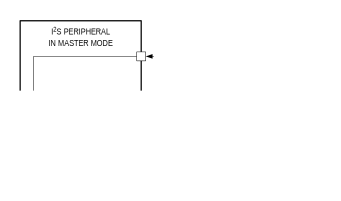
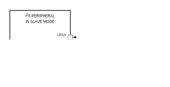

I²S is a serial audio interface for communicating pulse-code modulation (PCM) encoded streams between devices. The peripheral supports both master and slave modes.

Key features:

- Stereo (2 channel) and mono (left or right channel option) formats
- Separate DMA channels for transmit and receive.
- Flexible timing:

    - Configurable sampling rate from 1/65536 to 1 of the I²S input clock.

- Flexible data format:

    - The number of bits per data word can be selected from 1 to 32, typically 8, 16, 24, or 32-bit width.
    - Feature enhancement not in the I²S specification.

        - Word/Channel select polarity control.
        - First bit position selection.
        - Selectable FIFO data alignment to the MSB or the LSB of the sample
        - Sample size less than the word size with adjustment to MSB or LSB of the word.
        - Optional sign extension.

- Full-duplex serial communication with separate I²S serial data input and serial data output pins

## Instances
*Table 15-1: MAX78000 I²S Instances*

<table border="1" cellpadding="5" cellspacing="0">
<thead>
    <tr>
        <th>Instance</th>
        <th>Supported Channels</th>
        <th colspan="2">I2S_CLK Clock Options</th>
        <th>Receive FIFO Depth</th>
        <th>Transmit FIFO Depth</th>
    </tr>
</thead>
<tbody>
    <tr>
        <td>I2S0</td>
        <td>Stereo</td>
        <td>PCLK</td>
        <td>I2S_EXTCLK</td>
        <td>8 × 32-bits</td>
        <td>8 × 32-bits</td>
    </tr>
</tbody>
</table>

### I²S Bus Lines and Definitions
The I²S peripheral includes support for the following signals:

1. Bit clock line:
    - Continuous serial clock (SCK) referred to as bit clock (BCLK) in this document.
2. Word clock line:
    - Word select (WS) referred to as left-right clock (LRCLK) in this document.
3. Serial data in (SDI).
4. Serial data out (SDO).
5. External clock input (I2S_EXTCLK) required for operation in master mode.

Detailed pin and alternate function mapping are shown in [Table 15-2](#table15-2-max78000-i2s-pin-mapping).

*Table 15-2: MAX78000 I2S Pin Mapping*

<table border="1" cellpadding="5" cellspacing="0">
<thead>
    <tr>
        <th>Instance</th>
        <th>I2S Signal</th>
        <th>Pin Description</th>
        <th>81 CTBGA Pin Number</th>
        <th>Alternate Function Number</th>
        <th>Notes</th>
    </tr>
</thead>
<tbody>
    <tr>
        <td rowspan="5">I2S0</td>
        <td>BCLK (SCK)</td>
        <td>I²S bit clock</td>
        <td>P1.2</td>
        <td>AF1</td>
        <td>Also referred to as serial clock</td>
    </tr>
    <tr>
        <td>LRCLK (WS)</td>
        <td>I²S left/right clock (word select)</td>
        <td>P1.3</td>
        <td>AF1</td>
        <td>Also referred to as word select</td>
    </tr>
    <tr>
        <td>SDI</td>
        <td>I²S serial data input</td>
        <td>P1.4</td>
        <td>AF1</td>
        <td></td>
    </tr>
    <tr>
        <td>SDO</td>
        <td>I²S serial data output</td>
        <td>P1.5</td>
        <td>AF1</td>
        <td></td>
    </tr>
    <tr>
        <td>I2S_CLKEXT</td>
        <td>I²S external clock</td>
        <td>P0.14</td>
        <td>AF2</td>
        <td>This input is required to use the I²S peripheral as a master.</td>
    </tr>
</tbody>
</table>

## Details
The I²S supports full-duplex serial communication with separate SDI and SDO pins. [Figure 15-1](#figure15-1) shows an interconnect between a peripheral configured in host mode, communicating with an external I²S slave receiver and transmitter. In master mode, the peripheral hardware generates the BCLK and LRCLK, and both are output to each slave device.

*Note: Master operation requires the use of the I2S_EXTCLK signal to generate the LRCLK and BCLK signals.*

*Figure 15-1: I²S Master Mode, Full Duplex Connection*

[Figure 15-2](#figure15-2) shows the I²S peripheral configured for slave operation. The LRCLK and BCLK signals are generated externally and are inputs to the I²S peripheral.

*Figure 15-2: I²S Slave Mode*

## Master and Slave Mode Configuration
The hardware supports master and slave mode. In master mode, the BCLK and LRCLK signals are generated internally and output on the BCLK and LRCLK pins. In slave mode, the BCLK and LRCLK pins are configured as inputs, and the external clock source controls the peripheral timing.

*Table 15-3: I2S Mode Configuration*

<table border="1" cellpadding="5" cellspacing="0">
<thead>
    <tr>
        <th>Device Mode</th>
        <th><a href="#i2s-global-mode-control-0-register">I2S_CTRL0CH0</a>.<em>ch_mode</em></th>
        <th>LRCLK</th>
        <th>BCLK</th>
    </tr>
</thead>
<tbody>
    <tr>
        <td>Master</td>
        <td>0</td>
        <td>Output to Slave</td>
        <td>Output to Slave</td>
    </tr>
    <tr>
        <td>Slave</td>
        <td>3</td>
        <td>Input from Master</td>
        <td>Input from Master</td>
    </tr>
</tbody>
</table>

## Clocking
*Figure 15-3: Audio Interface I2S Signal Diagram*

I2S communication is synchronized using two signals, the LRCLK and the BCLK. When the I2S peripheral is configured as a master, the BCLK and LRCLK signals are generated internally by the peripheral using the I2S external clock signal. See Table 15-2 for details of the I2S pin mapping and alternate function selection. If using the I2S peripheral in master mode, the I2S external clock must be enabled to generate the BCLK and LRCLK signals.

When the I2S peripheral is configured in slave mode, the BCLK and LRCLK pins must be configured as inputs. An external master generates the BCLK and LRCLK signals, which the peripheral uses to synchronize itself to the I2S bus. [Figure 15-3](#figure15-3) shows the default signals and timing for I2S communication.

The BCLK frequency is the product of the sample rate, the number of bits per channel (left and right), and the number of channels. For CD audio sampled at a frequency of 44.1kHz, with 16-bit sample width and stereo audio (left and right), the bit clock frequency, $f_{BCLK}$, is 1.4112MHz as shown in [Equation 15-1](#equation15-1).

*Equation 15-1: CD Audio Bit Frequency Calculation*

$$
f_{BCLK} = 44.1 kHz \times 16 \times 2 = 1.4112MHz
$$

### BCLK Generation for Master Mode
As indicated by [Equation 15-1](#equation15-1), the requirements for determining the BCLK frequency are:

1. Audio sample frequency.
2. Number of bits per sample, also referred to as the sample width.

Using the above requirements, [Equation 15-2](#equation15-2) shows the formula to calculate the bit clock frequency for a given audio file.

*Equation 15-2: Calculating the Bit Clock Frequency for Audio*

$$
f_{BCLK} = f_{SAMPLE} \times \text{Sample Width} \times 2  
$$

In master mode, the I2S external clock input is used to generate the BCLK frequency. The I2S external clock is divided by the <a name="#i2s-master-mode-configuration-register">I2S_CTRL1CH0</a>.*clkdiv* field to achieve the target BCLK frequency, as shown in [Equation 15-3](#equation15-3).

*Equation 15-3: Master Mode BCLK Generation Using the I2S External Clock*

$$
f_{BCLK} = \frac{f_{ERFO}}{(\text{12Sn_CTRL1CH0.clkdiv} + 1) \times 2} 
$$

Use [Equation 15-4](#equation15-4) to determine the I2S clock divider for a target BCLK frequency.

*Equation 15-4: Master Mode Clock Divisor Calculation*

$$
\text{12Sn_CTRL1CH0.clkdiv} = \frac{f_{ERFO}}{2\times f_{BCLK}} - 1 
$$

### LRCLK Period Calculation
An I2S data stream can carry mono (either left or right channel) or stereo (left and right channel) data. The LRCLK signal indicates which channel is currently being sent, either left or right channel data, as shown in [Figure 15-3](#figure15-3). The LRCLK is a 50% duty cycle signal and is the same frequency as the audio sampling frequency, $f_{SAMPLE}$ .

The I2S peripheral uses the bits per word field, <a name="#i2s-global-mode-control-0-register">I2S_CTRL1CH0</a>.*bits_word*, to define the sample width of the audio, equivalent to the number of bit clocks per channel. This value should be set to the sample width of the audio minus 1. For example, the software should set the <a name="#i2s-global-mode-control-0-register">I2S_CTRL1CH0</a>.*bits_word* field to 15 for audio sampled using a 16-bit width.

*Equation 15-5: Bits Per Word Calculation*

$$
\text{12Sn_CTRL1CH0.bits_word} = \text{Sample Width} - 1 
$$

The LRCLK frequency, or word select frequency, is automatically generated by the I2S peripheral hardware when it is set to operate as a master. The LRCLK frequency calculation is shown in [Equation 15-6: LRCLK Frequency Calculation](#equation15-6).

*Equation 15-6: LRCLK Frequency Calculation*

$$
f_{LRCLK} = f_{BCLK}\times(\text{12Sn_CTRL1CH0.bits_word} + 1)  
$$

## Data Formatting
### Sample Size
The sample size field, <a name="#i2s-global-mode-control-0-register">I2S_CTRL1CH0</a>.*smp_word*, defines the number of desired samples within each channel, left, right or mono, for the peripheral. This field can be less than or equal to the <a name="#i2s-global-mode-control-0-register">I2S_CTRL1CH0</a>.*bits_word* field. For example, for 16-bit sample width audio, the <a name="#i2s-global-mode-control-0-register">I2S_CTRL1CH0</a>.*bits_word* field must be set to 15. However, the sample size field can be set from 0 to 15. Setting the sample size field to 0 is the equivalent of setting it to the value of the bits per word field. The sample size field determines how many of the bits per word are transmitted or saved per channel. The sample size field is a 0 based field; therefore, setting <a name="#i2s-global-mode-control-0-register">I2S_CTRL1CH0</a>.*smp_word* to 15 collects 16 samples. See [Figure 15-6](#figure15-6) for an example of the bits per word field’s setting compared to the sample size field’s setting.

### Word Select Polarity
Left channel data, by default, is transferred when the LRCLK signal is low, and right channel data is transferred when the LRCLK signal is high. The polarity of the LRCLK is programmable allowing left and right data to be swapped. The LRCLK polarity is controlled using the word select polarity field, <a name="#i2s-global-mode-control-0-register">I2S_CTRL0CH0</a>.*ws_pol*. By default, LRCLK low is for the left channel, high is for the right channel as shown in [Figure 15-3](#figure15-3). Setting  <a name="#i2s-global-mode-control-0-register">I2S_CTRL0CH0</a>.*ws_pol* to 1 inverts the LRCLK polarity, using LRCLK high for the left channel and LRCLK low for the right channel as shown in [Figure 15-4](#figure15-4).

*Figure 15-4: Audio Mode with Inverted Word Select Polarity*

### First Bit Location Control
The default setting is for the first bit of I2S data to be located at the second complete BCLK cycle after the LRCLK transition as required by the I2S specification. See [Figure 15-3](#figure15-3) for the standard data sampling configuration. Optionally, the first bit location can be left justified, resulting in the first bit of data being sampled on the first BCLK cycle after the LRCLK signal transitions as shown in [Figure 15-5](#figure15-5). Set  <a name="#i2s-global-mode-control-0-register">I2S_CTRL0CH0</a>.*msb_loc* to 1 to left justify the data with respect to the LRCLK.

*Figure 15-5: Audio Master Mode Left-Justified First Bit Location*

### Sample Adjustment
When the sample size field, <a name="#i2s-master-mode-configuration-register">I2S_CTRL1CH0</a>.*smp_word*, is less than the bits per word field, <a name="#i2s-master-mode-configuration-register">I2S_CTRL1CH0</a>.*bits_word*, use the <a name="#i2s-master-mode-configuration-register">I2S_CTRL1CH0</a>.*adjst* field to set which bits are stored in the receive FIFO or transmitted from the transmit FIFO, either from the first sample of the SDI/SDO line or the last sample of the SDI/SDO line for the left and right channels. [Figure 15-6](#figure15-6) shows an example of the default adjustment, MSB, where <a name="#i2s-master-mode-configuration-register">I2S_CTRL1CH0</a>.*smp_word* = 7 and <a name="#i2s-master-mode-configuration-register">I2S_CTRL1CH0</a>.*bits_word* = 15. [Figure 15-7](#figure15-7) shows the adjustment set to the LSB of the SDI/SDO data.

*Figure 15-6: MSB Adjustment when Sample Size is Less Than Bits Per Word*

*Figure 15-7: LSB Adjustment when Sample Size is Less Than Bits Per Word*

### Stereo/Mono Configuration
The I2S can transfer stereo or mono data based on the <a name="#i2s-global-mode-control-0-register">I2S_CTRL0CH0</a>.*stereo* field. In stereo mode, the default mode, both the left and right channels hold data. In mono mode, only the left or right channel contain data. For stereo mode, set <a name="#i2s-global-mode-control-0-register">I2S_CTRL0CH0</a>.*stereo* to 0. Set <a name="#i2s-global-mode-control-0-register">I2S_CTRL0CH0</a>.*stereo* field to 2 for left channel mono. Set <a name="#i2s-global-mode-control-0-register">I2S_CTRL0CH0</a>.*stereo* field to 3 for right channel mono.

*Figure 15-8: I2S Mono Left Mode*

*Figure 15-9: I2S Mono Right Mode*

## Transmit and Receive FIFOs
### FIFO Data Width
I2S audio data is programmable from 1 to 32 bits using the <a name="#i2s-master-mode-configuration-register">I2S_CTRL1CH0</a>.*bits_word* field. The software can set the FIFO width to either 8-bits (byte), 16-bits (half-word), or 32-bits (word). Set the FIFO width using the <a name="#i2s-global-mode-control-0-register">I2S_CTRL0CH0</a>.*wsize* field. For FIFO word sizes less than 32-bits, the data frame, comprising of a full LRCLK cycle, may still be 64 bits; the unused bits are transmitted as zero by the hardware.

### Transmit FIFO
An I2S transaction is started by writing data to the transmit FIFO using the <a name="#i2s-fifo-register">I2S_FIFOCH0</a>.*data* register, either directly or using a DMA channel. The data written is automatically transmitted out by the hardware, a FIFO word, as defined using the <a name="#i2s-global-mode-control-0-register">I2S_CTRL0CH0</a>.*wsize* field, at a time, in the order it was written to the transmit FIFO. Use the I2S interrupt flags to monitor the transmit FIFO status and determine when the transfer cycle(s) have completed.

If the transmit FIFO becomes empty, an error condition occurs, and results in undefined behavior.

### Receive FIFO
The received data is loaded into the receive FIFO, and it can then be unloaded by reading from the <a name="#i2s-fifo-register">I2S_FIFOCH0</a>.*data* register. An overrun event occurs if the receive FIFO is full and another word is shifted into the FIFO.

### FIFO Word Control
The data width of the transmit and receive FIFOs can be configured using the <a name="#i2s-global-mode-control-0-register">I2S_CTRL0CH0</a>.*wsize* field. [Table 15-4](#table15-4-data-ordering-for-byte-data-size), [Table 15-5](#table15-5-data-ordering-for-half-word-data-size), and [Table 15-6](#table15-5-data-ordering-for-word-data-size), describe the data ordering based on the <a name="#i2s-global-mode-control-0-register">I2S_CTRL0CH0</a>.*wsize* setting.

The transmit and receive FIFOs must be flushed, and the peripheral reset by the software, prior to reconfiguration. The software resets the peripheral by setting the <a name="#i2s-global-mode-control-0-register">I2S_CTRL0CH0</a>.*rst* field to 1.

*Table 15-4: Data Ordering for Byte Data Size (Stereo Mode)*

<table border="1" cellpadding="5" cellspacing="0">
<thead>
<tr>
    <th colspan="5">Byte Data Width (<a href="#i2s-global-mode-control-0-register">I2S_CTRL0CH0</a>.<em>wsize</em> = 0)</th>
</tr>
    <tr>
        <th>FIFO Entry</th>
        <th colspan="3">MSByte</th>
        <th>LSByte</th>
    </tr>
</thead>
<tbody>
    <tr>
        <td>FIFO 0</td>
        <td>Right Channel Byte 1</td>
        <td>Left Channel Byte 1</td>
        <td>Right Channe Byte 0</td>
        <td>Left Channel Byte 0</td>
    </tr>
    <tr>
        <td>FIFO 1</td>
        <td>Right Channel Byte 3</td>
        <td>Left Channel Byte 3</td>
        <td>Right Channel Byte 2</td>
        <td>Left Channel Byte 2</td>
    </tr>
    <tr>
        <td>…</td>
        <td>…</td>
        <td>…</td>
        <td>…</td>
        <td>…</td>
    </tr>
    <tr>
        <td>FIFO 7</td>
        <td>Right Channel Byte 14</td>
        <td>Left Channel Byte 14</td>
        <td>Right Channel Byte 13</td>
        <td>Left Channel Byte 13</td>
    </tr>
</tbody>
</table>

*Table 15-5: Data Ordering for Half-Word Data Size (Stereo Mode)*

<table border="1" cellpadding="5" cellspacing="0">
<thead>
    <tr>
        <th colspan="3">Half-Word Data Width (<a href="#i2s-global-mode-control-0-register">I2S_CTRL0CH0</a>.<em>wsize</em> = 1)</th>
    </tr>
</thead>
<thead>
    <tr>
        <th>FIFO Entry</th>
        <th>MS Half-Word</th>
        <th>LS Half-Word</th>
    </tr>
</thead>
<tbody>
    <tr>
        <td>FIFO 0</td>
        <td>Right Channel Half-Word 0</td>
        <td>Left Channel Half-Word 0</td>
    </tr>
    <tr>
        <td>FIFO 1</td>
        <td>Right Channel Half-Word 1</td>
        <td>Left Channel Half-Word 1</td>
    </tr>
    <tr>
        <td>…</td>
        <td>…</td>
        <td>…</td>
    </tr>
    <tr>
        <td>FIFO 7</td>
        <td>Right Channel Half Word <em>7</em></td>
        <td>Left Channel Half-Word <em>7</em></td>
    </tr>
</tbody>
</table>

*Table 15-6: Data Ordering for Word Data Size (Stereo Mode)*

<table border="1" cellpadding="5" cellspacing="0">
<thead>
    <tr>
        <th colspan="2">Word Data Width (<a href="#i2s-global-mode-control-0-register">I2S_CTRL0CH0</a>.<em>wsize</em> = 2 or 3)</th>
    </tr>
</thead>
<thead>
    <tr>
        <th>FIFO Entry</th>
        <th>Word</th>
    </tr>
</thead>
<tbody>
    <tr>
        <td>FIFO 0</td>
        <td>Left Channel Word 0</td>
    </tr>
    <tr>
        <td>FIFO 1</td>
        <td>Right Channel Word 0</td>
    </tr>
    <tr>
        <td>FIFO 2</td>
        <td>Left Channel Word 1</td>
    </tr>
    <tr>
        <td>FIFO 3</td>
        <td>Right Channel Word 1</td>
    </tr>
    <tr>
        <td>…</td>
        <td>…</td>
    </tr>
    <tr>
        <td>FIFO 6</td>
        <td>Left Channel Word 3</td>
    </tr>
    <tr>
        <td>FIFO 7</td>
        <td>Right Channel Word 3</td>
    </tr>
</tbody>
</table>

### FIFO Data Alignment
The I2S data can be left aligned (reset default), or right aligned, using the <a name="#i2s-global-mode-control-0-register">I2S_CTRL0CH0</a>.*align* field. The following conditions apply to each setting:

Left aligned: <a name="#i2s-global-mode-control-0-register">I2S_CTRL0CH0</a>.*align* = 0

- If the number of bits per word is greater than the FIFO data width:

    - Receive: All bits after the LSB of the FIFO data width is discarded.
    - Transmit: All bits after the LSB of the FIFO data width are sent as 0.

- If the number of bits per word is less than the FIFO data width:

    - Receive: The data received is stored starting at the MSB of the FIFO entry up to the number of bits per word plus one bit.
    - Transmit: The data in the transmit FIFO is sent from the LSB to the number of bits plus 1.

Right aligned: <a name="#i2s-global-mode-control-0-register">I2S_CTRL0CH0</a>.*align* = 1

- If the number of bits per word is greater than the FIFO data width:

    - Receive: The data received is stored in the receive FIFO starting with the LSB up to the FIFO data width and any additional bits are discarded.
    - Transmit: 0 bits are transmitted for all bits greater than the FIFO data width. For example, if the bits per word field is set to 12 and the FIFO data width is 8, the first 4 bits are transmitted as 0 and then the 8-bits of data in the FIFO are transmitted.

- If the number of bits per word is less than the FIFO data width:

    - Receive: The data received is sign extended and saved to the receive FIFO.
    - Transmit: The data in the transmit FIFO is sent from the LSB to the number of bits plus 1.

### Typical Audio Configurations
[Table 15-7](#table15-7-configuration-for-typical-audio-width-samples) shows the relationship between the bits per word field and the sample size field. [Equation 15-7](#equation15-7) shows the required relationship between the sample size field and the bits per word field.

*Equation 15-7: Sample Size Relationship Bits per Word*

$$
\text{I2Sn_CTRL1CH0.smp_size} \le \text{I2Sn_CTRL1CH0.bits_word}
$$

The <a name="#i2s-master-mode-configuration-register">I2S_CTRL1CH0</a>.*bits_word* column in Table 15-7 is set by the equation $\frac{\text{#BCLK}}{\text{Channel}} - 1$. The <a name="#i2s-master-mode-configuration-register">I2S_CTRL1CH0</a>.*smp_size* column is the number of samples per word captured from the I2S bus, and is calculated by the equation $\frac{\text{#Samples}}{\text{Channel}} - 1$. Channel refers to the left and right channels of audio.

*Table 15-7: Configuration for Typical Audio Width and Samples per WS Clock Cycle*

<table border="1" cellpadding="5" cellspacing="0">
    <tr>
        <td rowspan="2">Audio Sample Width / Samples per WS Cycle</td>
        <td rowspan="2">$$\frac{\mathbf{\#\
        BCLK}}{\mathbf{Channel}}$$</td>
        <td rowspan="2">$$\frac{\mathbf{\#\
        Samples}}{\mathbf{Channel}}$$</td>
        <td colspan="3"><em>I2S_CTRL1CH0</em></td>
        <td rowspan="2">Sign extension (align = 1)<em>✝</em></td>
    </tr>
    <tr>
        <td><em>bits_word</em></td>
        <td><em>smp_size</em></td>
        <td><em>wsize</em></td>
    </tr>
<tbody>
    <tr>
        <td>8-bit / 16</td>
        <td>8</td>
        <td>8</td>
        <td>7</td>
        <td>7</td>
        <td>0</td>
        <td></td>
    </tr>
    <tr>
        <td>16-bit / 32</td>
        <td>16</td>
        <td>16</td>
        <td>15</td>
        <td>15</td>
        <td>1</td>
        <td></td>
    </tr>
    <tr>
        <td>20-bit / 40</td>
        <td>20</td>
        <td>20</td>
        <td>19</td>
        <td>19</td>
        <td>2</td>
        <td>sign</td>
    </tr>
    <tr>
        <td>24-bit / 48</td>
        <td>24</td>
        <td>24</td>
        <td>23</td>
        <td>23</td>
        <td>2</td>
        <td>sign</td>
    </tr>
    <tr>
        <td>24-bit / 64</td>
        <td>32</td>
        <td>24</td>
        <td>31</td>
        <td>23</td>
        <td>2</td>
        <td>sign</td>
    </tr>
    <tr>
        <td>32-bit / 64</td>
        <td>32</td>
        <td>32</td>
        <td>31</td>
        <td>31</td>
        <td>2</td>
        <td></td>
    </tr>
    <tr>
        <td colspan="7">✝ Sign Extension applies only when
        <a href="#i2s-global-mode-control-0-register">I2S_CTRL0CH0</a>.<em>align</em> is set to 1 and <a href="#i2s-global-mode-control-0-register">I2S_CTRL0CH0</a>.<em>smp_size</em> is less than
        the FIFO width size setting.</td>
    </tr>
</tbody>
</table>

## Interrupt Events
The I2S peripheral generates interrupts for the events shown in [Table 15-8](#table15-8-i2s-interrupt-events). An interrupt is generated if the corresponding interrupt enable field is set. The interrupt flags stay set until cleared by the software by writing 1 to the interrupt flag field.

*Table 15-8: I2S Interrupt Events*

<table border="1" cellpadding="5" cellspacing="0">
    <thead>
        <tr>
            <th>Event</th>
            <th>Interrupt Flag</th>
            <th>Interrupt Enable</th>
        </tr>
    </thead>
<tbody>
    <tr>
        <td>Receive FIFO overrun</td>
        <td><a href="#i2s-interrupt-status-register">I2S_INTFL</a>.<em>rx_ov_ch0</em></td>
        <td><a href="#i2s-interrupt-enable-register">I2S_INTEN</a>.<em>rx_ov_ch0</em></td>
    </tr>
    <tr>
        <td>Receive threshold</td>
        <td><a href="#i2s-interrupt-status-register">I2S_INTFL</a>.<em>rx_thd_ch0</em></td>
        <td><a href="#i2s-interrupt-enable-register">I2S_INTEN</a>.<em>rx_thd_ch0</em></td>
    </tr>
    <tr>
        <td>Transmit FIFO half-empty</td>
        <td><a href="#i2s-interrupt-status-register">I2S_INTFL</a>.<em>tx_he_ch0</em></td>
        <td><a href="#i2s-interrupt-enable-register">I2S_INTEN</a>.<em>tx_he_ch0</em></td>
    </tr>
    <tr>
        <td>Transmit FIFO one byte remaining</td>
        <td><a href="#i2s-interrupt-status-register">I2S_INTFL</a>.<em>tx_ob_ch0</em></td>
        <td><a href="#i2s-interrupt-enable-register">I2S_INTEN</a>.<em>tx_ob_ch0</em></td>
    </tr>
</tbody>
</table>

### Receive FIFO Overrun
A receive FIFO overrun event occurs if the number of data words in the receive FIFO, <a name="#i2s-dma-control-channel-register">I2S_DMACH0</a>.*rx_lvl* is equal to the RX_FIFO_DEPTH and another word has been shifted into the FIFO. The hardware automatically sets the <a name="#i2s-interrupt-status-register">I2S_INTFL</a>.*rx_ov_ch0* field to 1 when this event occurs.

### Receive FIFO Threshold
A receive FIFO threshold event occurs when a word is shifted in and the number of words in the receive FIFO, <a name="#i2s-dma-control-channel-register">I2S_DMACH0</a>.*rx_lvl*, exceeds the <a name="#i2s-global-mode-control-0-register">I2S_CTRL0CH0</a>.*rx_thd_val*. The event does not occur if the opposite transition occurs. When this event occurs, the hardware automatically sets the <a name="#i2s-interrupt-status-register">I2S_INTFL</a>.*rx_thd_ch0* field to 1.

### Transmit FIFO Half-Empty
A transmit FIFO half-empty event occurs when the number of words in the transmit FIFO, <a name="#i2s-dma-control-channel-register">I2S_DMACH0</a>.*tx_lvl*, is less than ½ of the TX_FIFO_DEPTH as shown in Equation 15-8. When this event occurs, the <a name="#i2s-interrupt-status-register">I2S_INTFL</a>.*tx_he_ch0* flag is set to 1 by the hardware.

*Note: The transmit FIFO half empty interrupt flag is set by the hardware one BCLK cycle prior to the actual condition occurring. If the BCLK is much slower than the I2S peripheral clock, the software may receive the interrupt while the actual transmit FIFO level is still equal to ½ of the TX_FIFO_DEPTH. The software should always read the transmit FIFO level prior to filling it to determine the correct number of words to write to the transmit FIFO. Read the level of the transmit FIFO using the <a name="#i2s-dma-control-channel-register">I2S_DMACH0</a>.tx_lvl field.*

*Equation 15-8: Transmit FIFO Half-Empty Condition*

$$
\text{I2SnDMACH0.tx_lvl} < (\frac{\text{TX FIFO DEPTH}}{2})
$$

### Transmit FIFO One Entry Remaining
A transmit FIFO one entry remaining event occurs when the number of entries in the transmit FIFO is 1, <a name="#i2s-dma-control-channel-register">I2S_DMACH0</a>.*tx_lvl* = 1. When this event occurs, the <a name="#i2s-interrupt-status-register">I2S_INTFL</a>.*tx_ob_ch0* flag is set to 1 by the hardware.

*Note: The transmit FIFO one entry remaining interrupt flag is set by the hardware one BCLK cycle prior to the actual condition occurring. If the BCLK is much slower than the I2S peripheral clock, the software may receive the interrupt while the actual transmit FIFO level is still equal to 2. The software should always read the transmit FIFO level prior to filling it to determine the correct number of words to write to the transmit FIFO. Read the level of the transmit FIFO using the <a name="#i2s-dma-control-channel-register">I2S_DMACH0</a>.tx_lvl field.*

## Direct Memory Access
The I2S supports DMA for both transmit and receive; separate DMA channels can be connected to the receive and transmit FIFOs. The following describe the behavior of the receive and transmit DMA requests.

- A receive DMA request is asserted when the number of words in the receive FIFO is greater than or equal to the receive FIFO threshold.

- A transmit DMA request is asserted when the number of valid bytes in the transmit FIFO is less than ½ of the transmit FIFO’s depth.

## Block Operation
After exiting a power-on reset, the IP is disabled by default. It must be enabled and configured by the software to establish the I2S serial communication. A typical software sequence is shown below.

1. Set GCR_PCLKDIS1.i2s0 to 0 to enable the I2S peripheral clock source shown in [Table 15-1](#table15-1-max78000-i2s-instances).
2. Disable the I2S clock by setting <a name="#i2s-master-mode-configuration-register">I2S_CTRL1CH0</a>.*en* to 0.
3. Set <a name="#i2s-global-mode-control-0-register">I2S_CTRL0CH0</a>.*rst* to 1 to reset the I2S configuration.
4. Set <a name="#i2s-master-mode-configuration-register">I2S_CTRL1CH0</a>.*flush* to 1 to flush the FIFO buffers.
5. Configure the <a name="#i2s-global-mode-control-0-register">I2S_CTRL0CH0</a>.*ch_mode* to select the master or slave configuration.

    a. For master mode, configure the baud rate by programming the <a name="#i2s-master-mode-configuration-register">I2S_CTRL1CH0</a>.*clkdiv* field to achieve the required bit rate, set the <a name="#i2s-master-mode-configuration-register">I2S_CTRL1CH0</a>.*smp_size* field to the desired sample size of the data, and the <a name="#i2s-master-mode-configuration-register">I2S_CTRL1CH0</a>.*adjst* field if the Sample Size is smaller than the number of bits per word.

6. Configure the threshold of the receive FIFO by programming the <a name="#i2s-master-mode-configuration-register">I2S_CTRL1CH0</a>.rx_thd. The threshold of the transmit FIFO is a fixed value, which is half of the transmit FIFO depth.
7. If desired, configure DMA operation, see section Direct Memory Access for details.
8. Enable interrupt functionality by configuring the I2S_INTEN register if desired.
9. Program the clkdiv bits in <a name="#i2s-master-mode-configuration-register">I2S_CTRL1CH0</a> register for the new bit clock frequency.
10. For master operation, load data in the transmit FIFO for transmit.
11. Re-enable the bit clock by setting <a name="#i2s-master-mode-configuration-register">I2S_CTRL1CH0</a>.en to 1.

## Registers
See [Table 3-3](memory-register-mapping-access.md#apb-peripheral-base-address-map) for the base address of this peripheral/module. See [Table 1-1](index.md#table1-1-field-access-definitions) for an explanation of the read and write access of each field. Unless specified otherwise, all fields are reset on a system reset, soft reset, POR, and the peripheral-specific resets.

*Table 15-9: I2S Register Summary*

<table border="1" cellpadding="5" cellspacing="0">
<thead>
  <tr>
    <th>Offset</th>
    <th>Register</th>
    <th>Description</th>
  </tr>
</thead>
<tr>
    <td>[0x0000]</td>
    <td><a href="#i2s-global-mode-control-0-register">I2S_CTRL0CH0</a></td>
    <td>I2S Global Mode Control 0 Register</td>
</tr>
<tr>
    <td>[0x0010]</td>
    <td><a href="#i2s-master-mode-configuration-register">I2S_CTRL1CH0</a></td>
    <td>I2S Master Mode Configuration Register</td>
</tr>
<tr>
    <td>[0x0030]</td>
    <td><a href="#i2s-dma-control-channel-register">I2S_DMACH0</a></td>
    <td>I2S DMA Control Channel Register</td>
</tr>
<tr>
    <td>[0x0040]</td>
    <td><a href="#i2s-fifo-register">I2S_FIFOCH0</a></td>
    <td>I2S FIFO Register</td>
</tr>
<tr>
    <td>[0x0050]</td>
    <td><a href="#i2s-interrupt-status-register">I2S_INTFL</a></td>
    <td>I2S Interrupt Status Register</td>
</tr>
<tr>
    <td>[0x0054]</td>
    <td><a href="#i2s-interrupt-enable-register">I2S_INTEN</a></td>
    <td>I2S Interrupt Enable Register</td>
</tr>
</table>

### Register Details

*Table 15-10: I2S Control 0 Register*

<table border="1" cellpadding="5" cellspacing="0">
    <tr>
        <td colspan="3">I2S Control 0 Register</td>
        <td colspan="1">I2S_CTRL0CH0</td>
        <td>[0x0000]</td>
    </tr>
    <tr>
        <th>Bits</th>
        <th>Name</th>
        <th>Access</th>
        <th>Reset</th>
        <th>Description</th>
    </tr>
<tbody>
    <tr>
        <td>31:24</td>
        <td>rx_thd_val</td>
        <td>R/W</td>
        <td>0</td>
        <td><strong>RX FIFO Interrupt Threshold</strong> This field specifies the level of the receive FIFO for the threshold interrupt generation. Values of 0 or greater than the RX_FIFO_DEPTH are ignored.
        </td>
    </tr>
    <tr>
        <td>23:21</td>
        <td>-</td>
        <td>RO</td>
        <td>0</td>
        <td><strong>Reserved</strong></td>
    </tr>
    <tr>
        <td>20</td>
        <td>fifo_lsb</td>
        <td>R/W</td>
        <td>0</td>
        <td><strong>FIFO Bit Field Control</strong>  Only used if the FIFO size is larger than the sample size and <a href="#i2s-global-mode-control-0-register">I2S_CTRL0CH0</a>.<em>align</em> = 0.
        
For transmit, the LSB part is sent from the FIFO.

        
For receive, store the LSB part in the FIFO without sign extension.

        

        0: Disabled 
        1: Enabled

        </td>
    </tr>
    <tr>
        <td>19</td>
        <td>rst</td>
        <td>R/W1O</td>
        <td>0</td>
        <td><strong>Reset</strong>   Write 1 to reset the I2S peripheral. The hardware automatically clears this field to 0 when the reset is complete.
        

        0: Reset not in process. 
        1: Reset peripheral.

        </td>
    </tr>
    <tr>
        <td>18</td>
        <td>flush</td>
        <td>R/W1O</td>
        <td>0</td>
        <td><strong>FIFO Flush</strong>  Write 1 to start a flush of the receive and transmit FIFOs. The hardware automatically clears this field when the operation is complete.
        

        0: Flush complete or not in process. 
        1: Flush receive and transmit FIFOs.

        </td>
    </tr>
    <tr>
        <td>17</td>
        <td>rx_en</td>
        <td>R/W</td>
        <td>0</td>
        <td><strong>Receive Enable</strong>  Enable receive mode for the I2S peripheral.
        

        0: Disabled 
        1: Enabled

        </td>
    </tr>
    <tr>
        <td>16</td>
        <td>tx_en</td>
        <td>R/W</td>
        <td>0</td>
        <td><strong>Transmit Enable</strong>  Enable transmit mode for the I2S peripheral.
        

        0: Disabled 
        1: Enabled

        </td>
    </tr>
    <tr>
        <td>15:14</td>
        <td>wsize</td>
        <td>R/W</td>
        <td>0x3</td>
        <td><strong>Data Size When Reading/Writing FIFO</strong>  Set this field to the desired width for data writes and reads from the FIFO.
        

        0: Byte 
        1: Half-word (16 bits). 
        2-3: Word (32 bits).

        </td>
    </tr>
    <tr>
        <td>13:12</td>
        <td>stereo</td>
        <td>R/W</td>
        <td>0</td>
        <td><strong>I2S Mode</strong>  Select the mode for the I2S to stereo, mono left channel only, or mono right channel only.
        

        0-1: Stereo 
        2: Mono left channel. 
        3: Mono right channel.

        </td>
    </tr>
    <tr>
        <td>11</td>
        <td>-</td>
        <td>RO</td>
        <td>0</td>
        <td><strong>Reserved</strong></td>
    </tr>
    <tr>
        <td>10</td>
        <td>align</td>
        <td>R/W</td>
        <td>0</td>
        <td><strong>FIFO Data Alignment</strong>  Set this field to control the alignment of the data in the FIFOs. This field is only used if the FIFO data width, <a href="#i2s-global-mode-control-0-register">I2S_CTRL0CH0</a>.<em>wsize</em>, is not equal to the bits per word field.
        

        0: MSB 
        1: LSB

        </td>
    </tr>
    <tr>
        <td>9</td>
        <td>msb_loc</td>
        <td>R/W</td>
        <td>0</td>
        <td><strong>First Bit Location Sampling</strong>  This field controls when the first bit is transmitted/received in relation to the LRCLK. By default, the first bit is transmitted/received on SDO/SDI on the second complete LRCLK cycle. Set this field to 1 to transmit/receive the first bit of data on the first complete LRCLK cycle.
        

        0: Second complete LRCLK cycle is the first bit of the data. 
        1: First complete LRCLK cycle is the first bit of the data.

        </td>
    </tr>
    <tr>
        <td>8</td>
        <td>ws_pol</td>
        <td>R/W</td>
        <td>0</td>
        <td><strong>LRCLK Polarity Select</strong>  This field determines the polarity of the LRCLK signal associated with the left channel data. Set this field to 1 to associate the left channel with the LRCLK high state. The default setting is the standard I2S association.
        

        0: LRCLK low for left channel. 
        1: LRCLK high for left channel.

        </td>
    </tr>
    <tr>
        <td>7:6</td>
        <td>ch_mode</td>
        <td>R/W</td>
        <td>0</td>
        <td><strong>Mode</strong>  Set this field to indicate master or slave I2S operation. When using master mode, the I2S external clock must be used to generate the LRCLK/BCLK signals.
        

        0: Master mode, internal generation of LRCLK/BCLK using the I2S external clock input. 
        1-2: Reserved 
        3: Slave mode, external generation of LRCLK/BCLK.

        </td>
    </tr>
    <tr>
        <td>5:2</td>
        <td>-</td>
        <td>DNM</td>
        <td>0</td>
        <td><strong>Reserved, Do Not Modify</strong>
        </td>
    </tr>
    <tr>
        <td>1</td>
        <td>lsb_first</td>
        <td>R/W</td>
        <td>0</td>
        <td><strong>LSB First</strong>  Setting this field to 1 indicates the least significant bit of the data is transmitted/received first on the SDI/SDO pins. The default setting, 0, indicates the most significant bit of the data is received first.
        

        0: Disabled 
        1: Enabled

        </td>
    </tr>
    <tr>
        <td>0</td>
        <td>-</td>
        <td>RO</td>
        <td>0</td>
        <td><strong>Reserved</strong></td>
    </tr>
</tbody>
</table>

*Table 15-11: I2S Master Mode Configuration Register*

<table border="1" cellpadding="5" cellspacing="0">
    <tr>
        <td colspan="3">I2S Master Mode Configuration</td>
        <td colspan="1">I2S_CTRL1CH0</td>
        <td>[0x0010]</td>
    </tr>
    <tr>
        <th>Bits</th>
        <th>Name</th>
        <th>Access</th>
        <th>Reset</th>
        <th>Description</th>
    </tr>
<tbody>
<tr>
    <td>31:16</td>
    <td>clkdiv</td>
    <td>R/W</td>
    <td>0</td>
    <td><strong>I2S Frequency Divisor</strong>  Set this field to the required divisor to achieve the desired frequency for the I2S BCLK. See <em>BCLK Generation for Master Mode</em> for detailed information.
    
<em>Note: This field only applies when the I2S peripheral is set to master mode, <a href="#i2s-global-mode-control-0-register">I2S_CTRL0CH0</a>.ch_mode = 0.</em>
</td>
</tr>
<tr>
    <td>15</td>
    <td>adjust</td>
    <td>R/W</td>
    <td>0</td>
    <td><strong>Data Justification When Sample Size is Less than Bits Per Word</strong>  This field is used to determine which bits are used if the sample size is less than the bits per word.
    

    0: Left adjustment. 
    1: Right adjustment.

    </td>
</tr>
<tr>
    <td>14</td>
    <td>-</td>
    <td>RO</td>
    <td>0</td>
    <td><strong>Reserved</strong></td>
</tr>
<tr>
    <td>13:9</td>
    <td>smp_size</td>
    <td>R/W</td>
    <td>0</td>
    <td><strong>Sample Size</strong> This field is the desired sample size of the data received or transmitted with respect to the bits per word field. In most use cases, the sample size is equal to the bits per word. However, in some situations fewer number of bits are required by the application and this field allows flexibility. An example use case would be for 16-bit audio being received and the application only needs 8-bits of resolution. See <em>Sample Size</em> for additional details.
    
<em>Note: The sample size is equal to <a href="#i2s-master-mode-configuration-register">I2S_CTRL1CH0</a>.bits_word when <a href="#i2s-master-mode-configuration-register">I2S_CTRL1CH0</a>.smp_size = 0 or <a href="#i2s-master-mode-configuration-register">I2S_CTRL1CH0</a>.smp_size &gt; <a href="#i2s-master-mode-configuration-register">I2S_CTRL1CH0</a>.bits_word.</em>
</td>
</tr>
<tr>
    <td>8</td>
    <td>en</td>
    <td>R/W</td>
    <td>0</td>
    <td><strong>I2S Enable</strong>  For master mode operation, this field is used to start the generation of the I2S LRCLK and BCLK outputs. In slave mode, this field enables the peripheral to begin receiving signals on the I2S interface.
    

    0: Disabled 
    1: Enabled

    </td>
</tr>
<tr>
    <td>7:5</td>
    <td>-</td>
    <td>RO</td>
    <td>0</td>
    <td><strong>Reserved</strong></td>
</tr>
<tr>
    <td>4:0</td>
    <td>bits_word</td>
    <td>R/W</td>
    <td>0</td>
    <td><strong>I2S Word Length</strong>  This field is defined as the I2S data bits per left and right channel.
    
Example: If the bit clocks is 16 per half frame, bits_word is 15.
</td>
</tr>
</tbody>
</table>

*Table 15-12: I2S DMA Control Register*

<table border="1" cellpadding="5" cellspacing="0">
    <tr>
        <td colspan="3">I2S Master Mode Configuration</td>
        <td colspan="1">I2S_CTRL1CH0</td>
        <td>[0x0010]</td>
    </tr>
    <tr>
        <th>Bits</th>
        <th>Name</th>
        <th>Access</th>
        <th>Reset</th>
        <th>Description</th>
    </tr>
<tbody>
    <tr>
        <td>31:24</td>
        <td>rx_lvl</td>
        <td>RO</td>
        <td>0</td>
        <td><strong>Receive FIFO Level</strong>  This field is the number of data words in the receive FIFO.
        </td>
    </tr>
    <tr>
        <td>23:16</td>
        <td>tx_lvl</td>
        <td>RO</td>
        <td>0</td>
        <td><strong>Transmit FIFO Level</strong>  This field is the number of data words in the transmit FIFO.
        </td>
    </tr>
    <tr>
        <td>15</td>
        <td>dma_rx_en</td>
        <td>R/W</td>
        <td>0</td>
        <td><strong>DMA Receive Channel Enable</strong>
        

        0: Disabled 
        1: Enabled

        </td>
    </tr>
    <tr>
        <td>14:8</td>
        <td>dma_rx_thd_val</td>
        <td>R/W</td>
        <td>0</td>
        <td><strong>DMA Receive FIFO Event Threshold</strong>  If the receive FIFO level is greater than this value, then the receive FIFO DMA interface sends a signal to the system DMA indicating the receive FIFO has characters to transfer to memory.
        </td>
    </tr>
    <tr>
        <td>7</td>
        <td>dma_tx_en</td>
        <td>R/W</td>
        <td>0</td>
        <td><strong>DMA Transmit Channel Enable</strong>
        

        0: Disabled
        1: Enabled

        </td>
    </tr>
    <tr>
    <td>6:0</td>
        <td>dma_tx_thd_val</td>
        <td>RO</td>
        <td>0</td>
        <td><strong>DMA Transmit FIFO Event Threshold</strong>  If the transmit FIFO level is less than this value, then the transmit FIFO DMA interface sends a signal to system DMA indicating the transmit FIFO is ready to receive data from memory.
        </td>
    </tr>
</tbody>
</table>

*Table 15-13: I2S FIFO Register*

<table border="1" cellpadding="5" cellspacing="0">
    <tr>
        <td colspan="3">I2S FIFO Register</td>
        <td colspan="1">I2S_FIFOCH0</td>
        <td>[0x0040]</td>
    </tr>
    <tr>
        <th>Bits</th>
        <th>Name</th>
        <th>Access</th>
        <th>Reset</th>
        <th>Description</th>
    </tr>
<tbody>
    <tr>
        <td>31:0</td>
        <td>data</td>
        <td>R/W</td>
        <td>0</td>
        <td><strong>I2S FIFO</strong> Writing to this field loads the next character into the transmit FIFO and increments the <a href="#i2s-dma-control-channel-register">I2S_DMACH0</a>.<em>tx_lvl</em>. Writes are
        ignored if the transmit FIFO is full.
        
Reads of this field return the next character available from the receive FIFO and decrements the <a href="#i2s-dma-control-channel-register">I2S_DMACH0</a>.<em>rx_lvl</em>. The value 0 is returned if <a href="#i2s-dma-control-channel-register">I2S_DMACH0</a>.<em>rx_lvl</em> = 0.
</td>
    </tr>
</tbody>
</table>

*Table 15-14: I2S Interrupt Flag Register*

<table border="1" cellpadding="5" cellspacing="0">
    <tr>
        <td colspan="3">I2S Interrupt Flag</td>
        <td colspan="1">I2S_INTFL</td>
        <td>[0x0050]</td>
    </tr>
    <tr>
        <th>Bits</th>
        <th>Name</th>
        <th>Access</th>
        <th>Reset</th>
        <th>Description</th>
    </tr>
<tbody>
    <tr>
        <td>31:4</td>
        <td>-</td>
        <td>DNM</td>
        <td>0</td>
        <td><strong>Reserved, Do Not Modify</strong></td>
    </tr>
    <tr>
        <td>3</td>
        <td>tx_he_ch0</td>
        <td>W1C</td>
        <td>0</td>
        <td><strong>Transmit FIFO Half-Empty Event Interrupt Flag</strong>  If this field is set to 1, the event has occurred. Write 1 to clear.
        

        0: No event 
        1: Event occurred

        </td>
    </tr>
    <tr>
        <td>2</td>
        <td>tx_ob_ch0</td>
        <td>W1C</td>
        <td>0</td>
        <td><strong>Transmit FIFO One Entry Remaining Event Interrupt Flag</strong> 
        If this field is set to 1, the event has occurred. Write 1 to clear.
        

        0: No event
        1: Event occurred

        </td>
    </tr>
    <tr>
        <td>1</td>
        <td>rx_thd_ch0</td>
        <td>W1C</td>
        <td>0</td>
        <td><strong>Receive FIFO Threshold Event Interrupt Flag</strong>  If this field is set to 1, the event has occurred. Write 1 to clear.
        

        0: No event
        1: Event occurred

        </td>
    </tr>
    <tr>
        <td>0</td>
        <td>rx_ov_ch0</td>
        <td>W1C</td>
        <td>0</td>
        <td><strong>Receive FIFO Overrun Event Interrupt Flag</strong>  If this field is set to 1, the event has occurred. Write 1 to clear.
        

        0: No event
        1: Event occurred

        </td>
    </tr>
</tbody>
</table>

*Table 15-15: I2S Interrupt Enable Register*

<table border="1" cellpadding="5" cellspacing="0">
    <tr>
        <td colspan="3">I2S Interrupt Enable</td>
        <td colspan="1">I2S_INTEN</td>
        <td>[0x0054]</td>
    </tr>
    <tr>
        <th>Bits</th>
        <th>Name</th>
        <th>Access</th>
        <th>Reset</th>
        <th>Description</th>
    </tr>
<tbody>
    <tr>
        <td>31:4</td>
        <td>-</td>
        <td>DNM</td>
        <td>0</td>
        <td><strong>Reserved, Do Not Modify</strong></td>
    </tr>
    <tr>
        <td>3</td>
        <td>tx_he_ch0</td>
        <td>R/W</td>
        <td>0</td>
        <td><strong>Transmit FIFO Half-Empty Event Interrupt Enable</strong>  Set this field to 1 to enable interrupts for this event.
        

        0: Disabled
        1: Enabled

        </td>
    </tr>
    <tr>
        <td>2</td>
        <td>tx_ob_ch0</td>
        <td>R/W</td>
        <td>0</td>
        <td><strong>Transmit FIFO One Entry Remaining Event Interrupt Enable</strong>  Set this field to 1 to enable interrupts for this event.
        

        0: Disabled
        1: Enabled

        </td>
    </tr>
    <tr>
        <td>1</td>
        <td>rx_thd_ch0</td>
        <td>R/W</td>
        <td>0</td>
        <td><strong>Receive FIFO Threshold Event Interrupt Enable</strong> 
        Set this field to 1 to enable interrupts for this event.
        

        0: Disabled
        1: Enabled

        </td>
    </tr>
    <tr>
        <td>0</td>
        <td>rx_ov_ch0</td>
        <td>R/W</td>
        <td>0</td>
        <td><strong>Receive FIFO Overrun Event Interrupt Enable</strong>  Set this field to 1 to enable interrupts for this event.
        

        0: Disabled
        1: Enabled

        </td>
    </tr>
</tbody>
</table>
