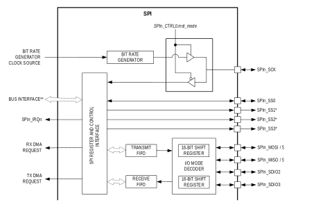
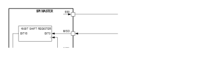
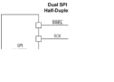

The Serial Peripheral Interface (SPI) is a highly configurable, flexible, and efficient synchronous interface between multiple SPI devices on a single bus. The SPI bus uses a single clock signal, and single, dual, or quad data lines, and one or more slave select lines for communication with external SPI devices.

The provided SPI ports support full-duplex, bi-direction I/O, and each SPI includes a bit rate generator (BRG) for generating the clock signal when operating in master mode. Each SPI port operates independently and requires minimal processor overhead. All instances of the SPI peripheral support both master and slave modes and support single master and multi-master networks.

Features include:

- Dedicated Bit Rate Generator for precision serial clock generation in Master Mode

    - Up to $\frac{f_{\text{PCLK}}}{2}$ for instances on the APB bus
    - Up to $\frac{f_{\text{HCLK}}}{2}$ for instances on the AHB bus
    - Programmable SCK duty cycle timing

- Full-duplex, synchronous communication of 2 to 16-bit characters

    - 1-bit and 9-bit characters are not supported
    - 2-bit and 10-bit characters do not support maximum clock speed. [SPIn_CLKCTRL](#spi-master-clock-configuration-register).*clkdiv* must be > 0

- 3-wire and 4-wire SPI operation for single-bit communication
- Single, dual, or quad I/O operation
- Byte-wide transmit and receive FIFOs with 32-byte depth

    - For character sizes greater than 8, each character uses 2 entries per character resulting in 16 entries for the transmit and receive FIFO

- Transmit and receive DMA support
- SPI modes 0, 1, 2, 3
- Configurable slave select lines

    - Programmable slave select level

- Programmable slave select timing with respect to SCK starting edge and ending edge
- Multi-master mode fault detection

[Figure 13-1](#figure13-1) shows a high-level block diagram of the SPI peripheral. See [Table 13-1](#table13-1-max78000-spi-instances) for the peripheral-specific peripheral bus assignment and bit rate generator clock source.

*Figure 13-1: SPI Block Diagram*

## Instances
There are two instances of the SPI peripheral, as shown in [Table 13-1](#table13-1-max78000-spi-instances). [Table 13-2](#table13-2-max78000-spi-peripheral-pins) lists the locations of the SPI signals for each of the SPI instances.

*Table 13-1: MAX78000 SPI Instances*

<table border="1" cellpadding="5" cellspacing="0">
    <thead>
        <tr>
            <th rowspan="2">Instance</th>
            <th colspan="4">Formats</th>
            <th rowspan="2">Hardware Bus</th>
            <th rowspan="2">Bit Rate Generator   Clock Source Frequency</th>
            <th>Slave Select Signals</th>
        </tr>
        <tr>
            <th>3-Wire</th>
            <th>4-Wire</th>
            <th>Dual</th>
            <th>Quad</th>
            <th>81-CTBGA</th>
        </tr>
    </thead>
<tbody>
    <tr>
        <td>SPI0</td>
        <td>Yes</td>
        <td>Yes</td>
        <td>Yes</td>
        <td>Yes</td>
        <td>AHB</td>
        <td><em>fSYS_CLK</em></td>
        <td>3</td>
    </tr>
    <tr>
        <td>SPI1</td>
        <td>Yes</td>
        <td>Yes</td>
        <td>Yes</td>
        <td>Yes</td>
        <td>APB</td>
        <td><em>fPCLK</em></td>
        <td>1</td>
    </tr>
    </tbody>
</table>

*Note: Refer to the MAX78000 data sheet for each peripheral's definitive list of alternate function assignments.*

*Table 13-2: MAX78000 SPI Peripheral Pins*

<table border="1" cellpadding="5" cellspacing="0">
    <thead>
        <tr>
        <th>Instance</th>
        <th>Signal Description</th>
        <th>Alternate Function</th>
        <th>Alternate Function Number</th>
        <th>81 CTBGA</th>
        </tr>
    </thead>
<tbody>
    <tr>
        <td rowspan="8">SPI0</td>
        <td>SPI Clock</td>
        <td>SPI0_SCK</td>
        <td>AF1</td>
        <td>P0.7</td>
    </tr>
    <tr>
        <td>Slave Select 0</td>
        <td>SPI0_SS0</td>
        <td>AF1</td>
        <td>P0.4</td>
    </tr>
    <tr>
        <td>Slave Select 1</td>
        <td>SPI0_SS1</td>
        <td>AF2</td>
        <td>P0.11</td>
    </tr>
    <tr>
        <td>Slave Select 2</td>
        <td>SPI0_SS2</td>
        <td>AF2</td>
        <td>P0.10</td>
    </tr>
    <tr>
        <td>MOSI (SDIO0)</td>
        <td>SPI0_MOSI</td>
        <td>AF1</td>
        <td>P0.5</td>
    </tr>
    <tr>
        <td>MISO (SDIO1)</td>
        <td>SPI0_MISO</td>
        <td>AF1</td>
        <td>P0.6</td>
    </tr>
    <tr>
        <td>SDIO2</td>
        <td>SPI0_SDIO2</td>
        <td>AF1</td>
        <td>P0.8</td>
    </tr>
    <tr>
        <td>SDIO3</td>
        <td>SPI0_SDIO3</td>
        <td>AF1</td>
        <td>P0.9</td>
    </tr>
    <tr>
        <td rowspan="6">SPI1</td>
        <td>SPI Clock</td>
        <td>SPI1_SCK</td>
        <td>AF1</td>
        <td>P0.23</td>
    </tr>
    <tr>
        <td>Slave Select 0</td>
        <td>SPI1_SS0</td>
        <td>AF1</td>
        <td>P0.20</td>
    </tr>
    <tr>
        <td>MOSI (SDIO0)</td>
        <td>SPI1_MOSI</td>
        <td>AF1</td>
        <td>P0.21</td>
    </tr>
    <tr>
        <td>MISO (SDIO1)</td>
        <td>SPI1_MISO</td>
        <td>AF1</td>
        <td>P0.22</td>
    </tr>
    <tr>
        <td>SDIO2</td>
        <td>SPI1_SDIO2</td>
        <td>AF1</td>
        <td>P0.24</td>
    </tr>
    <tr>
        <td>SDIO3</td>
        <td>SPI1_SDIO3</td>
        <td>AF1</td>
        <td>P0.25</td>
    </tr>
    </tbody>
</table>

## Format
### Four-Wire SPI
SPI devices operate as either a master or a slave device. In four-wire SPI, four signals are required for communication, as shown in [Table 13-3](#table13-3-four-wire-format-signals).

*Table 13-3: Four-Wire Format Signals*

<table border="1" cellpadding="5" cellspacing="0">
<thead>
<tr>
<th>Signal</th>
<th>Description</th>
<th>Direction</th>
</tr>
</thead>
<tbody>
    <tr>
    <td>SCK</td>
    <td>Serial Clock</td>
    <td>The master generates the serial clock signal, an output from the master, and an input to the slave.</td>
    </tr>
    <tr>
    <td>MOSI</td>
    <td>Master Output Slave Input</td>
    <td>In master mode, this signal is used as an output for sending data to the slave.   In slave mode, this is the input data from the master.</td>
    </tr>
    <tr>
    <td>MISO</td>
    <td>Master Input Slave Output</td>
    <td>In master mode, this signal is used as an input for receiving data from the slave.  In slave mode, this signal is an output for transmitting data to the master.</td>
    </tr>
    <tr>
    <td>SS</td>
    <td>Slave Select</td>
    <td>In master mode, this signal is an output used to select a slave device before communication. Peripherals may have multiple slave select outputs to communicate with one or more external slave devices.  In slave mode, SPIn_SS0 is a dedicated input that indicates when an external master is starting communication. Other slave select signals into the peripheral are ignored in slave mode.</td>
    </tr>
</tbody>
</table>

In a typical SPI network, the master device selects the slave device using the slave select output. The master starts the communication by selecting the slave device by asserting the slave select output. The master then starts the SPI clock through the SCK output pin. When a slave device's slave select pin is deasserted, the device must put the SPI pins in tri-state mode.

*Figure 13-2: 4-Wire SPI Connection Diagram*

### Three-Wire SPI
The signals in three-wire SPI operation are shown in [Table 13-4](#table13-4-three-wire-format-signals). The MOSI signal is used as a bi-directional, half-duplex I/O referred to as slave input slave output (SISO). Three-wire SPI also uses a serial clock signal generated by the master and a slave select pin controlled by the master.

*Table 13-4: Three-Wire Format Signals*

<table border="1" cellpadding="5" cellspacing="0">
    <thead>
        <tr>
        <th>Signal</th>
        <th>Description</th>
        <th>Direction</th>
        </tr>
    </thead>
<tbody>
    <tr>
        <td>SCK</td>
        <td>Serial Clock</td>
        <td>The master generates the serial clock signal, an output from the master, and an input to the slave.</td>
    </tr>
    <tr>
        <td>MOSI (SISO)</td>
        <td>Slave Input Slave Output</td>
        <td>The SISO is a half-duplex, bidirectional I/O pin used for communication between the SPI master and slave. This signal is used to transmit data from the master to the slave and receive data from the slave by the master.</td>
    </tr>
    <tr>
        <td>SS</td>
        <td>Slave Select</td>
        <td>In master mode, this signal is an output used to select a slave device before communication.  In slave mode, SPIn_SS0 is a dedicated input that indicates when an external master is starting communication. Other slave select signals into the peripheral are ignored in slave mode.</td>
    </tr>
</tbody>
</table>

A three-wire SPI network is shown in [Figure 13-3](#figure13-3). The master device selects the slave device using the slave select output. The communication starts with the master asserting the slave select line and then starting the clock (SCK). In three-wire SPI communication, the master and slave must know the data's intended direction to prevent bus contention. For a write, the master drives the data out of the SISO pin. The master must release the SISO line for a read and let the slave drive the SISO line. The direction of transmission is controlled using the FIFO. Writing to the FIFO starts the three-wire SPI write, and reading from the FIFO starts a three-wire SPI read transaction.

*Figure 13-3: Generic 3-Wire SPI Master to Slave Connection*

## Pin Configuration
Before configuring the SPI peripheral, first, disable any SPI activity for the port by clearing the [SPIn_CTRL0](#spi-master-signals-control-register).*en* field to 0.

### SPI Alternate Function Mapping
Pin selection and configuration are required to use the SPI port. The following information applies to SPI master and slave operations in three-wire, four-wire, dual, and quad mode communications. Determine the pins required for the SPI type and mode in the application, and configure the required GPIO as described in the following sections. Refer to the MAX78000 data sheet for pin availability for a specific package.

When the SPI port is disabled, [SPIn_CTRL0](#spi-master-signals-control-register).*en* = 0, the GPIO pins enabled for SPI alternate function are placed in high-impedance input mode.

### Four-Wire Format Configuration
Four-wire SPI uses SCK, MISO, MOSI, and one or more SS pins. Four-wire SPI may use more than one slave select pin for a transaction, resulting in more than four wires total; however, the communication is referred to as four-wire for legacy reasons.

*Note: Select the pins mapped to the SPI external device in the design and modify the setup accordingly. There is no restriction on which alternate function is used for a specific SPI pin, and each SPI pin can be used independently from the other pins chosen. However, it is recommended that only one set of GPIO port pins are used for any network.*

### Three-Wire Format Configuration
Three-wire SPI uses SCK, MOSI, and one or more slave select pins for an SPI transaction. Three-wire SPI configuration is identical to the four-wire configuration, except SPIn_MISO does not need to be set up for the SPI alternate function. The direction of communication in three-wire SPI mode is controlled by the SPI transmit and receive FIFO enables. Enabling the receive FIFO and disabling the transmit FIFO indicates a read transaction. Enabling the transmit FIFO and disabling the receive FIFO indicates a write transaction. It is an illegal condition to enable both the transmit and receive FIFOs in three-wire SPI operation.

### Dual-Mode Format Configuration
In dual-mode SPI, two I/O pins are used to transmit 2-bits of data per SCK clock cycle. The communication is half-duplex, and the direction of the data transmission must be known by both the master and slave for a given transaction. Dual-mode SPI uses SCK, SDIO0, SDIO1, and one or more slave select lines, as shown in [Figure 13-4](#figure13-4). The configuration of the GPIO pins for dual-mode SPI is identical to four-wire SPI. The mode is controlled by setting [SPIn_CTRL2](#spi-static-configuration-register).*data_width* to 1, indicating that the SPI hardware uses SDIO0 and SDIO1 for half-duplex communication.

*Figure 13-4: Dual Mode SPI Connection Diagram*

### Quad-Mode Format Configuration
Quad-mode SPI uses four I/O pins to transmit four bits of data per transaction. In quad-mode SPI, the communication is half-duplex, and the master and slave must know the direction of transmission for each transaction. Quad-mode SPI uses SCK, SDIO0, SDIO1, SDIO2, SDIO3, and one or more slave select pins.

Quad-mode SPI transmits four bits per SCK cycle. The selection of quad mode SPI is selected by setting [SPIn_CTRL2](#spi-static-configuration-register).*data_width* to 2.

## Clock Configuration
### Serial Clock
The SCK signal synchronizes data movement in and out of the device. The master drives SCK as an output to the slave's SCK pin. When SPI is set to master mode, the SPI bit rate generator creates the serial clock and outputs it on the configured SPIn_SCK pin. When SPI is configured for slave operation, the SPIn_SCK pin is an input from the external master, and the SPI hardware synchronizes communications using the SCK input. Operating as a slave, if an SPI slave select input is not asserted, the SPI ignores any signals on the serial clock and serial data lines.

In both master and slave devices, data is shifted on one edge of the SCK and is sampled on the opposite edge where data is stable. Data availability and sampling time are controlled using the SPI phase control field, [SPIn_CTRL2](#spi-static-configuration-register).*clkpha*. The SCK clock polarity field, [SPIn_CTRL2](#spi-static-configuration-register).*clkpol*, controls if the SCK signal is active high or active low.

The SPI peripheral supports four combinations of SCK phase and polarity referred to as SPI Modes 0, 1, 2, and 3. Clock Polarity ([SPIn_CTRL2](#spi-static-configuration-register).*clkpol*) selects an active low/high clock and does not affect the transfer format. Clock phase ([SPIn_CTRL2](#spi-static-configuration-register).*clkpha*) selects one of two different transfer formats.

The clock phase and polarity must be identical for the SPI master and slave for proper data transmission. The master always places data on the MOSI line a half-cycle before the SCK edge for the slave to latch the data. See Clock Phase and Polarity Control for additional details.

### Peripheral Clock
See [Table 13-1](#table13-1-max78000-spi-instances) for the specific input clock, $f_{SPI\text{_CLK}}$, used for each SPI instance. For SPI instances assigned to the AHB bus, the SPI input clock is the system clock, SYS_CLK. For SPI instances mapped to the APB bus, the SPI input clock is the system peripheral clock, PCLK. The SPI input clock drives the SPI peripheral clock. 

The SPI provides an internal clock, SPIn_CLK, used within the SPI peripheral for the base clock to control the module and generate the SCK clock when in master mode. Set the SPI internal clock using the field [SPIn_CLKCTRL](#spi-master-clock-configuration-register).*clkdiv* as shown in [Equation 13-1](#equation13-1). Valid settings for [SPIn_CLKCTRL](#spi-master-clock-configuration-register).*clkdiv* are 0 to 8, allowing a divisor of 1 to 256.

*Equation 13-1: SPI Peripheral Clock*

$$f_{SPI\text{_CLK}} = \frac{f_{INPUT\text{_CLK}}}{2^{clkdiv}}$$

### Master Mode Serial Clock Configuration
In master and multi-master mode, the SCK clock is generated by the master. The SPI provides control for both the high time and low time of the SCK clock. This control allows setting the high and low times for the SCK to duty cycles other than 50% if required. The SCK clock uses the SPI peripheral clock as a base value, and the high and low values are a count of the number of $f_{SPI\text{_CLK}}$ clocks. Figure 13-5 visually represents the use of the [SPIn_CLKCTRL](#spi-master-clock-configuration-register).*hi* and [SPIn_CLKCTRL](#spi-master-clock-configuration-register).*lo* fields for a non-50% duty cycle serial clock generation. See [Equation 13-2](#equation13-2) and [Equation 13-3](#equation13-3) for calculating the SCK high and low time from the [SPIn_CLKCTRL](#spi-master-clock-configuration-register).*hi* and [SPIn_CLKCTRL](#spi-master-clock-configuration-register).*lo* field values.

*Figure 13-5: SCK Clock Rate Control*

*Equation 13-2: SCK High Time*

$$t_{\text{SCK_HI}} = t_{\text{SPIn_CLK}} \times \text{SPIn_CLKCTRL.hi}$$

*Equation 13-3: SCK Low Time*

$$t_{\text{SCK_LOW}} = t_{\text{SPIn_CLK}} \times \text{SPIn_CLKCTRL.lo}$$

### Clock Phase and Polarity Control
SPI supports four combinations of clock and phase polarity as shown in [Table 13-5](#table13-5-spi-modes-clock-phase-polarity-operation). Clock polarity is controlled using the [SPIn_CTRL2](#spi-static-configuration-register).*clkpol* bit and determines if the clock is active high or active low, as shown in [Figure 13-6](#figure13-6). Clock polarity does not affect the transfer format for SPI. The clock phase determines when the data must be stable for sampling. Setting the clock phase to 0, [SPIn_CTRL2](#spi-static-configuration-register).*clkpha* = 0, dictates that the SPI data is sampled on the initial SPI clock edge regardless of clock polarity. Phase 1, [SPIn_CTRL2](#spi-static-configuration-register).*clkpha* = 1, results in the data sample occurring on the second edge of the clock regardless of clock polarity.

*Figure 13-6: SPI Clock Polarity*

The clock phase and polarity must be identical for the SPI master and slave for proper data transmission. The master always places data on the MOSI line a half-cycle before the SCK edge for the slave to latch the data.

*Table 13-5: SPI Modes Clock Phase and Polarity Operation*

<table border="1" cellpadding="5" cellspacing="0">
<thead>
    <tr>
        <th>SPI Mode</th>
        <th><a href="#spi-static-configuration-register">SPIn_CTRL2</a>.<em>clkpha</em></th>
        <th><a href="#spi-static-configuration-register">SPIn_CTRL2</a>.<em>clkpol</em></th>
        <th>SCK Transmit Edge</th>
        <th>SCK Receive Edge</th>
        <th>SCK Idle State</th>
    </tr>
</thead>
<tbody>
    <tr>
        <td>0</td>
        <td>0</td>
        <td>0</td>
        <td>Falling</td>
        <td>Rising</td>
        <td>Low</td>
    </tr>
    <tr>
        <td>1</td>
        <td>0</td>
        <td>1</td>
        <td>Rising</td>
        <td>Falling</td>
        <td>High</td>
    </tr>
    <tr>
        <td>2</td>
        <td>1</td>
        <td>0</td>
        <td>Rising</td>
        <td>Falling</td>
        <td>Low</td>
    </tr>
    <tr>
        <td>3</td>
        <td>1</td>
        <td>1</td>
        <td>Falling</td>
        <td>Rising</td>
        <td>High</td>
    </tr>
</tbody>
</table>

### Transmit and Receive FIFOs
The transmit FIFO hardware is 32 bytes deep. The write data width can be 8-, 16- or 32-bits wide. A 16-bit write queues a 16-bit word to the FIFO hardware. A 32-bit write queues two 16-bit words to the FIFO hardware with the least significant word dequeued first. Bytes must be written to two consecutive byte addresses, with the odd byte as the most significant byte and the even byte as the least significant byte. The FIFO logic waits for both the odd and even bytes to be written before dequeuing the 16-bit result to the FIFO.

The receive FIFO hardware is 32 bytes deep. Read data width can be 8-, 16- or 32-bits. A byte read from this register dequeues one byte from the FIFO. A 16-bit read from this register dequeues two bytes from the FIFO, the least significant byte first. A 32-bit read from this register dequeues four bytes from the FIFO, the least significant byte first.

### Interrupts and Wakeups
The SPI supports multiple interrupt sources. Status flags for each interrupt are set regardless of the state of the interrupt enable bit for that event. The event happens once when the condition is satisfied. The software must clear the status flag by writing a 1 to the interrupt flag.

The following FIFO interrupts are supported:

- Transmit FIFO empty
- Transmit FIFO threshold
- Receive FIFO full
- Receive FIFO threshold
- Transmit FIFO underrun

    - Slave mode only, master mode stalls the serial clock

- Transmit FIFO overrun
- Receive FIFO underrun
- Receive FIFO overrun

    - Slave mode only, master mode stalls the serial clock

- SPI supports interrupts for the internal state of the SPI and the external signals. The following transmission interrupts are supported:

    - SSn asserted or deasserted
    - SPI transaction complete
    - Master mode only
    - Slave mode transaction aborted
    - Multi-master fault

The SPI port can wake up the microcontroller from low-power modes when the wake event is enabled. SPI events that can wake the microcontroller are:

- Receive FIFO full
- Transmit FIFO empty
- Receive FIFO threshold
- Transmit FIFO threshold

## Registers
See [Table 3-3](memory-register-mapping-access.md#apb-peripheral-base-address-map) for the base address of this peripheral/module. If multiple instances of the peripheral are provided, each instance has its own independent set of the registers shown in [Table 13-6](#table13-6-spi-register-summary). Register names for a specific instance are defined by replacing "n" with the instance number. As an example, a register PERIPHERALn_CTRL resolves to PERIPHERAL0_CTRL and PERIPHERAL1_CTRL for instances 0 and 1, respectively.

See [Table 1-1](index.md#table1-1-field-access-definitions) for an explanation of the read and write access of each field. Unless specified otherwise, all fields are reset on a system reset, soft reset, POR, and the peripheral-specific resets.

*Table 13-6: SPI Register Summary*

<table border="1" cellpadding="5" cellspacing="0">
<thead>
  <tr>
    <th>Offset</th>
    <th>Register</th>
    <th>Description</th>
  </tr>
</thead>
<tbody>
<tr>
    <td>[0x0000]</td>
    <td><a href="#spi-fifo-data-register">SPIn_FIFO32</a></td>
    <td>SPI FIFO Data Register</td>
</tr>
<tr>
    <td>[0x0000]</td>
    <td><a href="#spi-16-bit-fifo-data-register">SPIn_FIFO16</a></td>
    <td>SPI 16-bit FIFO Data Register</td>
</tr>
<tr>
    <td>[0x0000]</td>
    <td><a href="#spi-8-bit-fifo-data-register">SPIn_FIFO8</a></td>
    <td>SPI 8-bit FIFO Data Register</td>
</tr>
<tr>
    <td>[0x0004]</td>
    <td><a href="#spi-master-signals-control-register">SPIn_CTRL0</a></td>
    <td>SPI Master Signals Control Register</td>
</tr>
<tr>
    <td>[0x0008]</td>
    <td><a href="#spi-transmit-packet-size-register">SPIn_CTRL1</a></td>
    <td>SPI Transmit Packet Size Register</td>
</tr>
<tr>
    <td>[0x000C]</td>
    <td><a href="#spi-static-configuration-register">SPIn_CTRL2</a></td>
    <td>SPI Static Configuration Register</td>
</tr>
<tr>
    <td>[0x0010]</td>
    <td><a href="#spi-slave-select-timing-register">SPIn_SSTIME</a></td>
    <td>SPI Slave Select Timing Register</td>
</tr>
<tr>
    <td>[0x0014]</td>
    <td><a href="#spi-master-clock-configuration-register">SPIn_CLKCTRL</a></td>
    <td>SPI Master Clock Configuration Register</td>
</tr>
<tr>
    <td>[0x001C]</td>
    <td><a href="#spi-dma-control-register">SPIn_DMA</a></td>
    <td>SPI DMA Control Register</td>
</tr>
<tr>
    <td>[0x0020]</td>
    <td><a href="#spi-interrupt-flag-register">SPIn_INTFL</a></td>
    <td>SPI Interrupt Flag Register</td>
</tr>
<tr>
    <td>[0x0024]</td>
    <td><a href="#spi-interrupt-enable-register">SPIn_INTEN</a></td>
    <td>SPI Interrupt Enable Register</td>
</tr>
<tr>
    <td>[0x0028]</td>
    <td><a href="#spi-wakeup-flags-register">SPIn_WKFL</a></td>
    <td>SPI Wakeup Flags Register</td>
</tr>
<tr>
    <td>[0x002C]</td>
    <td><a href="#spi-wakeup-enable-register">SPIn_WKEN</a></td>
    <td>SPI Wakeup Enable Register</td>
</tr>
<tr>
    <td>[0x0030]</td>
    <td><a href="#spi-status-register">SPIn_STAT</a></td>
    <td>SPI Status Register</td>
</tr>
</tbody>
</table>

### Register Details

*Table 13-7: SPI 32-bit FIFO Register*

<table border="1" cellpadding="5" cellspacing="0">
    <tr>
        <td colspan="3">SPI FIFO Data</td>
        <td colspan="1">SPIn_FIFO32</td>
        <td>[0x0000]</td>
    </tr>
    <tr>
        <th>Bits</th>
        <th>Name</th>
        <th>Access</th>
        <th>Reset</th>
        <th>Description</th>
    </tr>
    <tr>
        <td>31:0</td>
        <td>data</td>
        <td>R/W</td>
        <td>0</td>
        <td><strong>SPI FIFO Data Register</strong> 
        This register is used for the SPI transmit and receive FIFO. Reading from this register returns characters from the receive FIFO, and writing to this register adds characters to the transmit FIFO. Read and write this register in either 1-byte, 2-byte, or 4-byte widths only. Reading from an empty FIFO or writing to a full FIFO results in undefined behavior.
        </td>
    </tr>
</table>

*Table 13-8: SPI 16-bit FIFO Register*

<table border="1" cellpadding="5" cellspacing="0">
    <tr>
        <td colspan="3">SPI FIFO Data</td>
        <td colspan="1">SPIn_FIFO16</td>
        <td>[0x0000]</td>
    </tr>
    <tr>
        <th>Bits</th>
        <th>Name</th>
        <th>Access</th>
        <th>Reset</th>
        <th>Description</th>
    </tr>
<tbody>
    <tr>
        <td>31:16</td>
        <td>-</td>
        <td>R/W</td>
        <td>0</td>
        <td><strong>Reserved</strong></td>
    </tr>
    <tr>
        <td>15:0</td>
        <td>data</td>
        <td>R/W</td>
        <td>0</td>
        <td><strong>SPI 16-bit FIFO Data Register</strong> 
        This register is used for the SPI transmit and receive FIFO. Reading from this register returns characters from the receive FIFO, and writing to this register adds characters to the transmit FIFO. Read and write this register in 2-byte width only for 16-bit FIFO access. Reading from an empty FIFO or writing to a full FIFO results in undefined behavior.</td>
    </tr>
</tbody>
</table>

*Table 13-9: SPI 8-bit FIFO Register*

<table border="1" cellpadding="5" cellspacing="0">
    <tr>
        <td colspan="3">SPI 8-bit FIFO Data Register</td>
        <td colspan="1">SPIn_FIFO8</td>
        <td>[0x0000]</td>
    </tr>
    <tr>
        <th>Bits</th>
        <th>Name</th>
        <th>Access</th>
        <th>Reset</th>
        <th>Description</th>
    </tr>
<tbody>
    <tr>
        <td>31:0</td>
        <td>-</td>
        <td>RO</td>
        <td>0</td>
        <td><strong>Reserved</strong></td>
    </tr>
    <tr>
        <td>7:0</td>
        <td>data</td>
        <td>R/W</td>
        <td>0</td>
        <td><strong>SPI 8-bit FIFO Data Register</strong> This register is used for the SPI transmit and receive FIFO. Reading from this register returns characters from the receive FIFO, and writing to this register adds characters to the transmit FIFO. Read and write this register in 1-byte width only for 8-bit FIFO access. Reading from an empty FIFO or writing to a full FIFO results in undefined behavior.</td>
    </tr>
</tbody>
</table>

*Table 13-10: SPI Control 0 Register*

<table border="1" cellpadding="5" cellspacing="0">
    <tr>
        <td colspan="3">SPI Control 0</td>
        <td colspan="1">SPIn_CTRL0</td>
        <td>[0x0004]</td>
    </tr>
    <tr>
        <th>Bits</th>
        <th>Name</th>
        <th>Access</th>
        <th>Reset</th>
        <th>Description</th>
    </tr>
<tbody>
    <tr>
        <td>31:20</td>
        <td>-</td>
        <td>RO</td>
        <td>0</td>
        <td><strong>Reserved</strong></td>
    </tr>
    <tr>
        <td>19:16</td>
        <td>ss_active</td>
        <td>R/W</td>
        <td>0</td>
        <td><strong>Master Slave Select</strong>  
        The SPI includes up to four slave select lines for each port. This field selects which slave select pin is active when the next SPI transaction is started (<a href="#spi-master-signals-control-register">SPIn_CTRL0</a>.<em>start</em> = 1). One or more slave select pins can be selected for each SPI transaction by setting the bit for each slave select pin. For example, use SPIn_SS0 and SPIn_SS2 by setting this field to 0b0101 or select all slave selects by setting this field to 0b1111.
        <em>Note: This field is only used when the SPI is configured for Master
        Mode (<a href="#spi-master-signals-control-register">SPIn_CTRL0</a>.<em>mst_mode = 1).</em>
        </td>
    </tr>
    <tr>
        <td>15:9</td>
        <td>-</td>
        <td>RO</td>
        <td>0</td>
        <td><strong>Reserved</strong></td>
    </tr>
    <tr>
        <td>8</td>
        <td>ss_ctrl</td>
        <td>R/W</td>
        <td>0</td>
        <td><strong>Master Slave Select Control</strong>  This field controls the behavior of the slave select pins at the completion of a transaction. The default behavior, <em>ss_ctrl</em> = 0, deasserts the slave select pin at the completion of the transaction. Set this field to 1 to leave the slave select pins asserted at the completion of the transaction. If the external device supports this behavior, leaving the slave select pins asserted allows multiple transactions without the delay associated with deassertion of the slave select pin between transactions.
        

        0: Slave Select is deasserted at the end of a transmission 
        1: Slave Select stays asserted at the end of a transmission
        

        </td>
    </tr>
    <tr>
        <td>7:6</td>
        <td>-</td>
        <td>RO</td>
        <td>0</td>
        <td><strong>Reserved</strong></td>
    </tr>
    <tr>
        <td>5</td>
        <td>start</td>
        <td>R/W1O</td>
        <td>0</td>
        <td><strong>Master Start Data Transmission</strong> 
        Set this field to 1 to start an SPI master mode transaction.
        

        0: No master mode transaction active. 
        1: Master initiates data transmission. Ensure that all pending transactions are complete before setting this field to 1.
        

        

        <em>Note: This field is only used when the SPI is configured for Master
        Mode (<a href="#spi-master-signals-control-register">SPIn_CTRL0</a>.<em>mst_mode = 1).</em>
        

        </td>
    </tr>
    <tr>
        <td>4</td>
        <td>ss_io</td>
        <td>R/W</td>
        <td>0</td>
        <td><strong>Master Slave Select Signal Direction</strong> 
        Set the I/O direction for
        

        0: Slave select is an output 
        1: Slave select is an input<
        

        
<em>Note: This field is only used when the SPI is configured for Master
        Mode (<a href="#spi-master-signals-control-register">SPIn_CTRL0</a>.<em>mst_mode = 1).</em>
</td>
    </tr>
    <tr>
        <td>3:2</td>
        <td>-</td>
        <td>RO</td>
        <td>0</td>
        <td><strong>Reserved</strong></td>
    </tr>
    <tr>
        <td>1</td>
        <td>mst_mode</td>
        <td>R/W</td>
        <td>0</td>
        <td><strong>SPI Master Mode Enable</strong>  This field selects between slave mode and master mode operation for the SPI port. Write this field to 0 to operate as an SPI slave. Setting this field to 1 sets the port as an SPI master.
        

        0: Slave mode SPI operation. 
        1: Master mode SPI operation.
        

        </td>
    </tr>
    <tr>
        <td>0</td>
        <td>en</td>
        <td>R/W</td>
        <td>0</td>
        <td><strong>SPI Enable/Disable</strong> This field enables and disables the SPI port. Disable the SPI port by setting this field to 0. Disabling the SPI port does not affect the SPI FIFOs or register settings. Access to SPI registers is always available.
        

        0: SPI port is disabled  
        1: SPI port is enabled
        

        </td>
    </tr>
</tbody>
</table>

*Table 13-11: SPI Control 1 Register*

<table border="1" cellpadding="5" cellspacing="0">
    <tr>
        <td colspan="3">SPI Transmit Packet Size</td>
        <td colspan="1">SPIn_CTRL1</td>
        <td>[0x0008]</td>
    </tr>
    <tr>
        <th>Bits</th>
        <th>Name</th>
        <th>Access</th>
        <th>Reset</th>
        <th>Description</th>
    </tr>
<tbody>
    <tr>
        <td>31:16</td>
        <td>rx_num_char</td>
        <td>R/W</td>
        <td>0</td>
        <td><strong>Number of Receive Characters</strong>  This field sets the number of characters to receive in receive FIFO.
        
<em>Note: If the SPI port is set to operate in 4-wire mode, this field is
        ignored, and the <a href="#spi-transmit-packet-size-register">SPIn_CTRL1</a>.tx_num_char field is used for both the
        number of characters to receive and transmit.</em>

        </td>
    </tr>
    <tr>
        <td>15:0</td>
        <td>tx_num_char</td>
        <td>R/W</td>
        <td>0</td>
        <td><strong>Number of Transmit Characters</strong> This field sets the number of characters to transmit from transmit FIFO.
        
<em>Note: If the SPI port is set to operate in 4-wire mode, this field is
        used for both the number of characters to receive and transmit.</em>

        </td>
    </tr>
</tbody>
</table>

*Table 13-12: SPI Control 2 Register*

<table border="1" cellpadding="5" cellspacing="0">
    <tr>
        <td colspan="3">SPI Control 2</td>
        <td colspan="1">SPIn_CTRL2</td>
        <td>[0x000C]</td>
    </tr>
    <tr>
        <th>Bits</th>
        <th>Name</th>
        <th>Access</th>
        <th>Reset</th>
        <th>Description</th>
    </tr>
<tbody>
    <tr>
        <td>31:20</td>
        <td>-</td>
        <td>RO</td>
        <td>0</td>
        <td><strong>Reserved</strong></td>
    </tr>
    <tr>
        <td>19:16</td>
        <td>ss_pol</td>
        <td>R/W</td>
        <td >0</td>
        <td><strong>Slave Select Polarity</strong> Controls the polarity of each individual SS signal where each bit position corresponds to a SS signal. SPIn_SS0 is controlled with bit position 0, and SPIn_SS2 is controlled with bit position 2.
        
For each bit position,

        

        0: SS is active low 
        1: SS is active high
        

        </td>
    </tr>
    <tr>
        <td>15</td>
        <td>three_wire</td>
        <td>R/W</td>
        <td>0</td>
        <td><strong>Three-Wire SPI Enable</strong> Set this field to 1 to enable three-wire SPI communication. Set this field to 0 for four-wire full-duplex SPI communication.

        

        0: Four-wire full-duplex mode enabled. 
        1: Three-wire mode enabled

        
<em>Note: This field is ignored for Dual SPI, <a href="#spi-static-configuration-register">SPIn_CTRL2</a>.data_width =1,
        and Quad SPI, <a href="#spi-static-configuration-register">SPIn_CTRL2</a>.data_width =2.</em>

        </td>
    </tr>
    <tr>
        <td>14</td>
        <td>-</td>
        <td>RO</td>
        <td>0</td>
        <td><strong>Reserved</strong></td>
    </tr>
    <tr>
        <td>13:12</td>
        <td>data_width</td>
        <td>R/W</td>
        <td>0b00</td>
        <td>
        <strong>SPI Data Width</strong>  This field controls the number of data lines used for SPI communications.
        
<em><strong>Three-wire SPI</strong></em>: <em>data_width</em> = 0

        
Set this field to 0, indicating SPIn_MOSI is used for half-duplex communication.

        
<em><strong>Four-wire full-duplex SPI</strong></em>: <em>data_width</em> = 0

        
Set this field to 0, indicating the SPIn_MOSI and the SPIn_MISO are used for the SPI data output and input, respectively.

        
<em><strong>Dual Mode SPI</strong></em>: <em>data_width</em> = 1
        
 Set this field to 1, indicating SPIn_SDIO0 and SPIn_SDIO1 are used for
        half-duplex communication.

        
<em><strong>Quad Mode SPI</strong></em>: <em>data_width</em> = 2
        
Set this field to 2, indicating SPIn_SDIO0, SPIn_SDIO1, SPIn_SDIO2, and SPIn_SDIO3 are used for half-duplex communication.

        0: 1-bit per SCK cycle (Three-wire half-duplex SPI and Four-wire full-duplex SPI) 
        1: 2-bits per SCK cycle (Dual mode SPI) 
        2: 4-bits per SCK cycle (Quad mode SPI) 
        3: Reserved
        
<em>Note: When this field is set to 0, use the field SPIn_CTRL2.three_wire to select either three-wire SPI or four-wire SPI operation.</em>
</td>
    </tr>
    <tr>
        <td>11:8</td>
        <td>numbits</td>
        <td>R/W</td>
        <td>0</td>
        <td><strong>Number of Bits per Character</strong> 
        Set this field to the number of bits per character for the SPI transaction. Setting this field to 0 indicates a character size of 16.
        

        0: 16-bits per character 
        1: 1-bit per character (not supported) 
        2: 2-bits per character 
        … 
        14: 14-bits per character 
        15: 15-bits per character
        

        
<em>Note: 1-bit and 9-bit character lengths are not supported.</em>

        
<em>Note: 2-bit and 10-bit character lengths do not support maximum SCK speeds in master mode. SPIn_CLKCTRL.clkdiv must be &gt; 0</em>

        
<em>Note: For dual and quad mode SPI, the character size should be divisible by the number of bits per SCK cycle.</em>
</td>
    </tr>
    <tr>
        <td>7:2</td>
        <td>-</td>
        <td>RO</td>
        <td>0</td>
        <td><strong>Reserved</strong></td>
    </tr>
    <tr>
        <td>1</td>
        <td>clkpol</td>
        <td>R/W</td>
        <td>0</td>
        <td><strong>Clock Polarity</strong> 
        This field controls the SCK polarity. The default clock polarity is for SPI mode 0 and mode 1 operation and is active high. Invert the SCK polarity for SPI mode 2 and mode 3 operation.
        

        0: Standard SCK for use in SPI mode 0 and mode 1 
        1: Inverted SCK for use in SPI mode 2 and mode 3
        

        </td>
    </tr>
    <tr>
        <td>0</td>
        <td>clkpha</td>
        <td>R/W</td>
        <td>0</td>
        <td><strong>Clock Phase</strong>
        

        0: Data sampled on clock rising edge. Use when in SPI mode 0 and mode 2 
        1: Data sampled on clock falling edge. Use when in SPI mode 1 and mode 3
        

        </td>
    </tr>
</tbody>
</table>

*Table 13-13: SPI Slave Select Timing Register*

<table border="1" cellpadding="5" cellspacing="0">
    <tr>
        <td colspan="3">SPI Slave Select Timing</td>
        <td colspan="1">SPIn_SSTIME</td>
        <td>[0x0010]</td>
    </tr>
    <tr>
        <th>Bits</th>
        <th>Name</th>
        <th>Access</th>
        <th>Reset</th>
        <th>Description</th>
    </tr>
<tbody>
    <tr>
        <td>31:24</td>
        <td>-</td>
        <td>RO</td>
        <td>0</td>
        <td><strong>Reserved</strong></td>
    </tr>
    <tr>
        <td>23:16</td>
        <td>inact</td>
        <td>R/W</td>
        <td>0</td>
        <td><strong>Inactive Stretch</strong>  This field controls the number of system clocks the bus is inactive between the end of a transaction (slave select inactive) and the start of the next transaction (slave select active).
        

        0: 256 
        1: 1 
        2: 2 
        3:3 
        … 
        … 
        254: 254 
        255: 255
        

        
<em>Note: The <a href="#spi-slave-select-timing-register">SPIn_SSTIME</a> register bit settings only apply when SPI is operating in master mode (<a href="#spi-master-signals-control-register">SPIn_CTRL0</a>.mst_mode = 1)</em>
</td>
    </tr>
    <tr>
        <td>15:8</td>
        <td>post</td>
        <td>R/W</td>
        <td>0</td>
        <td><strong>Slave Select Hold Post Last SCK</strong> This field sets the number of system clock cycles that SS remains active after the last SCK edge.
        

        0: 256 
        1: 1 
        2: 2 
        3:3 
        … 
        … 
        254: 254 
        255: 255
        

        
<em>Note: The <a href="#spi-slave-select-timing-register">SPIn_SSTIME</a> register bit settings only apply when SPI is operating in master mode (<a href="#spi-master-signals-control-register">SPIn_CTRL0</a>.mst_mode = 1)</em>
</td>
    </tr>
    <tr>
        <td>7:0</td>
        <td>pre</td>
        <td>R/W</td>
        <td>0</td>
        <td><strong>Slave Select Delay to First SCK</strong>  This field sets the number of system clock cycles the slave select is held active before the first SCK edge.
        

        0: 256  
        1: 1 
        2: 2 
        3:3 
        … 
        … 
        254: 254 
        255: 255
        

        
<em>Note: The <a href="#spi-slave-select-timing-register">SPIn_SSTIME</a> register bit settings only apply when SPI is operating in master mode (<a href="#spi-master-signals-control-register">SPIn_CTRL0</a>.mst_mode = 1)</em>
</td>
    </tr>
</tbody>
</table>

*Table 13-14: SPI Master Clock Configuration Registers*

<table border="1" cellpadding="5" cellspacing="0">
    <tr>
        <td colspan="3">SPI Master Clock Configuration</td>
        <td colspan="1">SPIn_CLKCTRL</td>
        <td>[0x0014]</td>
    </tr>
    <tr>
        <th>Bits</th>
        <th>Name</th>
        <th>Access</th>
        <th>Reset</th>
        <th>Description</th>
    </tr>
<tbody>
    <tr>
        <td>31:20</td>
        <td>-</td>
        <td>RO</td>
        <td>0</td>
        <td>Reserved</td>
    </tr>
    <tr>
        <td>19:16</td>
        <td>clkdiv</td>
        <td>R/W</td>
        <td>0</td>
        <td><strong>SPI Peripheral Clock Scale</strong> 
        Scales the SPI input clock (PCLK) by 2scale to generate the SPI peripheral clock. 
        
$$f_{SPInCLK} = \frac{f_{SPIn\text{_INPUT}\text{_CLK}}}{2^{clkdiv}}$$

        
Valid values for scale are 0 to 8 inclusive. Values greater than 8 are reserved for future use.

        
<em>Note: 1-bit and 9-bit character lengths are not supported.</em>

        
<em>Note: If <a href="#spi-master-clock-configuration-register">SPIn_CLKCTRL</a>.<em>clkdiv</em> = 0, <a href="#spi-master-clock-configuration-register">SPIn_CLKCTRL</a>.<em>hi</em> = 0, and <a href="#spi-master-clock-configuration-register">SPIn_CLKCTRL</a>.<em>lo</em> = 0, character sizes of 2 and 10 bits are not supported.</em>
</td>
    </tr>
    <tr>
        <td>15:8</td>
        <td>hi</td>
        <td>R/W</td>
        <td>0</td>
        <td><strong>SCK Hi Clock Cycles Control</strong> 
        

        0: Hi duty cycle control disabled. Only valid if <a href="#spi-master-clock-configuration-register">SPIn_CLKCTRL</a>.<em>clkdiv</em> = 0. 
        1 - 15: The number of SPI peripheral clocks,
        <em>f</em><em>SPInCLK</em>,
        that SCK is high.
        

        
<em>Note: 1-bit and 9-bit character lengths are not supported.</em>

        
<em>Note: If <a href="#spi-master-clock-configuration-register">SPIn_CLKCTRL</a>.<em>clkdiv</em> = 0, <a href="#spi-master-clock-configuration-register">SPIn_CLKCTRL</a>.<em>hi</em> = 0, and <a href="#spi-master-clock-configuration-register">SPIn_CLKCTRL</a>.<em>lo</em> = 0, character sizes of 2 and 10 bits are not supported.</em>
</td>
    </tr>
    <tr>
        <td>7:0</td>
        <td>lo</td>
        <td>R/W</td>
        <td>0</td>
        <td><strong>SCK Low Clock Cycles Control</strong> 
        This field controls the SCK low clock time and controls the overall SCK duty cycle in combination with the <a href="#spi-master-clock-configuration-register">SPIn_CLKCTRL</a>.<em>hi</em> field.
        

        0: Low duty cycle control disabled. Setting this field to 0 is only valid if <a href="#spi-master-clock-configuration-register">SPIn_CLKCTRL</a>.<em>clkdiv</em> = 0. 
        1 to 15: The number of SPI peripheral clocks, 
        <em>f</em><em>SPInCLK</em>,
        that the SCK signal is low.

        

        
<em>Note: 1-bit and 9-bit character lengths are not supported.</em>

        
<em>Note: If <a href="#spi-master-clock-configuration-register">SPIn_CLKCTRL</a>.<em>clkdiv</em> = 0, <a href="#spi-master-clock-configuration-register">SPIn_CLKCTRL</a>.<em>hi</em> = 0, and <a href="#spi-master-clock-configuration-register">SPIn_CLKCTRL</a>.<em>lo</em> = 0, character sizes of 2 and 10 bits are not supported.</em>

        </td>
    </tr>
</tbody>
</table>

*Table 13-15: SPI DMA Control Registers*

<table border="1" cellpadding="5" cellspacing="0">
    <tr>
        <td colspan="3">SPI DMA Control</td>
        <td colspan="1">SPIn_DMA</td>
        <td>[0x001C]</td>
    </tr>
    <tr>
        <th>Bits</th>
        <th>Name</th>
        <th>Access</th>
        <th>Reset</th>
        <th>Description</th>
    </tr>
<tbody>
    <tr>
        <td>31</td>
        <td>dma_rx_en</td>
        <td>R/W</td>
        <td>0</td>
        <td><strong>Receive DMA Enable</strong>
        

        0: Disabled. Any pending DMA requests are cleared 
        1: Enabled
        

        </td>
    </tr>
    <tr>
        <td>30:24</td>
        <td>dma_rx_en</td>
        <td>R</td>
        <td>0</td>
        <td><strong>Number of Bytes in the Receive FIFO</strong> 
        Read returns the number of bytes currently in the receive FIFO.
        </td>
    </tr>
    <tr>
        <td>23</td>
        <td>rx_flush</td>
        <td>W1O</td>
        <td>-</td>
        <td><strong>Clear the Receive FIFO</strong> 
        

        1: Clear the receive FIFO and any pending receive FIFO flags in <em>SPIn_INTFL</em>. This should be done when the receive FIFO is inactive.
        

        
<em>Note: Writing a 0 to this field has no effect.</em>
</td>
    </tr>
    <tr>
        <td>22</td>
        <td>rx_fifo_en</td>
        <td>R/W</td>
        <td>0</td>
        <td><strong>Receive FIFO Enabled</strong>
        

        0: Disabled 
        1: Enabled

        </td>
    </tr>
    <tr>
        <td>21</td>
        <td>-</td>
        <td>RO</td>
        <td>0</td>
        <td><strong>Reserved</strong></td>
    </tr>
    <tr>
        <td>20:16</td>
        <td>rx_thd_val</td>
        <td>R/W</td>
        <td>0x00</td>
        <td><strong>Receive FIFO Threshold Level</strong> 
        Set this value to the desired receive FIFO threshold level. When the receive FIFO level crosses above this setting, a DMA request is triggered if enabled by setting <em>SPIn_DMA</em>.<em>dma_tx_en</em>, and <em>SPIn_INTFL.rx_thd</em> becomes set. Valid values are 0 to 30.
        
Note: 31 is an invalid setting and reserved for future use.
</td>
    </tr>
    <tr>
        <td>15</td>
        <td>dma_tx_en</td>
        <td>R/W</td>
        <td>0</td>
        <td><strong>Transmit DMA Enable</strong>
        

        0: Disabled. Any pending DMA requests are cleared. 
        1: Transmit DMA is enabled

        </td>
    </tr>
    <tr>
        <td>14:8</td>
        <td>tx_lvl</td>
        <td>R</td>
        <td>0</td>
        <td><strong>Number of Bytes in the Transmit FIFO</strong> 
        Read this field to determine the number of bytes currently in the transmit FIFO.
        </td>
    </tr>
    <tr>
        <td>7</td>
        <td>tx_flush</td>
        <td>R/W</td>
        <td>0</td>
        <td><strong>Transmit FIFO Clear</strong> 
        Set this bit to clear the transmit FIFO and all transmit FIFO flags in the <em>SPIn_INTFL</em> register.
        
<em>Note: The transmit FIFO should be disabled (SPIn_DMA.tx_fifo_en = 0) before setting this field.</em>

        
<em>Note: Setting this field to 0 has no effect.</em>
</td>
    </tr>
    <tr>
        <td>6</td>
        <td>tx_fifo_en</td>
        <td>R/W</td>
        <td>0</td>
        <td><strong>Transmit FIFO Enabled</strong>
        

        
0: Disabled

        
1: Enabled

        </td>
    </tr>
    <tr>
        <td>5</td>
        <td>-</td>
        <td>RO</td>
        <td>0</td>
        <td><strong>Reserved</strong></td>
    </tr>
    <tr>
        <td>4:0</td>
        <td>tx_thd_val</td>
        <td>R/W</td>
        <td>0x10</td>
        <td><strong>Transmit FIFO Threshold Level</strong> 
        Set this value to the desired transmit FIFO threshold level. When the transmit FIFO count (<em>SPIn_DMA</em>.<em>tx_lvl</em>) falls below this value, a DMA request is triggered if enabled by setting <em>SPIn_DMA</em>.<em>dma_tx_en,</em> and <em>SPIn_INTFL.tx_thd</em>
        becomes set.
        </td>
    </tr>
</tbody>
</table>

*Table 13-16: SPI Interrupt Status Flags Registers*

<table border="1" cellpadding="5" cellspacing="0">
    <tr>
        <td colspan="3">SPI Interrupt Status Flags</td>
        <td colspan="1">SPIn_INTFL</td>
        <td>[0x0020]</td>
    </tr>
    <tr>
        <th>Bits</th>
        <th>Name</th>
        <th>Access</th>
        <th>Reset</th>
        <th>Description</th>
    </tr>
<tbody>
    <tr>
        <td>31:16</td>
        <td>-</td>
        <td>RO</td>
        <td>0</td>
        <td><strong>Reserved</strong></td>
    </tr>
    <tr>
        <td>15</td>
        <td>rx_un</td>
        <td>R/W1C</td>
        <td>0</td>
        <td><strong>Receive FIFO Underrun Flag<strong> 
        This field is set when a read is attempted from an empty receive FIFO.
        </td>
    </tr>
    <tr>
        <td>14</td>
        <td>rx_ov</td>
        <td>R/W1C</td>
        <td>0</td>
        <td><strong>Receive FIFO Overrun Flag</strong> 
        This field is set if SPI is in slave mode, and a write to a full receive FIFO is attempted. If the SPI is in master mode, this bit is not set as the SPI stalls the clock until data is read from the receive FIFO.
</td>
    </tr>
    <tr>
        <td>13</td>
        <td>tx_un</td>
        <td>R/W1C</td>
        <td>0</td>
        <td><strong>Transmit FIFO Underrun Flag</strong> 
        This field is set if SPI is in slave mode, and a read from empty transmit FIFO is attempted. If SPI is in master mode, this bit is not set as the SPI stalls the clock until data is written to the empty transmit FIFO.
        </td>
    </tr>
    <tr>
        <td>12</td>
        <td>tx_ov</td>
        <td>R/W1C</td>
        <td>0</td>
        <td><strong>Transmit FIFO Overrun Flag</strong>  
        This field is set when a write is attempted to the full transmit FIFO.
        </td>
    </tr>
    <tr>
        <td>11</td>
        <td>mst_done</td>
        <td>R/W1C</td>
        <td>0</td>
        <td><strong>Master Data Transmission Done Flag</strong>
         This field is set if the SPI is in master mode and all transactions have been completed. <a href="#spi-transmit-packet-size-register">SPIn_CTRL1</a>.<em>tx_num_char</em> has been reached.
        </td>
    </tr>
    <tr>
        <td>10</td>
        <td>-</td>
        <td>RO</td>
        <td>0</td>
        <td><strong>Reserved</strong></td>
    </tr>
    <tr>
        <td>9</td>
        <td>abort</td>
        <td>R/W1C</td>
        <td>0</td>
        <td><strong>Slave Mode Transaction Abort Detected Flag</strong> 
        This field is set if the SPI is in slave mode, and SS is deasserted before a complete character is received.
        </td>
    </tr>
    <tr>
        <td>8</td>
        <td>fault</td>
        <td>R/W1C</td>
        <td>0</td>
        <td><strong>Multi-Master Fault Flag</strong> 
        This field is set if the SPI is in master mode, multi-master mode is enabled, and a slave select input is asserted. A collision also sets this flag.
        </td>
    </tr>
    <tr>
        <td>7:6</td>
        <td>-</td>
        <td>RO</td>
        <td>0</td>
        <td><strong>Reserved</strong></td>
    </tr>
    <tr>
        <td>5</td>
        <td>ssd</td>
        <td>R/W1C</td>
        <td>0</td>
        <td><strong>Slave Select Deasserted Flag</strong></td>
    </tr>
    <tr>
        <td>4</td>
        <td>ssa</td>
        <td>R/W1C</td>
        <td>0</td>
        <td><strong>Slave Select Asserted Flag</strong></td>
    </tr>
    <tr>
        <td>3</td>
        <td>rx_full</td>
        <td>R/W1C</td>
        <td>0</td>
        <td><strong>Receive FIFO Full Flag</strong></td>
    </tr>
    <tr>
        <td>2</td>
        <td>rx_thd</td>
        <td>R/W1C</td>
        <td>0</td>
        <td><strong>Receive FIFO Threshold Level Crossed Flag</strong> 
        This field is set when the receive FIFO exceeds the value in <em>SPIn_DMA.rx_lvl</em>. Cleared once receive FIFO level drops below <em>SPIn_DMA.rx_lvl.</em>
</td>
    </tr>
    <tr>
        <td>1</td>
        <td>tx_em</td>
        <td>R/W1C</td>
        <td>1</td>
        <td><strong>Transmit FIFO Empty Flag</strong> 
        This field is set if the transmit FIFO is empty.
        </td>
    </tr>
    <tr>
        <td>0</td>
        <td>tx_thd</td>
        <td>R/W1C</td>
        <td>0</td>
        <td><strong>Transmit FIFO Threshold Level Crossed Flag</strong> 
        This field is set when the transmit FIFO level is less than the value in the <em>SPIn_DMA.tx_lvl</em> field. This field is cleared by hardware when the transmit FIFO level exceeds <em>SPIn_DMA.tx_lvl.</em>
</td>
    </tr>
</tbody>
</table>

*Table 13-17: SPI Interrupt Enable Registers*

<table border="1" cellpadding="5" cellspacing="0">
    <tr>
        <td colspan="3">SPI Interrupt Enable</td>
        <td colspan="1">SPIn_INTEN</td>
        <td>[0x0024]</td>
    </tr>
    <tr>
        <th>Bits</th>
        <th>Name</th>
        <th>Access</th>
        <th>Reset</th>
        <th>Description</th>
    </tr>
    <tbody>
    <tr>
        <td>31:16</td>
        <td>-</td>
        <td>RO</td>
        <td>0</td>
        <td><strong>Reserved</strong></td>
    </tr>
    <tr>
        <td>15</td>
        <td>rx_un</td>
        <td>R/W</td>
        <td>0</td>
        <td><strong>Receive FIFO Underrun Interrupt Enable</strong>
        

        0: Interrupt is disabled 
        1: Interrupt is enabled
        

        </td>
    </tr>
    <tr>
        <td>14</td>
        <td>rx_ov</td>
        <td>R/W</td>
        <td>0</td>
        <td><strong>Receive FIFO Overrun Interrupt Enable</strong>
        

        0: Interrupt is disabled 
        1: Interrupt is enabled
        </td>
    </tr>
    <tr>
        <td>13</td>
        <td>tx_un</td>
        <td>R/W</td>
        <td>0</td>
        <td><strong>Transmit FIFO Underrun Interrupt Enable</strong>
        

        0: Interrupt is disabled 
        1: Interrupt is enabled
        

        </td>
    </tr>
    <tr>
        <td>12</td>
        <td>tx_ov</td>
        <td>R/W</td>
        <td>0</td>
        <td><strong>Transmit FIFO Overrun Interrupt Enable</strong>
        

        0: Interrupt is disabled 
        1: Interrupt is enabled
        

        </td>
    </tr>
    <tr>
        <td>11</td>
        <td>mst_done</td>
        <td>R/W</td>
        <td>0</td>
        <td><strong>Master Data Transmission Done Interrupt Enable</strong>
        

        0: Interrupt is disabled 
        1: Interrupt is enabled
        </td>
    </tr>
    <tr>
        <td>10</td>
        <td>-</td>
        <td>RO</td>
        <td>0</td>
        <td><strong>Reserved</strong></td>
    </tr>
    <tr>
        <td>9</td>
        <td>abort</td>
        <td>R/W</td>
        <td>0</td>
        <td><strong>Slave Mode Abort Detected Interrupt Enable</strong>
        

        0: Interrupt is disabled 
        1: Interrupt is enabled

        </td>
    </tr>
    <tr>
        <td>8</td>
        <td>fault</td>
        <td>R/W</td>
        <td>0</td>
        <td><strong>Multi-Master Fault Interrupt Enable</strong>
        

        0: Interrupt is disabled 
        1: Interrupt is enabled
        

        </td>
    </tr>
    <tr>
        <td>7:6</td>
        <td>-</td>
        <td>RO</td>
        <td>0</td>
        <td><strong>Reserved</strong></td>
    </tr>
    <tr>
        <td>5</td>
        <td>ssd</td>
        <td>R/W</td>
        <td>0</td>
        <td><strong>Slave Select Deasserted Interrupt Enable</strong>
        

        0: Interrupt is disabled 
        1: Interrupt is enabled

        </td>
    </tr>
    <tr>
        <td>4</td>
        <td>ssa</td>
        <td>R/W</td>
        <td>0</td>
        <td><strong>Slave Select Asserted Interrupt Enable</strong>
        

        0: Interrupt is disabled 
        1: Interrupt is enabled

        </td>
    </tr>
    <tr>
        <td>3</td>
        <td>rx_full</td>
        <td>R/W</td>
        <td>0</td>
        <td><strong>Receive FIFO Full Interrupt Enable</strong>
        

        0: Interrupt is disabled 
        1: Interrupt is enabled

        </td>
    </tr>
    <tr>
        <td>2</td>
        <td>rx_thd</td>
        <td>R/W</td>
        <td>0</td>
        <td><strong>Receive FIFO Threshold Level Crossed Interrupt Enable</strong>
        

        0: Interrupt is disabled 
        1: Interrupt is enabled

        </td>
    </tr>
    <tr>
        <td>1</td>
        <td>tx_em</td>
        <td>R/W</td>
        <td>0</td>
        <td><strong>Transmit FIFO Empty Interrupt Enable</strong>
        

        0: Interrupt is disabled 
        1: Interrupt is enabled

        </td>
    </tr>
    <tr>
        <td>0</td>
        <td>tx_thd</td>
        <td>R/W</td>
        <td>0</td>
        <td><strong>Transmit FIFO Threshold Level Crossed Interrupt Enable</strong>
        

        0: Interrupt is disabled 
        1: Interrupt is enabled

        </td>
    </tr>
</tbody>
</table>

*Table 13-18: SPI Wakeup Status Flags Registers*

<table border="1" cellpadding="5" cellspacing="0">
    <tr>
        <td colspan="3">SPI Wakeup Flags</td>
        <td colspan="1">SPIn_WKFL</td>
        <td>[0x0028]</td>
    </tr>
    <tr>
        <th>Bits</th>
        <th>Name</th>
        <th>Access</th>
        <th>Reset</th>
        <th>Description</th>
    </tr>
<tbody>
    <tr>
        <td>31:4</td>
        <td>-</td>
        <td>RO</td>
        <td>0</td>
        <td><strong>Reserved</strong></td>
    </tr>
    <tr>
        <td>3</td>
        <td>rx_full</td>
        <td>R/W1C</td>
        <td>0</td>
        <td><strong>Wake on Receive FIFO Full Flag</strong>
        

        0: Normal operation 
        1: Wake condition occurred.

        </td>
    </tr>
    <tr>
        <td>2</td>
        <td>rx_thd</td>
        <td>R/W1C</td>
        <td>0</td>
        <td><strong>Wake on Receive FIFO Threshold Level Crossed Flag</strong>
        

        0: Normal operation 
        1: Wake condition occurred.

        </td>
    </tr>
    <tr>
        <td>1</td>
        <td>tx_em</td>
        <td>R/W1C</td>
        <td>0</td>
        <td><strong>Wake on Transmit FIFO Empty Flag

        

        0: Normal operation 
        1: Wake condition occurred.
        

        </td>
    </tr>
    <tr>
        <td>0</td>
        <td>tx_thd</td>
        <td>R/W1C</td>
        <td>0</td>
        <td><strong>Wake on Transmit FIFO Threshold Level Crossed Flag</strong>
        

        0: Normal operation 
        1: Wake condition occurred.

        </td>
    </tr>
</tbody>
</table>

*Table 13-19: SPI Wakeup Enable Registers*

<table border="1" cellpadding="5" cellspacing="0">
    <tr>
        <td colspan="3">SPI Wakeup Enable</td>
        <td colspan="1">SPIn_WKEN</td>
        <td>[0x002C]</td>
    </tr>
    <tr>
        <th>Bits</th>
        <th>Name</th>
        <th>Access</th>
        <th>Reset</th>
        <th>Description</th>
    </tr>
<tbody>
    <tr>
        <td>31:4</td>
        <td>-</td>
        <td>RO</td>
        <td>0</td>
        <td><strong>Reserved</strong></td>
    </tr>
    <tr>
        <td>3</td>
        <td>rx_full</td>
        <td>R/W</td>
        <td>0</td>
        <td><strong>Wake on Receive FIFO Full Enable</strong>
        

        0: Disabled 
        1: Enabled

        </td>
    </tr>
    <tr>
        <td>2</td>
        <td>rx_thd</td>
        <td>R/W</td>
        <td>0</td>
        <td><strong>Wake on Receive FIFO Threshold Level Crossed Enable</strong>
        

        0: Disabled 
        1: Enabled
        

        </td>
    </tr>
    <tr>
        <td>1</td>
        <td>tx_em</td>
        <td>R/W</td>
        <td>0</td>
        <td><strong>Wake on Transmit FIFO Empty Enable</strong>
        

        0: Disabled 
        1: Enabled

        </td>
    </tr>
    <tr>
        <td>0</td>
        <td>tx_thd</td>
        <td>R/W</td>
        <td>0</td>
        <td><strong>Wake on Transmit FIFO Threshold Level Crossed Enable</strong>
        

        0: Disabled 
        1: Enabled

        </td>
    </tr>
</tbody>
</table>

*Table 13-20: SPI Slave Select Timing Registers*

<table border="1" cellpadding="5" cellspacing="0">
    <tr>
        <td colspan="3">SPI Status</td>
        <td colspan="1">SPIn_STAT</td>
        <td>[0x0030]</td>
    </tr>
    <tr>
        <th>Bits</th>
        <th>Name</th>
        <th>Access</th>
        <th>Reset</th>
        <th>Description</th>
    </tr>
<tbody>
    <tr>
        <td>31:1</td>
        <td>-</td>
        <td>RO</td>
        <td>0</td>
        <td><strong>Reserved</strong></td>
    </tr>
    <tr>
        <td>0</td>
        <td>busy</td>
        <td>R</td>
        <td>0</td>
        <td><strong>SPI Active Status</strong> 
        This field indicates the status of the SPI port. See the descriptions for details of each value.
        

        0: SPI is not active. In master mode, the <em>busy</em> flag is cleared when the last character is sent. In slave mode, the <em>busy</em> field is cleared when the configured slave select input is deasserted. 
        1: SPI is active. In master mode, the <em>busy</em> flag is set when a transaction starts. In slave mode, the <em>busy</em> flag is set when a configured slave select input is asserted.
        

        
<em>Note: <a href="#spi-master-signals-control-register">SPIn_CTRL0</a>, <a href="#spi-transmit-packet-size-register">SPIn_CTRL1</a>, <a href="#spi-static-configuration-register">SPIn_CTRL2</a>, <a href="#spi-slave-select-timing-register">SPIn_SSTIME</a>, and <a href="#spi-master-clock-configuration-register">SPIn_CLKCTRL</a> should not be configured if this bit is set.</em>
</td>
    </tr>
</tbody>
</table>
