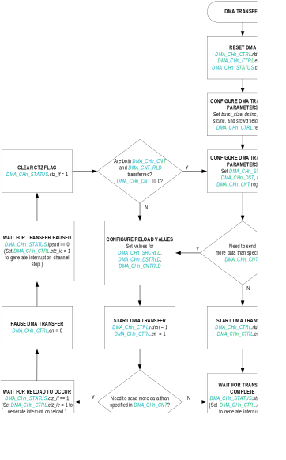

The DMA controller is a hardware feature that provides the ability to perform high-speed, block memory transfers of data independent of the device CPU. All DMA transactions consist of a burst read from the source into the internal DMA FIFO followed by a burst write from the internal DMA FIFO to the destination.

DMA transfers are one of three types:

- From a receive FIFO to a memory address,
- to a transmit FIFO from a memory address, or
- from a source memory address to a destination memory address.

The DMA supports multiple channels. Each channel provides the following features:

- Full 32-bit source and destination addresses with 24-bit (16 Mbytes) address increment capability
- The ability to chain DMA buffers when a count-to-zero (CTZ) condition occurs
- Interrupt upon CTZ
- Up to 16 Mbytes for each DMA transfer
- 8 × 32-byte transmit and receive FIFO
    - Programmable source and destination width with support for byte, half-word, and word
- Programmable channel timeout period
- Programmable burst size
- Programmable priority
- Abort on error

## Instances
There is one instance of the DMA, generically referred to as DMA. Each instance provides four channels, generically referred to as DMA_CHn. Each instance of the DMA has a set of interrupt registers common to all its channels and a set of registers unique to each channel instance.

*Table 10-1: MAX78000 DMA and Channel Instances*

<table border="1" cellpadding="5" cellspacing="0">
  <tr>
    <th>DMA Instance</th>
    <th>DMA_CHn Channel Instance</th>
  </tr>
  <tr>
    <td rowspan="4">DMA</td>
    <td>DMA_CH0</td>
  </tr>
  <tr>
    <td>DMA_CH1</td>
  </tr>
  <tr>
    <td>DMA_CH2</td>
  </tr>
    <tr>
    <td>DMA_CH3</td>
  </tr>
</table>

## DMA Channel Operation (DMA_CH)
### Channel Arbitration and DMA Bursts
The DMA peripheral contains an internal arbiter that allows enabled channels to access the AHB and move data. Once a channel is programmed and enabled, it generates a request to the arbiter immediately (for memory-to-memory DMA) or whenever its associated peripheral requests DMA (for memory-to-peripheral or peripheral-to-memory DMA).

Granting is done based on priority; a higher priority request is always granted. Within a given priority level, requests are granted on a round-robin basis. The DMA_CHn_CTRL.pri field determines the DMA channel priority.

When a channel's request is granted, the channel runs a DMA transfer. The arbiter grants requests to a single channel at a time. Once the DMA transfer completes, the channel relinquishes its grant.

A DMA channel is enabled using the DMA_CHn_CTRL.en bit.

When disabling a channel, poll the DMA_CHn_STATUS.status bit to determine if the channel is disabled. In general, DMA_CHn_STATUS.status follows the setting of the DMA_CHn_CTRL.en bit. However, the DMA_CHn_STATUS.status bit is automatically cleared under the following conditions:

- Bus error (cleared immediately)
- CTZ when the DMA_CHn_CTRL.rlden = 0 (cleared at the end of the AHB R/W burst)
- DMA_CHn_CTRL.en bit transitions to 0 (cleared at the end of the AHB R/W burst)

Whenever DMA_CHn_STATUS.status transitions from 1 to 0, the corresponding DMA_CHn_CTRL.en bit is also cleared. If an active channel is disabled during an AHB read/write burst, the current burst continues until completed.

Only an error condition can interrupt an ongoing data transfer.

### Source and Destination Addressing
The source and destination for DMA transfers are dictated by the request select dedicated to the peripheral instance. The DMA_CHn_CTRL.request field dictates the source and destination for a channel's DMA transfer, as shown in Table 10-2. depending on the specific operation, the DMA_CHn_SRC and DMA_CHn_DST registers hold the source or destination memory addresses.

The DMA_CHn_CTRL.srcinc field is ignored when the DMA source is peripheral memory, and the DMA_CHn_CTRL.dstinc field is ignored when the DMA destination is peripheral memory.

*Table 10-2: DMA Source and Destination by Peripheral* 

<table border="1" cellpadding="5" cellspacing="0">
<thead>
    <tr>
        <th>DMA_CHn_CTRL.<em>request</em></th>
        <th>Peripheral</th>
        <th>DMA Source</th>
        <th>DMA Destination</th>
    </tr>
</thead>
<tbody>
    <tr>
        <td>0</td>
        <td>Memory-to-Memory</td>
        <td>DMA_CHn_SRC</td>
        <td>DMA_CHn_DST</td>
    </tr>
    <tr>
        <td>1</td>
        <td>SPI1</td>
        <td>SPI1 Receive FIFO</td>
        <td>DMA_CHn_DST</td>
    </tr>
    <tr>
        <td>2-3</td>
        <td>Reserved</td>
        <td>-</td>
        <td>-</td>
    </tr>
    <tr>
        <td>4</td>
        <td>UART0</td>
        <td>UART0 Receive FIFO</td>
        <td>DMA_CHn_DST</td>
    </tr>
    <tr>
        <td>5</td>
        <td>UART1</td>
        <td>UART1 Receive FIFO</td>
        <td>DMA_CHn_DST</td>
    </tr>
  <tr>
    <td>6</td>
    <td>Reserved</td>
    <td>-</td>
    <td>-</td>
  </tr>
  <tr>
    <td>7</td>
    <td>I2C0</td>
    <td>I2C0 Receive FIFO</td>
    <td>DMA_CHn_DST</td>
  </tr>
<tr>
<td>8</td>
<td>I2C1</td>
<td>I2C1 Receive FIFO</td>
<td>DMA_CHn_DST</td>
</tr>
<tr>
<td>9</td>
<td>ADC</td>
<td>ADC Data Register</td>
<td>DMA_CHn_DST</td>
</tr>
<tr>
<td>10</td>
<td>I2C2</td>
<td>I2C2 Receive FIFO</td>
<td>DMA_CHn_DST</td>
</tr>
<tr>
<td>11-12</td>
<td>Reserved</td>
<td>-</td>
<td>-</td>
</tr>
<tr>
<td>13</td>
<td>PCIF</td>
<td>PCIF Receive FIFO</td>
<td>DMA_CHn_DST</td>
</tr>
<tr>
<td>14</td>
<td>UART 2</td>
<td>UART2 Receive FIFO</td>
<td>DMA_CHn_DST</td>
</tr>
<tr>
<td>15</td>
<td>SPI 0</td>
<td>SPI0 Receive FIFO</td>
<td>DMA_CHn_DST</td>
</tr>
<tr>
<td>16-27</td>
<td>Reserved</td>
<td>-</td>
<td>-</td>
</tr>
<tr>
<td>28</td>
<td>LPUART0 (UART 3)</td>
<td>UART3 Receive FIFO</td>
<td>DMA_CHn_DST</td>
</tr>
<tr>
<td>29</td>
<td>Reserved</td>
<td>-</td>
<td>-</td>
</tr>
<tr>
<td>30</td>
<td>I2S</td>
<td>I2S Data Register</td>
<td>DMA_CHn_DST></td>
</tr>
<tr>
<td>31-32</td>
<td>Reserved</td>
<td>-</td>
<td>-</td>
</tr>
<tr>
<td>33</td>
<td>SPI 1</td>
<td>DMA_CHn_SRC</td>
<td>SPI1 Transmit FIFO</td>
</tr>
<tr>
<td>34-35</td>
<td>Reserved</td>
<td>-</td>
<td>-</td>
</tr>
<tr>
<td>36</td>
<td>UART 0</td>
<td>DMA_CHn_SRC</td>
<td>UART0 Transmit FIFO</td>
</tr>
<tr>
<td>37</td>
<td>UART 1</td>
<td>DMA_CHn_SRC</td>
<td>UART1 Transmit FIFO</td>
</tr>
<tr>
<td>38</td>
<td>Reserved</td>
<td>-</td>
<td>-</td>
</tr>
<tr>
<td>39</td>
<td>I2C0</td>
<td>DMA_CHn_SRC</td>
<td>I2C0 Transmit FIFO</td>
</tr>
<tr>
<td>40</td>
<td>I2C1</td>
<td>DMA_CHn_SRC</td>
<td>I2C1 Transmit FIFO</td>
</tr>
<tr>
<td>41</td>
<td>Reserved</td>
<td>-</td>
<td>-</td>
</tr>
<tr>
<td>42</td>
<td>I2C2</td>
<td>DMA_CHn_SRC</td>
<td>I2C2 Transmit FIFO</td>
</tr>
<tr>
<td>43</td>
<td>Reserved</td>
<td>-</td>
<td>-</td>
</tr>
<tr>
<td>44</td>
<td>CRC</td>
<td>DMA_CHn_SRC</td>
<td>CRC Data Register</td>
</tr>
<tr>
<td>45</td>
<td>PCIF</td>
<td>DMA_CHn_SRC</td>
<td>PCIF Transmit FIFO</td>
</tr>
<tr>
<td>46</td>
<td>UART2</td>
<td>DMA_CHn_SRC</td>
<td>UART2 Transmit FIFO</td>
</tr>
<tr>
<td>47</td>
<td>SPI0</td>
<td>DMA_CHn_SRC</td>
<td>SPI0 Transmit FIFO</td>
</tr>
<tr>
<td>48-59</td>
<td>Reserved</td>
<td>-</td>
<td>-</td>
</tr>
<tr>
<td>60</td>
<td>LPUART 0 (UART 3)</td>
<td>DMA_CHn_SRC</td>
<td>UART3 Transmit FIFO</td>
</tr>
<tr>
<td>61</td>
<td>Reserved</td>
<td>-</td>
<td>-</td>
</tr>
<tr>
<td>62</td>
<td>I2S</td>
<td>DMA_CHn_SRC</td>
<td>I2S Data Register</td>
</tr>
<tr>
<td>63</td>
<td>Reserved</td>
<td>-</td>
<td>-</td>
</tr>
</tbody>
</table>

### Data Movement from Source to DMA
[Table 10-3](#table10-3-data-movement-source-dma-fifo) shows the fields that control the burst movement of data into the DMA FIFO. The source is a peripheral or memory.

*Table 10-3: Data Movement from Source to DMA FIFO*

<table border="1" cellpadding="5" cellspacing="0">
<thead>
  <tr>
    <th>Register/Field</th>
    <th>Description</th>
    <th>Comments</th>
  </tr>
</thead>
<tbody>
<tr>
<td>DMA_CHn_SRC</td>
<td>Source address</td>
<td>If the increment enable is set, this increments on every read cycle of the burst. This field is ignored when the DMA source is a peripheral.</td>
</tr>
<tr>
<td>DMA_CHn_CNT</td>
<td>Number of bytes to transfer before a CTZ condition occurs</td>
<td>This register is decremented on each read of a burst.</td>
</tr>
<tr>
<td>DMA_CHn_CTRL.<em>burst_size</em></td>
<td>Burst size (1-32)</td>
<td>This is the maximum number of bytes moved during the burst read.</td>
</tr>
<tr>
<td>DMA_CHn_CTRL.<em>srcwd</em></td>
<td>Source width</td>
<td>This field determines the maximum data width used during each read of the AHB burst (byte, half-word, or word). The actual AHB width might be less if DMA_CHn_CNT is not great enough to supply all the needed data.</td>
</tr>
<tr>
<td>DMA_CHn_CTRL.<em>srcinc</em></td>
<td>Source increments enable</td>
<td>Increments DMA_CHn_SRC. This field is ignored when the DMA source is a peripheral.</td>
</tr>
</tbody>
</table>

### Data Movement from DMA to Destination
[Table 10-4](#table10-4-data-movement-dma-fifo-destination) shows the fields that control the burst movement of data out of the DMA FIFO. The destination is a peripheral or memory.

*Table 10-4: Data Movement from the DMA FIFO to Destination*

<table border="1" cellpadding="5" cellspacing="0">
<thead>
  <tr>
    <th>Register/Field</th>
    <th>Description</th>
    <th>Comments</th>
  </tr>
</thead>
<tbody>
<tr>
<td>DMA_CHn_DST</td>
<td>Destination address</td>
<td>If the increment enable is set, this increments on every write cycle of the burst. This field is ignored when the DMA destination is a peripheral.</td>
</tr>
<tr>
<td>DMA_CHn_CTRL.<em>burst_size</em></td>
<td>Burst size (1-32)</td>
<td>The is the maximum number of bytes moved during a single AHB read/write burst.</td>
</tr>
<tr>
<td>DMA_CHn_CTRL.<em>dstwd</em></td>
<td>Destination width</td>
<td>This determines the maximum data width used during each write of the AHB burst (byte, half-word, or word).</td>
</tr>
<tr>
<td>DMA_CHn_CTRL.<em>dstinc</em></td>
<td>Destination address increment enable</td>
<td>Increments <em>DMA_CHn_DST</em>. This field is ignored when the DMA destination is a peripheral.</td>
</tr>
</tbody>
</table>

## Usage
Use the following procedure to perform a DMA transfer from a peripheral's receive FIFO to memory, from memory to a peripheral's transmit FIFO, or from memory to memory.

1. Ensure DMA_CHn_CTRL.en, DMA_CHn_CTRL.rlden = 0, and DMA_CHn_STATUS.ctz_if = 0.
2. If using memory for the destination of the DMA transfer, configure DMA_CHn_DST to the starting address of the destination in memory.
3. If using memory for the source of the DMA transfer, configure DMA_CHn_SRC to the starting address of the source in memory.
4. Write the number of bytes to transfer to the DMA_CHn_CNT register.
5. Configure the following DMA_CHn_CTRL register fields in one or more instructions. Do not set DMA_CHn_CTRL.en to 1 or DMA_CHn_CTRL.rlden to 1 in this step:
    
    a. Configure DMA_CHn_CTRL.request to select the transfer operation associated with the DMA channel.
    
    b. Configure DMA_CHn_CTRL.burst_size for the desired burst size.
    
    c. Configure DMA_CHn_CTRL.pri to set the channel priority relative to other DMA channels.
    
    d. Configure DMA_CHn_CTRL.dstwd to set the width of the data written in each transaction.
    
    e. If desired, set DMA_CHn_CTRL.dstinc to 1 to enable automatic incrementing of the DMA_CHn_DST register upon every AHB transaction.
    
    f. Configure DMA_CHn_CTRL.srcwd to set the width of the data read in each transaction.
    
    g. If desired, set DMA_CHn_CTRL.srcinc to 1 to enable automatic incrementing of the DMA_CHn_DST register upon every AHB transaction.
    
    h. If desired, set DMA_CHn_CTRL.dis_ie = 1 to generate an interrupt when the channel becomes disabled. The channel becomes disabled when the DMA transfer completes, or a bus error occurs.
    
    i. If desired, set DMA_CHn_CTRL.ctz_ie 1 to generate an interrupt when the DMA_CHn_CNT register is decremented to zero.
    
    j. If using the reload feature, configure the reload registers to set the destination, source, and count for the following DMA transaction.
   
      1. Load the DMA_CHn_SRCRLD register with the source address reload value.
      2. Load the DMA_CHn_DSTRLD register with the destination address reload value.   
      3. Load the DMA_CHn_CNTRLD register with the count reload value.
    
    k. If desired, enable the channel timeout feature described in Channel Timeout Detect. Clear DMA_CHn_CTRL.to_clkdiv to 0 to disable the channel timeout feature.

6. Set DMA_CHn_CTRL.rlden to 1 to enable the reload feature if using.
7. Set DMA_CHn_CTRL.en = 1 to start the DMA transfer immediately.
8. Wait for the interrupt flag to become 1 to indicate the completion of the DMA transfer.

## Count-To-Zero (CTZ) Condition
When an AHB channel burst completes, a CTZ condition exists if DMA_CHn_CNT is decremented to 0.
At this point, there are two responses are possible depending on the value of the DMA_CHn_CTRL.rlden:

1. If DMA_CHn_CTRL.rlden = 1, then the DMA_CHn_SRC, DMA_CHn_DST, and DMA_CHn_CNT registers are loaded from the reload registers, and the channel remains active and continues operating using the newly-loaded address/count values and the previously programmed configuration values.

2. If DMA_CHn_CTRL.rlden = 0, then the channel is disabled, and DMA_CHn_STATUS.status is cleared.

## Chaining Buffers
Chaining buffers reduce the DMA interrupt response time and allow the DMA to service requests without intermediate processing from the CPU. Figure 10-1 shows the procedure for generating a DMA transfer using one or more chain buffers.

Configure the following reload registers to configure a channel for chaining:

- DMA_CHn_SRC
- DMA_CHn_DST
- DMA_CHn_CNT
- DMA_CHn_SRCRLD
- DMA_CHn_DSTRLD
- DMA_CHn_CNTRLD

Writing to any register while a channel is disabled is supported, but there are certain restrictions when a channel is enabled. The DMA_CHn_STATUS.status bit indicates whether the channel is enabled or not. Because an active channel might be in the middle of an AHB read/write burst, do not write to the DMA_CHn_SRC, DMA_CHn_DST, or DMA_CHn_CNT registers while a channel is active (DMA_CHn_STATUS.status = 1). To disable any DMA channel, clear the DMA_INTEN.ch<n> bit. Then, poll the DMA_CHn_STATUS.status bit to verify that the channel is disabled.

## DMA Interrupts
Enable interrupts for each channel by setting DMA_INTEN.ch<n>. When an interrupt for a channel is pending, the corresponding DMA_INTFL.ch<n> = 1. Set the corresponding enable bit to cause an interrupt when the flag is set.

A channel interrupt (DMA_CHn_STATUS.ipend = 1) is caused by:

- DMA_CHn_CTRL.ctz_ie = 1
    - If enabled, all CTZ occurrences set the DMA_CHn_STATUS.ipend bit.
- DMA_CHn_CTRL.dis_ie = 1
    - If enabled, any clearing of the DMA_CHn_STATUS.status bit sets the DMA_CHn_STATUS.ipend bit. 
  
Examine the DMA_CHn_STATUS register to determine which reasons caused the disable. The DMA_CHn_CTRL.dis_ie bit also enables the DMA_CHn_STATUS.to_if bit. The DMA_CHn_STATUS.to_if bit does not clear the DMA_CHn_STATUS.status bit.

To clear the channel interrupt, write 1 to the cause of the interrupt (the DMA_CHn_STATUS.ctz_if, DMA_CHn_STATUS.rld_if, DMA_CHn_STATUS.bus_err, or DMA_CHn_STATUS.to_if bits).

When running in normal mode without buffer chaining (DMA_CHn_CTRL.rlden = 0), set the DMA_CHn_CTRL.dis_ie bit only. An interrupt is generated upon DMA completion or an error condition (bus error or timeout error).

When running in buffer chaining mode (DMA_CHn_CTRL.rlden = 1), set both the DMA_CHn_CTRL.dis_ie and DMA_CHn_CTRL.ctz_ie bits. The CTZ interrupts occur on completion of each DMA (count reaches zero, and reload occurs). The setting of DMA_CHn_CTRL.dis_ie ensures that an error condition generates an interrupt. If DMA_CHn_CTRL.ctz_ie = 0, then the only interrupt occurs when the DMA completes and DMA_CHn_CTRL.rlden = 0 (final DMA).

## Channel Timeout Detect
Each channel can optionally generate an interrupt when its associated peripheral does not request a transfer in a user-configurable period. When the timeout start conditions are met, an internal 10-bit counter begins incrementing at a frequency determined by the AHB clock, the DMA_CHn_CTRL.to_clkdiv field, and the DMA_CHn_CTRL.to_per field. See Table 10-5 for details. A channel timeout event is generated if the timer is not reset by one of the events listed below before the timeout period expires.

*Table 10-5: DMA Channel Timeout Configuration*

<table border="1" cellpadding="5" cellspacing="0">
  <thead>
    <tr>
      <th><em>DMA_CHn_CTRL</em>.<em>to_clkdiv</em></th>
      <th>Timeout Period (µs)</th>
    </tr>
  </thead>
<tbody>
  <tr>
    <td>0</td>
    <td align="center">Channel timeout disabled.</td>
  </tr>
  <tr>
    <td>1</td>
    <td>
    $$
    \frac{2^{8} \times \text{Value from } \texttt{DMA_CHn_CTRL.to_per}}{f_{HCLK}}
    $$
    </td>
  </tr>
  <tr>
    <td>2</td>
    <td>
    $$
    \frac{2^{16} \times \text{Value from } \texttt{DMA_CHn_CTRL.to_per}}{f_{HCLK}}
    $$
    </td>
  </tr>
  <tr>
    <td>3</td>
    <td>
    $$
    \frac{2^{24} \times \text{Value from } \texttt{DMA_CHn_CTRL.to_per}}{f_{HCLK}}
    $$
    </td>
  </tr>
</tbody>
</table>

DMA_CHn_CTRL.to_wait controls the start of the timeout period as follows:
- If DMA_CHn_CTRL.to_wait = 0, the timer begins immediately counting after DMA_CHn_CTRL.to_per is configured to a value other than 0, and the channel is enabled.
- If DMA_CHn_CTRL.to_wait = 1, the timer begins counting when the first DMA request is received from the peripheral.

The timer is reset whenever:
- The DMA request line programmed for the channel is activated.
- The channel is disabled for any reason (DMA_CHn_STATUS.status = 0).

If the timeout timer period expires, hardware sets DMA_CHn_STATUS.to_if = 1 to indicate a channel timeout event has occurred. A channel timeout does not disable the DMA channel.

## Memory-to-Memory DMA
Memory-to-memory transfers are processed as if the request is permanently active. This means that the DMA channel generates an almost constant request for the bus until its transfer is complete. For this reason, assign a lower priority to channels executing memory-to-memory transfers to prevent starvation of other DMA channels.

## Registers
See [Table 3-3](memory-register-mapping-access.md#apb-peripheral-base-address-map) for the base address of this peripheral/module. See [Table 1-1](index.md#table1-1-field-access-definitions) for an explanation of the read and write access of each field. Unless specified otherwise, all fields are reset on a system reset, soft reset, POR, and the peripheral-specific resets.

*Table 10-6: DMA Register Summary*

<table border="1" cellpadding="5" cellspacing="0">
  <thead>
  <tr>
    <th>Offset</th>
    <th>Register</th>
    <th>Description</th>
  </tr>
  </thead>
<tbody>
  <tr>
    <td>[0x0000]</td>
    <td><a href="#dma-channel-interrupt-enable">DMA_INTEN</a></td>
    <td>DMA Channel Interrupt Enable</td>
  </tr>
  <tr>
    <td>[0x0004]</td>
    <td><a href="#dma-interrupt-status-register">DMA_INTFL</a></td>
    <td>DMA Interrupt Status register</td>
  </tr>
</tbody>
</table>

### Register Details

*Table 10-7: DMA Interrupt Enable Register*

<table border="1" cellpadding="5" cellspacing="0">
    <tr>
        <td colspan="3">DMA Interrupt Enable</td>
        <td colspan="1">DMA_INTEN</td>
        <td>[0x0000]</td>
    </tr>
    <tr>
        <th>Bits</th>
        <th>Name</th>
        <th>Access</th>
        <th>Reset</th>
        <th>Description</th>
    </tr>
    <tr>
        <td>31:0</td>
        <td>ch&lt;n&gt;</td>
        <td>R/W</td>
        <td>0</td>
        <td>
            <strong>DMA Channel <em>n</em> Interrupt Enable</strong> 
            Each bit in this field enables the corresponding channel interrupt &lt;n&gt; in <em>DMA_INTFL</em>. 
            Register bits associated with unimplemented channels should not be changed from their default reset value. 
            

                0: Disabled 
                1: Enabled
            

        </td>
    </tr>
</table>

*Table 10-8: DMA Interrupt Status Register*

<table border="1" cellpadding="5" cellspacing="0">
    <tr>
        <td colspan="3">DMA Interrupt Flag</td>
        <td colspan="1">DMA_INTFL</td>
        <td>[0x0004]</td>
    </tr>
    <tr>
        <th>Bits</th>
        <th>Name</th>
        <th>Access</th>
        <th>Reset</th>
        <th>Description</th>
    </tr>
    <tr>
        <td>31:0</td>
        <td>ch&lt;n&gt;</td>
        <td>R/W</td>
        <td>0</td>
        <td>
            <strong>DMA Channel <em>n</em> Interrupt Flag</strong> 
            Each bit in this field represents an interrupt for the corresponding channel interrupt &lt;n&gt;. To clear an interrupt, clear the corresponding active interrupt bit in the DMA_CHn_STATUS register. An interrupt bit in this field is set if the corresponding interrupt enable field is set in the DMA_INTEN register and a channel's interrupt occurs. Register bits associated with unimplemented channels should be ignored.. 
            

                0: No interrupt 
                1: Interrupt pending
            

        </td>
    </tr>
</table>

## DMA Channel Registers

*Table 10-9: Standard DMA Channel 0 to Channel 3 Register Summary*

<table border="1" cellpadding="5" cellspacing="0">
  <thead>
  <tr>
    <th>Offset</th>
    <th>DMA Channel</th>
    <th>Description</th>
  </tr>
  </thead>
<tbody>
  <tr>
    <td>[0x0100]</td>
    <td><a href="#dma-channel0">DMA_CH0</a></td>
    <td>DDMA Channel 0</td>
  </tr>
  <tr>
    <td>[0x0120]</td>
    <td><a href="#dma-channel1">DMA_CH1</a></td>
    <td>DDMA Channel 1</td>
  </tr>
  <tr>
    <td>[0x0140]</td>
    <td><a href="#dma-channel2">DMA_CH2</a></td>
    <td>DDMA Channel 2</td>
  </tr>
  <tr>
    <td>[0x0160]</td>
    <td><a href="#dma-channel2">DMA_CH3</a></td>
    <td>DDMA Channel 3</td>
  </tr>
</table>

### Channel Register Details
See Table 3-3 for the base address of this peripheral/module. If multiple instances of the peripheral are provided, each instance has its own independent set of the registers shown in Table 10-10. Register names for a specific instance are defined by replacing "n" with the instance number. As an example, a register PERIPHERALn_CTRL resolves to PERIPHERAL0_CTRL and PERIPHERAL1_CTRL for instances 0 and 1, respectively.

See Table 1-1 for an explanation of the read and write access of each field. Unless specified otherwise, all fields are reset on a system reset, soft reset, POR, and the peripheral-specific resets.

*Table 10-10: DMA Channel Registers Summary*

<table border="1" cellpadding="5" cellspacing="0">
  <thead>
  <tr>
    <th>Offset</th>
    <th>Register</th>
    <th>Description</th>
  </tr>
  </thead>
<tbody>
  <tr>
    <td>[0x0000]</td>
    <td><a href="#dma-channel-n-configuration-register">DMA_CHn_CTRL</a></td>
    <td>DMA Channel n Configuration Register</td>
  </tr>
  <tr>
    <td>[0x0004]</td>
    <td><a href="#dma-channel-n-status-register">DMA_CHn_STATUS</a></td>
    <td>DMA Channel n Status Register</td>
  </tr>
  <tr>
    <td>[0x0008]</td>
    <td><a href="#dma-channel-n-status-register">DMA_CHn_SRC</a></td>
    <td>DMA Channel n Source Register</td>
  </tr>
  <tr>
    <td>[0x000C]</td>
    <td><a href="#dma-channel-n-source-register">DMA_CHn_DST</a></td>
    <td>DMA Channel n Destination Register</td>
  </tr>
  <tr>
    <td>[0x0010]</td>
    <td><a href="#dma-channel-n-count-register">DMA_CHn_CNT</a></td>
    <td>DMA Channel n Count Register</td>
  </tr>
  <tr>
    <td>[0x0014]</td>
    <td><a href="#dma-channel-n-source-reload-register">DMA_CHn_SRCRLD</a></td>
    <td>DMA Channel n Source Reload Register</td>
  </tr>
  <tr>
    <td>[0x0018]</td>
    <td><a href="#dma-channel-n-destination-reload-register">DMA_CHn_DSTRLD</a></td>
    <td>DMA Channel n Destination Reload Register</td>
  </tr>
  <tr>
    <td>[0x001C]</td>
    <td><a href="#dma-channel-n-count-reload-register">DMA_CHn_CNTRLD</a></td>
    <td>DMA Channel n Count Reload Register</td>
  </tr>
</table>

*Table 10-11: DMA_CH n Control Register*

<table border="1" cellpadding="5" cellspacing="0">
    <tr>
        <td colspan="3">DMA Channel n Control</td>
        <td colspan="1">DMA_CHn_CTRL</td>
        <td>[0x0000]</td>
    </tr>
    <tr>
        <th>Bits</th>
        <th>Name</th>
        <th>Access</th>
        <th>Reset</th>
        <th>Description</th>
    </tr>
    <tr>
        <td>31</td>
        <td>ctz_ie</td>
        <td>R/W</td>
        <td>0</td>
        <td>
            <strong>CTZ Interrupt Enable</strong>
            

                0: Disabled 
                1: Enabled. DMA_INTFL.ch&lt;n&gt; is set to 1 whenever a CTZ event occurs.
            

        </td>
    </tr>
    <tr>
      <td>30</td>
      <td>dis_ie</td>
      <td>R/W</td>
      <td>0</td>
      <td><strong>Channel Disable Interrupt Enable</strong>
          

              0: Disabled 
              1: Enabled. <em>DMA_INTFL</em>.ch&lt;n&gt; bit is set to 1 whenever 
              <em>DMA_CHn_STATUS</em>.status changes from 1 to 0.
          

      </td>
    </tr>
    <tr>
      <td>29</td>
      <td>-</td>
      <td>RO</td>
      <td>0</td>
      <td><strong>Reserved</strong></td>
    </tr>
  <tr>
  <td>28:24</td>
  <td>burst_size</td>
  <td>R/W</td>
  <td>0</td>
  <td><strong>Burst Size</strong> The number of bytes transferred into and out of the DMA FIFO in a
  single burst.
  

    0b00000: 1 byte 
    0b00001: 2 bytes 
    0b00010: 3 bytes 
    ... 
    0b11111: 32 bytes

    </td>
  </tr>
  <tr>
    <td>23</td>
    <td>-</td>
    <td>RO</td>
    <td>0</td>
    <td><strong>Reserved</strong></td>
  </tr>
  <tr>
    <td>22</td>
    <td>dstinc</td>
    <td>R/W</td>
    <td>0</td>
    <td><strong>Destination Increment Enable</strong>This bit enables the automatic increment of the <em>DMA_CHn_DST</em>
    register upon every AHB transaction. This bit is ignored for a DMA
    transmit to peripherals. 
    

    0: Disabled 
    1: Enabled
    

    </td>
  </tr>
  <tr>
    <td>21:20</td>
    <td>dstwd</td>
    <td>R/W</td>
    <td>0</td>
    <td><strong>Destination Width</strong> Indicates the width of each AHB transaction to the destination
    peripheral or memory (the actual width might be less than this if there
    are insufficient bytes in the DMA FIFO for the full width).
    

    0: Byte 
    1: Half word 
    2: Word 
    3: Reserved

    </td>
  </tr>
  <tr>
    <td>19</td>
    <td>-</td>
    <td>RO</td>
    <td>0</td>
    <td><strong>Reserved</strong></td>
  </tr>
  <tr>
    <td>18</td>
    <td>srcinc</td>
    <td>R/W</td>
    <td>0</td>
    <td><strong>Source Increment on AHB Transaction Enable</strong> This bit enables the automatic increment of the <em>DMA_CHn_SRC</em>
    register upon every AHB transaction. This bit is ignored for a DMA
    receive from peripherals.
    

    0: Disabled 
    1: Enabled
    

  </tr>
  <tr>
    <td>17:16</td>
    <td>srcwd</td>
    <td>R/W</td>
    <td>0</td>
    <td><strong>Source Width</strong> This field indicates the width of each AHB transaction from the
    source peripheral or memory. The actual width might be less than this if
    the <em>DMA_CHn_CNT</em> register indicates a smaller value.
    

    0: Byte 
    1: Half word 
    2: Word 
    3: Reserved
    

    </td>
  </tr>
  <tr>
  <td>15:14</td>
  <td>to_clkdiv</td>
  <td>R/W</td>
  <td>0</td>
  <td><strong>Timeout Timer Clock Pre-Scale Select</strong> This field selects the pre-scale divider for the timer clock
  input.
  

  0: Timer disabled. 
  1: 
  $$
  \frac{f_{\text{HCLK}}}{2^8}
  $$ 
   
  2: 
  $$
  \frac{f_{HCLK}}{2^{16}}
  $$ 
   
  3: 
  $$
  \frac{f_{HCLK}}{2^{24}}
  $$ 
  

  </td>
  </tr>
  <tr>
  <td>13:11</td>
  <td>to_per</td>
  <td>R/W</td>
  <td>0</td>
  <td><strong>Timeout Period Select</strong>   This field selects the number of pre-scaled clocks seen by the channel timer before a timeout condition is generated. The value is approximate because of synchronization delays between timers.
  

  0: 3 to 4 
  1: 7 to 8 
  2: 15 to 16 
  3: 31 to 32 
  4: 63 to 64 
  5: 127 to 128 
  6: 255 to 256 
  7: 511 to 512
  

  </td>
  </tr>
  <tr>
    <td>10</td>
    <td>to_wait</td>
    <td>R/W</td>
    <td>0</td>
    <td><strong>Request DMA Timeout Timer Wait Enable</strong>  This field controls when the timeout timer starts, either immediately when the timeout timer is enabled or after the first DMA transaction occurs.
    

    0: Start the timer immediately when enabled. 
    1: Delay the timer's start until after the first DMA transaction occurs.
    

    </td>
  </tr>
  <tr>
  <td>9:4</td>
  <td>request</td>
  <td>R/W</td>
  <td>0</td>
  <td><strong>Request Select</strong>  Selects the source and destination for the transfer as shown in <em>Source and Destination Addressing</em>.
</td>
  </tr>
  <tr>
    <td>3:2</td>
    <td>pri</td>
    <td>R/W</td>
    <td>0</td>
    <td><strong>Channel Priority</strong>  This field sets the priority of the channel relative to other channels of the DMA peripheral. Channels of the same priority are serviced in a round-robin fashion.
    

    0: High 
    1: Medium-high 
    2: Medium-low 
    3: Low 
    

    </td>
  </tr>
  <tr>
  <td>1</td>
  <td>rlden</td>
  <td>R/W</td>
  <td>0</td>
  <td><strong>Reload Enable</strong>  Setting this bit to 1 allows reloading the <em>DMA_CHn_SRC</em>, <em>DMA_CHn_DST,</em> and <em>DMA_CHn_CNT</em> registers upon a CTZ. 
  When this bit is set to 0 and a CTZ occurs, the channel is disabled, and the <em>DMA_CHn_STATUS.status</em> bit is set to 0.
  

  0: The channel is disabled when a CTZ occurs, and the <em>DMA_CHn_STATUS.status</em> is set to 0. 
  1: Automatically reload the <em>DMA_CHn_SRC</em>, <em>DMA_CHn_DST</em>, and <em>DMA_CHn_CNT</em> registers on a CTZ.
  

  </td>
  </tr>
  <tr>
    <td>0</td>
    <td>en</td>
    <td>R/W</td>
    <td>0</td>
    <td><strong>Channel Enable</strong>  This bit is automatically cleared when <em>DMA_CHn_STATUS</em>.<em>status</em> changes from 1 to 0.
    

    0: Disabled 
    1: Enabled
    

    </td>
  </tr>
</tbody>
</table>

*Table 10-12: DMA Status Register*

<table border="1" cellpadding="5" cellspacing="0">
    <tr>
        <td colspan="3">DMA Channel n Status</td>
        <td colspan="1">DMA_CHn_STATUS</td>
        <td>[0x0004]</td>
    </tr>
    <tr>
        <th>Bits</th>
        <th>Name</th>
        <th>Access</th>
        <th>Reset</th>
        <th>Description</th>
    </tr>
    <tr>
            <td>31:7</td>
            <td>-</td>
            <td>RO</td>
            <td>0</td>
            <td><strong>Reserved</strong></td>
    </tr>
        <tr>
            <td>6</td>
            <td>to_if</td>
            <td>R/W1C</td>
            <td>0</td>
            <td><strong>Timeout Interrupt Flag</strong> 
            Timeout. Write 1 to clear.
                

                    0: No time out. 
                    1: A channel timeout has occurred.
                

            </td>
        </tr>
        <tr>
            <td>5</td>
            <td>-</td>
            <td>RO</td>
            <td>0</td>
            <td><strong>Reserved</strong></td>
        </tr>
        <tr>
            <td>4</td>
            <td>bus_err</td>
            <td>R/W1C</td>
            <td>0</td>
            <td><strong>Bus Error</strong> 
            If this bit reads 1, an AHB abort occurred, and the channel was disabled by hardware. Write 1 to clear.
                

                    0: No error found. 
                    1: An AHB bus error occurred.
                

            </td>
        </tr>
        <tr>
            <td>3</td>
            <td>rld_if</td>
            <td>R/W1C</td>
            <td>0</td>
            <td><strong>Reload Interrupt Flag</strong> 
            Reload. Write 1 to clear.
                

                    0: Reload has not occurred. 
                    1: Reload occurred.
                

            </td>
        </tr>
        <tr>
            <td>2</td>
            <td>ctz_if</td>
            <td>R/W1C</td>
            <td>0</td>
            <td><strong>CTZ Interrupt Flag</strong> 
            Write 1 to clear.
                

                    0: CTZ has not occurred. 
                    1: CTZ has occurred.
                

            </td>
        </tr>
        <tr>
            <td>1</td>
            <td>ipend</td>
            <td>RO</td>
            <td>0</td>
            <td><strong>Channel Interrupt Pending</strong>
                

                    0: No interrupt. 
                    1: Interrupt pending.
                

            </td>
        </tr>
        <tr>
            <td>0</td>
            <td>status</td>
            <td>RO</td>
            <td>0</td>
            <td><strong>Channel Status</strong> 
            This bit indicates when it is safe to change the configuration, address, and count registers for the channel. 
                
    
                    Whenever this bit is cleared by hardware, the
                    <em>DMA_CHn_CTRL</em>.<em>en</em> bit is also cleared. 
                    0: Disabled. 
                    1: Enabled.
                

            </td>
        </tr>
    </tbody>
</table>

*Table 10-13: DMA Channel n Source Register*

<table border="1" cellpadding="5" cellspacing="0">
    <tr>
        <td colspan="3">DMA Channel n Source Register</td>
        <td colspan="1">DMA_CHn_SRC</td>
        <td>[0x0008]</td>
    </tr>
    <tr>
        <th>Bits</th>
        <th>Name</th>
        <th>Access</th>
        <th>Reset</th>
        <th>Description</th>
    </tr>
<tr>
<td>31:0</td>
<td>addr</td>
<td>R/W</td>
<td>0</td>
<td><strong>Source Device Address</strong> 
For peripheral transfers, the actual address field is either ignored or forced to zero because peripherals only have one location to read/write data based on the request select chosen.

If DMA_CHn_CTRL.<em>srcinc</em> = 1, then this register is incremented on each AHB transfer cycle by one, two, or four bytes depending on the data width.

If DMA_CHn_CTRL.<em>srcinc</em> = 0, this register remains constant.

Suppose a CTZ condition occurs while DMA_CHn_CTRL.<em>rlden</em> = 1, then this register is reloaded with the contents of the DMA_CHn_SRCRLD register.

</td>
</tr>
</tbody>
</table>

*Table 10-14: DMA Channel n Destination Register*

<table border="1" cellpadding="5" cellspacing="0">
    <tr>
        <td colspan="3">DMA Channel n Destination</td>
        <td colspan="1">DMA_CHn_DST</td>
        <td>[0x000C]</td>
    </tr>
    <tr>
        <th>Bits</th>
        <th>Name</th>
        <th>Access</th>
        <th>Reset</th>
        <th>Description</th>
    </tr>
<tr>
<td>31:0</td>
<td>addr</td>
<td>R/W</td>
<td>0</td>
<td><strong>Destination Device Address</strong>  For peripheral transfers, the actual address field is either ignored or forced to zero because peripherals only have one location to read/write data based on the request select chosen.

If DMA_CHn_CTRL.<em>dstinc</em> = 1, then this register is incremented on every AHB transfer cycle by one, two, or four bytes depending on the data width.

Suppose a CTZ condition occurs while DMA_CHn_CTRL.<em>rlden</em> = 1, then this register is reloaded with the contents of the <em>DMA_CHn_DSTRLD</em> register.

</td>
</tr>
</tbody>
</table>

*Table 10-15: DMA Channel n Count Register*

<table border="1" cellpadding="5" cellspacing="0">
    <tr>
        <td colspan="3">DMA Channel n Count Register</td>
        <td colspan="1">DMA_CHn_CNT</td>
        <td>[0x0010]</td>
    </tr>
    <tr>
        <th>Bits</th>
        <th>Name</th>
        <th>Access</th>
        <th>Reset</th>
        <th>Description</th>
    </tr>
<tr>
<td>31:24</td>
<td>-</td>
<td>RO</td>
<td>0</td>
<td><strong>Reserved</strong></td>
</tr>
<tr>
<td>23:0</td>
<td>cnt</td>
<td>R/W</td>
<td>0</td>
<td><strong>DMA Counter</strong>  Load this register with the number of bytes to transfer. This field decreases on every AHB access to the DMA FIFO. The decrement is one, two, or four bytes depending on the data width. When the counter reaches 0, a CTZ condition is triggered.

Suppose a CTZ condition occurs while DMA_CHn_CTRL.<em>rlden</em> = 1, then this register is reloaded with the contents of the DMA_CHn_CNTRLD.<em>cnt</em> field.
</td>
</tr>
</table>

*Table 10-16: DMA Channel n Source Reload Register*

<table border="1" cellpadding="5" cellspacing="0">
    <tr>
        <td colspan="3">DMA Channel n Source Reload</td>
        <td colspan="1">DMA_CHn_SRCRLD</td>
        <td>[0x0014]</td>
    </tr>
    <tr>
        <th>Bits</th>
        <th>Name</th>
        <th>Access</th>
        <th>Reset</th>
        <th>Description</th>
    </tr>
<tr>
<td>31</td>
<td>-</td>
<td>RO</td>
<td>0</td>
<td><strong>Reserved</strong></td>
</tr>
<tr>
<td>30:0</td>
<td>addr</td>
<td>R/W</td>
<td>0</td>
<td><strong>Source Address Reload Value</strong>  If DMA_CHn_CTRL.<em>rlden</em> = 1, then the value of this register is loaded into DMA_CHn_SRC upon a CTZ condition.
</td>
</tr>
</table>

*Table 10-17: DMA Channel n Destination Reload Register*

<table border="1" cellpadding="5" cellspacing="0">
    <tr>
        <td colspan="3">DMA Channel n Destination Reload</td>
        <td colspan="1">DMA_CHn_DSTRLD</td>
        <td>[0x0018]</td>
    </tr>
    <tr>
        <th>Bits</th>
        <th>Name</th>
        <th>Access</th>
        <th>Reset</th>
        <th>Description</th>
    </tr>
<tr>
<td>31</td>
<td>-</td>
<td>RO</td>
<td>0</td>
<td><strong>Reserved</strong></td>
</tr>
<tr>
<td>30:0</td>
<td>addr</td>
<td>R/W</td>
<td>0</td>
<td><strong>Destination Address Reload Value</strong> If DMA_CHn_CTRL.<em>rlden</em> = 1, then the value of this register is loaded into DMA_CHn_DST upon a CTZ condition.
</td>
</tr>
</table>

*Table 10-17: Table 10-18: DMA Channel n Count Reload Register*

<table border="1" cellpadding="5" cellspacing="0">
    <tr>
        <td colspan="3">DMA Channel n Count Reload</td>
        <td colspan="1">DMA_CHn_CNTRLD</td>
        <td>[0x001C]</td>
    </tr>
    <tr>
        <th>Bits</th>
        <th>Name</th>
        <th>Access</th>
        <th>Reset</th>
        <th>Description</th>
    </tr>
<tr>
<td>31:24</td>
<td>-</td>
<td>RO</td>
<td>0</td>
<td><strong>Reserved</strong></td>
</tr>
<tr>
<td>23:0</td>
<td>cnt</td>
<td>R/W</td>
<td>0</td>
<td><strong>Count Reload Value</strong>  If DMA_CHn_CTRL.<em>rlden</em> = 1, then the value of this register is loaded into DMA_CHn_CNT upon a CTZ condition.
</td>
</tr>
</table>
