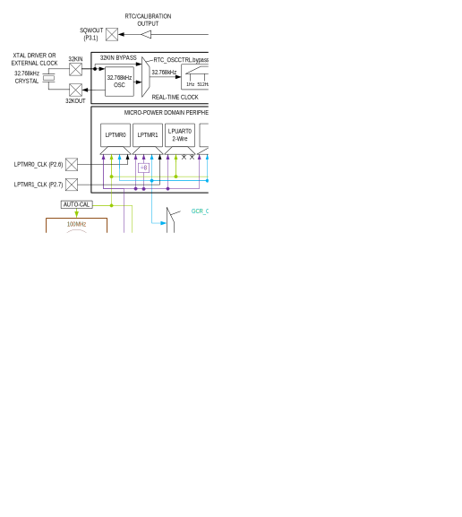
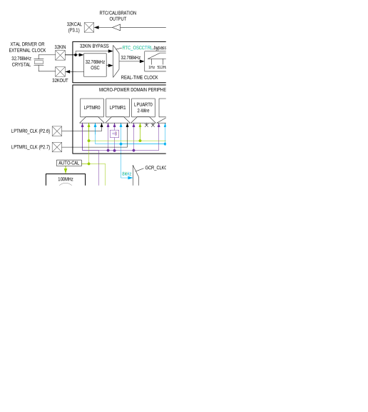
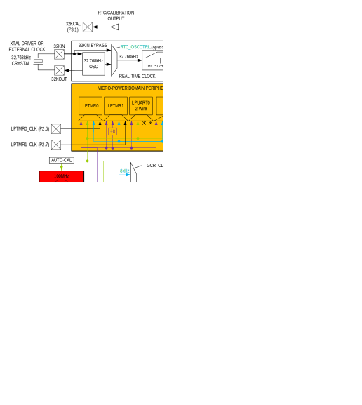
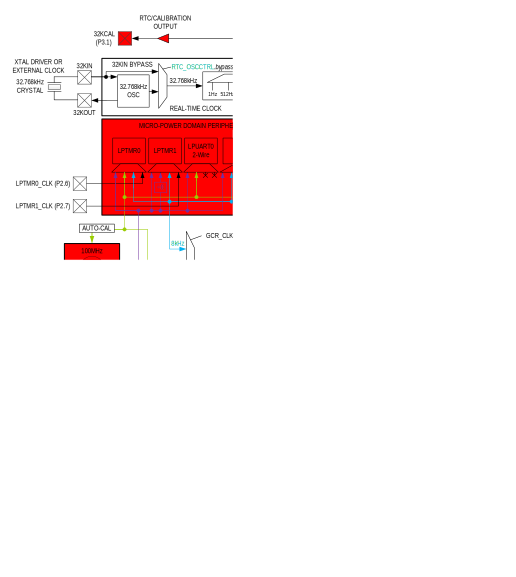

# System, Power, Clocks, Reset
Different peripherals and subsystems use several clocks. These clocks are highly configurable by software, allowing developers to select the combination of application performance and power savings required for the target systems. Support for selectable core operating voltage is provided, enabling optimal timing access to the internal memories.

## Oscillator Sources
### 100MHz Internal Primary Oscillator (IPO)
The MAX78000 includes a 100MHz internal high-speed oscillator, referred to in this document as the internal primary oscillator (IPO). The IPO is the highest frequency oscillator and draws the most power.

The IPO can optionally be powered down in LPM by setting the GCR_PM.ipo_pd field to 1.

The IPO can be selected as the SYS_OSC. Use the IPO as the SYS_OSC by performing the following steps:

1. Enable the IPO by setting GCR_CLKCTRL.ipo_en to 1.
2. Wait until the GCR_CLKCTRL.ipo_rdy field reads 1, indicating the IPO is operating.
3. Set GCR_CLKCTRL.sysclk_sel to 4.
4. Wait until the GCR_CLKCTRL.sysclk_rdy field reads 1. The IPO is now operating as the SYS_OSC.

### 60MHz Internal Secondary Oscillator (ISO)
The ISO is a low-power internal secondary oscillator that is the power-on reset default SYS_OSC. The ISO is automatically selected as SYS_OSC after a system reset or POR.

The following steps show how to enable the ISO and select it as the SYS_OSC.

1. Enable the ISO by setting GCR_CLKCTRL.iso_en to 1.
2. Wait until the GCR_CLKCTRL.iso_rdy field reads 1, indicating the ISO is operating.
3. Set GCR_CLKCTRL.sysclk_sel to 0.
4. Wait until the GCR_CLKCTRL.sysclk_rdy field reads 1. The ISO is now operating as the SYS_OSC.

### 8kHz-30kHz Internal Nano-Ring Oscillator (INRO)
The INRO is an ultra-low-power internal oscillator that can be selected as the SYS_OSC. The INRO is always enabled and cannot be disabled by software.

The frequency of this oscillator is configurable to 8kHz, 16kHz, or 30kHz. Use the TRIMSIR_INRO.lpclksel field to select the desired frequency. On a POR or system reset, the frequency defaults to 30kHz.

The following steps show how to set the INRO as the SYS_OSC.

1. Verify the GCR_CLKCTRL.inro_rdy field reads 1.
2. Set GCR_CLKCTRL.sysclk_sel to 3.
3. Wait until the GCR_CLKCTRL.sysclk_rdy field reads 1. The INRO is now operating as the SYS_OSC.

### 7.3728MHz Internal Baud Rate Oscillator (IBRO)
The IBRO is a very low-power internal oscillator that can be selected as SYS_OSC. The INRO can optionally be used as a dedicated baud rate clock for the UARTs. The INRO is useful if the selected SYS_OSC does not accurately generate a desired UART baud rate.

The following steps show how to enable the IBRO and select it as the SYS_OSC.

1. Wait until the GCR_CLKCTRL.ibro_rdy field reads 1, indicating the IBRO is operating.
2. Set GCR_CLKCTRL.sysclk_sel to 5.
3. Wait until the GCR_CLKCTRL.sysclk_rdy field reads 1. The IBRO is now operating as the SYS_OSC.

### 32.768kHz External Real-Time Clock Oscillator (ERTCO)
The ERTCO is an extremely low-power internal oscillator that can be selected as the SYS_OSC. The ERTCO can optionally use a 32.768kHz input clock or an 8kHz independent nano-ring oscillator instead of an external crystal. The internal 32.768kHz clock is available as an output on GPIO P3.1 as alternate function 1 (SQWOUT).

This oscillator is the default clock for the real-time clock (RTC). If the RTC is enabled, the ERTCO is enabled automatically, independent of the selection of the SYS_OSC. The ERTCO is disabled on a POR or system reset.

The following steps show how to enable the ERTCO and select it as the SYS_OSC.

1. Enable the ERTCO by setting GCR_CLKCTRL.ertco_en to 1.
2. Wait until the GCR_CLKCTRL.ertco_rdy field reads 1, indicating the ERTCO is operating.
3. Set GCR_CLKCTRL.sysclk_sel to 6.
4. Wait until the GCR_CLKCTRL.sysclk_rdy field reads 1. The ERTCO is now operating as the SYS_OSC.

## System Oscillator (SYS_OSC)
The MAX78000 supports multiple clock sources as the SYS_OSC. The selected SYS_OSC is the clock source for most internal blocks. Each oscillator, description, and nominal frequency are shown in [Table 4-1](#available-system-oscillators). An external clock source, EXT_CLK, is supported on P0.3, alternate function 1. Each of the oscillators/clocks is described in detail in section Oscillator Sources.

*Table 4-1: Available System Oscillators*
<a name="available-system-oscillators"></a>

<table border="1" cellpadding="5" cellspacing="0">
    <tr style="background-color: #e0e0e0; font-weight: bold; text-align: center">
        <th>Oscillator/Clock</th>
        <th>Description</th>
        <th>Nominal Frequency</th>
    </tr>
    <tr>
        <td>IPO</td>
        <td>Internal Primary Oscillator</td>
        <td>100MHz</td>
    </tr>
    <tr>
        <td>ISO</td>
        <td>Internal Secondary Oscillator</td>
        <td>60MHz</td>
    </tr>
    <tr>
        <td>INRO</td>
        <td>Internal Nano-Ring Oscillator</td>
        <td>Configurable 8kHz, 16kHz, or 30kHz</td>
    </tr>
    <tr>
        <td>IBRO</td>
        <td>Internal Baud Rate Oscillator</td>
        <td>7.3728MHz</td>
    </tr>
    <tr>
        <td>ERTCO</td>
        <td>External Real-Time Clock Oscillator</td>
        <td>32.768kHz</td>
    </tr>
    <tr>
        <td>EXT_CLK</td>
        <td>External Clock</td>
        <td>Up to 80MHz</td>
    </tr>
</table>

### System Oscillator Selection
Set the system oscillator using the GCR_CLKCTRL.sysclk_sel field. Before selecting an oscillator as the system oscillator, the oscillator source must first be enabled and ready. See each oscillator source’s detailed description for the required steps to enable the oscillator and select it as the system oscillator.

When the GCR_CLKCTRL.sysclk_sel is modified, hardware clears the GCR_CLKCTRL.sysclk_rdy field, and there is a delay until the switchover is complete. When the switchover to the selected SYS_OSC is complete, the GCR_CLKCTRL.sysclk_rdy field is set to 1 by hardware. The application software must verify that the switchover is complete before continuing operation.

### System Clock (SYS_CLK)
The selected SYS_OSC is the input to the system oscillator divider to generate the system clock (SYS_CLK). The system clock divider divides the selected SYS_OSC by the GCR_CLKCTRL.sysclk_div field, as shown in [Equation 4-1](#equation-4-1-system-clock-scaling).

*Equation 4-1: System Clock Scaling*
<a name="equation-4-1-system-clock-scaling"></a>

SYS_CLK = SYS_OSC / 2<sup>sysclk_div</sup>

GCR_CLKCTRL.sysclk_div is selectable from 0 to 7, resulting in divisors of 1, 2, 4, 8, 16, 32, 64 or 128.

SYS_CLK drives the Arm core, the RV32 core, and all AHB masters in the system. SYS_CLK generates the following internal clocks as shown below:

- AHB Clock
    - HLCK = SYS_CLK
- APB Clock
    - PCLK = SYS_CLK / 2

The RTC uses the ERTCO for its clock source. Optionally, the RTC can run using an internal dedicated 8kHz nano-ring oscillator. See the Real-Time Clock (RTC) chapter for details on using this 8kHz nano-ring oscillator for the RTC.

All oscillators are reset to their POR reset default state during:
- Power-On Reset
- System Reset

Oscillator settings are *not* reset during:
- Soft Reset
- Peripheral Reset

<a href="#reset-sources-effect-oscillator-system-clock"><em>Table 4-2</em></a> shows each oscillator’s enabled state for each type of reset source in the MAX78000.

*Note: A Watchdog Timer Reset performs a System Reset.*

*Table 4-2: Reset Sources and Effect on Oscillator and System Clock*
<a name="reset-sources-effect-oscillator-system-clock"></a>

<table border="1" cellpadding="5" cellspacing="0">
    <tr style="background-color: #e0e0e0; font-weight: bold; text-align: center">
        <th></th>
        <th colspan="4" align="center">Reset Source</th>
    </tr>
    <tr>
        <th style="background-color: #e0e0e0; font-weight: bold; text-align: center">Oscillator</th>
        <th style="background-color: #e0e0e0; font-weight: bold; text-align: center">POR</th>
        <th style="background-color: #e0e0e0; font-weight: bold; text-align: center">System</th>
        <th style="background-color: #e0e0e0; font-weight: bold; text-align: center">Soft</th>
        <th style="background-color: #e0e0e0; font-weight: bold; text-align: center">Peripheral</th>
    </tr>
    <tr>
        <td style="background-color: #e0e0e0; font-weight: bold; text-align: center">IPO</td>
        <td>Disabled</td>
        <td>Disabled</td>
        <td>Retains State</td>
        <td>Retains State</td>
    </tr>
    <tr>
        <td style="background-color: #e0e0e0; font-weight: bold; text-align: center">ISO</td>
        <td>Enabled</td>
        <td>Enabled</td>
        <td>Retains State</td>
        <td>Retains State</td>
    </tr>
    <tr>
        <td style="background-color: #e0e0e0; font-weight: bold; text-align: center">IBRO</td>
        <td>Enabled</td>
        <td>Enabled</td>
        <td>Enabled</td>
        <td>Enabled</td>
    </tr>
    <tr>
        <td style="background-color: #e0e0e0; font-weight: bold; text-align: center">INRO</td>
        <td>Enabled</td>
        <td>Enabled</td>
        <td>Enabled</td>
        <td>Enabled</td>
    </tr>
    <tr>
        <td style="background-color: #e0e0e0; font-weight: bold; text-align: center">ERTCO</td>
        <td>Disabled</td>
        <td>Disabled</td>
        <td>Retains State</td>
        <td>Retains State</td>
    </tr>
    <tr>
        <td style="background-color: #e0e0e0; font-weight: bold; text-align: center">System Clock<br>(SYS_OSC) Source</td>
        <td>ISO</td>
        <td>ISO</td>
        <td>Retains State</td>
        <td>Retains State</td>
    </tr>
</table>

<a href="#figure4-1">Figure 4-1: MAX78000 Clock Block Diagram</a> shows a high-level diagram of the MAX78000 clock tree.

*Figure 4-1: MAX78000 Clock Block Diagram*
<a name="figure4-1"></a>



## Operating Modes
The MAX78000 includes multiple operating modes and the ability to fine-tune power options to optimize performance and power. The system supports the following operating modes:

- ACTIVE
- SLEEP
- Low-Power Mode (LPM)
- Micro Power Mode (UPM)
- STANDBY
- BACKUP
- Power Down Mode (PDM)

### ACTIVE Mode
In this mode, both the CM4 and the RV32 cores can execute software, and all digital and analog peripherals are available on demand. Dynamic clocking disables peripheral not in use, providing the optimal mix of high performance and low power consumption. The CM4 has access to all System RAM by default. The RV32 has access to sysram2 and sysram3 and can be optionally configured to have exclusive access to these RAMs. Additionally, sysram3 can be configured as a unified internal cache controller for the RV32 allowing simultaneous data access and code execution for the CM4 and RV32 from the internal flash memory.

Each of the peripherals can be individually enabled during active mode or powered down. The CNN and each of the four CNNx16_n Processor Arrays and their associated memories can be powered down or set to active mode.

### Low-Power Modes
#### SLEEP
This mode consumes less power but wakes faster because the clocks can optionally be enabled.
The device status is as follows:

- The CM4 (CPU0) is sleeping
- The RV32 (CPU1) is sleeping
- The CNN is optionally available for use
- Each of the four CNNx16_n quadrants is individually configurable for power down
- Standard DMA is available for use
- All peripherals are on unless explicitly disabled before entering SLEEP

##### Entering SLEEP
Entering SLEEP requires both the CM4 and RV32 to cooperate to enter SLEEP. Synchronization is necessary for deterministic entry into SLEEP. Two methods are described below, allowing either core to request entry into SLEEP. Both methods use the semaphore peripheral interrupt to communicate between the cores.

If the RV32 is driving entry to SLEEP, the RV32 notifies the CM4 of a request to enter SLEEP using Multiprocessor Communications. The CM4 receives the notification and then sends confirmation through the semaphore peripheral to the RV32. The CM4 should then enter SLEEP by setting the SCR.sleepdeep field to 0 and performing a WFI or WFE instruction. The RV32 should then enter SLEEP by performing a WFI instruction or by setting GCR_PM.mode to 1, followed by two NOP instructions.

Alternatively, the CM4 can initiate the request to enter SLEEP by sending the request to the RV32 using Multiprocessor Communications. The RV32 confirms the request through Multiprocessor Communications and performs a WFI instruction followed by two NOP instructions. The CM4 should then enter SLEEP by setting SCR.sleepdeep to 0 and performing a WFI or WFE instruction or by setting GCR_PM.mode to 1.

*Figure 4-2: SLEEP Mode Clock Control*
<a name="figure4-2"></a>



#### LPM
This mode is suitable for running the RV32 processor to collect and move data from enabled peripherals. The device status is a follows:

- The CM4, sysram0, and sysram1 are in state retention
- The CNN quadrants and memory are active and configurable.
- The RV32 can access the SPI, UARTS, Timers, I2C, 1-Wire, Timers, Pulse Train Engine, I2S, CRC, AES, TRNG, Comparators, as well as sysram2 and sysram3. Sysram3 can be configured to operate as the RV32 unified instruction cache
- The transition from LPM to ACTIVE is faster than the transition from BACKUP to ACTIVE because system initialization is not required
- The DMA is in state retention mode
- PWRSEQ_GP0 and PWRSEQ_GP1 registers retain state
- Choose the system PCLK or ISO as the clock source for the RV32 and all peripherals 
    - PWRSEQ_LPCN.lpmclksel defaults to use ISO during LPM. Setting this field to 1 uses the PCLK
- The following oscillators are powered down by default, but can be configured by software to remain active:
    - ISO
    - IPO
    - ERTCO
    - INRO
- The following oscillator is enabled:
    - IBRO

##### Entering LPM
Entry into LPM should be managed between the two cores using Multiprocessor Communications to ensure both cores are in a known state when entering LPM.

When the CM4 puts itself into deep sleep, the device automatically enters LPM, and hardware sets the GCR_PM.mode to LPM. To place the CM4 in LPM mode in software, perform the following instructions.

```
SCR.sleepdeep = 1;  // deep sleep mode enabled

WFI (or WFE);   // Enter deep sleep mode
```

If the RV32 requests the CM4 to enter LPM mode through Multiprocessor Communications and the CM4 enters SLEEP instead, by setting SCR.sleepdeep to 0 and performing a WFI or WFE instruction, the RV32 can put the device into LPM by directly setting the GCR_PM.mode field to LPM (8).

*Note: The device immediately enters LPM when the GCR_PM.mode field is set to LPM. If the CM4 is not in a known state, issues may occur when exiting LPM.*

*Figure 4-3: LPM Clock and State Retention Diagram*
<a name="figure4-3"></a>


#### UPM
This mode is used for extremely low power consumption while using a minimal set of peripherals to provide wake-up capability. The device status during UPM is:

- Both CM4 and RV32 are state retained.
- System state and all system RAM are retained
- CNN quadrants are optionally powered off
- CNN memory provides selectable retention
- The GPIO pins retain their state
- All non-UPM peripherals are state retained
- The following oscillators are powered down:
    - IPO
    - ISO
- The following oscillators are enabled:
    - IBRO
    - ERTCO, firmware configurable
    - INRO, firmware configurable
- The following UPM peripherals are available for use to wake the device:
    - LPUART0
    - LPTMR0
    - LPTMR1
    - LPWDT0
    - LPCOMP0-LPCOMP3
    - GPIO

##### Entering UPM
Entering UPM mode requires both the CM4 and RV32 to cooperate to enter UPM mode. Synchronization is necessary for deterministic entry into UPM. Two methods are described below, allowing either core to request entry into UPM and ensuring deterministic entry. Both methods use the Semaphore peripheral interrupt to communicate between the cores.

If the RV32 is driving entry to UPM, the RV32 notifies the CM4 of a request to enter UPM using Multiprocessor Communications. The CM4 receives the notification and then sends a confirmation through the semaphore peripheral to the RV32. The CM4 should then enter SLEEP by setting SCR.sleepdeep to 0 and performing a WFI or WFE instruction. The RV32 sets the GCR_PM.mode to UPM, followed by two NOP instructions, and the device immediately enters UPM.

Alternatively, the CM4 can initiate the request to enter UPM by sending the request to the RV32 using Multiprocessor Communications. The RV32 confirms the request through Multiprocessor Communications and performs a WFI instruction, followed by two NOP instructions. The CM4 then sets the GCR_PM.mode to UPM, and the device immediately enters UPM.

*Figure 4-4: UPM Clock and State Retention Block Diagram*
<a name="figure4-4"></a>


#### STANDBY
This mode is used to maintain the system operation while keeping time with the RTC. The device status is as follows:

- Both CM4 and RV32 are state retained.
- System state and all system RAM is retained
- CNN quadrants are powered off
- CNN memory provides selectable retention (optional state retention)
- GPIO pins retain their state
- All peripherals retain state
- The following oscillators are powered down:
    - IPO
    - ISO
    - IBRO
- The following oscillators are enabled:
    - ERTCO, firmware configurable
    - INRO

##### Entering STANDBY
Entering STANDBY requires both the CM4 and RV32 to enter STANDBY mode. Synchronization is necessary for deterministic entry into STANDBY. Two methods are described below, allowing either core to request entry into STANDBY and ensuring deterministic entry. Both methods use the semaphore peripheral interrupt to communicate between the cores.

If the RV32 is driving entry to STANDBY, the RV32 notifies the CM4 of a request to enter STANDBY using Multiprocessor Communications. The CM4 receives the notification and then sends a confirmation through the semaphore peripheral to the RV32. The CM4 should then enter SLEEP by setting SCR.sleepdeep to 0 and performing a WFI or WFE instruction. The RV32 sets the GCR_PM.mode to STANDBY, followed by two NOP instructions, and the device immediately enters into STANDBY.

Alternatively, the CM4 can initiate the request to enter STANDBY by sending the request to the RV32 using Multiprocessor Communications. The RV32 confirms the request through Multiprocessor Communications and performs a WFI instruction followed by two NOP instructions. The CM4 then sets the GCR_PM.mode to STANDBY, and the device immediately enters STANDBY.

*Figure 4-5: STANDBY Mode Clock and State Retention Block Diagram*
<a name="figure4-5"></a>



#### BACKUP
This mode is used to maintain the System RAM. The device status is as follows:

- CM4 and RV32 are powered off.
- Sysram0, sysram1, sysram2, and sysram3 can be independently configured for state retention, as shown in Table 4-3.
- User-configurable CNN memory retention
- All peripherals are powered off
- The following oscillators are powered down:
    - IPO
    - ISO
    - IBRO
    - INRO
- The following oscillators are enabled:
    - ERTCO (The RTC peripheral can be turned off, but not the oscillator)

*Table 4-3 System RAM Retention in BACKUP Mode*
<a name="table4-3-system-ram-detention-in-backup-mode"></a>

<table border="1" cellpadding="5" cellspacing="0">
   <tr style="background-color: #e0e0e0; font-weight: bold; text-align: center">
       <th>RAM Block #</th>
       <th>Size</th>
       <th>State Retention Control</th>
   </tr>
   <tr><td>sysram0</td><td>32KB + ECC if enabled</td><td>PWRSEQ_LPCN.ramret0</td></tr>
   <tr><td>sysram1</td><td>32KB</td><td>PWRSEQ_LPCN.ramret1</td></tr>
   <tr><td>sysram2</td><td>48KB</td><td>PWRSEQ_LPCN.ramret2</td></tr>
   <tr><td>sysram3</td><td>16KB</td><td>PWRSEQ_LPCN.ramret3</td></tr>
</table>

##### Entering BACKUP
Entering BACKUP mode does not require synchronization between the RV32 and CM4 cores. However, it is recommended that Multiprocessor Communications are used to ensure both cores are aware of entry into BACKUP and complete any memory transactions before entry.

Either core can set GCR_PM.mode to BACKUP, and the device immediately enters BACKUP.

*Figure 4-6: BACKUP Mode Clock and State Retention Block Diagram*
<a name="figure4-6"></a>



#### PDM
This mode is used during product level distribution and storage. The device status is as follows:

- The CM4 and RV32 are powered off
- All peripherals and all RAMs are powered down
- All oscillators are powered down
- There is no data retention in this mode, but values in the flash are preserved
- V<sub>REGI</sub> POR voltage monitor is operational.
- Exit from PDM is possible through an external reset (RSTN) or a wake-up event using either P3.0 or P3.1 if configured.

##### Entering PDM
Entering PDM does not require synchronization between the RV32 and CM4 cores. However, it is recommended that Multiprocessor Communications is used to ensure both cores are aware of entry into PDM and complete any flash memory transactions.

Either core can set GCR_PM.mode to PDM, and the device immediately enters PDM.

*Figure 4-7: PDM Clock and State Retention Block Diagram*
<a name="figure4-7"></a>


## Wake-Up Sources for Each Operating Mode
In all operating modes other than ACTIVE, wake-up sources are required to re-enter ACTIVE operation. [Table 4-4](#table4-4-wakeup-sources-for-each-operating-mode-in-78000) shows available wake-up sources for each operating mode of the MAX78000.

*Note: Each wake-up source must be enabled individually except for External Reset, which is hardware controlled.*

*Table 4-4: Wake-Up Sources for Each Operating Mode in the MAX78000*
<a name="table4-4-wakeup-sources-for-each-operating-mode-in-78000"></a>

<table border="1" cellpadding="5" cellspacing="0">
   <tr style="background-color: #e0e0e0; font-weight: bold; text-align: center">
       <th>Operating Mode</th>
       <th>Any Peripheral Interrupts</th>
       <th>External Reset</th>
       <th>RV32</th>
       <th>CNN</th>
       <th>CNN FIFO</th>
       <th>SPI1</th>
       <th>SPI0</th>
       <th>I2S</th>
       <th>I2C2</th>
       <th>I2C1</th>
       <th>I2C0</th>
       <th>LPUART0 (UART3)</th>
       <th>UART2</th>
       <th>UART1</th>
       <th>UART0</th>
       <th>LPTMR1 (TMR5)</th>
       <th>LPTMR0 (TMR4)</th>
       <th>TMR3</th>
       <th>TMR2</th>
       <th>TMR1</th>
       <th>TMR0</th>
       <th>LPWDT0 (WDT1)</th>
       <th>WDT0</th>
       <th>LPCOMP3</th>
       <th>LPCMOP2</th>
       <th>LPCMOP1</th>
       <th>COMP0</th>
       <th>RTC</th>
       <th>WUT</th>
       <th>GPIO3</th>
       <th>GPIO2</th>
       <th>GPIO1</th>
       <th>GPIO0</th>
   </tr>
   <tr>
    <td>SLEEP</td>
    <td></td>
    <td></td>
    <td></td>
    <td></td>
    <td></td>
    <td></td>
    <td></td>
    <td></td>
    <td></td>
    <td></td>
    <td></td>
    <td></td>
    <td></td>
    <td></td>
    <td></td>
    <td></td>
    <td></td>
    <td></td>
    <td></td>
    <td></td>
    <td></td>
    <td></td>
    <td></td>
    <td></td>
    <td></td>
    <td></td>
    <td></td>
    <td></td>
    <td></td>
    <td></td>
    <td></td>
    <td></td>
    <td></td>
  </tr>
  <tr>
    <td>LPM</td>
    <td></td>
    <td></td>
    <td></td>
    <td></td>
    <td></td>
    <td></td>
    <td></td>
    <td></td>
    <td></td>
    <td></td>
    <td></td>
    <td></td>
    <td></td>
    <td></td>
    <td></td>
    <td></td>
    <td></td>
    <td></td>
    <td></td>
    <td></td>
    <td></td>
    <td></td>
    <td></td>
    <td></td>
    <td></td>
    <td></td>
    <td></td>
    <td></td>
    <td></td>
    <td></td>
    <td></td>
    <td></td>
    <td></td>
  </tr>
  <tr>
    <td>UPM</td>
    <td></td>
    <td></td>
    <td></td>
    <td></td>
    <td></td>
    <td></td>
    <td></td>
    <td></td>
    <td></td>
    <td></td>
    <td></td>
    <td></td>
    <td></td>
    <td></td>
    <td></td>
    <td></td>
    <td></td>
    <td></td>
    <td></td>
    <td></td>
    <td></td>
    <td></td>
    <td></td>
    <td></td>
    <td></td>
    <td></td>
    <td></td>
    <td></td>
    <td></td>
    <td></td>
    <td></td>
    <td></td>
    <td></td>
  </tr>
  <tr>
    <td>STANDBY</td>
    <td></td>
    <td></td>
    <td></td>
    <td></td>
    <td></td>
    <td></td>
    <td></td>
    <td></td>
    <td></td>
    <td></td>
    <td></td>
    <td></td>
    <td></td>
    <td></td>
    <td></td>
    <td></td>
    <td></td>
    <td></td>
    <td></td>
    <td></td>
    <td></td>
    <td></td>
    <td></td>
    <td></td>
    <td></td>
    <td></td>
    <td></td>
    <td></td>
    <td></td>
    <td></td>
    <td></td>
    <td></td>
    <td></td>
  </tr>
  <tr>
    <td>BACKUP</td>
    <td></td>
    <td></td>
    <td></td>
    <td></td>
    <td></td>
    <td></td>
    <td></td>
    <td></td>
    <td></td>
    <td></td>
    <td></td>
    <td></td>
    <td></td>
    <td></td>
    <td></td>
    <td></td>
    <td></td>
    <td></td>
    <td></td>
    <td></td>
    <td></td>
    <td></td>
    <td></td>
    <td></td>
    <td></td>
    <td></td>
    <td></td>
    <td></td>
    <td></td>
    <td></td>
    <td></td>
    <td></td>
    <td></td>
  </tr>
  <tr>
    <td>PDM</td>
    <td></td>
    <td></td>
    <td></td>
    <td></td>
    <td></td>
    <td></td>
    <td></td>
    <td></td>
    <td></td>
    <td></td>
    <td></td>
    <td></td>
    <td></td>
    <td></td>
    <td></td>
    <td></td>
    <td></td>
    <td></td>
    <td></td>
    <td></td>
    <td></td>
    <td></td>
    <td></td>
    <td></td>
    <td></td>
    <td></td>
    <td></td>
    <td></td>
    <td></td>
    <td></td>
    <td></td>
    <td></td>
    <td></td>
  </tr>
  <tr>
    <td colspan="34" style="text-align: left;"><em>Note: The CNN and CNN FIFO cannot wake the CM4 from LPM.</em></td>
</tr>
</table>

## Device Resets
Four device resets are available:

- Peripheral Reset
- Soft Reset
- System Reset
- Power-On Reset

On completion of any of the four reset cycles, all peripherals are reset. On completion of any reset cycle, HCLK and PCLK are operational, the CPU core receives clocks and power, and the device is in ACTIVE. Program execution begins at the reset vector address.

The contents of the always-on domain (AoD) are reset only on power-cycling VCOREA, VCOREB, VDDA, VDDIOH, or VREGI.

The on-chip peripherals can also be reset to their POR default state using the two reset registers, GCR_RST0 and GCR_RST1.

[Table 4-5]() shows the effects of each reset type on each of the operating modes.

*Table 4-5: Reset and Low-Power Mode Effects*

### Peripheral Reset
Peripheral reset resets all peripherals. The CPU retains its state. The GPIO, watchdog timers, AoD, RAM retention, and general control registers (GCR), including the clock configuration, are unaffected.

To start a peripheral reset, set GCR_RST0.periph to 1. The reset is completed immediately upon setting GCR_RST0.periph to 1.

### Soft Reset
A soft reset is the same as a peripheral reset except that it also resets the GPIO to its POR state.

To perform a soft reset, set GCR_RST0.soft to 1. The reset occurs immediately upon setting GCR_RST0.soft to 1.

### System Reset
A system reset is the same as a soft reset, except it also resets all GCR, resetting the clocks to their POR default state. The CPU state is reset, as well as the watchdog timers. The AoD and RAM are unaffected.

A watchdog timer reset event initiates a system reset. To start a system reset, set GCR_RST0.sys to 1.

### Power-On Reset
A POR resets everything in the device to its default state. A POR results from V<sub>COREA</sub>, V<sub>COREB</sub>, V<sub>DDA</sub>, or V<sub>REGI</sub> falling below their reset voltage level. Refer to the MAX78000 data sheet for details of the reset voltage levels.

## Unified Internal Cache Controllers
The MAX78000 includes two unified internal cache controllers. ICC0 is the cache controller used for the CM4. ICC1, if enabled, is dedicated to the RV32 core. ICC1 uses sysram3 as the cache memory. If ICC1 is enabled, sysram3 is not accessible as SRAM (address range 0x2001 C000 to 0x2001 FFFF).

Both caches, ICC0 and ICC1, include a line buffer, tag RAM, and a 16KB 2-way set associative RAM when enabled.

### Enabling the Internal Cache Controllers
Enabling ICC1 for use as the cache controller for the RV32 requires using *sysram3* as the cache memory.
*Note: The contents of sysram3 are lost when ICC1 is enabled, and sysram3 is not accessible for data reads or writes as part of the memory map.*
*Note: Before enabling ICC1 as a cache controller, sysram3 should be zeroized.*

Perform the following steps to enable each ICC:

1. Set the ICCn_CTRL.en to 0, ensuring the cache is invalidated when enabled.
2. Set ICCn_CTRL.en to 1.
3. Read ICCn_CTRL.rdy until it returns 1.
4. Zeroize the ICC instance by setting GCR_MEMZ.icc0 or GCR_MEMZ.icc1 to 1.

### Disabling the ICC
Disable an ICC instance by setting ICCn_CTRL.en to 0.

To use sysram3 as data RAM, first, disable the ICC1 instance as described above. When ICC1 is disabled, sysram3 is accessible as data RAM by both the CM4 and RV32 controllers unless sysram3 is configured for exclusive access by the RV32 core only.

### Invalidating the ICC Cache and Tag RAM
Invalidate the contents of a specific ICC instance by setting the ICCn_INVALIDATE register to 1. Once invalidated, the system flushes the cache. Read the ICCn_CTRL.rdy field until it returns 1 to determine when the flush is completed.

### Flushing the ICC
Flush ICC0 using the system configuration register (GCR_SYSCTRL). Set GCR_SYSCTRL.icc0_flush to 1 to immediately flush the contents of the 16KB cache and tag RAM.

Flush ICC1 using the RV32 Control Register (FCR_URVCTRL). Set FCR_URVCTRL.icc1_flush to 1 to immediately flush the contents of the 16KB cache and tag RAM.

### Internal Cache Control Registers (ICC)
See Table 3-3 for the base address of this peripheral/module. See Table 1-1 for an explanation of the read and write access of each field. Unless specified otherwise, all fields are reset on a system reset, soft reset, POR, and the peripheral-specific resets.

*Table 4-6: Instruction Cache Controller Register Summary*
<a name="table4-6-instruction-cache-controller-register-summary"></a>

<table border="1" cellpadding="5" cellspacing="0">
  <tr style="background-color: #e0e0e0; font-weight: bold; text-align: center">
    <th>Offset</th>
    <th>Register</th>
    <th>Name</th>
  </tr>
  <tr>
    <td>[0x0000]</td>
    <td><a href="#cache-id-register">ICCn_INFO</td>
    <td>Cache ID Register</td>
  </tr>
  <tr>
    <td>[0x0004]</td>
    <td><a href="#cache-memory-size-register">ICCn_SZ</td>
    <td>Cache Memory Size Register</td>
  </tr>
  <tr>
    <td>[0x0100]</td>
    <td><a href="#instruction-cache-control-register">ICCn_CTRL</td>
    <td>Instruction Cache Control Register</td>
  </tr>
  <tr>
    <td>[0x0700]</td>
    <td><a href="#instruction-cache-controller-invalidate-register">ICCn_INVALIDATE</td>
    <td>Instruction Cache Controller Invalidate Register</td>
  </tr>
</table>

### ICC0 Register Details
*Table 4-7: ICC0 Cache Information Register*
<a name="cache-id-register"></a>

<table border="1" cellpadding="5" cellspacing="0">
   <tr>
       <td colspan="3">ICC0 Cache Information</td>
       <td colspan="1">ICCn_INFO</td>
       <td>[0x0000]</td>
   </tr>
   <tr class="header-row">
       <th>Bits</th>
       <th>Name</th>
       <th>Access</th>
       <th>Reset</th>
       <th>Description</th>
   </tr>
   <tr>
       <td>31:16</td>
       <td>-</td>
       <td>RO</td>
       <td>0</td>
       <td><strong>Reserved</strong></td>
   </tr>
   <tr>
       <td>15:10</td>
       <td>id</td>
       <td>R</td>
       <td>-</td>
       <td><strong>Cache ID</strong><br>
       This field returns the ID for the cache instance.
       </td>
   </tr>
      <tr>
       <td>9:6</td>
       <td>partnum</td>
       <td>R</td>
       <td>-</td>
       <td><strong>Cache Part Number</strong><br>
       This field returns the part number indicator for the cache instance.
       </td>
   </tr>
         <tr>
       <td>5:0</td>
       <td>relnum</td>
       <td>R</td>
       <td>-</td>
       <td><strong>Cache Release Number</strong>
       <br>This field returns the release number for the cache instance.
       </td>
   </tr>
</table>

*Table 4-8: ICC0 Memory Size Register*
<a name="cache-memory-size-register"></a>

<table border="1" cellpadding="5" cellspacing="0">
   <tr>
       <td colspan="3">ICC0 Memory Size</td>
       <td colspan="1">ICCn_SZ</td>
       <td>[0x0004]</td>
   </tr>
   <tr class="header-row">
       <th>Bits</th>
       <th>Name</th>
       <th>Access</th>
       <th>Reset</th>
       <th>Description</th>
   </tr>
   <tr>
       <td>31:16</td>
       <td>mem</td>
       <td>R</td>
       <td>-</td>
       <td><strong>Addressable Memory Size</strong><br>
       This field indicates the size of addressable memory by the cache controller instance in 128KB units.
       </td>
   </tr>
   <tr>
       <td>15:0</td>
       <td>cch</td>
       <td>R</td>
       <td>-</td>
       <td><strong>Cache Size</strong><br>This field returns the size of the cache RAM in 1KB units.<br> 
       <div style="margin-left: 20px">
       16: 16KB Cache RAM
       </td>
   </tr>
</table>

*Table 4-9: ICC0 Cache Control Register*
<a name="instruction-cache-control-register"></a>

<table border="1" cellpadding="5" cellspacing="0">
   <tr>
       <td colspan="3">ICC0 Cache Control</td>
       <td colspan="1">ICCn_CTRL</td>
       <td>[0x0100]</td>
   </tr>
   <tr class="header-row">
       <th>Bits</th>
       <th>Name</th>
       <th>Access</th>
       <th>Reset</th>
       <th>Description</th>
   </tr>
   <tr>
       <td>31:17</td>
       <td>-</td>
       <td>R/W</td>
       <td>-</td>
       <td><strong>Reserved</strong></td>
   </tr>
   <tr>
       <td>16</td>
       <td>rdy</td>
       <td>R</td>
       <td>-</td>
       <td><strong>Ready</strong><br>This field is cleared by hardware anytime the cache as a whole is invalidated (including a POR). Hardware automatically sets this field to 1 when the invalidate operation is complete, and the cache is ready.<br>
        <div style="margin-left: 20px">
            0: Cache invalidation in process.<br>
            1: Cache is ready.
        </div>
        <em>Note: While this field reads 0, the cache is bypassed, and reads come directly from the line fill buffer.</em>
   </tr>
      <tr>
       <td>15:1</td>
       <td>-</td>
       <td>R/W</td>
       <td>-</td>
       <td><strong>Reserved</strong></td>
   </tr>
      <tr>
       <td>0</td>
       <td>en</td>
       <td>R/W</td>
       <td>0</td>
       <td><strong>Cache Enable</strong><br>Set this field to 1 to enable the cache. Setting this field to 0 invalidates the cache contents, and the line fill buffer handles all reads. <br>         
       <div style="margin-left: 20px">
            0: Disable<br>
            1: Enable
        </div>
   </tr>
</table>

*Table 4-10: ICC0 Invalidate Register*
<a name="instruction-cache-controller-invalidate-register"></a>

<table border="1" cellpadding="5" cellspacing="0">
  <tr style="background-color: #e0e0e0; font-weight: bold; text-align: center">
    <td colspan="3">ICC0 Invalidate</td>
    <td colspan="1">ICCn_INVALIDATE</td>
    <td>[0x0700]</td>
  </tr>
  <tr>
    <th>Bits</th>
    <th>Name</th>
    <th>Access</th>
    <th>Reset</th>
    <th>Description</th>
  </tr>
  <tr>
    <td>31:0</td>
    <td>invalid</td>
    <td>W</td>
    <td>-</td>
    <td><strong>Invalidate</strong><br>
    Writing any value to this register invalidates the cache.
    </td>
  </tr>
</table>

## RAM Memory Management
This device has many features for managing the on-chip RAM. The on-chip RAM includes the data RAM, the unified cache controllers (ICC0 and ICC1), the CNN RAM, and the peripheral FIFOs.

### On-Chip Cache Management
The MAX78000 includes two unified internal cache controllers for code and data fetches from the flash memory. The caches can be enabled, disabled, zeroized, and flushed. See section [Unified Internal Cache Controller]() for details.

### RAM Zeroization
The GCR memory zeroize register, GCR_MEMZ, allows clearing memory for software or security reasons. Zeroization writes all zeros to the specified memory.

The following SRAM memories can be zeroized:

- Each of the System RAMs can be individually zeroized by setting the respective GCR_MEMZ bit:
    - GCR_MEMZ.ram0
    - GCR_MEMZ.ram0ecc
    - GCR_MEMZ.ram1
    - GCR_MEMZ.ram2
    - GCR_MEMZ.ram3
- ICC0 16KB Cache
- GCR_MEMZ.icc0
- ICC1 16KB Cache, if enabled
    - GCR_MEMZ.icc1
    - Each of the CNNx16n processor arrays supports zeroizing the tornado RAM, mask RAM, bias RAM, and data SRAM:
    - CNNx16_n_TEST.tramz set to 1 to zero, read CNNx16_n_TEST.tallzdone until 1 for completion
    - CNNx16_n_TEST.mramz set to 1 to zero, read CNNx16_n_TEST.mallzdone until 1 for completion
    - CNNx16_n_TEST.bramz set to 1 to zero, read CNNx16_n_TEST.ballzdone until 1 for completion
    - CNNx16_n_TEST.sramz set to 1 to zero, read CNNx16_n_TEST.sallzdone until 1 for completion

## Miscellaneous Control Registers (MCR)
See [Table 3-3](memory-register-mapping-access.md#apb-peripheral-base-address-map) for the base address of this peripheral/module. See Table 1-1 for an explanation of the read and write access of each field. Unless specified otherwise, all fields are reset on a system reset, soft reset, POR, and the peripheral-specific resets.

*Table 4-11: Miscellaneous Control Register Summary*
<a name="table4-11-miscellaneous-control-register-summary"></a>

<table border="1" cellpadding="5" cellspacing="0">
  <tr style="background-color: #e0e0e0; font-weight: bold; text-align: center">
    <th>Offset</th>
    <th>Register Name</th>
    <th>Access</th>
    <th>Name</th>
  </tr>
  <tr>
    <td>[0x0000]</td>
    <td><a href="#error-correction-coding-enable-register">MCR_ECCEN</td>
    <td>R/W</td>
    <td>Error Correction Coding Enable Register</td>
  </tr>
  <tr>
    <td>[0x0004]</td>
    <td><a href="#ipo-manual-trim-register">MCR_IPO_MTRIM</td>
    <td>R/W</td>
    <td>IPO Manual Trim Register</td>
  </tr>
  <tr>
    <td>[0x0008]</td>
    <td><a href="#miscellaneous-output-enable-register">MCR_OUTEN</td>
    <td>R/W</td>
    <td>Miscellaneous Output Enable Register</td>
  </tr>
    <tr>
    <td>[0x000C]</td>
    <td><a href="#comparator-control-register">MCR_CMP_CTRL</td>
    <td>R/W</td>
    <td>Comparator Control Register</td>
  </tr>
  </tr>
    <tr>
    <td>[0x0010]</td>
    <td><a href="#miscellaneous-control-register">MCR_CTRL</td>
    <td>R/W</td>
    <td>Miscellaneous Control Register</td>
  </tr>
    </tr>
    <tr>
    <td>[0x0020]</td>
    <td><a href="#gpio3-pin-control-register">MCR_GPIO3_CTRL</td>
    <td>R/W</td>
    <td>GPIO3 Pin Control Register</td>
  </tr>
</table>

### Miscellaneous Control Register Details

*Table 4-12: Error Correction Coding Enable Register*
<a name="error-correction-coding-enable-register"></a>

<table border="1" cellpadding="5" cellspacing="0">
  <tr style="background-color: #e0e0e0; font-weight: bold; text-align: center">
    <td colspan="3">Error Correction Coding Enable</td>
    <td colspan="1">MCR_ECCEN</td>
    <td>[0x0000]</td>
  </tr>
  <tr>
    <th>Bits</th>
    <th>Name</th>
    <th>Access</th>
    <th>Reset</th>
    <th>Description</th>
  </tr>
  <tr>
    <td>31:1</td>
    <td>-</td>
    <td>RO</td>
    <td>0</td>
    <td><strong>Reserved</strong></td>
  </tr>
  <tr>
    <td>0</td>
    <td>ram0</td>
    <td>R/W</td>
    <td>0</td>
    <td><strong>System RAM 0 ECC Enable</strong><br>Set this field to 1 to enable ECC for <em>sysram0</em>.<br>
        <div style="margin-left: 20px">
            0: Disabled<br>
            1: Enabled
        </div>
    </td>
  </tr>
</table>

*Table 4-13: IPO Manual Register*
<a name="ipo-manual-trim-register"></a>

<table border="1" cellpadding="5" cellspacing="0">
  <tr style="background-color: #e0e0e0; font-weight: bold; text-align: center">
    <td colspan="3">IPO Manual Trim</td>
    <td colspan="1">MCR_IPO_MTRIM</td>
    <td>[0x0004]</td>
  </tr>
  <tr>
    <th>Bits</th>
    <th>Name</th>
    <th>Access</th>
    <th>Reset</th>
    <th>Description</th>
  </tr>
  <tr>
    <td>31:9</td>
    <td>-</td>
    <td>R0</td>
    <td>0</td>
    <td><strong>Reserved</strong></td>
  </tr>
  <tr>
    <td>8</td>
    <td>trim_range</td>
    <td>R/W</td>
    <td>0</td>
    <td><strong>Trim Range Select</strong><br>If this bit is set to 1, the value loaded into the MCR_IPO_MTRIM.mtrim field must be greater than the trim setting in the TRIMSIR_IPOLO.ipo_limitlo field. If this bit is set to 0, the value loaded into the MCR_IPO_MTRIM.mtrim field must be less than the trim setting in the TRIMSIR_CTRL.ipo_limithi field.
        <div style="margin-left: 20px">
            0: MCR_IPO_MTRIM.mtrim < TRIMSIR_IPOLO.ipo_limitlo<br>
            1: MCR_IPO_MTRIM.mtrim > TRIMSIR_CTRL.ipo_limithi
        </div>   
    </td>
  </tr>
  <tr>
    <td>7:0</td>
    <td>mtrim</td>
    <td>R/W</td>
    <td>0x04</td>
    <td><strong>Manual Trim Value</strong><br>
    Set this value to the desired manual trim based on the value set in MCR_IPO_MTRIM.trim_range.<br>
    If MCR_IPO_MTRIM.trim_range is 0, the value in this field must be less than the value in TRIMSIR_IPOLO.ipo_limitlo.<br>
    If MCR_IPO_MTRIM.trim_range is 1, the value in this field must be greater than the value in TRIMSIR_CTRL.ipo_limithi.
    </td>
  </tr>
</table>

*Table 4-14: Output Enable Register*
<a name="miscellaneous-output-enable-register"></a>

<table border="1" cellpadding="5" cellspacing="0">
  <tr style="background-color: #e0e0e0; font-weight: bold; text-align: center">
    <td colspan="3">Output Enable</td>
    <td colspan="1">MCR_OUTEN</td>
    <td>[0x0008]</td>
  </tr>
  <tr>
    <th>Bits</th>
    <th>Name</th>
    <th>Access</th>
    <th>Reset</th>
    <th>Description</th>
  </tr>
  <tr>
    <td>31:2</td>
    <td>-</td>
    <td>RO</td>
    <td>0</td>
    <td><strong>Reserved</strong></td>
  </tr>
  <tr>
    <td>1</td>
    <td>pdown_out_en</td>
    <td>R/W</td>
    <td>0</td>
    <td><strong>Power Down Output Enable on P3.0</strong><br>Set this field to 1 to enable the power down output, P3.0 AF1 (PDOWN). PDOWN is active in BACKUP and STANDBY.<br> 
    <div style="margin-left: 20px">
    0: PDOWN output not enabled on P3.0<br>
    1: PDOWN output is enabled on P3.0
    </div>
    </td>
  </tr>
    <tr>
    <td>0</td>
    <td>sqwout_en</td>
    <td>R/W</td>
    <td>0</td>
    <td><strong>Square Wave Output Enable on P3.1 (SQWOUT)</strong><br>Set this field to 1 to enable the square wave output on P3.1 AF1 (SQWOUT).<br> 
    <div style="margin-left: 20px">
    0: Square wave output not enabled on P3.1.<br>
    1: Square wave output enabled on P3.1.
    </div>
    </td>
  </tr>
</table>

*Table 4-15: Comparator 0 Control Register*
<a name="comparator-control-register"></a>

<table border="1" cellpadding="5" cellspacing="0">
  <tr style="background-color: #e0e0e0; font-weight: bold; text-align: center">
    <td colspan="3">Comparator 0 Control</td>
    <td colspan="1">MCR_CMP_CTRL</td>
    <td>[0x000C]</td>
  </tr>
  <tr>
    <th>Bits</th>
    <th>Name</th>
    <th>Access</th>
    <th>Reset</th>
    <th>Description</th>
  </tr>
  <tr>
    <td>31:16</td>
    <td>-</td>
    <td>RO</td>
    <td>0</td>
    <td><strong>Reserved</strong></td>
  </tr>
  <tr>
    <td>15</td>
    <td>if</td>
    <td>R/W1C</td>
    <td>0</td>
    <td><strong>Comparator 0 Interrupt Flag</strong><br>This field is set to 1 by hardware when the comparator output changes to the active state as set using the MCR_CMP_CTRL.pol field. Write 1 to clear this flag.<br> 
    <div style="margin-left: 20px">
    0: No interrupt<br>
    1: Interrupt occurred
    </div>
    </td>
  </tr>
<tr>
    <td>14</td>
    <td>out</td>
    <td>RO</td>
    <td>*</td>
    <td><strong>Comparator 0 Output</strong><br>This field is the comparator output state.<br> 
    <div style="margin-left: 20px">
    0: Output low<br>
    1: Output high
    </div>
    </td>
</tr>
<tr>
    <td>13-7</td>
    <td>-</td>
    <td>RO</td>
    <td>*</td>
    <td><strong>Reserved</strong> 
    </td>
  </tr>
<tr>
    <td>6</td>
    <td>int_en</td>
    <td>R/W</td>
    <td>0</td>
    <td><strong>Comparator 0 Interrupt Enable</strong><br>Set this field to 1 to enable the interrupt for comparator 0.<br> 
    <div style="margin-left: 20px">
    0: Interrupt disabled<br>
    1: Interrupt enabled
    </div>
    </td>
</tr>
<tr>
    <td>5</td>
    <td>pol</td>
    <td>R/W</td>
    <td>0</td>
    <td><strong>Comparator 0 Interrupt Polarity Select</strong><br>Set this field to select the polarity of the output change that generates a comparator 3 interrupt.<br> 
    <div style="margin-left: 20px">
    0: Interrupt occurs from a transition from low to high<br>
    1: Interrupt occurs from a transition from high to low
    </div>
    </td>
</tr>
<tr>
    <td>4:1</td>
    <td>-</td>
    <td>RO</td>
    <td>0</td>
    <td><strong>Reserved</strong>
    </td>
</tr>
<tr>
    <td>0</td>
    <td>en</td>
    <td>R/W</td>
    <td>0</td>
    <td><strong>Comparator 0 Enable</strong><br>Set this field to 1 to enable the comparator.<br> 
    <div style="margin-left: 20px">
    0: Comparator disabled<br>
    1: Comparator enable
    </div>
    </td>
</tr>
</table>

*Table 4-16: Miscellaneous Control Register*
<a name="miscellaneous-control-register"></a>

<table border="1" cellpadding="5" cellspacing="0">
  <tr style="background-color: #e0e0e0; font-weight: bold; text-align: center">
    <td colspan="3">Miscellaneous Control</td>
    <td colspan="1">MCR_CTRL</td>
    <td>[0x0010]</td>
  </tr>
  <tr>
    <th>Bits</th>
    <th>Name</th>
    <th>Access</th>
    <th>Reset</th>
    <th>Description</th>
  </tr>
  <tr>
    <td>31:10</td>
    <td>-</td>
    <td>RO</td>
    <td>0</td>
    <td><strong>Reserved</strong></td>
  </tr>
  <tr>
    <td>9</td>
    <td>simo_rstd</td>
    <td>R/W</td>
    <td>0</td>
    <td><strong>SIMO System Reset Disable</strong><br>If this field is set, the SIMO is only reset by a POR. When this bit is set, the VSET* stays unchanged when exiting all low-power modes.<br> 
    <div style="margin-left: 20px">
    0: The SIMO is reset by all system resets.<br>
    1: The SIMO is only reset by a Power-On Reset.
    </div>
    </td>
  </tr>
<tr>
    <td>9</td>
    <td>simo_rstd</td>
    <td>R/W</td>
    <td>0</td>
    <td><strong>SIMO System Reset Disable</strong><br>If this field is set, the SIMO is only reset by a POR. When this bit is set, the VSET* stays unchanged when exiting all low-power modes.<br> 
    <div style="margin-left: 20px">
    0: The SIMO is reset by all system resets.<br>
    1: The SIMO is only reset by a Power-On Reset.
    </div>
    </td>
</tr>
<tr>
    <td>8</td>
    <td>simo_clkscl_en</td>
    <td>R/W</td>
    <td>0</td>
    <td><strong>SIMO Clock Scaling Enable</strong><br>Set this field to 1 to enable dynamic clock scaling to the SIMO based on load current. When enabled, the SIMO clock slows down in low-power modes, reducing current consumption.<br> 
    <div style="margin-left: 20px">
    0: SIMO clock scaling disabled<br>
    1: SIMO clock scaling enabled
    </div>
    </td>
</tr>
<tr>
    <td>7:4</td>
    <td>-</td>
    <td>DNM</td>
    <td>0x01</td>
    <td><strong>Reserved</strong>
    </td>
</tr>
<tr>
    <td>3</td>
    <td>ertco_en</td>
    <td>R/W</td>
    <td>0</td>
    <td><strong>ERTCO Enable for *LPM* and *UPM*</strong><br>Set this field to 1 to enable the ERTCO in *LPM* and *UPM*.<br> 
    <div style="margin-left: 20px">
    0: ERTCO disabled<br>
    1: ERTCO enabled
    </div>
    </td>
</tr>
<tr>
    <td>2</td>
    <td>inro_en</td>
    <td>R/W</td>
    <td>0</td>
    <td><strong>INRO Enable</strong><br>Set this field to 1 to enable the INRO in *LPM* and *UPM*.<br> 
    <div style="margin-left: 20px">
    0: INRO disabled<br>
    1: INRO enabled
    </div>
    </td>
</tr>
<tr>
    <td>1:0</td>
    <td>-</td>
    <td>RO</td>
    <td>0</td>
    <td><strong>Reserved</strong>
    </td>
</tr>
</table>

#### GPIO 3 Control

*Table 4-17: GPIO3 Pin Control Register*
<a name="gpio3-pin-control-register"></a>

<table border="1" cellpadding="5" cellspacing="0">
  <tr style="background-color: #e0e0e0; font-weight: bold; text-align: center">
    <td colspan="3">GPIO3 Pin Control</td>
    <td colspan="1">MCR_GPIO3_CTRL</td>
    <td>[0x0020]</td>
  </tr>
  <tr>
    <th>Bits</th>
    <th>Name</th>
    <th>Access</th>
    <th>Reset</th>
    <th>Description</th>
  </tr>
  <tr>
    <td>31:8</td>
    <td>-</td>
    <td>RO</td>
    <td>0</td>
    <td><strong>Reserved</strong></td>
  </tr>
<tr>
    <td>7</td>
    <td>p31_in</td>
    <td>RO</td>
    <td>See Description</td>
    <td><strong>GPIO3 Pin 1 Input Status</strong><br>Read this field to determine the input status of P3.1.<br> 
      <div style="margin-left: 20px">
        0: Input Low<br>
        1: Input High
      </div>
    </td>
  </tr>
<tr>
    <td>6</td>
    <td>p31_pe</td>
    <td>R/W</td>
    <td>0</td>
    <td><strong>GPIO3 Pin 1 Pull-up Enable</strong><br>Set this bit to 1 to enable the pullup resistor for P3.1.<br> 
      <div style="margin-left: 20px">
        0: Pull-up Disabled<br>
        1: Pull-up Enabled
      </div>
    </td>
</tr>
<tr>
    <td>5</td>
    <td>p31_oe</td>
    <td>R/W</td>
    <td>0</td>
    <td><strong>GPIO3 Pin 1 Output Enable</strong><br>Set this bit to 1 to enable P3.1 for output mode.<br> 
      <div style="margin-left: 20px">
        0: Input mode.<br>
        1: Output mode enabled.
      </div>
    </td>
</tr>
<tr>
    <td>4</td>
    <td>p31_do</td>
    <td>R/W</td>
    <td>0</td>
    <td><strong>GPIO3 Pin 1 Data Output</strong><br>If *p31_oe* is set to 1, this field is used to control the output state of P3.1.<br> 
      <div style="margin-left: 20px">
        0: Output low if *p31_oe* is 1<br>
        1: Output high if *p31_oe* is 1.
      </div>
    </td>
</tr>
<tr>
    <td>3</td>
    <td>p30_in</td>
    <td>RO</td>
    <td>See Description</td>
    <td><strong>GPIO3 Pin 0 Input Status</strong><br>Read this field to determine the input status of P3.0.<br> 
      <div style="margin-left: 20px">
        0: Input Low<br>
        1: Input High
      </div>
    </td>
</tr>
<tr>
    <td>2</td>
    <td>p30_pe</td>
    <td>R/W</td>
    <td>0</td>
    <td><strong>GPIO3 Pin 0 Pull-up Enable</strong><br>Set this bit to 1 to enable the pullup resistor for P3.0.<br> 
      <div style="margin-left: 20px">
        0: Pull-up Disabled<br>
        1: Pull-up Enabled
      </div>
    </td>
</tr>
<tr>
    <td>1</td>
    <td>p30_oe</td>
    <td>R/W</td>
    <td>0</td>
    <td><strong>GPIO3 Pin 0 Output Enable</strong><br>Set this bit to 1 to enable P3.0 for output mode.<br> 
      <div style="margin-left: 20px">
        0: Input mode<br>
        1: Output mode enabled.
      </div>
    </td>
</tr>
<tr>
    <td>0</td>
    <td>p30_do</td>
    <td>R/W</td>
    <td>0</td>
    <td><strong>GPIO3 Pin 0 Data Output</strong><br>If <em>p30_oe</em> is set to 1, this field is used to control the output state of P3.0.<br> 
      <div style="margin-left: 20px">
        0: Output low if <em>p30_oe</em> is 1<br>
        1: Output high if <em>p30_oe</em> is 1.
      </div>
    </td>
</tr>
</table>

## Single Inductor Multiple Output Power Supply (SIMO)
The SIMO switch mode power supply allows the device to operate autonomously from a single lithium cell. The SIMO provides three buck switching regulators (VREGO_A thru VREGO_C). Each of the three regulator voltages can be controlled by either CPU individually. For the SIMO to operate properly, the three buck regulator outputs must drive the power supply pins of the device, as shown in Table 4-18.

### Power Supply Monitor
The system also provides a power monitor that monitors the external power supplies relative to the on-chip bandgap voltage. The following power supplies are monitored:

- VCOREA (V<sub>COREA</sub>) Digital Core Supply Voltage A for the AoD
- VCOREB (V<sub>COREB</sub>) Digital Core Supply Voltage B
- VDDIO (V<sub>DDIO</sub>) GPIO Supply Voltage
- VDDIOH (V<sub>DDIOH</sub>) GPIO High Supply Voltage
- VDDA (V<sub>DDA</sub>) AoD Analog Supply Voltage
- VREGI (V<sub>REGI</sub>) Input Supply Voltage, Battery

If the voltage drops below the trigger threshold, all registers and peripherals in that power domain are reset. This improves reliability and safety by guarding against a low voltage condition corrupting the contents of the registers and the device state.

Refer to the device data sheet electrical characteristics for the trigger threshold values and power fail reset voltages.

*Table 4-18: SIMO Power Supply Device Pin Connectivity*
<a name="table4-18-simo-power-supply-device-pin-connectivity"></a>

<table border="1" cellpadding="5" cellspacing="0">
<tr style="background-color: #e0e0e0; font-weight: bold; text-align: center">
  <td>SIMO Supply Output Pin</td>
  <td>Connection</td>
  <td>Device Power Supply Input Pin</td>
  <td>Supply Monitor Reset Action</td>
</tr>
<tr>
  <td>V<sub>REGO_A</sub></td>
  <td>--></td>
  <td>V<sub>DDA</sub></td>
  <td>POR</td>
</tr>
<tr>
  <td>V<sub>REGO_B</sub></td>
  <td>--></td>
  <td>V<sub>COREB</sub></td>
  <td>POR</td>
</tr>
<tr>
  <td>V<sub>REGO_C</sub></td>
  <td>--></td>
  <td>V<sub>COREA</sub></td>
  <td>POR</td>
</tr>
<tr>
  <td>-</sub></td>
  <td>-</td>
  <td>V<sub>REGI</sub></td>
  <td>POR</td>
</tr>
<tr>
  <td>-</sub></td>
  <td>-</td>
  <td>V<sub>DDIO</sub> Power On</td>
  <td>GPIO pad held in reset until the voltage rises above its threshold</td>
</tr>
<tr>
  <td>-</sub></td>
  <td>-</td>
  <td>V<sub>DDIOH</sub> Power On</td>
  <td>GPIO pad held in reset until the voltage rises above its threshold</td>
</tr>
<tr>
  <td>-</sub></td>
  <td>-</td>
  <td>V<sub>DDIO</sub></td>
  <td>GPIO pad logic enters POR</td>
</tr>
<tr>
  <td>-</sub></td>
  <td>-</td>
  <td>V<sub>DDIOH</sub></td>
  <td>GPIO pad logic enters POR</td>
</tr>
</table>


See [Table 3-3]() for the SIMO Controller Peripheral Base Address.

*Table 4-19: SIMO Controller Register Summary*
<a name="table4-19-simo-controller-register-summary"></a>

<table border="1" cellpadding="5" cellspacing="0">
  <tr style="background-color: #e0e0e0; font-weight: bold; text-align: center">
    <th>Offset</th>
    <th>Register Name</th>
    <th>Access</th>
    <th>Name</th>
  </tr>
  <tr>
    <td>[0x0004]</td>
    <td><a href="#buck-voltage-regulator-a-control-register">SIMO_VREGO_A</td>
    <td>R/W</td>
    <td>Buck Voltage Regulator A Control Register</td>
  </tr>
  <tr>
    <td>[0x0008]</td>
    <td><a href="#buck-voltage-regulator-b-control-register">SIMO_VREGO_B</td>
    <td>R/W</td>
    <td>Buck Voltage Regulator B Control Register</td>
  </tr>
  <tr>
    <td>[0x000C]</td>
    <td><a href="#buck-voltage-regulator-c-control-register">SIMO_VREGO_C</td>
    <td>R/W</td>
    <td>Buck Voltage Regulator C Control Register</td>
  </tr>
    <tr>
    <td>[0x0014]</td>
    <td><a href="#simo-ipka">SIMO_IPKA</td>
    <td>RO</td>
    <td>Reserved. Do not modify this register.</td>
  </tr>
    <tr>
    <td>[0x0018]</td>
    <td><a href="#simo-ipkb">SIMO_IPKB</td>
    <td>RO</td>
    <td>Reserved. Do not modify this register.</td>
  </tr>
<tr>
    <td>[0x001C]</td>
    <td><a href="#simo-maxton">SIMO_MAXTON</td>
    <td>RO</td>
    <td>Reserved. Do not modify this register.</td>
</tr>
<tr>
    <td>[0x0020]</td>
    <td><a href="#simo-iload-a">SIMO_ILOAD_A</td>
    <td>RO</td>
    <td>Reserved. Do not modify this register.</td>
</tr>
<tr>
    <td>[0x0024]</td>
    <td><a href="#simo-iload-b">SIMO_ILOAD_B</td>
    <td>RO</td>
    <td>Reserved. Do not modify this register.</td>
</tr>
<tr>
    <td>[0x0028]</td>
    <td><a href="#simo-iload-c">SIMO_ILOAD_C</td>
    <td>RO</td>
    <td>Reserved. Do not modify this register.</td>
</tr>
<tr>
    <td>[0x0030]</td>
    <td><a href="#simo-buck-alert-thr-a">SIMO_BUCK_ALERT_THR_A</td>
    <td>RO</td>
    <td>Reserved. Do not modify this register.</td>
</tr>
<tr>
    <td>[0x0034]</td>
    <td><a href="#simo-buck-alert-thr-b">SIMO_BUCK_ALERT_THR_B</td>
    <td>RO</td>
    <td>Reserved. Do not modify this register.</td>
</tr>
<tr>
    <td>[0x0038]</td>
    <td><a href="#simo-buck-alert-thr-c">SIMO_BUCK_ALERT_THR_C</td>
    <td>RO</td>
    <td>Reserved. Do not modify this register.</td>
</tr>
<tr>
    <td>[0x0040]</td>
    <td><a href="#simo-buck-out-ready">SIMO_BUCK_OUT_READY</td>
    <td>RO</td>
    <td>Buck Regulator Output Ready Register</td>
</tr>
<tr>
    <td>[0x0044]</td>
    <td><a href="#simo-zero-cross-cal-a">SIMO_ZERO_CROSS_CAL_A</td>
    <td>RO</td>
    <td>Reserved. Do not modify this register.</td>
</tr>
<tr>
    <td>[0x0048]</td>
    <td><a href="#simo-zero-cross-cal-b">SIMO_ZERO_CROSS_CAL_B</td>
    <td>RO</td>
    <td>Reserved. Do not modify this register.</td>
</tr>
<tr>
    <td>[0x004C]</td>
    <td><a href="#simo-zero-cross-cal-c">SIMO_ZERO_CROSS_CAL_C</td>
    <td>RO</td>
    <td>Reserved. Do not modify this register.</td>
</tr>
</table>

### Single Inductor Multiple Output (SIMO) Registers Details

*Table 4-20: SIMO Buck Voltage Regulator A Control Register*
<a name="buck-voltage-regulator-a-control-register"></a> <!--This creates a link for the table.-->

<table border="1" cellpadding="5" cellspacing="0">
  <tr style="background-color: #e0e0e0; font-weight: bold; text-align: center">
    <td colspan="3">SIMO Buck Voltage Regulator A Control</td>
    <td colspan="1">SIMO_VREGO_A</td>
    <td>[0x0004]</td>
  </tr>
  <tr>
    <th>Bits</th>
    <th>Name</th>
    <th>Access</th>
    <th>Reset</th>
    <th>Description</th>
  </tr>
  <tr>
    <td>31:8</td>
    <td>-</td>
    <td>RO</td>
    <td>-</td>
    <td><strong>Reserved</strong></td>
  </tr>
  <tr>
    <td>7</td>
    <td>rangea</td>
    <td>R/W</td>
    <td>1</td>
    <td><strong>Regulator Output A Range</strong><br>This field selects the regulator output range for V<sub>REGO_A</sub>.<br> 
    <div style="margin-left: 20px">
    0: 0.5V to 1.77V<br>
    1: 0.6V to 1.87V
    </div></td>
  </tr>
    <tr>
    <td>6:0</td>
    <td>vseta</td>
    <td>R/W</td>
    <td>0x78h</td>
    <td><strong>Regulator Output A Voltage</strong><br>Each bit increment in this field represents 10mV allowing output voltage settings from the minimum to the maximum of the <a href="#buck-voltage-regulator-a-control-register">SIMO_VREGO_A</a>.<em>rangea</em> selected.<br> 
    <div style="margin-left: 20px">
    <p><a href="#buck-voltage-regulator-a-control-register">SIMO_VREGO_A</a>.<em>rangea</em> = 1: Output Voltage=0.6V + (10mV × vseta)</p>
    <p><a href="#buck-voltage-regulator-a-control-register">SIMO_VREGO_A</a>.<em>rangea</em> = 0: Output Voltage=0.5V + (10mV × vseta)</p>
    </div>
    Default: 0x78 = <a href="#buck-voltage-regulator-a-control-register">SIMO_VREGO_A</a>.<em>rangea</em> = 0, Output Voltage = 1.7V; <a href="#buck-voltage-regulator-a-control-register">SIMO_VREGO_A</a>.<em>rangea</em> = 1, Output Voltage = 1.8V<br>
    *Warning: When this regulator is connected as shown in <a href="#table4-18-simo-power-supply-device-pin-connectivity">Table 4-18: SIMO Power Supply Device Pin Connectivity</a>, the following apply:*
   <div style="margin-left: 20px">
    1. The maximum setting for this regulator must be followed for V<sub>DDA</sub> as indicated in the device data sheet.<br>
    2. Setting the regulator to a voltage below the power-fail reset voltage for V<sub>DDA</sub> initiates the power monitor reset action.
    </div>
    </td>
  </tr>
</table>

*Table 4-21: SIMO Buck Voltage Regulator B Control Register*
<a name="buck-voltage-regulator-b-control-register"></a> <!--This creates a link for the table.-->

<table border="1" cellpadding="5" cellspacing="0">
  <tr style="background-color: #e0e0e0; font-weight: bold; text-align: center">
    <td colspan="3">SIMO Buck Voltage Regulator B Control</td>
    <td colspan="1">SIMO_VREGO_B</td>
    <td>[0x0008]</td>
  </tr>
  <tr>
    <th>Bits</th>
    <th>Name</th>
    <th>Access</th>
    <th>Reset</th>
    <th>Description</th>
  </tr>
  <tr>
    <td>31:8</td>
    <td>-</td>
    <td>RO</td>
    <td>-</td>
    <td><strong>Reserved</strong></td>
  </tr>
  <tr>
    <td>7</td>
    <td>rangeb</td>
    <td>R/W</td>
    <td>1</td>
    <td><strong>Regulator Output B Range</strong><br>This field selects the regulator output range for V<sub>REGO_B</sub>.<br> 
    <div style="margin-left: 20px">
    0: 0.5V to 1.77V<br>
    1: 0.6V to 1.87V
    </div></td>
  </tr>
    <tr>
    <td>6:0</td>
    <td>vsetb</td>
    <td>R/W</td>
    <td>0x32h</td>
    <td><strong>Regulator Output Voltage</strong><br>Each bit increment in this field represents 10mV allowing output voltage settings from the minimum to the maximum of the <a href="#buck-voltage-regulator-b-control-register">SIMO_VREGO_B</a>.<em>rangeb</em> selected.<br> 
    <div style="margin-left: 20px">
    <p><a href="#buck-voltage-regulator-b-control-register">SIMO_VREGO_B</a>.<em>rangeb</em> = 1: Output Voltage=0.6V + (10mV × vsetb)</p>
    <p><a href="#buck-voltage-regulator-b-control-register">SIMO_VREGO_B</a>.<em>rangeb</em>> = 0: Output Voltage=0.5V + (10mV × vsetb)</p>
    </div>
    Setting this field to 0x7F results in the maximum output voltage per the <a href="#buck-voltage-regulator-b-control-register">SIMO_VREGO_B</a>.<em>rangeb</em> selected (1.77V or 1.87V)<br>
    Default: 0x32 = <a href="#buck-voltage-regulator-b-control-register">SIMO_VREGO_B</a>.<em>rangeb</em>, Output Voltage = 1.0V; <a href="#buck-voltage-regulator-b-control-register">SIMO_VREGO_B</a>.<em>rangeb</em> = 1, Output Voltage = 1.1V
    *Warning: When this regulator is connected as shown in <a href="#table4-18-simo-power-supply-device-pin-connectivity">Table 4-18: SIMO Power Supply Device Pin Connectivity</a>, the following apply:*
   <div style="margin-left: 20px">
    1. The maximum setting for this regulator must be followed for V<sub>COREB</sub> as indicated in the device data sheet.<br>
    2. Setting the regulator to a voltage below the power-fail reset voltage for V<sub>COREB</sub> initiates the power monitor reset action.
    </div>
    </td>
  </tr>
</table>

*Table 4-22: SIMO Buck Voltage Regulator C Control Register*
<a name="buck-voltage-regulator-c-control-register"></a> <!--This creates a link for the table.-->

<table border="1" cellpadding="5" cellspacing="0">
  <tr style="background-color: #e0e0e0; font-weight: bold; text-align: center">
    <td colspan="3">SIMO Buck Voltage Regulator C Control</td>
    <td colspan="1">SIMO_VREGO_C</td>
    <td>[0x000C]</td>
  </tr>
  <tr>
    <th>Bits</th>
    <th>Name</th>
    <th>Access</th>
    <th>Reset</th>
    <th>Description</th>
  </tr>
  <tr>
    <td>31:8</td>
    <td>-</td>
    <td>RO</td>
    <td>-</td>
    <td><strong>Reserved</strong></td>
  </tr>
  <tr>
    <td>7</td>
    <td>rangec</td>
    <td>R/W</td>
    <td>1</td>
    <td><strong>Regulator Output B Range</strong><br>This field selects the regulator output range for V<sub>REGO_C</sub>.<br> 
    <div style="margin-left: 20px">
    0: 0.5V to 1.77V<br>
    1: 0.6V to 1.87V
    </div></td>
  </tr>
    <tr>
    <td>6:0</td>
    <td>vsetc</td>
    <td>R/W</td>
    <td>0x32h</td>
    <td><strong>Regulator Output Voltage</strong><br>Each increment in the register represents 10mV.<br> 
    <div style="margin-left: 20px">
    <p><a href="#buck-voltage-regulator-c-control-register">SIMO_VREGO_C</a>.<em>rangec</em> = 1: Output Voltage=0.6V + (10mV × vsetb)</p>
    <p><a href="#buck-voltage-regulator-c-control-register">SIMO_VREGO_C</a>.<em>rangec</em>> = 0: Output Voltage=0.5V + (10mV × vsetb)</p>
    </div>
    Setting this field to 0x7F results in the maximum output voltage per the <a href="#buck-voltage-regulator-c-control-register">SIMO_VREGO_C</a>.<em>rangec</em> selected (1.77V or 1.87V)<br>
    Default: 0x32 = <a href="#buck-voltage-regulator-c-control-register">SIMO_VREGO_C</a>.<em>rangec</em>, Output Voltage = 1.0V; <a href="#buck-voltage-regulator-c-control-register">SIMO_VREGO_C</a>.<em>rangec</em> = 1, Output Voltage = 1.1V
    *Warning: When this regulator is connected as shown in <a href="#table4-18-simo-power-supply-device-pin-connectivity">Table 4-18: SIMO Power Supply Device Pin Connectivity</a>, the following apply:*
   <div style="margin-left: 20px">
    1. The maximum setting for this regulator must be followed for V<sub>COREC</sub> as indicated in the device data sheet.<br>
    2. Setting the regulator to a voltage below the power-fail reset voltage for V<sub>COREC</sub> initiates the power monitor reset action.
    </div>
    </td>
  </tr>
</table>

*Table 4-23: SIMO High Side FET Peak Current V<sub>REGO_A</sub> V<sub>REGO_B</sub> Register*
<a name="simo-ipka"></a> <!--This creates a link for the table.-->

<table border="1" cellpadding="5" cellspacing="0">
<tr style="background-color: #e0e0e0; font-weight: bold; text-align: center">
    <td colspan="3">SIMO High Side FET Peak Current V<sub>REGO_A</sub> V<sub>REGO_B</sub></td>
    <td colspan="1">SIMO_IPKA</td>
    <td>[0x0014]</td>
</tr>
<tr>
    <th>Bits</th>
    <th>Name</th>
    <th>Access</th>
    <th>Reset</th>
    <th>Description</th>
</tr>
<tr>
    <td>31:8</td>
    <td>-</td>
    <td>RO</td>
    <td>-</td>
    <td><strong>Reserved</strong></td>
</tr>
<tr>
    <td>7:4</td>
    <td>ipksetb</td>
    <td>RO</td>
    <td>8</td>
    <td><strong>Reserved</strong></td>
</tr>
<tr>
    <td>3:0</td>
    <td>ipkseta</td>
    <td>RO</td>
    <td>8</td>
    <td><strong>Reserved</strong></td>
</tr>
</table>

*Table 4-24: SIMO High Side FET Peak Current V<sub>REGO_C</sub> Register*
<a name="simo-ipkb"></a> <!--This creates a link for the table.-->

<table border="1" cellpadding="5" cellspacing="0">
<tr style="background-color: #e0e0e0; font-weight: bold; text-align: center">
    <td colspan="3">SIMO High Side FET Peak Current V<sub>REGO_C</sub> V<sub>REGO_D</sub></td>
    <td colspan="1">SIMO_IPKB</td>
    <td>[0x0018]</td>
</tr>
<tr>
    <th>Bits</th>
    <th>Name</th>
    <th>Access</th>
    <th>Reset</th>
    <th>Description</th>
</tr>
<tr>
    <td>31:4</td>
    <td>-</td>
    <td>RO</td>
    <td>-</td>
    <td><strong>Reserved</strong></td>
</tr>
<tr>
    <td>3:0</td>
    <td>ipksetc</td>
    <td>RO</td>
    <td>8</td>
    <td><strong>Reserved</strong></td>
</tr>
</table>

*Table 4-25: SIMO Maximum High Side FET Time On Register*
<a name="simo-maxton"></a> <!--This creates a link for the table.-->

<table border="1" cellpadding="5" cellspacing="0">
<tr style="background-color: #e0e0e0; font-weight: bold; text-align: center">
    <td colspan="3">SIMO Maximum High Side FET On Time</td>
    <td colspan="1">SIMO_MAXTON</td>
    <td>[0x001C]</td>
</tr>
<tr>
    <th>Bits</th>
    <th>Name</th>
    <th>Access</th>
    <th>Reset</th>
    <th>Description</th>
</tr>
<tr>
    <td>31:4</td>
    <td>-</td>
    <td>RO</td>
    <td>0</td>
    <td><strong>Reserved</strong></td>
</tr>
  <tr>
      <td>3:0</td>
      <td>tonset</td>
      <td>RO</td>
      <td>0x8h</td>
      <td><strong>Reserved</strong></td>
  </tr>
</table>

*Table 4-26: SIMO Buck Cycle Count VREGO_A Register*
<a name="simo-iload-a"></a> <!--This creates a link for the table.-->

<table border="1" cellpadding="5" cellspacing="0">
<tr style="background-color: #e0e0e0; font-weight: bold; text-align: center">
    <td colspan="3">SIMO Buck Cycle Count VREGO_A</td>
    <td colspan="1">SIMO_ILOAD_A</td>
    <td>[0x0020]</td>
</tr>
<tr>
    <th>Bits</th>
    <th>Name</th>
    <th>Access</th>
    <th>Reset</th>
    <th>Description</th>
</tr>
<tr>
    <td>31:8</td>
    <td>-</td>
    <td>RO</td>
    <td>0</td>
    <td><strong>Reserved</strong></td>
</tr>
  <tr>
      <td>7:0</td>
      <td>iloada</td>
      <td>RO</td>
      <td>0</td>
      <td><strong>Reserved</strong></td>
  </tr>
</table>

*Table 4-26: SIMO Buck Cycle Count VREGO_B Register*
<a name="simo-iload-b"></a> <!--This creates a link for the table.-->

<table border="1" cellpadding="5" cellspacing="0">
<tr style="background-color: #e0e0e0; font-weight: bold; text-align: center">
    <td colspan="3">SIMO Buck Cycle Count VREGO_B</td>
    <td colspan="1">SIMO_ILOAD_B</td>
    <td>[0x0024]</td>
</tr>
<tr>
    <th>Bits</th>
    <th>Name</th>
    <th>Access</th>
    <th>Reset</th>
    <th>Description</th>
</tr>
<tr>
    <td>31:8</td>
    <td>-</td>
    <td>RO</td>
    <td>0</td>
    <td><strong>Reserved</strong></td>
</tr>
  <tr>
      <td>7:0</td>
      <td>iloadb</td>
      <td>RO</td>
      <td>0</td>
      <td><strong>Reserved</strong></td>
  </tr>
</table>

*Table 4-28: SIMO Buck Cycle Count VREGO_C Register*
<a name="simo-iload-c"></a> <!--This creates a link for the table.-->

<table border="1" cellpadding="5" cellspacing="0">
<tr style="background-color: #e0e0e0; font-weight: bold; text-align: center">
    <td colspan="3">SIMO Buck Cycle Count VREGO_C</td>
    <td colspan="1">SIMO_ILOAD_C</td>
    <td>[0x0028]</td>
</tr>
<tr>
    <th>Bits</th>
    <th>Name</th>
    <th>Access</th>
    <th>Reset</th>
    <th>Description</th>
</tr>
<tr>
    <td>31:8</td>
    <td>-</td>
    <td>RO</td>
    <td>0</td>
    <td><strong>Reserved</strong></td>
</tr>
  <tr>
      <td>7:0</td>
      <td>iloadc</td>
      <td>RO</td>
      <td>0</td>
      <td><strong>Reserved</strong></td>
  </tr>
</table>

*Table 4-29: SIMO Buck Cycle Count Alert VREGO_A Register*
<a name="simo-buck-alert-thr-a"></a> <!--This creates a link for the table.-->

<table border="1" cellpadding="5" cellspacing="0">
<tr style="background-color: #e0e0e0; font-weight: bold; text-align: center">
    <td colspan="3">SIMO Buck Cycle Count Alert VREGO_A</td>
    <td colspan="1">SIMO_BUCK_ALERT_THR_A</td>
    <td>[0x0030]</td>
</tr>
<tr>
    <th>Bits</th>
    <th>Name</th>
    <th>Access</th>
    <th>Reset</th>
    <th>Description</th>
</tr>
<tr>
    <td>31:8</td>
    <td>-</td>
    <td>RO</td>
    <td>0</td>
    <td><strong>Reserved</strong></td>
</tr>
  <tr>
      <td>7:0</td>
      <td>buckthra</td>
      <td>RO</td>
      <td>0</td>
      <td><strong>Reserved</strong></td>
  </tr>
</table>

*Table 4-30: SIMO Buck Cycle Count Alert VREGO_B Register*
<a name="simo-buck-alert-thr-b"></a> <!--This creates a link for the table.-->

<table border="1" cellpadding="5" cellspacing="0">
<tr style="background-color: #e0e0e0; font-weight: bold; text-align: center">
    <td colspan="3">SIMO Buck Cycle Count Alert VREGO_B</td>
    <td colspan="1">SIMO_BUCK_ALERT_THR_B</td>
    <td>[0x0034]</td>
</tr>
<tr>
    <th>Bits</th>
    <th>Name</th>
    <th>Access</th>
    <th>Reset</th>
    <th>Description</th>
</tr>
<tr>
    <td>31:8</td>
    <td>-</td>
    <td>RO</td>
    <td>0</td>
    <td><strong>Reserved</strong></td>
</tr>
  <tr>
      <td>7:0</td>
      <td>buckthrb</td>
      <td>RO</td>
      <td>0</td>
      <td><strong>Reserved</strong></td>
  </tr>
</table>

*Table 4-30: SIMO Buck Cycle Count Alert VREGO_C Register*
<a name="simo-buck-alert-thr-c"></a> <!--This creates a link for the table.-->

<table border="1" cellpadding="5" cellspacing="0">
<tr style="background-color: #e0e0e0; font-weight: bold; text-align: center">
    <td colspan="3">SIMO Buck Cycle Count Alert VREGO_C</td>
    <td colspan="1">SIMO_BUCK_ALERT_THR_C</td>
    <td>[0x0038]</td>
</tr>
<tr>
    <th>Bits</th>
    <th>Name</th>
    <th>Access</th>
    <th>Reset</th>
    <th>Description</th>
</tr>
<tr>
    <td>31:8</td>
    <td>-</td>
    <td>RO</td>
    <td>0</td>
    <td><strong>Reserved</strong></td>
</tr>
  <tr>
      <td>7:0</td>
      <td>buckthrc</td>
      <td>RO</td>
      <td>0</td>
      <td><strong>Reserved</strong></td>
  </tr>
</table>

*Table 4-32: SIMO Buck Regulator Output Ready Register*
<a name="simo-buck-out-ready"></a>

<table border="1" cellpadding="5" cellspacing="0">
  <tr style="background-color: #e0e0e0; font-weight: bold; text-align: center">
    <td colspan="3">SIMO Buck Regulator Output Ready</td>
    <td colspan="1">SIMO_BUCK_OUT_READY</td>
    <td>[0x0040]</td>
  </tr>
  <tr>
    <th>Bits</th>
    <th>Name</th>
    <th>Access</th>
    <th>Reset</th>
    <th>Description</th>
  </tr>
<tr>
    <td>31:4</td>
    <td>-</td>
    <td>RO</td>
    <td>0</td>
    <td><strong>Reserved</strong></td>
</tr>
<tr>
    <td>3</td>
    <td>buckoutrdya</td>
    <td>RO</td>
    <td>0</td>
    <td><strong>V<sub>REGO_A</sub> Output Ready</strong><br>When <a href="#buck-voltage-regulator-a-control-register">SIMO_VREGO_A</a>.<em>vseta</em> changes, this bit is set when the output voltage has reached its regulated value. It is not cleared if the output voltage drops below its set value.<br> 
    <div style="margin-left: 20px">
    0: Not ready<br>
    1: Ready
    </div>
    </td>
</tr>
<tr>
    <td>2</td>
    <td>buckoutrdyb</td>
    <td>RO</td>
    <td>0</td>
    <td><strong>V<sub>REGO_B</sub> Output Ready</strong><br>When <a href="#buck-voltage-regulator-b-control-register">SIMO_VREGO_B</a>.<em>vsetb</em> changes, this bit is set when the output voltage has reached its regulated value. It is not cleared if the output voltage drops below its set value.<br> 
    <div style="margin-left: 20px">
    0: Not ready<br>
    1: Ready
    </div>
    </td>
</tr>
<tr>
    <td>1</td>
    <td>buckoutrdyc</td>
    <td>R/W</td>
    <td>0</td>
    <td><strong>V<sub>REGO_C</sub> Output Ready</strong><br>When <a href="#buck-voltage-regulator-c-control-register">SIMO_VREGO_C</a>.<em>vsetb</em> changes, this bit is set when the output voltage has reached its regulated value. It is not cleared if the output voltage drops below its set value.<br> 
    <div style="margin-left: 20px">
    0: Not ready<br>
    1: Ready
    </div>
    </td>
</tr>
<tr>
    <td>0</td>
    <td>-</td>
    <td>RO</td>
    <td>0</td>
    <td><strong>Reserved</strong></td>
</tr>
</table>

*Table 4-33: SIMO Zero Cross Calibration V<sub>REGO_A</sub> Register*
<a name="simo-zero-cross-cal-a"></a>

<table border="1" cellpadding="5" cellspacing="0">
  <tr style="background-color: #e0e0e0; font-weight: bold; text-align: center">
    <td colspan="3">SIMO Zero Cross Calibration V<sub>REGO_A</sub></td>
    <td colspan="1">SIMO_ZERO_CROSS_CAL_A</td>
    <td>[0x0044]</td>
  </tr>
  <tr>
    <th>Bits</th>
    <th>Name</th>
    <th>Access</th>
    <th>Reset</th>
    <th>Description</th>
  </tr>
  <tr>
    <td>31:5</td>
    <td>-</td>
    <td>RO</td>
    <td>0</td>
    <td><strong>Reserved</strong></td>
  </tr>
  <tr>
    <td>4:0</td>
    <td>zxcala</td>
    <td>RO</td>
    <td>0</td>
    <td><strong>Reserved</strong></td>
  </tr>
</table>

*Table 4-34: SIMO Zero Cross Calibration V<sub>REGO_B</sub> Register*
<a name="simo-zero-cross-cal-b"></a>

<table border="1" cellpadding="5" cellspacing="0">
  <tr style="background-color: #e0e0e0; font-weight: bold; text-align: center">
    <td colspan="3">SIMO Zero Cross Calibration V<sub>REGO_B</sub></td>
    <td colspan="1">SIMO_ZERO_CROSS_CAL_B</td>
    <td>[0x0048]</td>
  </tr>
  <tr>
    <th>Bits</th>
    <th>Name</th>
    <th>Access</th>
    <th>Reset</th>
    <th>Description</th>
  </tr>
  <tr>
    <td>31:5</td>
    <td>-</td>
    <td>RO</td>
    <td>0</td>
    <td><strong>Reserved</strong></td>
  </tr>
  <tr>
    <td>4:0</td>
    <td>zxcalb</td>
    <td>RO</td>
    <td>0</td>
    <td><strong>Reserved</strong></td>
  </tr>
</table>

*Table 4-35: SIMO Zero Cross Calibration V<sub>REGO_B</sub> Register*
<a name="simo-zero-cross-cal-c"></a>

<table border="1" cellpadding="5" cellspacing="0">
  <tr style="background-color: #e0e0e0; font-weight: bold; text-align: center">
    <td colspan="3">SIMO Zero Cross Calibration V<sub>REGO_C</sub></td>
    <td colspan="1">SIMO_ZERO_CROSS_CAL_C</td>
    <td>[0x004C]</td>
  </tr>
  <tr>
    <th>Bits</th>
    <th>Name</th>
    <th>Access</th>
    <th>Reset</th>
    <th>Description</th>
  </tr>
  <tr>
    <td>31:5</td>
    <td>-</td>
    <td>RO</td>
    <td>0</td>
    <td><strong>Reserved</strong></td>
  </tr>
  <tr>
    <td>4:0</td>
    <td>zxcalc</td>
    <td>RO</td>
    <td>0</td>
    <td><strong>Reserved</strong></td>
  </tr>
    <tr>
    <td>4:0</td>
    <td>zxcald</td>
    <td>RO</td>
    <td>0</td>
    <td><strong>Reserved</strong></td>
  </tr>
</table>

## Low-Power General Control Registers (LPGCR)
This set of general control registers provides reset and clock control for the low-power peripherals, including:

- LPUART0 (UART3)
- LPTMR0 (TMR4)
- LPTMR1 (TMR5)
- LPWDT0 (WDT1)
- LPCOMP1, LPCOMP2, and LPCOMP3
- GPIO2

See [Table 3-3](memory-register-mapping-access.md#apb-peripheral-base-address-map) for the base address of this peripheral/module. See [Table 1-1]() for an explanation of the read and write access of each field. Unless specified otherwise, all fields are reset on a system reset, soft reset, POR, and the peripheral-specific resets.

*Table 4-36: Low-Power Control Register Summary*
<a name="table4-36-low-power-control-register-summary"></a>

<table border="1" cellpadding="5" cellspacing="0">
  <tr style="background-color: #e0e0e0; font-weight: bold; text-align: center">
    <td>Offset</td>
    <td>Register</td>
    <td>Name</td>
  </tr>
  <tr>
    <td>[0x0004]</td>
    <td><a href="#reset-control-register">LPGCR_RST</td>
    <td>Reset Control Register</td>
  </tr>
  <tr>
    <td>[0x0008]</td>
    <td><a href="#clock-control-register">LPGCR_PCLKDIS</td>
    <td>Clock Control Register/td>
  </tr>
</table>

### Low-Power General Control Registers Details

*Table 4-37: Low-Power General Control Registers Details*
<a name="reset-control-register"></a>

<table border="1" cellpadding="5" cellspacing="0">
  <tr style="background-color: #e0e0e0; font-weight: bold; text-align: center">
    <td colspan="3">Low-Power Reset Control</td>
    <td colspan="1">LPGCR_RST</td>
    <td>[0x0004]</td>
  </tr>
  <tr>
    <th>Bits</th>
    <th>Name</th>
    <th>Access</th>
    <th>Reset</th>
    <th>Description</th>
  </tr>
  <tr>
    <td>31:7</td>
    <td>-</td>
    <td>RO</td>
    <td>0</td>
    <td><strong>Reserved</strong></td>
  </tr>
  <tr>
    <td>6</td>
    <td>lpcomp</td>
    <td>W1O</td>
    <td>0</td>
    <td><strong>Low Power Comparators Reset</strong><br>
    Write 1 to reset. This field is cleared by hardware when the reset is complete. See Device Resets for additional information. </td>
  </tr>
  <tr>
    <td>5</td>
    <td>-</td>
    <td>RO</td>
    <td>0</td>
    <td><strong>Reserved</strong>
    </td>
  </tr>
  <tr>
    <td>4</td>
    <td>uart3</td>
    <td>W1O</td>
    <td>0</td>
    <td><strong>UART3 (LPUART0) Reset</strong><br>
    Write 1 to reset. This field is cleared by hardware when the reset is complete. See Device Resets for additional information.</td>
  </tr>
  <tr>
    <td>3</td>
    <td>tmr5</td>
    <td>W1O</td>
    <td>0</td>
    <td><strong>TMR5 (LPTMR1) Reset</strong><br>
    Write 1 to reset. This field is cleared by hardware when the reset is complete. See Device Resets for additional information.</td>
  </tr>
  <tr>
    <td>2</td>
    <td>tmr4</td>
    <td>W1O</td>
    <td>0</td>
    <td><strong>TMR4 (LPTMR0) Reset</strong><br>
    Write 1 to reset. This field is cleared by hardware when the reset is complete. See Device Resets for additional information.</td>
  </tr>
  <tr>
    <td>1</td>
    <td>wdt1</td>
    <td>W1O</td>
    <td>0</td>
    <td><strong>WDT1 (LPWDT0) Reset</strong><br>
    Write 1 to reset. This field is cleared by hardware when the reset is complete. See Device Resets for additional information.</td>
  </tr>
  <tr>
    <td>0</td>
    <td>gpio2</td>
    <td>W1O</td>
    <td>0</td>
    <td><strong>GPIO2 Reset</strong><br>
    Write 1 to reset. This field is cleared by hardware when the reset is complete. See Device Resets for additional information.</td>
  </tr>
</table>

*Table 4-38: Clock Disable Register*
<a name="table4-38-clock-disable-register"></a>

<table border="1" cellpadding="5" cellspacing="0">
  <tr style="background-color: #e0e0e0; font-weight: bold; text-align: center">
    <td colspan="3">Clock Disable</td>
    <td colspan="1">LPGCR_PCLKDIS</td>
    <td>[0x008]</td>
  </tr>
  <tr>
    <th>Bits</th>
    <th>Name</th>
    <th>Access</th>
    <th>Reset</th>
    <th>Description</th>
  </tr>
  <tr>
    <td>31:7</td>
    <td>-</td>
    <td>RO</td>
    <td>0</td>
    <td><strong>Reserved</strong></td>
  </tr>
  <tr>
    <td>6</td>
    <td>lpcomp</td>
    <td>R/W</td>
    <td>0</td>
    <td><strong>Low Power Comparators Clock Disable</strong><br>
    Disabling a clock disables functionality while also saving power. Reads and writes to peripheral registers are disabled. Peripheral register states are retained.<br>
    <p><em>Note: This field disables clocks to LPCOMP1, LPCOMP2, and LPCOMP3.</em></p>
    <div style="margin-left: 20px">
    0: Enabled<br>
    1: Disabled
    </div>
    </td>
  </tr>
  <tr>
    <td>5</td>
    <td>-</td>
    <td>RO</td>
    <td>0</td>
    <td><strong>Reserved</strong></td>
  </tr>
  <tr>
    <td>4</td>
    <td>uart3</td>
    <td>R/W</td>
    <td>0</td>
    <td><strong>UART3 (LPUART0) Clock Disable</strong><br>
    Disabling a clock disables functionality while also saving power. Reads and writes to peripheral registers are disabled. Peripheral register states are retained.<br>
    <div style="margin-left: 20px">
    0: Enabled<br>
    1: Disabled
    </div>
    </td>
  </tr>
  <tr>
    <td>3</td>
    <td>tmr5</td>
    <td>R/W</td>
    <td>0</td>
    <td><strong>TMR5 (LPTMR1) Clock Disable</strong><br>
    Disabling a clock disables functionality while also saving power. Reads and writes to peripheral registers are disabled. Peripheral register states are retained.<br>
    <div style="margin-left: 20px">
    0: Enabled<br>
    1: Disabled
    </div>
    </td>
  </tr>
  <tr>
    <td>2</td>
    <td>tmr4</td>
    <td>R/W</td>
    <td>0</td>
    <td><strong>TMR4 (LPTMR0) Clock Disable</strong><br>
    Disabling a clock disables functionality while also saving power. Reads and writes to peripheral registers are disabled. Peripheral register states are retained.<br>
    <div style="margin-left: 20px">
    0: Enabled<br>
    1: Disabled
    </div>
    </td>
  </tr>
  <tr>
    <td>1</td>
    <td>wdt1</td>
    <td>R/W</td>
    <td>0</td>
    <td><strong>WDT1 (LPWDT0) Clock Disable</strong><br>
    Disabling a clock disables functionality while also saving power. Reads and writes to peripheral registers are disabled. Peripheral register states are retained.<br>
    <div style="margin-left: 20px">
    0: Enabled<br>
    1: Disabled
    </div>
    </td>
  </tr>
  <tr>
    <td>0</td>
    <td>gpio2</td>
    <td>R/W</td>
    <td>0</td>
    <td><strong>GPIO2 Clock Disable</strong><br>
    Disabling a clock disables functionality while also saving power. Reads and writes to peripheral registers are disabled. Peripheral register states are retained.<br>
    <div style="margin-left: 20px">
    0: Enabled<br>
    1: Disabled
    </div>
    </td>
  </tr>
</table>

## Power Sequencer Registers (PWRSEQ)
See [Table 3-3](memory-register-mapping-access.md#apb-peripheral-base-address-map) for the base address of this peripheral/module. See Table 1-1 for an explanation of the read and write access of each field. Unless specified otherwise, all fields are reset on a system reset, soft reset, POR, and the peripheral-specific resets.

*Table 4-39: Power Sequencer Register Summary*
<a name= "table4-39-power-sequencer-register-summary"></a>

<table border="1" cellpadding="5" cellspacing="0">
  <tr style="background-color: #e0e0e0; font-weight: bold; text-align: center">
    <td>Offset</td>
    <td>Register</td>
    <td>Name</td>
  </tr>
  <tr>
    <td>[0x0000]</td>
    <td><a href="#low-power-control-register">PWRSEQ_LPCN</td>
    <td>Low Power Control Register</td>
  </tr>
  <tr>
    <td>[0x0004]</td>
    <td><a href="#low-power-gpio0-wakeup-status-flag">PWRSEQ_LPWKST0</td>
    <td>Low Power GPIO0 Wakeup Status Flags</td>
  </tr>
  <tr>
    <td>[0x0008]</td>
    <td><a href="#low-power-gpio0-wakeup-enable-register">PWRSEQ_LPWKEN0</td>
    <td>Low Power GPIO0 Wakeup Enable Register</td>
  </tr>
  <tr>
    <td>[0x000C]</td>
    <td><a href="#low-power-gpio1-wakeup-status-flags">PWRSEQ_LPWKST1</td>
    <td>Low Power GPIO1 Wakeup Status Flags</td>
  </tr>
  <tr>
    <td>[0x0010]</td>
    <td><a href="#low-power-gpio1-wakeup-status-flags">PWRSEQ_LPWKEN1</td>
    <td>Low Power GPIO1 Wakeup Enable Register</td>
  </tr>
  <tr>
    <td>[0x0014]</td>
    <td><a href="#low-power-gpio2-wakeup-status-flags">PWRSEQ_LPWKST2</td>
    <td>Low Power GPIO2 Wakeup Status Flags</td>
  </tr>
  <tr>
    <td>[0x0018]</td>
    <td><a href="#low-power-gpio2-wakeup-enable-registers">PWRSEQ_LPWKEN2</td>
    <td>Low Power GPIO2 Wakeup Enable Registers</td>
  </tr>
  <tr>
    <td>[0x001C]</td>
    <td><a href="#low-power-gpio3-wakeup-status-flags">PWRSEQ_LPWKST3</td>
    <td>Low Power GPIO3 Wakeup Status Flags</td>
  </tr>
  <tr>
    <td>[0x0020]</td>
    <td><a href="#low-power-gpio3-wakeup-enable-register">PWRSEQ_LPWKEN3</td>
    <td>Low Power GPIO3 Wakeup Enable Register</td>
  </tr>
  <tr>
    <td>[0x0030]</td>
    <td><a href="#low-power-peripheral-wakeup-status-register">PWRSEQ_LPPWST</td>
    <td>Low Power Peripheral Wakeup Status Register</td>
  </tr>
  <tr>
    <td>[0x0034]</td>
    <td><a href="#low-power-peripheral-wakeup-enable-register">PWRSEQ_LPPWEN</td>
    <td>Low Power Peripheral Wakeup Enable Register</td>
  </tr>
  <tr>
    <td>[0x0048]</td>
    <td><a href="#general-purpose-register0">PWRSEQ_GP0</td>
    <td>General Purpose Register 0</td>
  </tr>
    <tr>
    <td>[0x004C]</td>
    <td><a href="#general-purpose-register1">PWRSEQ_GP1</td>
    <td>General Purpose Register 1</td>
  </tr>
</table>

### Power Sequencer Register Details
*Table 4-40: Low Power Control Register*
<a name="low-power-control-register"></a>

<table border="1" cellpadding="5" cellspacing="0">
  <tr style="background-color: #e0e0e0; font-weight: bold; text-align: center">
    <td colspan="3">Low Power Control</td>
    <td colspan="1">PWRSEQ_LPCN</td>
    <td>[0x0000]</td>
  </tr>
  <tr>
    <th>Bits</th>
    <th>Name</th>
    <th>Access</th>
    <th>Reset</th>
    <th>Description</th>
  </tr>
  <tr>
    <td>31</td>
    <td>lpwkst_clr</td>
    <td>R/W1</td>
    <td>0</td>
    <td><strong>Low Power Wakeup Status Register Clear</strong><br>
    Write 1 to this field to clear the Low Power Wakeup Status registers:<br>
      <div style="margin-left: 20px">
        <ul>
          <li><a href="#low-power-gpio0-wakeup-status-flag">PWRSEQ_LPWKST0</a></li>
          <li><a href="#low-power-gpio1-wakeup-status-flags">PWRSEQ_LPWKST1</a></li>
          <li><a href="#low-power-gpio2-wakeup-status-flags">PWRSEQ_LPWKST2</a></li>
          <li><a href="#low-power-gpio3-wakeup-status-flags">PWRSEQ_LPWKST3</a></li>
          <li><a href="#low-power-peripheral-wakeup-status-register">PWRSEQ_LPPWST</a></li>
        </ul>
        <p>1: Write 1 to initiate a clear of all the Low Power Wakeup Status registers. Hardware automatically clears this field when the registers are cleared.</p>
      </div>
    </td>
  </tr>
  <tr>
    <td>30:12</td>
    <td>-</td>
    <td>DNM</td>
    <td>0</td>
    <td><strong>Reserved, Do Not Modify</strong>
    </td>
  </tr>
  <tr>
    <td>11</td>
    <td>bg_dis</td>
    <td>R/W</td>
    <td>1</td>
    <td><strong>Band Gap Disable for <em>LPM</em> and <em>BACKUP</em> Mode</strong><br>
    Setting this field to 1 (default) disables the Bandgap during LPM and BACKUP mode.<br>
    <div style="margin-left: 20px">
    0: System Bandgap is on in <em>LPM</em> and <em>BACKUP</em> modes.<br>
    1: System Bandgap is off in <em>LPM</em> and <em>BACKUP</em> modes.
    </div>
    </td>
  </tr>
  <tr>
    <td>10</td>
    <td>-</td>
    <td>RO</td>
    <td>0</td>
    <td><strong>Reserved</strong>
    </td>
  </tr>
  <tr>
    <td>9</td>
    <td>lpmfast</td>
    <td>R/W</td>
    <td>0</td>
    <td><strong>Low Power Mode Clock Select</strong><br>
    If the ISO is selected (default), fast <em>LPM</em> entry is enabled. Setting the clock to INRO disables fast <em>LPM</em> entry.<br>
    <div style="margin-left: 20px">
    0: ISO used for entering <em>LPM</em> (Fast Mode Enable).<br>
    1: INRO used for <em>LPM</em> entry (Fast Mode Disabled).
    </div>
    </td>
  </tr>
  <tr>
    <td>8</td>
    <td>lpmclksel</td>
    <td>R/W</td>
    <td>1</td>
    <td><strong>Low Power Mode APB Clock Select</strong><br>
    This field selects the clock source for the RV32 (CPU1) and other APB peripherals during <em>LPM</em>.<br>
    <div style="margin-left: 20px">
    0: PCLK is used as the RV32 (CPU1) and APB system clock during <em>LPM</em>.<br>
    1: ISO is used as the RV32 (CPU1) and APB system clock during <em>LPM</em>.
    </div>
    </td>
  </tr>
  <tr>
    <td>7:4</td>
    <td>-</td>
    <td>DNM</td>
    <td>0</td>
    <td><strong>Reserved, Do not modify</strong><br>
    <em>Note: This field must be set to 0 to maintain future compatibility.</em>.<br>
    </td>
  </tr>
  <tr>
    <td>3</td>
    <td>ramret3</td>
    <td>R/W</td>
    <td>0</td>
    <td><strong>System RAM 3 Data Retention Enable for BACKUP</strong><br>
    Set this field to 1 to enable data retention for <em>sysram3</em>. See <a href="../memory-register-mapping-access#sram-space">SRAM Space</a> for the system RAM configuration.<br>
    <div style="margin-left: 20px">
    0: Disable data retention for <em>sysram3</em> address space in <em>BACKUP</em>.<br>
    1: Enable data retention for <em>sysram3</em> address space in <em>BACKUP</em>.
    </div>
    </td>
  </tr>
  <tr>
    <td>2</td>
    <td>ramret2</td>
    <td>R/W</td>
    <td>0</td>
    <td><strong>System RAM 2 Data Retention Enable for BACKUP</strong><br>
    Set this field to 1 to enable data retention for <em>sysram2</em>. See <a href="../memory-register-mapping-access#sram-space">SRAM Space</a> for the system RAM configuration.<br>
    <div style="margin-left: 20px">
    0: Disable data retention for <em>sysram2</em> address space in <em>BACKUP</em>.<br>
    1: Enable data retention for <em>sysram2</em> address space in <em>BACKUP</em>.
    </div>
    </td>
  </tr>
  <tr>
    <td>1</td>
    <td>ramret1</td>
    <td>R/W</td>
    <td>0</td>
    <td><strong>System RAM 1 Data Retention Enable for BACKUP</strong><br>
    Set this field to 1 to enable data retention for <em>sysram1</em>. See <a href="../memory-register-mapping-access#sram-space">SRAM Space</a> for the system RAM configuration.<br>
    <div style="margin-left: 20px">
    0: Disable data retention for <em>sysram1</em> address space in <em>BACKUP</em>.<br>
    1: Enable data retention for <em>sysram1</em> address space in <em>BACKUP</em>.
    </div>
    </td>
  </tr>
  <tr>
    <td>0</td>
    <td>ramret0</td>
    <td>R/W</td>
    <td>0</td>
    <td><strong>System RAM 0 Data Retention Enable for BACKUP</strong><br>
    Set this field to 1 to enable data retention for <em>sysram0</em>. See See <a href="../memory-register-mapping-access#sram-space">SRAM Space</a> for the system RAM configuration.<br>
    <div style="margin-left: 20px">
    0: Disable data retention for <em>sysram0</em> address space in <em>BACKUP</em>.<br>
    1: Enable data retention for <em>sysram0</em> address space in <em>BACKUP</em>.
    </div>
    </td>
  </tr>
</table>

*Table 4-41: GPIO0 Low Power Wakeup Status Flags*
<a name="low-power-gpio0-wakeup-status-flag"></a>

<table border="1" cellpadding="5" cellspacing="0">
  <tr style="background-color: #e0e0e0; font-weight: bold; text-align: center">
    <td colspan="3">GPIO0 Low Power Wakeup Status Flags</td>
    <td colspan="1">PWRSEQ_LPWKST0</td>
    <td>[0x0004]</td>
  </tr>
  <tr>
    <th>Bits</th>
    <th>Name</th>
    <th>Access</th>
    <th>Reset</th>
    <th>Description</th>
  </tr>
  <tr>
    <td>31:0</td>
    <td>wakest</td>
    <td>R/W1C</td>
    <td>0</td>
    <td><strong>GPIO0 Pin Wakeup Status Flag</strong><br>
    Whenever a GPIO0 pin, in any power mode, transitions from low-to-high or high-to-low, the pin’s corresponding bit in this register is set. The device transitions from a low-power mode to <em>ACTIVE</em> if the corresponding GPIO pin’s interrupt enable bit is set in the <a href="#low-power-gpio0-wakeup-enable-register">PWRSEQ_LPWKEN0</a> register.<br>
    <p><em>Note: Clear this register before entering any low-power mode.</em></p>
    </td>
  </tr>
</table>

*Table 4-42: GPIO0 Low Power Wakeup Enable Registers*
<a name="low-power-gpio0-wakeup-enable-register"></a>

<table border="1" cellpadding="5" cellspacing="0">
  <tr style="background-color: #e0e0e0; font-weight: bold; text-align: center">
    <td colspan="3">GPIO0 Low Power Wakeup Enable</td>
    <td colspan="1">PWRSEQ_LPWKEN0</td>
    <td>[0x0008]</td>
  </tr>
  <tr>
    <th>Bits</th>
    <th>Name</th>
    <th>Access</th>
    <th>Reset</th>
    <th>Description</th>
  </tr>
  <tr>
    <td>31:0</td>
    <td>en</td>
    <td>R/W</td>
    <td>0</td>
    <td><strong>GPIO0 Pin Wakeup Interrupt Enable</strong><br>
    Setting a GPIO0 pin’s bit in this register causes an interrupt to be generated to wake up the device from any low-power mode to <em>ACTIVE</em>. A wake-up event sets the corresponding GPIO0’s bit in the <a href="#low-power-gpio0-wakeup-status-flag">PWRSEQ_LPWKST0</a> register, enabling the determination of which GPIO0 pin triggered the wake-up event. Bits corresponding to unimplemented GPIO are ignored.<br>
    <p><em>Note: To enable the MAX78000 to wake up from a low-power mode on a GPIO pin transition, first set the GPIO wake-up enable register bit GCR_PM.gpio_we to 1.</em></p>
    </td>
  </tr>
</table>

*Table 4-43: GPIO1 Low Power Wakeup Status Flags*
<a name="low-power-gpio1-wakeup-status-flags"></a>

<table border="1" cellpadding="5" cellspacing="0">
  <tr style="background-color: #e0e0e0; font-weight: bold; text-align: center">
    <td colspan="3">GPIO1 Low Power Wakeup Status Flags</td>
    <td colspan="1">PWRSEQ_LPWKST1</td>
    <td>[0x000C]</td>
  </tr>
  <tr>
    <th>Bits</th>
    <th>Name</th>
    <th>Access</th>
    <th>Reset</th>
    <th>Description</th>
  </tr>
  <tr>
    <td>31:10</td>
    <td>-</td>
    <td>RO</td>
    <td>0</td>
    <td><strong>Reserved</strong><br>Bits corresponding to unimplemented GPIO are ignored.</td>
  </tr>
  <tr>
    <td>9:0</td>
    <td>st</td>
    <td>R/W1C</td>
    <td>0</td>
    <td><strong>GPIO1 Pin Wakeup Status Flag</strong><br>
    Whenever a GPIO1 pin, in any power mode, transitions from low-to-high or high-to-low, the pin’s corresponding bit in this register is set. The device wakes from a low-power mode to <em>ACTIVE</em> if the corresponding interrupt enable bit is set in <a href="#low-power-gpio1-wakeup-status-flags">PWRSEQ_LPWKEN1</a>.<br>
    <p><em>Note: Clear this register before entering any low-power mode.</em></p>
    </td>
  </tr>
</table>

*Table 4-44: GPIO1 Low Power Wakeup Enable Registers*
<a name="low-power-gpio1-wakeup-status-flags"></a>

<table border="1" cellpadding="5" cellspacing="0">
  <tr style="background-color: #e0e0e0; font-weight: bold; text-align: center">
    <td colspan="3">GPIO1 Low Power Wakeup Enable</td>
    <td colspan="1">PWRSEQ_LPWKEN1</td>
    <td>[0x0010]</td>
  </tr>
  <tr>
    <th>Bits</th>
    <th>Name</th>
    <th>Access</th>
    <th>Reset</th>
    <th>Description</th>
  </tr>
  <tr>
    <td>31:10</td>
    <td>-</td>
    <td>RO</td>
    <td>0</td>
    <td><strong>Reserved</strong><br>Bits corresponding to unimplemented GPIO are ignored.</td>
  </tr>
  <tr>
    <td>9:0</td>
    <td>en</td>
    <td>R/W</td>
    <td>0</td>
    <td><strong>GPIO1 Pin Wakeup Interrupt Enable</strong><br>
    Setting a GPIO1 pin’s bit in this register causes an interrupt to be generated that wakes up the device from any low-power mode to <em>ACTIVE</em>. A wake-up event sets the corresponding GPIO1’s bit in the <a href="#low-power-gpio1-wakeup-status-flags">PWRSEQ_LPWKST1</a> register, enabling the determination of which GPIO1 pin triggered the wake-up event. Bits corresponding to unimplemented GPIO are ignored.<br>
    <p><em>Note: To enable the MAX78000 to wake up from a low-power mode on a GPIO pin transition, first set the GPIO wake-up enable register bit GCR_PM.gpio_we to 1.</em></p>
    </td>
  </tr>
</table>

*Table 4-45: GPIO2 Low Power Wakeup Status Flags*
<a name="low-power-gpio2-wakeup-status-flags"></a>

<table border="1" cellpadding="5" cellspacing="0">
  <tr style="background-color: #e0e0e0; font-weight: bold; text-align: center">
    <td colspan="3">GPIO2 Low Power Wakeup Status Flags</td>
    <td colspan="1">PWRSEQ_LPWKST2</td>
    <td>[0x0014]</td>
  </tr>
  <tr>
    <th>Bits</th>
    <th>Name</th>
    <th>Access</th>
    <th>Reset</th>
    <th>Description</th>
  </tr>
  <tr>
    <td>31:8</td>
    <td>-</td>
    <td>R/W1C</td>
    <td>0</td>
    <td><strong>Reserved</strong><br>Bits corresponding to unimplemented GPIO are ignored.</td>
  </tr>
  <tr>
    <td>7:0</td>
    <td>wakest</td>
    <td>R/W1C</td>
    <td>0</td>
    <td><strong>GPIO2 Pin Wakeup Status Flag</strong><br>
    Whenever a GPIO2 pin, in any power mode, transitions from low-to-high or high-to-low, the pin's corresponding bit in this register is set. The device wakes from a low-power mode to <em>ACTIVE</em> if the corresponding interrupt enable bit is set in <a href="#low-power-gpio2-wakeup-enable-registers">PWRSEQ_LPWKEN2</a>.<br>
    <p><em>Note: Clear this register before entering any low-power mode.</em></p>
    </td>
  </tr>
</table>

*Table 4-46: GPIO2 Low Power Wakeup Enable Registers*
<a name="low-power-gpio2-wakeup-enable-registers"></a>

<table border="1" cellpadding="5" cellspacing="0">
  <tr style="background-color: #e0e0e0; font-weight: bold; text-align: center">
    <td colspan="3">GPIO2 Low Power Wakeup Enable</td>
    <td colspan="1">PWRSEQ_LPWKEN2</td>
    <td>[0x0018]</td>
  </tr>
  <tr>
    <th>Bits</th>
    <th>Name</th>
    <th>Access</th>
    <th>Reset</th>
    <th>Description</th>
  </tr>
  <tr>
    <td>31:8</td>
    <td>-</td>
    <td>RO</td>
    <td>0</td>
    <td><strong>Reserved</strong><br>Bits corresponding to unimplemented GPIO are ignored.</td>
  </tr>
  <tr>
    <td>7:0</td>
    <td>en</td>
    <td>R/W</td>
    <td>0</td>
    <td><strong>GPIO2 Pin Wakeup Interrupt Enable</strong><br>
    Setting a GPIO2 pin’s bit in this register causes an interrupt to be generated that wakes up the device from any low-power mode to <em>ACTIVE</em>. A wake-up event sets the corresponding GPIO2’s bit in the <a href="#low-power-gpio2-wakeup-status-flags">PWRSEQ_LPWKST2</a> register, enabling the determination of which GPIO2 pin triggered the wake-up event.<br>
    <p><em>Note: To enable the MAX78000 to wake up from a low-power mode on a GPIO pin transition, first set the GPIO wake-up enable register bit GCR_PM.gpio_we to 1.</em></p>
    </td>
  </tr>
</table>

*Table 4-47: GPIO3 Low Power Wakeup Status Flags*
<a name="low-power-gpio3-wakeup-status-flags"></a>

<table border="1" cellpadding="5" cellspacing="0">
  <tr style="background-color: #e0e0e0; font-weight: bold; text-align: center">
    <td colspan="3">GPIO3 Low Power Wakeup Status Flags</td>
    <td colspan="1">PWRSEQ_LPWKST3</td>
    <td>[0x001C]</td>
  </tr>
  <tr>
    <th>Bits</th>
    <th>Name</th>
    <th>Access</th>
    <th>Reset</th>
    <th>Description</th>
  </tr>
  <tr>
    <td>31:2</td>
    <td>-</td>
    <td>RO</td>
    <td>0</td>
    <td><strong>Reserved</strong></td>
  </tr>
  <tr>
    <td>1:0</td>
    <td>wakest</td>
    <td>R/W1C</td>
    <td>0</td>
    <td><strong>GPIO3 Pin Wakeup Status Flag</strong><br>
    Whenever a GPIO3 pin, in any power mode, transitions from low-to-high or high-to-low, the corresponding bit in this register is set. Bits corresponding to unimplemented GPIO are ignored.<br>
    The device wakes from a low-power mode to <em>ACTIVE</em> if the corresponding interrupt enable bit is set in <a href="#low-power-gpio3-wakeup-enable-register">PWRSEQ_LPWKEN3</a>.<br>
    <p><em>Note: Clear this register before entering any low-power mode.</em></p>
    </td>
  </tr>
</table>

*Table 4-48: GPIO3 Low Power Wakeup Enable Registers*
<a name="low-power-gpio3-wakeup-enable-register"></a>

<table border="1" cellpadding="5" cellspacing="0">
  <tr style="background-color: #e0e0e0; font-weight: bold; text-align: center">
    <td colspan="3">GPIO3 Low Power Wakeup Enable</td>
    <td colspan="1">PWRSEQ_LPWKEN3</td>
    <td>[0x0020]</td>
  </tr>
  <tr>
    <th>Bits</th>
    <th>Name</th>
    <th>Access</th>
    <th>Reset</th>
    <th>Description</th>
  </tr>
  <tr>
    <td>31:2</td>
    <td>-</td>
    <td>RO</td>
    <td>0</td>
    <td><strong>Reserved</strong></td>
  </tr>
  <tr>
    <td>1:0</td>
    <td>en</td>
    <td>R/W1C</td>
    <td>0</td>
    <td><strong>GPIO3 Pin Wakeup Interrupt Enable</strong><br>
    Setting a GPIO3 pin’s bit in this register causes an interrupt to be generated that wakes up the device from any low-power mode to <em>ACTIVE</em>. A wake-up event sets the corresponding GPIO3’s bit in the <a href="#low-power-gpio3-wakeup-status-flags">PWRSEQ_LPWKST3</a> register, enabling the determination of which GPIO3 pin triggered the wake-up event. Bits corresponding to unimplemented GPIO are ignored.<br>
    <p><em>Note: To enable the MAX78000 to wake up from a low-power mode on a GPIO pin transition, first set the GPIO wake-up enable register bit GCR_PM.gpio_we = 1.</em></p>
    </td>
  </tr>
</table>

*Table 4-49: Low Power Peripheral Wakeup Status Flags*
<a name="low-power-peripheral-wakeup-status-register"></a>

<table border="1" cellpadding="5" cellspacing="0">
  <tr style="background-color: #e0e0e0; font-weight: bold; text-align: center">
    <td colspan="3">Low Power Peripheral Wakeup Status Flags</td>
    <td colspan="1">PWRSEQ_LPPWST</td>
    <td>[0x0030]</td>
  </tr>
  <tr>
    <th>Bits</th>
    <th>Name</th>
    <th>Access</th>
    <th>Reset</th>
    <th>Description</th>
  </tr>
  <tr>
    <td>31:18</td>
    <td>-</td>
    <td>RO</td>
    <td>0</td>
    <td><strong>Reserved</strong></td>
  </tr>
  <tr>
    <td>17</td>
    <td>reset</td>
    <td>R/W1C</td>
    <td>0</td>
    <td><strong>Reset Detected Wakeup Flag</strong><br>
      This field is set when an external reset caused the wake-up event.
    </td>
  </tr>
  <tr>
    <td>16</td>
    <td>backup</td>
    <td>R/W1C</td>
    <td>0</td>
    <td><strong>BACKUP Mode Wakeup Flag</strong><br>
      This field is set when the device wakes up from <em>BACKUP</em>.
    </td>
  </tr>
  <tr>
    <td>15:5</td>
    <td>-</td>
    <td>RO</td>
    <td>0</td>
    <td><strong>Reserved</strong></td>
  </tr>
  <tr>
    <td>4</td>
    <td>comp0</td>
    <td>R/W1C</td>
    <td>0</td>
    <td><strong>Comparator 0 Wakeup Flag</strong><br>
      This field is set if the wake-up event was the result of a comparator 0 trigger event.
    </td>
  </tr>
  <tr>
    <td>3:0</td>
    <td>-</td>
    <td>RO</td>
    <td>0</td>
    <td><strong>Reserved</strong></td>
  </tr>
</table>

*Table 4-50: Low Power Peripheral Wakeup Enable Registers*
<a name="low-power-peripheral-wakeup-enable-register"></a>

<table border="1" cellpadding="5" cellspacing="0">
  <tr style="background-color: #e0e0e0; font-weight: bold; text-align: center">
    <td colspan="3">Low Power Peripheral Wakeup Enable</td>
    <td colspan="1">PWRSEQ_LPPWEN</td>
    <td>[0x0034]</td>
  </tr>
  <tr>
    <th>Bits</th>
    <th>Name</th>
    <th>Access</th>
    <th>Reset</th>
    <th>Description</th>
  </tr>
  <tr>
    <td>31:27</td>
    <td>-</td>
    <td>RO</td>
    <td>0</td>
    <td><strong>Reserved</strong></td>
  </tr>
  <tr>
    <td>26</td>
    <td>lpcomp</td>
    <td>R/W</td>
    <td>0</td>
    <td><strong>Low Power Comparator Interrupt Wakeup Enable</strong><br>
      Set this field to 1 to enable wake-up events from the LPCOMPn interrupt.
    <div style="margin-left: 20px">
    0: Disable wake-up on interrupt<br>
    1: Enable wake-up on interrupt
    </div>
    </td>
  </tr>
  <tr>
    <td>25</td>
    <td>spi1</td>
    <td>R/W</td>
    <td>0</td>
    <td><strong>SPI1 Interrupt Wakeup Enable</strong><br>
      Set this field to 1 to enable wake-up events from the SPI1 interrupt.
    <div style="margin-left: 20px">
    0: Disable wake-up on interrupt<br>
    1: Enable wake-up on interrupt
    </div>
    </td>
  </tr>
  <tr>
    <td>24</td>
    <td>i2s</td>
    <td>R/W</td>
    <td>0</td>
    <td><strong>I2S Interrupt Wakeup Enable</strong><br>
      Set this field to 1 to enable wake-up events from the I2S interrupt.
    <div style="margin-left: 20px">
    0: Disable wake-up on interrupt<br>
    1: Enable wake-up on interrupt
    </div>
    </td>
  </tr>
  <tr>
    <td>23</td>
    <td>i2c2</td>
    <td>R/W</td>
    <td>0</td>
    <td><strong>I2C2 Interrupt Wakeup Enable</strong><br>
      Set this field to 1 to enable wake-up events from the I2C2 interrupt.
    <div style="margin-left: 20px">
    0: Disable wake-up on interrupt<br>
    1: Enable wake-up on interrupt
    </div>
    </td>
  </tr>
  <tr>
    <td>22</td>
    <td>i2c1</td>
    <td>R/W</td>
    <td>0</td>
    <td><strong>I2C1 Interrupt Wakeup Enable</strong><br>
      Set this field to 1 to enable wake-up events from the I2C1 interrupt.
    <div style="margin-left: 20px">
    0: Disable wake-up on interrupt<br>
    1: Enable wake-up on interrupt
    </div>
    </td>
  </tr>
  <tr>
    <td>21</td>
    <td>i2c0</td>
    <td>R/W</td>
    <td>0</td>
    <td><strong>I2C0 Interrupt Wakeup Enable</strong><br>
      Set this field to 1 to enable wake-up events from the I2C0 interrupt.
    <div style="margin-left: 20px">
    0: Disable wake-up on interrupt<br>
    1: Enable wake-up on interrupt
    </div>
    </td>
  </tr>
  <tr>
    <td>20</td>
    <td>uart3</td>
    <td>R/W</td>
    <td>0</td>
    <td><strong>LPUART0 (UART3) Interrupt Wakeup Enable</strong><br>
      Set this field to 1 to enable wake-up events from LPUART0 (UART3) interrupt.
    <div style="margin-left: 20px">
    0: Disable wake-up on interrupt<br>
    1: Enable wake-up on interrupt
    </div>
    </td>
  </tr>
  <tr>
    <td>19</td>
    <td>uart2</td>
    <td>R/W</td>
    <td>0</td>
    <td><strong>UART2 Interrupt Wakeup Enable</strong><br>
      Set this field to 1 to enable wake-up events from the UART2 interrupt.
    <div style="margin-left: 20px">
    0: Disable wake-up on interrupt<br>
    1: Enable wake-up on interrupt
    </div>
    </td>
  </tr>
  <tr>
    <td>18</td>
    <td>uart1</td>
    <td>R/W</td>
    <td>0</td>
    <td><strong>UART1 Interrupt Wakeup Enable</strong><br>
      Set this field to 1 to enable wake-up events from the UART1 interrupt.
    <div style="margin-left: 20px">
    0: Disable wake-up on interrupt<br>
    1: Enable wake-up on interrupt
    </div>
    </td>
  </tr>
  <tr>
    <td>17</td>
    <td>uart0</td>
    <td>R/W</td>
    <td>0</td>
    <td><strong>UART0 Interrupt Wakeup Enable</strong><br>
      Set this field to 1 to enable wake-up events from the UART0 interrupt.
    <div style="margin-left: 20px">
    0: Disable wake-up on interrupt<br>
    1: Enable wake-up on interrupt
    </div>
    </td>
  </tr>
  <tr>
    <td>16</td>
    <td>tmr5</td>
    <td>R/W</td>
    <td>0</td>
    <td><strong>LPTMR1 (TMR5) Interrupt Wakeup Enable</strong><br>
      Set this field to 1 to enable wake-up events from the LPTMR1 (TMR5) interrupt.
    <div style="margin-left: 20px">
    0: Disable wake-up on interrupt<br>
    1: Enable wake-up on interrupt
    </div>
    </td>
  </tr>
  <tr>
    <td>15</td>
    <td>tmr4</td>
    <td>R/W</td>
    <td>0</td>
    <td><strong>LPTMR1 (TMR4) Interrupt Wakeup Enable</strong><br>
      Set this field to 1 to enable wake-up events from the LPTMR1 (TMR4) interrupt.
    <div style="margin-left: 20px">
    0: Disable wake-up on interrupt<br>
    1: Enable wake-up on interrupt
    </div>
    </td>
  </tr>
  <tr>
    <td>14</td>
    <td>tmr3</td>
    <td>R/W</td>
    <td>0</td>
    <td><strong>TMR3 Interrupt Wakeup Enable</strong><br>
      Set this field to 1 to enable wake-up events from the TMR3 interrupt.
    <div style="margin-left: 20px">
    0: Disable wake-up on interrupt<br>
    1: Enable wake-up on interrupt
    </div>
    </td>
  </tr>
  <tr>
    <td>13</td>
    <td>tmr2</td>
    <td>R/W</td>
    <td>0</td>
    <td><strong>TMR2 Interrupt Wakeup Enable</strong><br>
      Set this field to 1 to enable wake-up events from the TMR2 interrupt.
    <div style="margin-left: 20px">
    0: Disable wake-up on interrupt<br>
    1: Enable wake-up on interrupt
    </div>
    </td>
  </tr>
  <tr>
    <td>12</td>
    <td>tmr1</td>
    <td>R/W</td>
    <td>0</td>
    <td><strong>TMR1 Interrupt Wakeup Enable</strong><br>
      Set this field to 1 to enable wake-up events from the TMR1 interrupt.
    <div style="margin-left: 20px">
    0: Disable wake-up on interrupt<br>
    1: Enable wake-up on interrupt
    </div>
    </td>
  </tr>
  <tr>
    <td>11</td>
    <td>tmr0</td>
    <td>R/W</td>
    <td>0</td>
    <td><strong>TMR0 Interrupt Wakeup Enable</strong><br>
      Set this field to 1 to enable wake-up events from the TMR0 interrupt.
    <div style="margin-left: 20px">
    0: Disable wake-up on interrupt<br>
    1: Enable wake-up on interrupt
    </div>
    </td>
  </tr>
  <tr>
    <td>10</td>
    <td>cpu1</td>
    <td>R/W</td>
    <td>0</td>
    <td><strong>CPU1 (RV32) Interrupt Wakeup Enable</strong><br>
      Set this field to 1 to enable wake-up events from the RV32 interrupt.
    <div style="margin-left: 20px">
    0: Disable wake-up on interrupt<br>
    1: Enable wake-up on interrupt
    </div>
    </td>
  </tr>
  <tr>
    <td>9</td>
    <td>wdt1</td>
    <td>R/W</td>
    <td>0</td>
    <td><strong>WDT1 (LPWDT0) Interrupt Wakeup Enable</strong><br>
      Set this field to 1 to enable wake-up events from the WDT1 (LPWDT0) interrupt.
    <div style="margin-left: 20px">
    0: Disable wake-up on interrupt<br>
    1: Enable wake-up on interrupt
    </div>
    </td>
  </tr>
  <tr>
    <td>8</td>
    <td>wdt0</td>
    <td>R/W</td>
    <td>0</td>
    <td><strong>WDT0 Interrupt Wakeup Enable</strong><br>
      Set this field to 1 to enable wake-up events from the WDT0 interrupt.
    <div style="margin-left: 20px">
    0: Disable wake-up on interrupt<br>
    1: Enable wake-up on interrupt
    </div>
    </td>
  </tr>
  <tr>
    <td>7:5</td>
    <td>-</td>
    <td>RO</td>
    <td>0</td>
    <td><strong>Comparator 0 Wakeup Enable</strong><br>
      Set this field to 1 to enable wake-up events from Comparator 0. Comparator 0 can wake the device up from <em>SLEEP</em>, <em>LPM</em>, <em>UPM</em>, <em>STANDBY</em>, and <em>BACKUP</em>.
    <div style="margin-left: 20px">
    0: Disable wake-up on interrupt<br>
    1: Enable wake-up on interrupt
    </div>
    </td>
  </tr>
  <tr>
    <td>3:0</td>
    <td>-</td>
    <td>RO</td>
    <td>0</td>
    <td><strong>Reserved</strong></td>
  </tr>
</table>

*Table 4-51: Low Power General Purpose 0 Register*
<a name="general-purpose-register0"></a>

<table border="1" cellpadding="5" cellspacing="0">
   <tr style="background-color: #e0e0e0; font-weight: bold; text-align: center">
       <td colspan="3">Low Power General Purpose 0</td>
       <td colspan="1">PWRSEQ_GP0</td>
       <td>[0x0048]</td>
   </tr>
   <tr>
       <th>Bits</th>
       <th>Name</th>
       <th>Access</th>
       <th>Reset</th>
       <th>Description</th>
   </tr>
   <tr>
       <td>31:0</td>
       <td>-</td>
       <td>R/W</td>
       <td>0x1000 0000</td>
       <td><strong>General Purpose Field</strong><br>
       This register can be used as a general-purpose register by software and retains the contents during <em>SLEEP</em>, <em>LPM</em>, <em>UPM</em>, <em>STANDBY</em>, and <em>BACKUP</em>.</td>
   </tr>
</table>

*Table 4-52: Low Power General Purpose 1 Register*
<a name="general-purpose-register1"></a>

<table border="1" cellpadding="5" cellspacing="0">
   <tr style="background-color: #e0e0e0; font-weight: bold; text-align: center">
       <td colspan="3">Low Power General Purpose 1</td>
       <td colspan="1">PWRSEQ_GP1</td>
       <td>[0x004C]</td>
   </tr>
   <tr>
       <th>Bits</th>
       <th>Name</th>
       <th>Access</th>
       <th>Reset</th>
       <th>Description</th>
   </tr>
   <tr>
       <td>31:0</td>
       <td>-</td>
       <td>R/W</td>
       <td>0x1000 0000</td>
       <td><strong>General Purpose Field</strong><br>
       This register can be used as a general-purpose register by software and retains the contents during <em>SLEEP</em>, <em>LPM</em>, <em>UPM</em>, <em>STANDBY</em>, and <em>BACKUP</em>.</td>
   </tr>
</table>

## Trim System Initialization Registers (TRIMSIR)

See <a href=../memory-register-mapping-access#apb-peripheral-base-address-map>Table 3-3</a> for the base address of this peripheral/module. See Table 1-1 for an explanation of the read and write access of each field. Unless specified otherwise, all fields are reset on a system reset, soft reset, POR, and the peripheral-specific resets.

*Note: The TRIMSIR registers are reset only on a POR. System reset, soft reset, and peripheral reset do not affect the TRIMSIR register values.*

*Table 4-53: Trim System Initialization Register Summary*
<a name= "table4-53-trim-system-initialization-register-summary"></a>

<table border="1" cellpadding="5" cellspacing="0">
  <tr style="background-color: #e0e0e0; font-weight: bold; text-align: center">
    <td>Offset</td>
    <td>Register</td>
    <td>Name</td>
  </tr>
  <tr>
    <td>[0x0008]</td>
    <td><a href="#rtc-trim-system-initialization-register">TRIMSIR_RTC</td>
    <td>RTC Trim System Initialization Register</td>
  </tr>
  <tr>
    <td>[0x0034]</td>
    <td><a href="#system-initialization-register">TRIMSIR_SIMO</td>
    <td>System Initialization Register</td>
  </tr>
  <tr>
    <td>[0x003C]</td>
    <td><a href="#system-initialization-function-register">TRIMSIR_IPOLO</td>
    <td>System Initialization Function Status Register</td>
  </tr>
  <tr>
    <td>[0x0040]</td>
    <td><a href="#control-trim-system-initialization-register">TRIMSIR_CTRL</td>
    <td>Control Trim System Initialization Register</td>
  </tr>
  <tr>
    <td>[0x0044]</td>
    <td><a href="#inro-trim-system-initialization-register">TRIMSIR_INRO</td>
    <td>INRO Trim System Initialization Register</td>
  </tr>
</table>

### TRIM System Initialization Register Details

*Table 4-54: RTC Trim System Initialization Register*
<a name="rtc-trim-system-initialization-register"></a>

<table border="1" cellpadding="5" cellspacing="0">
   <tr style="background-color: #e0e0e0; font-weight: bold; text-align: center">
       <td colspan="3">RTC Trim System Initialization</td>
       <td colspan="1">TRIMSIR_RTC</td>
       <td>[0x0008]</td>
   </tr>
   <tr>
       <th>Bits</th>
       <th>Name</th>
       <th>Access</th>
       <th>Reset</th>
       <th>Description</th>
   </tr>
   <tr>
       <td>31:0</td>
       <td>lock</td>
       <td>RO</td>
       <td>*</td>
       <td><strong>Lock</strong><br>This register is read-only if this field is set to 1, and the RTC X1 and RTC X2 fields cannot be modified.</td>
   </tr>
   <tr>
       <td>30:26</td>
       <td>-</td>
       <td>RO</td>
       <td>0</td>
       <td><strong>Reserved</strong></td>
   </tr>
   <tr>
       <td>25:21</td>
       <td>x2trim</td>
       <td>R/W*</td>
       <td>0</td>
       <td><strong>RTC X2 Trim</strong><br>The X2 trim setting for the RTC.<br>
       <p><em>Note: If <a href="#rtc-trim-system-initialization-register">TRIMSIR_RTC</a>.lock is set to 1, this field is read-only.</em></p>
       </td>
   </tr>
   <tr>
       <td>20:16</td>
       <td>x1trim</td>
       <td>R/W*</td>
       <td>0</td>
       <td><strong>RTC X1 Trim</strong><br>The X1 trim setting for the RTC.<br>
       <p><em>Note: If <a href="#rtc-trim-system-initialization-register">TRIMSIR_RTC</a>.lock is set to 1, this field is read-only.</em></p>
       </td>
   </tr>
   <tr>
       <td>15:0</td>
       <td>-</td>
       <td>RO</td>
       <td>0</td>
       <td><strong>Reserved</strong></td>
   </tr>
</table>

*Table 4-55: SIMO Trim System Initialization Register*
<a name="system-initialization-register"></a>

<table border="1" cellpadding="5" cellspacing="0">
   <tr style="background-color: #e0e0e0; font-weight: bold; text-align: center">
       <td colspan="3">SIMO System Initialization</td>
       <td colspan="1">TRIMSIR_SIMO</td>
       <td>[0x0034]</td>
   </tr>
   <tr>
       <th>Bits</th>
       <th>Name</th>
       <th>Access</th>
       <th>Reset</th>
       <th>Description</th>
   </tr>
   <tr>
       <td>31:3</td>
       <td>-</td>
       <td>RO</td>
       <td>0</td>
       <td><strong>Reserved</strong></td>
   </tr>
   <tr>
       <td>2:0</td>
       <td>clkdiv</td>
       <td>R/W</td>
       <td>1</td>
       <td><strong>SIMO Clock Divide</strong><br>This field selects the SIMO clock divisor. The SIMO uses the INRO as its input clock.<br>
       <div style="margin-left: 20px">
           0: INRO/1<br>
           1: INRO/16<br>
           2: Reserved for Future Use<br>
           3: INRO/32<br>
           4: Reserved for Future Use<br>
           5: INRO/64<br>
           6: Reserved for Future Use<br>
           7: INRO/128
       </div>
       </td>
   </tr>
</table>

*Table 4-56: IPO Low Trim System Initialization Register*
<a name="system-initialization-function-register"></a>

<table border="1" cellpadding="5" cellspacing="0">
   <tr style="background-color: #e0e0e0; font-weight: bold; text-align: center">
       <td colspan="3">IPO Trim Low System Initialization</td>
       <td colspan="1">TRIMSIR_IPOLO</td>
       <td>[0x003C]</td>
   </tr>
   <tr>
       <th>Bits</th>
       <th>Name</th>
       <th>Access</th>
       <th>Reset</th>
       <th>Description</th>
   </tr>
   <tr>
       <td>31:8</td>
       <td>-</td>
       <td>RO</td>
       <td>0</td>
       <td><strong>Reserved</strong></td>
   </tr>
   <tr>
       <td>7:0</td>
       <td>ipo_limitlo</td>
       <td>RO</td>
       <td>See Description</td>
       <td><strong>IPO Low Trim Limit</strong><br>This field contains the low trim limit for the IPO. </td>
   </tr>
</table>

*Table 4-57: Control Trim System Initialization Register*
<a name="control-trim-system-initialization-register"></a>

<table border="1" cellpadding="5" cellspacing="0">
   <tr style="background-color: #e0e0e0; font-weight: bold; text-align: center">
       <td colspan="3">Control System Initialization</td>
       <td colspan="1">TRIMSIR_CTRL</td>
       <td>[0x0040]</td>
   </tr>
   <tr>
       <th>Bits</th>
       <th>Name</th>
       <th>Access</th>
       <th>Reset</th>
       <th>Description</th>
   </tr>
   <tr>
       <td>31:29</td>
       <td>inro_trim</td>
       <td>R/W</td>
       <td>See Description</td>
       <td><strong>INRO Clock Trim</strong><br>This field contains the trim for the INRO when set to 8KHz.</td>
   </tr>
   <tr>
       <td>28:26</td>
       <td>-</td>
       <td>RO</td>
       <td>0</td>
       <td><strong>Reserved</strong></td>
   </tr>
   <tr>
       <td>25:24</td>
       <td>inro_sel</td>
       <td>R/W</td>
       <td>2</td>
       <td><strong>INRO Clock Select</strong><br>This field selects the INRO frequency.<br>
       <div style="margin-left: 20px">
       0: 8KHz<br>
       1: 16KHz<br>
       2: 30KHz (Power-On Reset default)<br>
       3: Reserved for Future Use
       </div>       
       </td>
   </tr>
   <tr>
       <td>23:15</td>
       <td>ipo_limithi</td>
       <td>R/W</td>
       <td>0x1FF</td>
       <td><strong>IPO High Trim Limit</strong><br>This field contains the high limit for the IPO. </td>
   </tr>
    <tr>
       <td>14:8</td>
       <td>vdda_limithi</td>
       <td>R/W</td>
       <td>0x78</td>
       <td><strong>V<sub>DDA</sub> High Trim Limit</strong><br>
       This field is the high trim limit for V<sub>DDA</sub>.</td>
   </tr>
   <tr>
       <td>7</td>
       <td>-</td>
       <td>RO</td>
       <td>0</td>
       <td><strong>Reserved</strong></td>
   </tr>
   <tr>
       <td>6:0</td>
       <td>vdda_limitlo</td>
       <td>R/W</td>
       <td>0x64</td>
       <td><strong>V<sub>DDA</sub> Low Trim Limit</strong><br>
       This field is the low trim limit for V<sub>DDA</sub>.</td>
   </tr>
</table>

*Table 4-58: INRO Trim System Initialization Register*
<a name="inro-trim-system-initialization-registerr"></a>

<table border="1" cellpadding="5" cellspacing="0">
   <tr style="background-color: #e0e0e0; font-weight: bold; text-align: center">
       <td colspan="3">INRO System Initialization</td>
       <td colspan="1">TRIMSIR_INRO</td>
       <td>[0x0044]</td>
   </tr>
   <tr>
       <th>Bits</th>
       <th>Name</th>
       <th>Access</th>
       <th>Reset</th>
       <th>Description</th>
   </tr>
   <tr>
       <td>31:8</td>
       <td>-</td>
       <td>RO</td>
       <td>0</td>
       <td><strong>Reserved</strong></td>
   </tr>
   <tr>
       <td>7:6</td>
       <td>lpclksel</td>
       <td>R/W</td>
       <td>2</td>
       <td><strong>INRO Low Power Mode Clock Select</strong><br>
       This field selects the INRO clock frequency for <em>LPM</em> operation.<br>
      <div style="margin-left: 20px">
       0: 8KHz<br>
       1: 16KHz<br>
       2: 30KHz (POR default)<br>
       3: Reserved for Future Use
       </div>
       </td>
   </tr>
   <tr>
       <td>5:3</td>
       <td>trim30k</td>
       <td>R/W</td>
       <td>0</td>
       <td><strong>INRO 30KHz Trim</strong><br>This field contains the trim for the INRO when set to 30KHz. </td>
   </tr>
   <tr>
       <td>2:0</td>
       <td>trim16k</td>
       <td>R/W</td>
       <td>0</td>
       <td><strong>INRO 16KHz Trim</strong><br>This field contains the trim for the INRO when set to 16KHz.</td>
   </tr>
</table>

## Global Control Registers (GCR)

See [Table 3-3](memory-register-mapping-access.md#apb-peripheral-base-address-map) for the base address of this peripheral/module. See [Table 1-1](index.md#table1-1-field-access-definitions) for an explanation of the read and write access of each field. Unless specified otherwise, all fields are reset on a system reset, soft reset, POR, and the peripheral-specific resets.

*Note: The GCR are only reset on a system reset or POR. A soft reset or peripheral reset does not affect these registers.*

*Table 4-59: Global Control Register Summary*
<a name= "table4-59-global-control-register-summary"></a>


<table border="1" cellpadding="5" cellspacing="0">
  <tr style="background-color: #e0e0e0; font-weight: bold; text-align: center">
    <td>Offset</td>
    <td>Register</td>
    <td>Name</td>
  </tr>
  <tr>
    <td>[0x0000]</td>
    <td><a href="#low-power-control-register">PWRSEQ_LPCN</td>
    <td>Low Power Control Register</td>
  </tr>
  <tr>
    <td>[0x0004]</td>
    <td><a href="#low-power-gpio0-wakeup-status-flag">PWRSEQ_LPWKST0</td>
    <td>Low Power GPIO0 Wakeup Status Flags</td>
  </tr>
  <tr>
    <td>[0x0008]</td>
    <td><a href="#low-power-gpio0-wakeup-enable-register">PWRSEQ_LPWKEN0</td>
    <td>Low Power GPIO0 Wakeup Enable Register</td>
  </tr>
  <tr>
    <td>[0x000C]</td>
    <td><a href="#low-power-gpio1-wakeup-status-flags">PWRSEQ_LPWKST1</td>
    <td>Low Power GPIO1 Wakeup Status Flags</td>
  </tr>
  <tr>
    <td>[0x0010]</td>
    <td><a href="#low-power-gpio1-wakeup-status-flags">PWRSEQ_LPWKEN1</td>
    <td>Low Power GPIO1 Wakeup Enable Register</td>
  </tr>
  <tr>
    <td>[0x0014]</td>
    <td><a href="#low-power-gpio2-wakeup-status-flags">PWRSEQ_LPWKST2</td>
    <td>Low Power GPIO2 Wakeup Status Flags</td>
  </tr>
  <tr>
    <td>[0x0018]</td>
    <td><a href="#low-power-gpio2-wakeup-enable-registers">PWRSEQ_LPWKEN2</td>
    <td>Low Power GPIO2 Wakeup Enable Registers</td>
  </tr>
  <tr>
    <td>[0x001C]</td>
    <td><a href="#low-power-gpio3-wakeup-status-flags">PWRSEQ_LPWKST3</td>
    <td>Low Power GPIO3 Wakeup Status Flags</td>
  </tr>
  <tr>
    <td>[0x0020]</td>
    <td><a href="#low-power-gpio3-wakeup-enable-register">PWRSEQ_LPWKEN3</td>
    <td>Low Power GPIO3 Wakeup Enable Register</td>
  </tr>
  <tr>
    <td>[0x0030]</td>
    <td><a href="#low-power-peripheral-wakeup-status-register">PWRSEQ_LPPWST</td>
    <td>Low Power Peripheral Wakeup Status Register</td>
  </tr>
  <tr>
    <td>[0x0034]</td>
    <td><a href="#low-power-peripheral-wakeup-enable-register">PWRSEQ_LPPWEN</td>
    <td>Low Power Peripheral Wakeup Enable Register</td>
  </tr>
  <tr>
    <td>[0x0048]</td>
    <td><a href="#general-purpose-register0">PWRSEQ_GP0</td>
    <td>General Purpose Register 0</td>
  </tr>
    <tr>
    <td>[0x004C]</td>
    <td><a href="#general-purpose-register1">PWRSEQ_GP1</td>
    <td>General Purpose Register 1</td>
  </tr>
</table>
