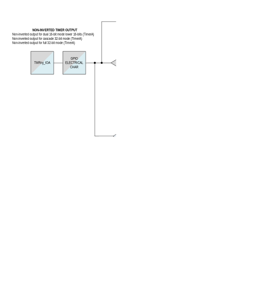
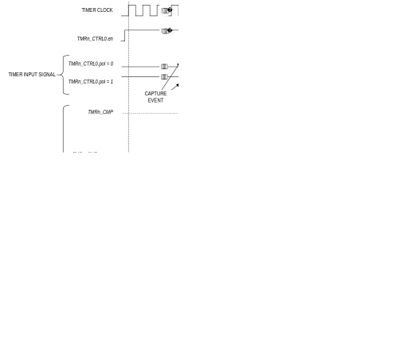

Multiple 32-bit and dual 16-bit, reloadable timers are provided.

The features include:

- Operation as a single 32-bit counter or single/dual 16-bit counter(s).
- Programmable clock prescaler with values from 1 to 4096
- Non-overlapping pulse width modulated (PWM) output generation with configurable off-time.
- Capture, compare, and capture/compare capability.
- Timer input and output signals available and mapped as alternate functions.

  - Refer to the device data sheet for alternate function details and availability

- Configurable input pin for event triggering, clock gating, or capture signal
- Timer output pin for event output and PWM signal generation.
- Multiple clock source options.

Instances denoted as LPTMR, shown in [Table 19‑1](#table19-1), are configurable to
operate in any of the low-power modes and wake the device from the
low-power modes to *ACTIVE*.

Each timer supports multiple operating modes:

- One-shot: The timer counts up to terminal value then halts.
- Continuous: The timer counts up to the terminal value then repeats.
- Counter: The timer counts input edges received on the timer input pin.
- PWM
- Capture: The timer captures a snapshot of the current timer count when the timer's input edge transitions.
- Compare: The timer pin toggles when the timer's count exceeds the terminal count.
- Gated: The timer increments only when the timer's input pin is asserted.
- Capture/Compare: The timer counts when the timer input pin is asserted; the timer captures the timer's count when the input pin is deasserted.

### Instances

Instances of the peripheral are listed in [Table 19‑1](#table19-1). Both the TMR and LPTMR are functionally similar, so for convenience, all timers are referenced as TMR. The LPTMR instances can function while the device is in certain low-power modes.

Refer to the device data sheet for frequency limitations for external clock sources, if available. Refer to the device data sheet for I/O signal configurations and alternate functions for each timer instance.

*Table 19-1: MAX78000 TMR/LPTMR Instances*

<table border="1" cellpadding="5" cellspacing="0">
<thead>
    <tr>
        <th>Instance</th>
        <th>Register Access Name</th>
        <th>Cascade 32‑Bit Mode</th>
        <th>16‑Bit Mode</th>
        <th>Operating Modes</th>
        <th>CLK0</th>
        <th>CLK1</th>
        <th>CLK2</th>
        <th>CLK3</th>
    </tr>
</thead>
<tbody>
    <tr>
        <td>TMR0</td>
        <td>TMR0</td>
        <td rowspan="4">Yes</td>
        <td rowspan="4">Dual</td>
        <td rowspan="4"><em>ACTIVE 
        SLEEP 
        LPM</em></td>
        <td rowspan="4">PCLK</td>
        <td rowspan="4">ISO</td>
        <td rowspan="4">IBRO</td>
        <td rowspan="4">ERTCO</td>
    </tr>
    <tr>
        <td>TMR1</td>
        <td>TMR1</td>
    </tr>
    <tr>
        <td>TMR2</td>
        <td>TMR2</td>
    </tr>
    <tr>
        <td>TMR3</td>
        <td>TMR3</td>
    </tr>
    <tr>
        <td rowspan="2">LPTMR0</td>
        <td rowspan="2">TMR4</td>
        <td rowspan="2">No</td>
        <td rowspan="2">Single</td>
        <td><em>ACTIVE 
        SLEEP 
        LPM</em></td>
        <td>IBRO</td>
        <td>ERTCO</td>
        <td>INRO</td>
        <td>
LPTMR0_CLK

        
P2.6 (AF1)
</td>
    </tr>
    <tr>
        <td><em>UPM</em></td>
        <td>N/A</td>
        <td>N/A</td>
        <td>ERTCO</td>
        <td>INRO</td>
    </tr>
    <tr>
        <td rowspan="2">LPTMR1</td>
        <td rowspan="2">TMR5</td>
        <td rowspan="2">No</td>
        <td rowspan="2">Single</td>
        <td><em>ACTIVE 
        SLEEP 
        LPM</em></td>
        <td>IBRO</td>
        <td><em>IBRO / 8</em></td>
        <td>INRO</td>
        <td>LPTMR1_CLK P2.7 (AF1)</td>
    </tr>
    <tr>
        <td><em>UPM</em></td>
        <td>N/A</td>
        <td>N/A</td>
        <td>ERTCO</td>
        <td>INRO</td>
    </tr>
</tbody>
</table>

*Table 19-2: MAX78000 TMR/LPTMR Instances Capture Events*

<table border="1" cellpadding="5" cellspacing="0">
<thead>
    <tr>
        <th>Instance</th>
        <th>Capture Event 0</th>
        <th>Capture Event 1</th>
        <th>Capture Event 2</th>
        <th>Capture Event 3</th>
    </tr>
</thead>
<tbody>
    <tr>
        <td>TMR0</td>
        <td>Timer Input Pin</td>
        <td>TMR0A_IOA</td>
        <td>TMR0B_IOA</td>
        <td>Software Event</td>
    </tr>
    <tr>
        <td>TMR1</td>
        <td>Timer Input Pin</td>
        <td>TMR1A_IOA</td>
        <td>TMR1B_IOA</td>
        <td>Software Event</td>
    </tr>
    <tr>
        <td>TMR2</td>
        <td>-</td>
        <td>-</td>
        <td>-</td>
        <td>-</td>
    </tr>
    <tr>
        <td>TMR3</td>
        <td>-</td>
        <td>-</td>
        <td>-</td>
        <td>-</td>
    </tr>
    <tr>
        <td>LPTMR0</td>
        <td>LPTMR0B_IOA</td>
        <td>LPCMP0 Interrupt</td>
        <td>LPCMP1 Interrupt</td>
        <td>-</td>
    </tr>
    <tr>
        <td>LPTMR1</td>
        <td>LPTMR1B_IOA</td>
        <td>LPCMP0 Interrupt</td>
        <td>LPCMP1 Interrupt</td>
        <td>-</td>
    </tr>
</tbody>
</table>

## Basic Timer Operation
The timer modes operate by incrementing the <a href="#table19-9">TMRn_CNT</a> register, driven
by either the timer clock, an external stimulus on the timer pin, or a
combination of both. The <a href="#table19-9">TMRn_CNT</a> register is always readable, even
while the timer is enabled and counting.

Each timer mode has a user-configurable timer period, which terminates
on the timer clock cycle following the end of the timer period
condition. Each timer mode has a different response at the end of a
timer period, which can include changing the state of the timer pin,
capturing a timer value, reloading <a href="#table19-9">TMRn_CNT</a> with a new starting value,
or disabling the counter. The end of a timer period always sets the
corresponding interrupt bit and can generate an interrupt if enabled.

In most modes, the timer peripheral automatically sets <a href="#table19-9">TMRn_CNT</a> to
0x0000 0001 at the end of a timer period, but <a href="#table19-9">TMRn_CNT</a> is set to
0x0000_0000 following a system reset. This means the first timer period
following a system reset is one timer clock longer than subsequent timer
periods if <a href="#table19-9">TMRn_CNT</a> is not initialized to 0x0000 0001 during the timer
configuration step.

## 32-Bit Single / 32-Bit Cascade / Dual 16-Bit
Most instances contain two 16-bit timers, which may support combinations
of single or cascaded 32-bit modes, and single or dual 16-bit modes, as
shown in [Table 19‑1](#table19-1). In most cases, the two 16-bit timers have the
same functionality.

The terminology TimerA and TimerB are used to differentiate the
organization of the 32-bit registers shown in [Table 19‑3](#table19-3). Most of the
other registers have the same fields duplicated in the upper and lower
16-bits and are differentiated with the _a and _b suffixes.

In the 32-bit modes, the fields and controls associated with TimerA
control the 32-bit timer functionality. In single 16-bit timer mode, the
TimerA fields control the single 16-bit timer, and the TimerB fields are
ignored. In dual 16-bit timer modes, both TimerA and TimerB fields
control the dual timers; TimerB fields control the upper 16-bit timer,
and TimerA fields control the lower 16-bit timer. In dual-16 bit timer
modes, TimerB can be used as a single 16-bit timer.

*Table 19-3: TimerA/TimerB 32-Bit Field Allocations*

<table border="1" cellpadding="5" cellspacing="0">
<thead>
    <tr>
        <th>Register</th>
        <th>Cascade 32-Bit Mode</th>
        <th colspan="2">Dual 16-Bit Mode</th>
        <th>Single 16-Bit Mode</th>
    </tr>
</thead>
<tbody>
    <tr>
        <td>Timer Counter</td>
        <td>TimerA Count = <em><a href="#table19-9">TMRn_CNT</a>[31:0]</em></td>
        <td>TimerA Compare = <em><a href="#table19-9">TMRn_CNT</a>[15:0]</em></td>
        <td>TimerB Count = <em><a href="#table19-9">TMRn_CNT</a>[31:16]</em></td>
        <td>TimerA Compare = <em><a href="#table19-9">TMRn_CNT</a>[15:0]</em></td>
    </tr>
    <tr>
        <td>Timer Compare</td>
        <td>TimerA Compare = <em><a href="#table19-10">TMRn_CMP</a>[31:0]</em></td>
        <td>TimerA Compare = <em><a href="#table19-10">TMRn_CMP</a>[15:0]</em></td>
        <td>TimerB Compare = <em><a href="#table19-10">TMRn_CMP</a>[31:16]</em></td>
        <td>TimerA Compare = <em><a href="#table19-10">TMRn_CMP</a>[15:0]</em></td>
    </tr>
    <tr>
        <td>Timer PWM</td>
        <td>TimerA Count = <em><a href="#table19-11">TMRn_PWM</a>.pwm[31:0]</em></td>
        <td>TimerA Count = <em><a href="#table19-11">TMRn_PWM</a>.pwm[15:0]</em></td>
        <td>TimerB Count = <em><a href="#table19-11">TMRn_PWM</a>.pwm[31:16]</em></td>
        <td>TimerA Count = <em><a href="#table19-11">TMRn_PWM</a>.pwm[15:0]</em></td>
    </tr>
</tbody>
</table>

## Timer Clock Sources
Clocking of timer functions is driven by the timer clock frequency,
*fCNT_CLK*, a function of the selected clock source shown in
[Table 19‑1](#table19-1). Most modes support multiple clock sources and prescaler
values, which can be chosen independently for TimerA and TimerB when the
peripheral is operating in dual 16-bit mode. The prescaler can be set
from 1 to 4096 using the <a href="#table19-13">TMRn_CTRL0</a>.*clkdiv* field.

*Equation 19-1: Timer Peripheral Clock Equation*

$$f_{\text{CNT_CLK}} = \frac{f_{\text{CLK_SOURCE}}}{\text{prescaler}}$$

The software configures and controls the timer by reading and writing to
the timer registers. External events on timer pins are asynchronous
events to the timer's clock frequency. The external events are latched
on the next rising edge of the timer's clock. Since it is not possible
to externally synchronize to the timer's internal clock, input events
may require up to 50% of the timer's internal clock before the hardware
recognizes the event.

The software must configure the timer's clock source by performing the following steps:

1.  Disable the timer peripheral:

    a. Clear <a href="#table19-13">TMRn_CTRL0</a>.*en* to 0 to disable the timer.

    b. Read the <a href="#table19-15">TMRn_CTRL1</a>.*clken* field until it returns 0, confirming the timer peripheral is disabled.

2.  Set <a href="#table19-15">TMRn_CTRL1</a>.*clksel* to the new desired clock source.

    a. Note: In cascade 32-bit mode the <a href="#table19-15">TMRn_CTRL1</a>.*clksel_b* field must be set to the value selected for the <a href="#table19-15">TMRn_CTRL1</a>.*clksel*\_a field.

3.  Configure the timer for the desired operating mode. See *Operating Modes* for details on mode configuration.

4.  Enable the timer clock source:

    a. Set the <a href="#table19-13">TMRn_CTRL0</a>.*clken* field to 1 to enable the timer's clock source.

    b. Read the <a href="#table19-15">TMRn_CTRL1</a>.*clkrdy* field until it returns 1, confirming the timer clock source is enabled.

5.  Enable the timer:

    a. Set <a href="#table19-13">TMRn_CTRL0</a>.*en* to 1 to enable the timer.

    b. Read the <a href="#table19-13">TMRn_CTRL0</a>.*clken* field until it returns 1 to confirm the timer is enabled.

The timer peripheral should be disabled while changing any of the registers in the peripheral.

## Timer Pin Functionality
Each timer instance may have an input signal, an output signal, or both
depending on the operating mode. Not all instances of the peripheral are
available in all packages. The number of input and output signals per
peripheral instance may vary as well. Refer to the data sheet for I/O
signal configurations and alternate functions for each timer instance.

The physical pin location of the timer input and output signals may vary
between packages. However, the timer functionality is always expressed
on the same GPIO pin in the same alternate function mode.

The timer pin functionality is mapped as an alternate function that is
shared with a GPIO. When the timer pin alternate function is enabled,
the timer pin has the same electrical characteristics as the GPIO mode
settings for the pin. The pin characteristics must be configured before
enabling the timer. When configured as an output, the corresponding bit
in the GPIO_OUT register should be configured to match the inactive
state of the timer pin for that mode. Consult the GPIO section for
details on how to configure the electrical characteristics for the pin.

The TimerA output controls for modes 0, 1, 3, and 5 output signals are
shown in *Figure 19‑1*. The TimerA input controls for modes 2, 4, 6, 7,
8, and 14 input signals are shown in *Figure 19‑2*.

*Figure 19-1: MAX78000 TimerA Output Functionality, Modes 0/1/3/5*

*Figure 19-2: MAX78000 TimerA Input Functionality, Modes 2/4/6/7/8/14*

## Wake-Up Events
In low-power modes, the system clock may be turned off to conserve
power. LPTMR instances can continue to run from the clock sources shown
in [Table 19‑1](#table19-1). In this case, a wake-up event can be configured to wake
up the clock control logic and re-enable the system clock.

Programming Sequence Example:

1.  Disable the timer peripheral and set the timer clock source as described in *Timer Clock Sources*.
2.  Configure the timer operating mode as described in the section *Operating Modes*.
3.  Enable the timer by setting <a href="#table19-13">TMRn_CTRL0</a>.*en* to 1.
4.  Poll <a href="#table19-15">TMRn_CTRL1</a>.*clkrdy* until it reads 1.
5. Set the <a href="#table19-15">TMRn_CTRL1</a>.*we* field to 1 to enable wake-up events for the timer.
6. If desired, enable the timer interrupt and provide a TMRn_IRQn for the timer.
7. Enter a low-power mode as described in the *Operating Modes* section.
8. When the device wakes up from the low-power mode, check the <a href="#table19-16">TMRn_WKFL</a> register to determine if the timer caused the wake-up event.

*Table 19-4: MAX78000 Wake-Up Events*

<table border="1" cellpadding="5" cellspacing="0">
<thead>
    <tr>
        <th>Condition</th>
        <th>Peripheral Wake-Up Flag <a href="#table19-12">TMRn_INTFL</a></th>
        <th>Peripheral Wake-Up Enable</th>
        <th>Low-Power Peripheral Wake-Up Flag</th>
        <th>Low-Power Peripheral Wake-Up Enable</th>
        <th>Power Management Wake-Up Enable</th>
    </tr>
</thead>
<tbody>
    <tr>
        <td>Any event for LPTMR0</td>
        <td><em>irq_a</em></td>
        <td>N/A</td>
        <td>PWRSEQ_LPPWST.<em>lptmr0</em></td>
        <td>PWRSEQ_.<em>lptmr0</em></td>
        <td>N/A</td>
    </tr>
    <tr>
        <td>Any event for LPTMR1</td>
        <td><em>irq_a</em></td>
        <td>N/A</td>
        <td>PWRSEQ_LPPWST.<em>lptmr1</em></td>
        <td>PWRSEQ_.<em>lptmr1</em></td>
        <td>N/A</td>
    </tr>
</tbody>
</table>

## Operating Modes
Multiple operating modes are supported. Some operating modes'
availability depends on the device and package-specific implementation
of the external input and output signals. Refer to the data sheet for
I/O signal configurations and alternate functions for each Timer
instance.

*Figure 19-3: Timer I/O Signal Naming Conventions*

In [Table 19‑5](#table19-5), [Table 19‑6](#table19-6), and [Table 19‑7](#table19-7), the timer's signal name is generically shown where *n* is the timer number (0, 1, 2, 3, etc.) and *y* is the port mapping alternate function. See [Figure 19‑3](#figure19-3) for details of the timer's naming convention for I/O signals.

*Table 19-5: MAX78000 Operating Mode Signals for Timer 0 and Timer 1*

<table border="1" cellpadding="5" cellspacing="0">
<thead>
    <tr>
        <th>Timer Mode</th>
        <th>TMR0/TMR1 
        TMRn_CTRL1.<em>outen</em> = 0 
        TMRn_CTRL1.<em>outben</em> = 0</th>
        <th>I/O Signal Name<em>✝</em></th>
        <th>Pin Required</th>
    </tr>
</thead>
<tbody>
    <tr>
        <td rowspan="4"><a href="#one-shot-mode-0">One-Shot Mode (0)</a></td>
        <td>TimerA Output Signal</td>
        <td>TMR<em>ny</em>_IOA</td>
        <td>Optional</td>
    </tr>
    <tr>
        <td>TimerA Complementary Output Signal</td>
        <td>TMR<em>ny</em>_IOAN</td>
        <td>Optional</td>
    </tr>
    <tr>
        <td>TimerB Output Signal</td>
        <td>TMR<em>ny</em>_IOB</td>
        <td>Optional</td>
    </tr>
    <tr>
        <td>TimerB Complementary Output Signal</td>
        <td>TMR<em>ny</em>_IOBN</td>
        <td>Optional</td>
    </tr>
    <tr>
        <td rowspan="4"><a href="#continuous-mode-1">Continuous Mode (1)</a></td>
        <td>TimerA Output Signal</td>
        <td>TMR<em>ny</em>_IOA</td>
        <td>Optional</td>
    </tr>
    <tr>
        <td>TimerA Complementary Output Signal</td>
        <td>TMR<em>ny</em>_IOAN</td>
        <td>Optional</td>
    </tr>
    <tr>
        <td>TimerB Output Signal</td>
        <td>TMR<em>ny</em>_IOB</td>
        <td>Optional</td>
    </tr>
    <tr>
        <td>TimerB Complementary Output Signal</td>
        <td>TMR<em>ny</em>_IOBN</td>
        <td>Optional</td>
    </tr>
    <tr>
        <td rowspan="2"><a href="#counter-mode-2">Counter Mode (2)</a></td>
        <td>TimerA Input Signal</td>
        <td>TMR<em>ny</em>_IOA</td>
        <td>Yes</td>
    </tr>
    <tr>
        <td>TimerB Input Signal</td>
        <td>TMR<em>ny</em>_IOB</td>
        <td>Yes</td>
    </tr>
    <tr>
        <td rowspan="2">
<a href="#figure19-7">Figure 19‑7</a>:<a href="#pwm-mode-3">PWM Mode Diagram</a>

        

        
<a href="#capture-mode-4">Capture Mode (4)</a>
</td>
        <td>TimerA Input Signal</td>
        <td>TMR<em>ny</em>_IOA</td>
        <td>Yes</td>
    </tr>
    <tr>
        <td>TimerB Input Signal</td>
        <td>TMR<em>ny</em>_IOB</td>
        <td>Yes</td>
    </tr>
    <tr>
        <td rowspan="4"><a href="#compare-mode-5">Compare Mode (5)</a></td>
        <td>TimerA Output Signal</td>
        <td>TMR<em>ny</em>_IOA</td>
        <td>Optional</td>
    </tr>
    <tr>
        <td>TimerA Complementary Output Signal</td>
        <td>TMR<em>ny</em>_IOAN</td>
        <td>Optional</td>
    </tr>
    <tr>
        <td>TimerB Output Signal</td>
        <td>TMR<em>ny</em>_IOB</td>
        <td>Optional</td>
    </tr>
    <tr>
        <td>TimerB Complementary Output Signal</td>
        <td>TMR<em>ny</em>_IOBN</td>
        <td>Optional</td>
    </tr>
    <tr>
        <td rowspan="2"><a href="#gated-mode-6">Gated Mode (6)</a></td>
        <td>TimerA Input Signal</td>
        <td>TMR<em>ny</em>_IOA</td>
        <td>Yes</td>
    </tr>
    <tr>
        <td>TimerB Input Signal</td>
        <td>TMR<em>ny</em>_IOB</td>
        <td>Yes</td>
    </tr>
    <tr>
        <td rowspan="2"><a href="#capturecompare-mode-7">Capture/Compare Mode (7)</a></td>
        <td>TimerA Input Signal</td>
        <td>TMR<em>ny</em>_IOA</td>
        <td>Yes</td>
    </tr>
    <tr>
        <td>TimerB Input Signal</td>
        <td>TMR<em>ny</em>_IOB</td>
        <td>Yes</td>
    </tr>
    <tr>
        <td rowspan="2"><a href="#dual-edge-capture-mode-8">Dual Edge Capture Mode (8)</a></td>
        <td>TimerA Input Signal</td>
        <td>TMR<em>ny</em>_IOA</td>
        <td>Yes</td>
    </tr>
    <tr>
        <td>TimerB Input Signal</td>
        <td>TMR<em>ny</em>_IOB</td>
        <td>Yes</td>
    </tr>
    <tr>
        <td>Reserved (9 - 13)</td>
        <td>-</td>
        <td>-</td>
        <td>-</td>
    </tr>
    <tr>
        <td rowspan="2"><a href="#inactive-gated-mode-14">Inactive Gated Mode (14)</a></td>
        <td>TimerA Input Signal</td>
        <td>TMR<em>ny</em>_IOA</td>
        <td>Yes</td>
    </tr>
    <tr>
        <td>TimerB Input Signal</td>
        <td>TMR<em>ny</em>_IOB</td>
        <td>Yes</td>
    </tr>
    <tr>
        <td>Reserved (15)</td>
        <td>-</td>
        <td>-</td>
        <td>-</td>
    </tr>
    <tr>
        <td>✝ See <a href="#figure19-3">Figure 19‑3</a> for details on the
        timer I/O signal naming convention and the device data sheet for the
        alternate functions.</td>
    </tr>
</tbody>
</table>

*Table 19-6: MAX78000 Operating Mode Signals for Timer 2 and Timer 3*

<table border="1" cellpadding="5" cellspacing="0">
<thead>
    <tr>
        <th>Timer Mode</th>
        <th>TMR2/TMR3 
        <a href="#table19-15">TMRn_CTRL1</a>.<em>outen_a</em> = 0 
        <a href="#table19-15">TMRn_CTRL1</a>.<em>outben_a</em> = 0</th>
        <th>I/O Signal Name<em>✝</em></th>
        <th>Required?</th>
    </tr>
</thead>
<tbody>
    <tr>
        <td rowspan="2"><a href="#one-shot-mode-0">One-Shot Mode (0)</a></td>
        <td>TimerA Output Signal</td>
        <td>TMR<em>ny</em>_IOA</td>
        <td>Optional</td>
    </tr>
    <tr>
        <td>TimerB Output Signal</td>
        <td>TMR<em>ny</em>_IOB</td>
        <td>Optional</td>
    </tr>
    <tr>
        <td rowspan="2"><a href="#continuous-mode-1">Continuous Mode (1)</a></td>
        <td>TimerA Output Signal</td>
        <td>TMR<em>ny</em>_IOA</td>
        <td>Optional</td>
    </tr>
    <tr>
        <td>TimerB Output Signal</td>
        <td>TMR<em>ny</em>_IOB</td>
        <td>Optional</td>
    </tr>
    <tr>
        <td rowspan="2"><a href="#counter-mode-2">Counter Mode (2)</a></td>
        <td>TimerA Input Signal</td>
        <td>TMR<em>ny</em>_IOA</td>
        <td>Yes</td>
    </tr>
    <tr>
        <td>TimerB Input Signal</td>
        <td>TMR<em>ny</em>_IOB</td>
        <td>Yes</td>
    </tr>
    <tr>
        <td rowspan="2">
<a href="#figure19-7">Figure 19‑7</a>:<a href="#pwm-mode-3">PWM Mode Diagram</a>

        

        
<a href="#capture-mode-4">Capture Mode (4)</a>
</td>
        <td>TimerA Input Signal</td>
        <td>TMR<em>ny</em>_IOA</td>
        <td>Yes</td>
    </tr>
    <tr>
        <td>TimerB Input Signal</td>
        <td>TMR<em>ny</em>_IOB</td>
        <td>Yes</td>
    </tr>
    <tr>
        <td rowspan="2"><a href="#compare-mode-5">Compare Mode (5)</a></td>
        <td>TimerA Output Signal</td>
        <td>TMR<em>ny</em>_IOA</td>
        <td>Optional</td>
    </tr>
    <tr>
        <td>TimerB Output Signal</td>
        <td>TMR<em>ny</em>_IOB</td>
        <td>Optional</td>
    </tr>
    <tr>
        <td rowspan="2"><a href="#gated-mode-6">Gated Mode (6)</a></td>
        <td>TimerA Input Signal</td>
        <td>TMR<em>ny</em>_IOA</td>
        <td>Yes</td>
    </tr>
    <tr>
        <td>TimerB Input Signal</td>
        <td>TMR<em>ny</em>_IOB</td>
        <td>Yes</td>
    </tr>
    <tr>
        <td rowspan="2"><a href="#capturecompare-mode-7">Capture/Compare Mode (7)</a></td>
        <td>TimerA Input Signal</td>
        <td>TMR<em>ny</em>_IOA</td>
        <td>Yes</td>
    </tr>
    <tr>
        <td>TimerB Input Signal</td>
        <td>TMR<em>ny</em>_IOB</td>
        <td>Yes</td>
    </tr>
    <tr>
        <td rowspan="2"><a href="#dual-edge-capture-mode-8">Dual Edge Capture Mode (8)</a></td>
        <td>TimerA Input Signal</td>
        <td>TMR<em>ny</em>_IOA</td>
        <td>Yes</td>
    </tr>
    <tr>
        <td>TimerB Input Signal</td>
        <td>TMR<em>ny</em>_IOB</td>
        <td>Yes</td>
    </tr>
    <tr>
        <td>Reserved (0 - 13)</td>
        <td>-</td>
        <td>-</td>
        <td>-</td>
    </tr>
    <tr>
        <td rowspan="2"><a href="#inactive-gated-mode-14">Inactive Gated Mode (14)</a></td>
        <td>TimerA Input Signal</td>
        <td>TMR<em>ny</em>_IOA</td>
        <td>Yes</td>
    </tr>
    <tr>
        <td>TimerB Input Signal</td>
        <td>TMR<em>ny</em>_IOB</td>
        <td>Yes</td>
    </tr>
    <tr>
        <td>Reserved (15)</td>
        <td>-</td>
        <td>-</td>
        <td>-</td>
    </tr>
    <tr>
        <td>✝ See <em>Figure 19‑3</em> for details on the
        timer I/O signal naming convention and the device data sheet for the
        alternate functions.</td>
    </tr>
</tbody>
</table>

*Table 19-7: MAX78000 Operating Mode Signals for Low-Power Timer 0 and Low-Power Timer 1*

<table border="1" cellpadding="5" cellspacing="0">
<thead>
    <tr>
        <th>Timer mode</th>
        <th>TMR4/TMR5 
        <a href="#table19-15">TMRn_CTRL1</a>.<em>outen</em> = 0 
        <a href="#table19-15">TMRn_CTRL1</a>.<em>outben</em> = 0</th>
        <th>I/O Signal Name<em>✝</em></th>
        <th>Required?</th>
    </tr>
</thead>
<tbody>
    <tr>
        <td><em>One-Shot Mode (0)</em></td>
        <td>TimerA Output Signal</td>
        <td>LPTMR<em>ny</em>_IOB</td>
        <td>Optional</td>
    </tr>
    <tr>
        <td><em>Continuous Mode (1)</em></td>
        <td>TimerA Output Signal</td>
        <td>LPTMR<em>ny</em>_IOB</td>
        <td>Optional</td>
    </tr>
    <tr>
        <td><em>Counter Mode (2)</em></td>
        <td>TimerA Input Signal</td>
        <td>LPTMR<em>ny</em>_IOB</td>
        <td>Yes</td>
    </tr>
    <tr>
        <td>
<em>Figure 19‑7: PWM</em> Mode Diagram

        

        
Capture Mode (4)
</td>
        <td>TimerA Input Signal</td>
        <td>LPTMR<em>ny</em>_IOB</td>
        <td>Yes</td>
    </tr>
    <tr>
        <td><em>Compare Mode (5)</em></td>
        <td>TimerA Output Signal</td>
        <td>LPTMR<em>ny</em>_IOB</td>
        <td>Optional</td>
    </tr>
    <tr>
        <td><em>Gated Mode (6)</em></td>
        <td>TimerA Input Signal</td>
        <td>LPTMR<em>ny</em>_IOB</td>
        <td>Yes</td>
    </tr>
    <tr>
        <td><em>Capture/Compare Mode (7)</em></td>
        <td>TimerA Input Signal</td>
        <td>LPTMR<em>ny</em>_IOB</td>
        <td>Yes</td>
    </tr>
    <tr>
        <td><em>Dual Edge Capture Mode (8)</em></td>
        <td>TimerA Input Signal</td>
        <td>LPTMR<em>ny</em>_IOB</td>
        <td>Yes</td>
    </tr>
    <tr>
        <td>Reserved (9 - 13)</td>
        <td>-</td>
        <td>-</td>
        <td>-</td>
    </tr>
    <tr>
        <td><em>Inactive Gated Mode (14)</em></td>
        <td>TimerA Input Signal</td>
        <td>LPTMR<em>ny</em>_IOB</td>
        <td>Yes</td>
    </tr>
    <tr>
        <td>Reserved (15)</td>
        <td>-</td>
        <td>-</td>
        <td>-</td>
    </tr>
    <tr>
        <td>✝ See <em>Figure 19‑3</em> for details on the
        timer I/O signal naming convention and the device data sheet for the
        alternate functions.</td>
    </tr>
</tbody>
</table>

### One-Shot Mode (0)
In one-shot mode, the timer peripheral increments the timer's <a href="#table19-9">TMRn_CNT</a>
field until it reaches the timer's <a href="#table19-10">TMRn_CMP</a> field, and the timer is
then disabled. If the timer's output is enabled, the output signal is
driven active for one timer clock cycle. One-shot mode provides exactly
one timer period and is automatically disabled.

The timer period ends on the timer clock following
<a href="#table19-9">TMRn_CNT</a> = <a href="#table19-10">TMRn_CMP</a>. The timer peripheral hardware automatically performs the following actions at the end of the timer period:

- The <a href="#table19-9">TMRn_CNT</a> field is set to 0x0000 0001,

- The timer is disabled (<a href="#table19-13">TMRn_CTRL0</a>.*en* = 0),

- The timer output, if enabled, is driven to its active state for one timer clock period,

- The <a href="#table19-12">TMRn_INTFL</a>.*irq* field is set to 1 to indicate a timer interrupt event occurred.

The timer period is calculated using [Equation 19‑2](#equation19-2).

*Equation 19-2: One-shot Mode Timer Period*

$$
\text{One-shot mode timer period in seconds} = 
\frac{\text{TMR}n\text{CMP} - \text{TMR}n\text{CNT}_{\text{INITIAL VALUE}} + 1}{f_{\text{CNT_CLK}}(\text{Hz})}
$$

*Figure 19-4: One-Shot Mode Diagram*

Configure the timer for one-shot mode by performing the following steps:

1. Disable the timer peripheral and set the timer clock source as described in *Timer Clock Sources*.
2. Set the <a href="#table19-13">TMRn_CTRL0</a>.*mode* field to 0 to select one-shot mode.
3. Set the <a href="#table19-13">TMRn_CTRL0</a>.*clkdiv* field to set the prescaler for the required timer frequency.
4. If using the timer output function:

    a. Set <a href="#table19-13">TMRn_CTRL0</a>.*pol* to match the desired inactive state.

    b. Configure the GPIO electrical characteristics as desired.

    c. Select the correct alternate function mode for the timer output pin.

5. Or, if using the inverted timer output function:

    a. Set <a href="#table19-13">TMRn_CTRL0</a>.*pol* to match the desired inactive state.

    b. Configure the GPIO electrical characteristics as desired.

    c. Select the correct alternate function mode for the inverted timer output pin.

6. If using the timer interrupt, enable the corresponding field in the <a href="#table19-15">TMRn_CTRL1</a> register.
7. Write the compare value to the <a href="#table19-10">TMRn_CMP</a> field.
8. If desired, write an initial value to the <a href="#table19-9">TMRn_CNT</a> field.

    a. This affects only the first period; subsequent timer periods always reset the <a href="#table19-9">TMRn_CNT</a> field to 0x0000 0001.

9. Enable the timer peripheral as described in *Timer Clock Sources*.

### Continuous Mode (1)
In continuous mode, the <a href="#table19-9">TMRn_CNT</a> field increments until it matches the
<a href="#table19-10">TMRn_CMP</a> field; the <a href="#table19-9">TMRn_CNT</a> field is then set to 0x0000 0001, and the count continues to increment. Optionally, application software can configure continuous mode to toggle the timer output pin at the end of each timer period. A continuous mode timer period ends when the timer count field reaches the timer compare field (<a href="#table19-9">TMRn_CNT</a> = <a href="#table19-10">TMRn_CMP</a>).

The timer peripheral hardware automatically performs the following
actions on the timer clock cycle after the period ends:

- The <a href="#table19-9">TMRn_CNT</a> field is set to 0x0000 0001,

- if the timer output signal is toggled,

- the corresponding <a href="#table19-12">TMRn_INTFL</a>.*irq* field is set to 1 to indicate a
  timer interrupt event occurred.

The continuous mode timer period is calculated using [Equation 19‑3: Continuous Mode Timer Period](#figure19-3).

*Equation 19-3: Continuous Mode Timer Period*

$$
\text{Continuous mode timer period(s)} = 
\frac{\text{TMR}_n\text{CMP} - \text{TMR}_n\text{CNT}_{\text{INITIAL VALUE}} + 1}{f_{\text{CNT\_CLK}}(\text{Hz})}
$$

*Figure 19-5: Continuous Mode Diagram*

Configure the timer for continuous mode by performing the following steps:

1. Disable the timer peripheral and set the timer clock as described in *Timer Clock Sources*.
2. Set the <a href="#table19-13">TMRn_CTRL0</a>.*mode* field to 1 to select continuous mode.
3. Set the <a href="#table19-13">TMRn_CTRL0</a>.*clkdiv* field to set the prescaler that determines the timer frequency.
4. If using the timer output function:

    a. Set <a href="#table19-13">TMRn_CTRL0</a>.*pol* to match the desired (inactive) state.

    b. Configure the GPIO electrical characteristics as desired.

    c. Select the correct alternate function mode for the timer output pin.

5. Or, if using the inverted timer output function:

    a. Set <a href="#table19-13">TMRn_CTRL0</a>.*pol* to match the desired (inactive) state.

    b. Configure the GPIO electrical characteristics as desired.

    c. Select the correct alternate function mode for the inverted timer output pin.

6. If using the timer interrupt, enable the corresponding field in the <a href="#table19-15">TMRn_CTRL1</a> register.
7. Write the compare value to the <a href="#table19-10">TMRn_CMP</a> field.
8. If desired, write an initial value to the <a href="#table19-9">TMRn_CNT</a> field.

    a. This affects only the first period; subsequent timer periods always reset the <a href="#table19-9">TMRn_CNT</a> field to 0x0000 0001.

9. Enable the timer peripheral as described in *Timer Clock Sources*.

### Counter Mode (2)
In counter mode, the timer peripheral increments the <a href="#table19-9">TMRn_CNT</a> each time a transition occurs on the timer input signal. The transition must be greater than 4 × *PCLK* for a count to occur. When the <a href="#table19-9">TMRn_CNT</a>  reaches the <a href="#table19-10">TMRn_CMP</a> field, the hardware automatically sets the interrupt bit to 1 (<a href="#table19-12">TMRn_INTFL</a>.*irq)*, sets the <a href="#table19-9">TMRn_CNT</a> field to 0x0000 0001, and continues incrementing.
The timer can be configured to increment on either the timer's input signal's rising edge or falling edge, but not both. Use the <a href="#table19-13">TMRn_CTRL0</a>.*pol\_* field to select which edge is used for the timer's input signal count.

The timer prescaler setting has no effect in this mode. The timer's input signal (*fCTR_CLK*) frequency must not exceed 25 percent of the PCLK frequency, as shown in *Equation 19‑4*.

*Note: If the input signal's frequency is equal to fPCLK, it is possible that the timer hardware can miss the transition due to PCLK being an asynchronous internal clock. A minimum of 4 PCLK cycles is required for a count to occur. The timer input signal should be greater than 4 PCLK cycles to guarantee a count occurs.*

*Equation 19-4: Counter Mode Maximum Clock Frequency*

$$
f_{\text{CTR_CLK}} \leq \frac{f_{\text{PCLK}}(\text{Hz})}{4}
$$

The timer period ends on the rising edge of PCLK following <a href="#table19-9">TMRn_CNT</a> = <a href="#table19-10">TMRn_CMP</a>

The timer peripheral's hardware automatically performs the following actions at the end of the timer period:

- The <a href="#table19-9">TMRn_CNT</a> field is set to 0x0000 0001,

- the timer output signal is toggled if the timer output pin is enabled,

- the <a href="#table19-12">TMRn_INTFL</a>.*irq* field to 1 indicating a timer interrupt event occurred,

- the timer remains enabled and continues incrementing.

*Note: The software must clear the interrupt flag by writing 1 to the <a href="#table19-12">TMRn_INTFL</a>.irq field. If the timer period ends and the interrupt flag is already set to 1, a second interrupt does not occur.*

In counter mode, the number of timer input transitions that occurred
during a period is equal to the <a href="#table19-10">TMRn_CMP</a> field's setting. Use [Equation 19‑5](#equation19-5) to determine the number of transitions that occurred before the end of the timer's period.

*Note: [Equation 19‑5](#equation19-5) is only valid during an active timer count before the end of the timer's period.*

*Equation 19-5: Counter Mode Timer Input Transitions*

*Counter mode timer input transitions* = *TMR\_CNT**CURRENT\_VALUE*

*Figure 19-6: Counter Mode Diagram*

Configure the timer for counter mode by performing the following:

1. Disable the timer peripheral as described in *Timer Clock Sources*.
2. If desired, change the timer clock source as described in *Timer Clock Sources*.
3. Set <a href="#table19-13">TMRn_CTRL0</a>.*mode* 0x2 to select Counter mode.
4. Configure the timer input function:

    a. Set <a href="#table19-13">TMRn_CTRL0</a>.*pol* to match the desired (inactive) state.

    b. Configure the GPIO electrical characteristics as desired.

    c. Set <a href="#table19-15">TMRn_CTRL1</a>.*outen_a* and <a href="#table19-15">TMRn_CTRL1</a>.*outben* to the values shown in the *Operating Modes* section.

    d. Select the correct alternate function mode for the timer input pin.

5. Write the compare value to <a href="#table19-10">TMRn_CMP</a>.
6. If desired, write an initial value to <a href="#table19-9">TMRn_CNT</a>. This affects only the first period; subsequent timer periods always reset <a href="#table19-9">TMRn_CNT</a> = 0x0000 0001.
7. Enable the timer peripheral as described in *Timer Clock Sources*.

### PWM Mode (3)
In PWM mode, the timer sends a PWM output using the timer's output
signal. The timer first counts up to the match value stored in the
<a href="#table19-11">TMRn_PWM</a>.*pwm* register. At the end of the cycle, where the <a href="#table19-9">TMRn_CNT</a> value matches the <a href="#table19-11">TMRn_PWM</a>.*pwm*, the timer output signal toggles state. The timer continues counting until it reaches the <a href="#table19-10">TMRn_CMP</a> value.

The timer period ends on the rising edge of *fCNT_CLK*
following <a href="#table19-9">TMRn_CNT</a> = <a href="#table19-10">TMRn_CMP</a>.

The timer peripheral automatically performs the following actions at the
end of the timer period:

- The <a href="#table19-9">TMRn_CNT</a> is reset to 0x0000 0001, and the timer resumes counting.

- The timer output signal is toggled.

- The corresponding <a href="#table19-12">TMRn_INTFL</a>.*irq* field is set to 1 to indicate a timer interrupt event occurred.

When <a href="#table19-13">TMRn_CTRL0</a>.*pol* = 0, the timer output signal starts low and then
transitions to high when the <a href="#table19-9">TMRn_CNT</a> value matches the *TMRn_PWM*
value. The timer output signal remains high until the <a href="#table19-9">TMRn_CNT</a> value
reaches the <a href="#table19-10">TMRn_CMP</a>, resulting in the timer output signal
transitioning low and the <a href="#table19-9">TMRn_CNT</a> value resetting to 0x0000 0001.

When <a href="#table19-13">TMRn_CTRL0</a>.*pol* = 1, the timer output signal starts high and
transitions low when the <a href="#table19-9">TMRn_CNT</a> value matches the *TMRn_PWM* value.
The timer output signal remains low until the <a href="#table19-9">TMRn_CNT</a> value reaches
<a href="#table19-10">TMRn_CMP</a>, resulting in the timer output signal transitioning high and
the <a href="#table19-9">TMRn_CNT</a> value resetting to 0x0000 0001.

Complete the following steps to configure a timer for PWM mode and initiate the PWM operation:

1. Disable the timer peripheral as described in *Timer Clock Sources*.
2. If desired, change the timer clock source as described in *Timer Clock Sources*.
3. Set the <a href="#table19-13">TMRn_CTRL0</a>.*mode field* to 3 to select PWM mode.
4. Set the <a href="#table19-13">TMRn_CTRL0</a>.*clkdiv* field to set the prescaler that determines the timer frequency.
5. Configure the pin as a timer input and configure the electrical characteristics as needed.
6. Set <a href="#table19-13">TMRn_CTRL0</a>.*pol* to match the desired initial (inactive) state.
7. Set <a href="#table19-13">TMRn_CTRL0</a>.*pol* to select the initial logic level (high or low) and PWM transition state for the timer's output.
8. Set <a href="#table19-9">TMRn_CNT</a> initial value if desired.

    a. The initial <a href="#table19-9">TMRn_CNT</a> value only affects the initial period in PWM mode, with subsequent periods always setting <a href="#table19-9">TMRn_CNT</a> to 0x0000 0001.

9. Set the *TMRn_PWM* value to the transition period count.
10. Set the <a href="#table19-10">TMRn_CMP</a> value for the PWM second transition period. Note: <a href="#table19-10">TMRn_CMP</a> must be greater than the *TMRn_PWM* value.
11. If using the timer interrupt, set the interrupt priority and enable the interrupt.
12. Enable the timer peripheral as described in *Timer Clock Sources*.

[Equation 19‑6](#equation19-6) shows the formula for calculating the timer PWM period.

*Equation 19-6: Timer PWM Period*

$$
PWM\\ period\\ (s) = \frac{TMRn\text{_CNT}}{f_{CNT\text{_CLK}}\\ (Hz)}\\ 
$$

If an initial starting value other than 0x0000 0001 is loaded into the
<a href="#table19-9">TMRn_CNT</a> register, use the one-shot mode equation, *Equation 19‑2*, to
determine the initial PWM period.

If <a href="#table19-13">TMRn_CTRL0</a>.*pol* is 0, the ratio of the PWM output high time to the
total period is calculated using [Equation 19‑7](#equation19-7).

*Equation 19-7: Timer PWM Output High Time Ratio with Polarity 0*

$$
\text{PWM output high time ratio (%)} = \frac{\left( TMR\text{_CMP}\\ –\\ TMR\text{_PWM}
\right)}{TMR\text{_CMP}}\\ \times \\ 100
$$

If <a href="#table19-13">TMRn_CTRL0</a>.*pol* is set to 1, the ratio of the PWM output high time
to the total period is calculated using *Equation 19‑8*.

*Equation 19-8: Timer PWM Output High Time Ratio with Polarity 1*

$$
\text{PWM output high time ratio (%)} = \frac{TMR\text{_PWM}}{TMR\text{_CMP}}\\ \times \\ 100
$$

*Figure 19-7: PWM Mode Diagram*

### Capture Mode (4)
Capture mode is used to measure the time between software-determined
events. The timer starts incrementing the timer's count field until a
transition occurs on the timer's input pin or a rollover event occurs. A
capture event is triggered by the hardware when the timer's input pin
transitions state. [Equation 19‑9](#equation19-9) shows the formula for calculating the
capture event's elapsed time.

If a capture event does not occur before the timer's count value
reaching the timer's compare value (<a href="#table19-9">TMRn_CNT</a> = <a href="#table19-10">TMRn_CMP</a>), a rollover event occurs. The capture event and the rollover event set the timer's interrupt flag (<a href="#table19-12">TMRn_INTFL</a>.*irq* = 1) resulting in an interrupt if the timer's interrupt is enabled.

A capture event can occur before or after a rollover event. The software
must track the number of rollover events that occur before a capture
event to determine the elapsed time of the capture event. When a capture
event occurs, the software should reset the count of rollover events.

*Note: A capture event does not stop the timer's counter from
incrementing and does not reset the timer's count value; a rollover
event still occurs when the timer's count value reaches the timer's
compare value.*

#### Capture Event
When a capture event occurs, the timer hardware, on the next timer clock cycle, automatically performs the following actions:

- The <a href="#table19-9">TMRn_CNT</a> value is copied to the <a href="#table19-11">TMRn_PWM</a> register,

- the <a href="#table19-12">TMRn_INTFL</a>.*irq* field is set to 1,

- the timer remains enabled, and continues counting.

The software must check the value of the <a href="#table19-11">TMRn_PWM</a>.pwm field to determine
the trigger of the timer interrupt.

*Equation 19-9: Capture Mode Elapsed Time Calculation in Seconds*

$$
\text{Capture elapsed time (s)} =
\frac{
\left( \text{TMR_PWM} - \text{TMR_CNT}_{\text{INITIAL VALUE}} \right) 
+ \left( (\text{Number of rollover events}) \times \left( \text{TMR_CMP} - \text{TMR_CNT}_{\text{INITIAL VALUE}} \right) \right)
}{
f_{\text{CNT_CLK}}
}
$$

*Note: The capture elapsed time calculation is only valid after the
capture event occurs, and the timer stores the captured count in the
TMRn_PWM register.*

#### Rollover Event
A rollover event occurs when the timer's count value reaches the timer's compare value (<a href="#table19-9">TMRn_CNT</a> = <a href="#table19-10">TMRn_CMP</a>). A rollover event indicates that a capture event did not occur within the set timer period. When a rollover event occurs, the timer hardware automatically performs the
following actions during the next timer clock period:

- The <a href="#table19-9">TMRn_CNT</a> field is set to 0x0000 0001,

- the <a href="#table19-12">TMRn_INTFL</a>.*irq* field is set to 1,

- and the timer remains enabled and continues counting.

*Figure 19-8: Capture Mode Diagram*

Configure the timer for capture mode by doing the following:

1. Disable the timer peripheral as described in *Timer Clock Sources*.
2. If desired, change the timer clock source as described in *Timer Clock Sources*.
3. Set <a href="#table19-13">TMRn_CTRL0</a>.*mode* to 4 to select capture mode.
4. Configure the timer input function:

    a. Set <a href="#table19-13">TMRn_CTRL0</a>.*pol* to match the desired inactive state.

    b. Configure the GPIO electrical characteristics as desired.

    c. Select the correct alternate function mode for the timer input pin.

5. Write the initial value to <a href="#table19-9">TMRn_CNT</a>, if desired.

    a. This affects only the first period; subsequent timer periods always reset <a href="#table19-9">TMRn_CNT</a> = 0x0000 0001.

6. Write the compare value to the <a href="#table19-10">TMRn_CMP</a> field.
7. Select the capture event by setting <a href="#table19-15">TMRn_CTRL1</a>.*capeventsel*.
8. Enable the timer peripheral as described in *Timer Clock Sources*.

The timer period is calculated using the following equation:

*Equation 19-10: Capture Mode Elapsed Time Calculation  in Seconds*

$$
\text{Capture elapsed time in seconds} =
\frac{
\text{TMR_PWM} - \text{TMR_CNT}_{\text{INITIAL VALUE}}
}{
f_{\text{CNT_CLK}}
}
$$

*Note: The capture elapsed time calculation is only valid after the capture event occurs, and the timer stores the captured count in the <a href="#table19-11">TMRn_PWM</a> register.*

### Compare Mode (5)
In compare mode, the timer peripheral increments continually from
0x0000 0000 (after the first timer period) to the maximum value of the
32- or 16-bit mode, then rolls over to 0x0000 0000 and continues
incrementing. The end of timer period event occurs when the timer value
matches the compare value, but the timer continues to increment until
the count reaches 0xFFFF FFFF. The timer counter then rolls over and
continues counting from 0x0000 0000.

The timer period ends on the timer clock following <a href="#table19-9">TMRn_CNT</a> = <a href="#table19-10">TMRn_CMP</a>.

The timer peripheral automatically performs the following actions when a timer period event:

- Unlike other modes, <a href="#table19-9">TMRn_CNT</a> is reset to 0x0000 00000, not 0x0000 0001 at the end of the timer period.

- The corresponding <a href="#table19-12">TMRn_INTFL</a>.*irq* field is set to 1 to indicate a timer interrupt event occurred.

- The hardware toggles the state of the timer output signal. The timer output pin changes state if the timer output is enabled.

- The timer remains enabled and continues incrementing.

The compare Mode timer period is calculated using [Equation 19‑12: Capture Mode Elapsed Time](#equation19-12).

*Equation 19-11: Compare Mode Timer Period*

$$
\text{Compare mode timer period in seconds} =
\frac{
\left( \text{TMR_CMP} - \text{TMR_CNT}_{\text{INITIAL VALUE}} + 1 \right)
}{
f_{\text{CNT_CLK}}\, (\text{Hz})
}
$$

*Figure 19-9: Compare Mode Diagram*

Configure the timer for compare mode by doing the following:

1. Disable the timer peripheral as described in *Timer Clock Sources*.
2. If desired, change the timer clock source as described in *Timer Clock Sources*.
3. Set <a href="#table19-13">TMRn_CTRL0</a>.*mode* to 5 to select Compare mode.
4. Set <a href="#table19-13">TMRn_CTRL0</a>.*clkdiv* to set the prescaler that determines the timer frequency.
5. If using the timer output function:

    a. Set <a href="#table19-13">TMRn_CTRL0</a>.*pol* to match the desired (inactive) state.

    b. Configure the GPIO electrical characteristics as desired.

    c. Select the correct alternate function mode for the timer output pin.

6. If using the inverted timer output function:

    a. Set <a href="#table19-13">TMRn_CTRL0</a>.*pol* to match the desired (inactive) state.

    b. Configure the GPIO electrical characteristics as desired.

    c. Select the correct alternate function mode for the inverted timer output pin.

7. If using the timer interrupt, enable the corresponding field in the <a href="#table19-15">TMRn_CTRL1</a> register.
8. Write the compare value to <a href="#table19-10">TMRn_CMP</a>.
9. If desired, write an initial value to <a href="#table19-9">TMRn_CNT</a>.

    a. This affects only the first period; subsequent timer periods always reset <a href="#table19-9">TMRn_CNT</a> = 0x0000 0001.

10. Enable the timer peripheral as described in *Timer Clock Sources*.

### Gated Mode (6)
Gated mode is similar to continuous mode, except that <a href="#table19-9">TMRn_CNT</a> only increments when the timer input signal is in its active state.

The timer period ends on the timer clock following <a href="#table19-9">TMRn_CNT</a> = <a href="#table19-10">TMRn_CMP</a>.

The timer peripheral automatically performs the following actions at the end of the timer period:

- The <a href="#table19-9">TMRn_CNT</a> field is set to 0x0000 0001;

- The timer remains enabled and continues incrementing;

- If the timer output signal toggles state., the timer output pin
  changes state if the timer output is enabled;

- The corresponding <a href="#table19-12">TMRn_INTFL</a>.*irq* field is set to 1 to indicate a
  timer interrupt event occurred.

*Figure 19-10: Gated Mode Diagram*

Configure the timer for gated mode by performing the following steps:

1. Disable the timer peripheral as described in *Timer Clock Sources*.
2. If desired, change the timer clock source as described in *Timer Clock Sources*.
3. Set <a href="#table19-13">TMRn_CTRL0</a>.*mode* to 6 to select gated mode.
4. Configure the timer input function:

    a. Set <a href="#table19-13">TMRn_CTRL0</a>.*pol* to match the desired inactive state.

    b. Configure the GPIO electrical characteristics as desired.

    c. Select the correct alternate function mode for the timer input pin.

5. If desired, write an initial value to the <a href="#table19-9">TMRn_CNT</a> field.

    a. This only effects the first period; subsequent timer periods always reset <a href="#table19-9">TMRn_CNT</a> = 0x0000 0001.

6. Write the compare value to <a href="#table19-10">TMRn_CMP</a>.
7. Enable the timer peripheral as described in *Timer Clock Sources*.

### Capture/Compare Mode (7)
In capture/compare mode, the timer starts counting after the first
external timer input transition occurs. The transition, a rising edge or
falling edge on the timer's input signal, is set using the
<a href="#table19-13">TMRn_CTRL0</a>.*pol* bit.

After the first transition of the timer input signal, each subsequent
transition captures the <a href="#table19-9">TMRn_CNT</a> value, writing it to the
<a href="#table19-11">TMRn_PWM</a>.*pwm* register (capture event). When a capture event occurs,
a timer interrupt is generated, the <a href="#table19-9">TMRn_CNT</a> value is reset to
0x0000_0001, and the timer resumes counting.

If no capture event occurs, the timer counts up to <a href="#table19-10">TMRn_CMP</a>. At the
end of the cycle, where the <a href="#table19-9">TMRn_CNT</a> equals the <a href="#table19-10">TMRn_CMP</a>, a timer
interrupt is generated, the <a href="#table19-9">TMRn_CNT</a> value is reset to 0x0000 0001,
and the timer resumes counting.

The timer period ends when the selected transition occurs on the timer
pin or the clock cycle following <a href="#table19-9">TMRn_CNT</a> = <a href="#table19-10">TMRn_CMP</a>.

The actions performed at the end of the timer period are dependent on
the event that ended the timer period:

If a transition on the timer pin caused the end of the timer period, the
hardware automatically performs the following:

- The value in the <a href="#table19-9">TMRn_CNT</a> field is copied to the <a href="#table19-11">TMRn_PWM</a>.*pwm* field,

- the <a href="#table19-9">TMRn_CNT</a> field is set to 0x0000 0001,

- the timer remains enabled and continues incrementing,

- the corresponding <a href="#table19-12">TMRn_INTFL</a>.*irq* field is set to 1 to indicate a timer interrupt event occurred.

In capture/compare mode, the elapsed time from the timer start to the capture event is calculated using [Equation 19‑12](#equation19-12).

*Equation 19-12: Capture Mode Elapsed Time*

$$
\text{Capture elapsed time (seconds)} =
\frac{
\text{TMRn_PWM} - \text{TMRn_CNT}_{\text{INITIAL_CNT_VALUE}}
}{
f_{\text{CNT_CLK}} \, (\text{Hz})
}
$$

*Figure 19-11: Capture/Compare Mode Diagram*

Configure the timer for capture/compare mode by doing the following:

1. Disable the timer peripheral as described in *Timer Clock Sources*.
2. If desired, change the timer clock source as described in *Timer Clock Sources*.
3. Set <a href="#table19-13">TMRn_CTRL0</a>.*mode* to 7 to select Capture/Compare mode.
4. Configure the timer input function:

    a. Set <a href="#table19-13">TMRn_CTRL0</a>.*pol* to select the positive edge
        (<a href="#table19-13">TMRn_CTRL0</a>.*pol* = 1) or negative edge
        (<a href="#table19-13">TMRn_CTRL0</a>.*pol* = 0) transition to cause the capture event.

    b. Configure the GPIO electrical characteristics as desired.

    c. Select the correct alternate function mode for the timer input pin.

5. If desired, write an initial value to the <a href="#table19-9">TMRn_CNT</a> field.

    a. This effects only the first period; subsequent timer periods always reset <a href="#table19-9">TMRn_CNT</a> = 0x0000 0001.

6. Write the compare value to <a href="#table19-10">TMRn_CMP</a>.
7. Enable the timer peripheral as described in *Timer Clock Sources*.

*Note: No interrupt is generated by the first transition of the input signal.*

### Dual Edge Capture Mode (8)
Dual edge capture mode is similar to capture mode, except the counter can capture on both edges of the timer input pin.

### Inactive Gated Mode (14)
Inactive gated mode is similar to gated mode except that the interrupt is triggered when the timer input pin is in its inactive state.

## Registers
See [Table 3-3](memory-register-mapping-access.md#apb-peripheral-base-address-map) for the base address of this peripheral/module. If multiple instances of the peripheral are provided, each instance has its own independent set of the registers shown in [Table 19‑8](#table19-8). Register names for a specific instance are defined by replacing "n" with the instance number. As an example, a register PERIPHERALn_CTRL resolves to PERIPHERAL0_CTRL and PERIPHERAL1_CTRL for instances 0 and 1, respectively.

See [Table 1-1](index.md#table1-1-field-access-definitions) for an explanation of the read and write access of each field. Unless specified otherwise, all fields are reset on a system reset, soft reset, POR, and the peripheral-specific resets.

*Table 19-8: Timer Register Summary*

<table border="1" cellpadding="5" cellspacing="0">
<thead>
    <tr>
        <th>Offset</th>
        <th>Register</th>
        <th>Description</th>
    </tr>
</thead>
<tbody>
    <tr>
        <td>[0x0000]</td>
        <td><a href="#table19-9">TMRn_CNT</a></td>
        <td>Timer Counter Register</td>
    </tr>
    <tr>
        <td>[0x0004]</td>
        <td><a href="#table19-10">TMRn_CMP</a></td>
        <td>Timer Compare Register</td>
    </tr>
    <tr>
        <td>[0x0008]</td>
        <td><a href="#table19-11">TMRn_PWM</a></td>
        <td>Timer PWM Register</td>
    </tr>
    <tr>
        <td>[0x000C]</td>
        <td><a href="#table19-12">TMRn_INTFL</a></td>
        <td>Timer Interrupt Register</td>
    </tr>
    <tr>
        <td>[0x0010]</td>
        <td><a href="#table19-13">TMRn_CTRL0</a></td>
        <td>Timer Control Register</td>
    </tr>
    <tr>
        <td>[0x0014]</td>
        <td><a href="#table19-14">TMRn_NOLCMP</a></td>
        <td>Timer Non-Overlapping Compare Register</td>
    </tr>
    <tr>
        <td>[0x0018]</td>
        <td><a href="#table19-15">TMRn_CTRL1</a></td>
        <td>Timer Configuration Register</td>
    </tr>
    <tr>
        <td>[0x001C]</td>
        <td><a href="#table19-16">TMRn_WKFL</a></td>
        <td>Timer Wake-Up Status Register</td>
    </tr>
</tbody>
</table>

### Register Details

*Table 19-9: Timer Count Register*

<table border="1" cellpadding="5" cellspacing="0">
<thead>
    <tr>
        <th colspan="3">Timer Count</th>
        <th colspan="1">TMRn_CNT</th>
        <th>[0x0000]</th>
    </tr>
    <tr>
        <th>Bits</th>
        <th>Field</th>
        <th>Access</th>
        <th>Reset</th>
        <th>Description</th>
    </tr>
</thead>
<tbody>
    <tr>
        <td>31:0</td>
        <td>count</td>
        <td>R/W</td>
        <td>0</td>
        <td><strong>Timer Count</strong> This field increments at a rate dependent on the selected timer operating mode. The function of the bits in this field is dependent on the 32-bit/16-bit configuration. Reads of this register always return the current value.</td>
    </tr>
</tbody>
</table>

*Table 19-10: Timer Compare Register*

<table border="1" cellpadding="5" cellspacing="0">
<thead>
    <tr>
        <th colspan="3">Timer Compare</th>
        <th colspan="1">TMRn_CMP</th>
        <th>[0x0004]</th>
    </tr>
    <tr>
        <th>Bits</th>
        <th>Field</th>
        <th>Access</th>
        <th>Reset</th>
        <th>Description</th>
    </tr>
</thead>
<tbody>
    <tr>
        <td>31:0</td>
        <td>compare</td>
        <td>R/W</td>
        <td>0</td>
        <td><strong>Timer Compare Value</strong>  The value in this register is used as the compare value for the timer's count value. The specific mode of the timer determines the
        compare field meaning. See the timer mode's detailed configuration section for compare usage and meaning.</td>
    </tr>
</tbody>
</table>

*Table 19-11: Timer PWM Register*

<table border="1" cellpadding="5" cellspacing="0">
<thead>
    <tr>
        <th colspan="3">Timer PWM</th>
        <th colspan="1">TMRn_PWM</th>
        <th>[0x0008]</th>
    </tr>
    <tr>
        <th>Bits</th>
        <th>Field</th>
        <th>Access</th>
        <th>Reset</th>
        <th>Description</th>
    </tr>
</thead>
<tbody>
    <tr>
        <td>31:0</td>
        <td>pwm</td>
        <td>R/W</td>
        <td>0</td>
        <td><strong>Timer PWM Match</strong> This field sets the count value for the first transition period of the PWM cycle in PWM mode. At the end of the cycle, when
        <a href="#table19-9">TMRn_CNT</a> = <a href="#table19-10">TMRn_CMP</a>, the PWM output transitions to the second period of the PWM cycle. The second PWM period count is stored in <a href="#table19-10">TMRn_CMP</a>. <a href="#table19-11">TMRn_PWM</a>.<em>pwm</em> must be less than <a href="#table19-10">TMRn_CMP</a> for PWM mode operation.
        
Timer Capture Value

        
In capture, compare, and capture/compare modes, this field is used to store the <a href="#table19-9">TMRn_CNT</a> value when a Capture, Compare, or Capture/Compare event occurs.
</td>
    </tr>
</tbody>
</table>

*Table 19-12: Timer Interrupt Register*

<table border="1" cellpadding="5" cellspacing="0">
<thead>
    <tr>
        <th colspan="3">Timer Interrupt</th>
        <th colspan="1">TMRn_INTFL</th>
        <th>[0x000C]</th>
    </tr>
    <tr>
        <th>Bits</th>
        <th>Field</th>
        <th>Access</th>
        <th>Reset</th>
        <th>Description</th>
    </tr>
</thead>
<tbody>
    <tr>
        <td>31:26</td>
        <td>-</td>
        <td>RO</td>
        <td>0</td>
        <td><strong>Reserved</strong></td>
    </tr>
    <tr>
        <td>24</td>
        <td>wr_dis_b</td>
        <td>R/W</td>
        <td>0</td>
        <td><strong>TimerB Write Protect in Dual Timer Mode</strong>  Set this field to 0 to write protect the TimerB fields in the <a href="#table19-9">TMRn_CNT</a>[31:16] and <a href="#table19-11">TMRn_PWM</a>.<em>pwm[31:16]</em>. When this field is set to 0, 32-bit writes to the <a href="#table19-9">TMRn_CNT</a> and
        <a href="#table19-11">TMRn_PWM</a> registers only modify the lower 16-bits associated with TimerA.
        

        0: Enabled. 
        1: Disabled.

        
<em>Note: This field always reads 0 if the timer is configured as a 32-bit cascade timer.</em>
</td>
    </tr>
    <tr>
        <td>25</td>
        <td>wrdone_b</td>
        <td>R</td>
        <td>0</td>
        <td><strong>TimerB Write Done</strong>  This field is cleared to 0 by the hardware when the software performs a write to <a href="#table19-9">TMRn_CNT</a>[31:16] or <a href="#table19-11">TMRn_PWM</a>.<em>pwm[31:16]</em> when in dual timer mode. Wait until the field is set to 1 before proceeding.
        

        0: Operation in progress. 
        1: Operation complete.

        </td>
    </tr>
    <tr>
        <td>23:17</td>
        <td>-</td>
        <td>RO</td>
        <td>0</td>
        <td><strong>Reserved</strong></td>
    </tr>
    <tr>
        <td>16</td>
        <td>irq_b</td>
        <td>R/W1C</td>
        <td>0</td>
        <td><strong>TimerB Interrupt Event</strong>  This field is set when a TimerB interrupt event occurs. Write 1 to clear.
        

        0: No event. 
        1: Interrupt event occurred.

        </td>
    </tr>
    <tr>
        <td>15:10</td>
        <td>-</td>
        <td>RO</td>
        <td>0</td>
        <td><strong>Reserved</strong></td>
    </tr>
    <tr>
        <td>9</td>
        <td>wr_dis_a</td>
        <td>R/W</td>
        <td>0</td>
        <td><strong>TimerA Dual Timer Mode Write Protect</strong>  This field disables write access to the <a href="#table19-9">TMRn_CNT</a>[15:0] and <a href="#table19-11">TMRn_PWM</a>.<em>pwm[15:0]</em> fields so that only the 16 bits associated with updating TimerA are modified during writes to the <a href="#table19-9">TMRn_CNT</a> and <a href="#table19-11">TMRn_PWM</a> registers.
        

        0: Enabled. 
        1: Disabled.

        
<em>Note: This field always reads 0 if the timer is configured as a 32-bit cascade timer.</em>
</td>
    </tr>
    <tr>
        <td>8</td>
        <td>wrdone_a</td>
        <td>R</td>
        <td>0</td>
        <td><strong>TimerA Write Done</strong>  This field is cleared to 0 by the hardware when the application software performs a write to <a href="#table19-9">TMRn_CNT</a>[15:0]or <a href="#table19-11">TMRn_PWM</a>.<em>pwm[15:0]</em> when in dual 16-bit timer mode. Wait until the field reads 1 before proceeding.
        

        0: Operation in progress. 
        1: Operation complete.

        </td>
    </tr>
    <tr>
        <td>7:1</td>
        <td>-</td>
        <td>RO</td>
        <td>0</td>
        <td><strong>Reserved</strong></td>
    </tr>
    <tr>
        <td>0</td>
        <td>irq_a</td>
        <td>W1C</td>
        <td>0</td>
        <td><strong>TimerA Interrupt Event</strong>  This field is set when a TimerA interrupt event occurs. Write 1 to clear.
        

        0: No event. 
        1: Interrupt event occurred.

        </td>
    </tr>
</tbody>
</table>

*Table 19-13: Timer Control 0 Register*

<table border="1" cellpadding="5" cellspacing="0">
<thead>
    <tr>
        <th colspan="3">Timer Control 0</th>
        <th colspan="1">TMRn_CTRL0</th>
        <th>[0x0010]</th>
    </tr>
    <tr>
        <th>Bits</th>
        <th>Field</th>
        <th>Access</th>
        <th>Reset</th>
        <th>Description</th>
    </tr>
</thead>
<tbody>
    <tr>
        <td>31</td>
        <td>en_b</td>
        <td>R/W</td>
        <td>0</td>
        <td><strong>TimerB Enable</strong>
        

        0: Disabled. 
        1: Enabled.

        </td>
    </tr>
    <tr>
        <td>30</td>
        <td>clken_b</td>
        <td>R/W</td>
        <td>0</td>
        <td><strong>TimerB Clock Enable</strong>
        

        0: Disabled. 
        1: Enabled.

        </td>
    </tr>
    <tr>
        <td>29</td>
        <td>rst_b</td>
        <td>W1O</td>
        <td>0</td>
        <td><strong>TimerB Reset</strong>
        

        0: Normal operation. 
        1: Reset TImerB.

        </td>
    </tr>
    <tr>
        <td>28:24</td>
        <td>-</td>
        <td>RO</td>
        <td>0</td>
        <td><strong>Reserved</strong></td>
    </tr>
    <tr>
        <td>23:20</td>
        <td>clkdiv_b</td>
        <td>R/W</td>
        <td>0</td>
        <td><strong>TimerB Prescaler Select</strong>  The <em>clkdiv_b</em> field selects a prescaler that divides the timer's source clock to set the timer's count clock as follows:
        
<em>f</em>CNT_CLK=<em>f</em>CLK_SOURCE / <em>prescaler</em>

        
See <a href="#operating-modes">Operating Modes</a> for details on which timer modes use the prescaler.

        <table border="0">
        <tbody>
        <tr>
            <td>0:</td>
            <td>1</td>
        </tr>
        <tr>
            <td>1:</td>
            <td>2</td>
        </tr>
        <tr>
            <td>2:</td>
            <td>4</td>
        </tr>
        <tr>
            <td>3:</td>
            <td>8</td>
        </tr>
        <tr>
            <td>4:</td>
            <td>16</td>
        </tr>
        <tr>
            <td>5:</td>
            <td>32</td>
        </tr>
        <tr>
            <td>6:</td>
            <td>64</td>
        </tr>
        <tr>
            <td>7:</td>
            <td>128</td>
        </tr>
        <tr>
            <td>8:</td>
            <td>256</td>
        </tr>
        <tr>
            <td>9:</td>
            <td>512</td>
        </tr>
        <tr>
            <td>10:</td>
            <td>1024</td>
        </tr>
        <tr>
            <td>11:</td>
            <td>2048</td>
        </tr>
        <tr>
            <td>12:</td>
            <td>4096</td>
        </tr>
        <tr>
            <td>13-15:</td>
            <td>Reserved</td>
        </tr>
        </tbody>
        </table>
        </td>
    </tr>
    <tr>
        <td>19:16</td>
        <td>mode_b</td>
        <td>R/W</td>
        <td>0</td>
        <td><strong>TimerB Mode Select</strong>  Set this field to the desired mode for TimerB.
        <table border="0">
        <tbody>
        <tr>
            <td>0:</td>
            <td>One-Shot</td>
        </tr>
        <tr>
            <td>1:</td>
            <td>Continuous</td>
        </tr>
        <tr>
            <td>2:</td>
            <td>Counter</td>
        </tr>
        <tr>
            <td>3:</td>
            <td>PWM</td>
        </tr>
        <tr>
            <td>4:</td>
            <td>Capture</td>
        </tr>
        <tr>
            <td>5:</td>
            <td>Compare</td>
        </tr>
        <tr>
            <td>6:</td>
            <td>Gated</td>
        </tr>
        <tr>
            <td>7:</td>
            <td>Capture/Compare</td>
        </tr>
        <tr>
            <td>8:</td>
            <td>Dual-Edge Capture</td>
        </tr>
        <tr>
            <td>9-11:</td>
            <td>Reserved</td>
        </tr>
        <tr>
            <td>12:</td>
            <td>Internally Gated</td>
        </tr>
        <tr>
            <td>13-15:</td>
            <td>Reserved</td>
        </tr>
        </tbody>
        </table>
        </td>
        </tr>
        <tr>
        <td>15</td>
        <td>en_a</td>
        <td>R/W</td>
        <td>0</td>
        <td>
TimerA Enable

        
0: Disabled

        
1: Enabled
</td>
        </tr>
        <tr>
        <td>14</td>
        <td>clken_a</td>
        <td>R/W</td>
        <td>0</td>
        <td>
TimerA Clock Enable

        
0: Disabled

        
1: Enabled
</td>
        </tr>
        <tr>
        <td>13</td>
        <td>rst_a</td>
        <td>R/W1O</td>
        <td>0</td>
        <td>
TimerA Reset

        
0: No action

        
1: Reset TimerA
</td>
    </tr>
    <tr>
        <td>12</td>
        <td>pwmckbd_a</td>
        <td>R/W</td>
        <td>1</td>
        <td><strong>TimerA PWM Output <em>ϕA′</em> Disable</strong>  Set this field to 0 to enable the <em>ϕA′</em> output signal. The ϕA′ output signal is disabled by default.

        

        0: Enable the PWM <em>ϕA′</em> output signal. 
        1: Disable PWM <em>ϕA′</em> output signal.

        </td>
    </tr>
    <tr>
        <td>11</td>
        <td>nollpol_a</td>
        <td>R/W</td>
        <td>0</td>
        <td><strong>TimerA PWM Output <em>ϕA′</em> Polarity Bit</strong>  Set this field to 1 to invert the PWM <em>ϕA</em>′ signal.
        

        0: Do not invert the PWM <em>ϕA′</em> output signal. 
        1: Invert the PWM <em>ϕA′</em> output signal.

        </td>
    </tr>
    <tr>
        <td>10</td>
        <td>nolhpol_a</td>
        <td>R/W</td>
        <td>0</td>
        <td><strong>TimerA PWM Output <em>ϕA′</em> Polarity Bit</strong>  Set this field to 1 to invert the PWM <em>ϕA</em> signal.
        

        0: Do not invert the <em>ϕA</em> PWM output signal. 
        1: Invert the <em>ϕA</em> output signal.

        </td>
    </tr>
    <tr>
        <td>9</td>
        <td>pwmsync_a</td>
        <td>R/W</td>
        <td>0</td>
        <td><strong>TimerA/TimerB PWM Synchronization Mode</strong>
        

        0: Disabled 
        1: Enabled

        </td>
    </tr>
    <tr>
        <td>8</td>
        <td>pol_a</td>
        <td>R/W</td>
        <td>0</td>
        <td><strong>TimerA Polarity</strong>  This field selects the polarity of the timer's input and output signal. This setting is not used if the GPIO is not configured for the
        timer's alternate function. This field's usage and settings are operating mode specific. See the <a href="#operating-modes">Operating Modes</a> section for details on the mode selected. </td>
    </tr>
    <tr>
        <td>7:4</td>
        <td>clkdiv_a</td>
        <td>R/W</td>
        <td>0</td>
        <td><strong>TimerA Prescaler Select</strong>  The <em>clkdiv_a</em> field selects a prescaler that divides the timer's clock source to set the timer's count clock as follows:
        
<em>f</em>CNT_CLK = <em>f</em>CLK_SOURCE / <em>prescaler</em>
        
 
See the <a href="#operating-modes">Operating Modes</a> section to determine which modes use the prescaler.

        <table border="0">
        <tbody>
        <tr>
            <td>0:</td>
            <td>1</td>
        </tr>
        <tr>
            <td>1:</td>
            <td>2</td>
        </tr>
        <tr>
            <td>2:</td>
            <td>4</td>
        </tr>
        <tr>
            <td>3:</td>
            <td>8</td>
        </tr>
        <tr>
            <td>4:</td>
            <td>16</td>
        </tr>
        <tr>
            <td>5:</td>
            <td>32</td>
        </tr>
        <tr>
            <td>6:</td>
            <td>64</td>
        </tr>
        <tr>
            <td>7:</td>
            <td>128</td>
        </tr>
        <tr>
            <td>8:</td>
            <td>256</td>
        </tr>
        <tr>
            <td>9:</td>
            <td>512</td>
        </tr>
        <tr>
            <td>10:</td>
            <td>1024</td>
        </tr>
        <tr>
            <td>11:</td>
            <td>2048</td>
        </tr>
        <tr>
            <td>12:</td>
            <td>4096</td>
        </tr>
        <tr>
            <td>13-15:</td>
            <td>Reserved</td>
        </tr>
        </tbody>
        </table></td>
    </tr>
    <tr>
        <td>3:0</td>
        <td>mode_a</td>
        <td>R/W</td>
        <td>0</td>
        <td><strong>TimerA Mode Select</strong>   Set this field to the desired operating mode for TimerA.
        <table border="0">
        <tbody>
        <tr>
            <td>0:</td>
            <td>One-Shot</td>
        </tr>
        <tr>
            <td>1:</td>
            <td>Continuous</td>
        </tr>
        <tr>
            <td>2:</td>
            <td>Counter</td>
        </tr>
        <tr>
            <td>3:</td>
            <td>PWM</td>
        </tr>
        <tr>
            <td>4:</td>
            <td>Capture</td>
        </tr>
        <tr>
            <td>5:</td>
            <td>Compare</td>
        </tr>
        <tr>
            <td>6:</td>
            <td>Gated</td>
        </tr>
        <tr>
            <td>7:</td>
            <td>Capture/Compare</td>
        </tr>
        <tr>
            <td>8:</td>
            <td>Dual-Edge Capture</td>
        </tr>
        <tr>
            <td>9-11:</td>
            <td>Reserved for Future Use</td>
        </tr>
        <tr>
            <td>12:</td>
            <td>Internally Gated</td>
        </tr>
        <tr>
            <td>13-15:</td>
            <td>Reserved for Future Use</td>
        </tr>
        </tbody>
        </table></td>
    </tr>
</tbody>
</table>

*Table 19-14: Timer Non-Overlapping Compare Register*

<table border="1" cellpadding="5" cellspacing="0">
<thead>
    <tr>
        <th colspan="3">Timer Non-Overlapping Compare</th>
        <th colspan="1">TMRn_NOLCMP</th>
        <th>[0x0014]</th>
    </tr>
    <tr>
        <th>Bits</th>
        <th>Field</th>
        <th>Access</th>
        <th>Reset</th>
        <th>Description</th>
    </tr>
</thead>
<tbody>
    <tr>
        <td>31:24</td>
        <td>hi_b</td>
        <td>R/W</td>
        <td>0</td>
        <td><strong>TimerA Non-Overlapping High Compare 1</strong>  The 8-bit timer count value of non-overlapping time between the falling edge of the PWM output <em>ϕA</em>′ (phase A prime) and the next rising edge of the PWM output <em>ϕA</em> <em>(phase A)</em>.
</td>
    </tr>
    <tr>
        <td>23:16</td>
        <td>lo_b</td>
        <td>R/W</td>
        <td>0</td>
        <td><strong>TimerA Non-Overlapping Low Compare 1</strong>  The 8-bit timer count value of non-overlapping time between the falling edge of the PWM output <em>ϕA</em> and the next rising edge of the PWM output <em>ϕA</em>′.
</td>
    </tr>
    <tr>
        <td>15:8</td>
        <td>hi_a</td>
        <td>R/W</td>
        <td>0</td>
        <td><strong>TimerA Non-Overlapping High Compare 0</strong>  The 8-bit timer count value of non-overlapping time between the falling edge of the PWM output <em>ϕA</em>′ and the next rising edge of the PWM output <em>ϕA</em>.
</td>
    </tr>
    <tr>
        <td>7:0</td>
        <td>lo_a</td>
        <td>R/W</td>
        <td>0</td>
        <td><strong>TimerA Non-Overlapping Low Compare 0</strong>  The 8-bit timer count value of non-overlapping time between the falling edge of the PWM output <em>ϕA</em> and the next rising edge of the PWM output <em>ϕA</em>′.
</td>
    </tr>
</tbody>
</table>

*Table 19-15: Timer Control 1 Register*

<table border="1" cellpadding="5" cellspacing="0">
<thead>
    <tr>
        <th colspan="3">Timer Control 1</th>
        <th colspan="1">TMRn_CTRL1</th>
        <th>[0x0018]</th>
    </tr>
    <tr>
        <th>Bits</th>
        <th>Field</th>
        <th>Access</th>
        <th>Reset</th>
        <th>Description</th>
    </tr>
</thead>
<tbody>
    <tr>
        <td>31</td>
        <td>cascade</td>
        <td>R/W</td>
        <td>0</td>
        <td><strong>32-bit Cascade Timer Enable</strong>  This field is only supported by timer instances with support for 32-bit cascade mode.
        

        0: Dual 16-bit timers 
        1: 32-bit cascade timer

        </td>
    </tr>
    <tr>
        <td>30</td>
        <td>outben_b</td>
        <td>RO</td>
        <td>0</td>
        <td><strong>Reserved</strong></td>
    </tr>
    <tr>
        <td>29</td>
        <td>outen_b</td>
        <td>RO</td>
        <td>0</td>
        <td><strong>Reserved</strong></td>
    </tr>
    <tr>
        <td>28</td>
        <td>we_b</td>
        <td>R/W</td>
        <td>0</td>
        <td><strong>TimerB Wake-Up Function</strong>
        

        0: Disabled 
        1: Enabled

        </td>
    </tr>
    <tr>
        <td>27</td>
        <td>sw_capevent_b</td>
        <td>R/W</td>
        <td>0</td>
        <td><strong>TimerB Software Event Capture</strong>  Write this field to 1 to initiate a software event capture when operating the timer in capture mode to perform a software event capture.
        

        0: No event 
        1: Reserved

        </td>
    </tr>
    <tr>
        <td>26:25</td>
        <td>capevent_sel_b</td>
        <td>R/W</td>
        <td>0</td>
        <td><strong>TimerB Event Capture Selection</strong>  Set this field to the desired capture event source. See <a href="#table19-2">Table 19‑2</a> for available capture event 0 and capture event 1 options.
        

        0-3: Reserved

        </td>
    </tr>
    <tr>
        <td>24</td>
        <td>ie_b</td>
        <td>R/W</td>
        <td>0</td>
        <td><strong>TimerB Interrupt Enable</strong>
        

        0: Disabled 
        1: Enabled

        </td>
    </tr>
    <tr>
        <td>23</td>
        <td>negtrig_b</td>
        <td>R/W</td>
        <td>0</td>
        <td><strong>TimerB Negative Edge Trigger for Event</strong>
        

        0: Rising-edge trigger 
        1: Falling-edge trigger

        </td>
    </tr>
    <tr>
        <td>22:20</td>
        <td>event_sel_b</td>
        <td>R/W</td>
        <td>0</td>
        <td><strong>TimerB Event Selection</strong>
        <table border="0">
        <tbody>
        <tr>
        <td>0:</td>
        <td>Event disabled</td>
        </tr>
        <tr>
        <td>1-7:</td>
        <td>Reserved</td>
        </tr>
        </tbody>
        </table></td>
    </tr>
    <tr>
        <td>19</td>
        <td>clkrdy_b</td>
        <td>RO</td>
        <td>0</td>
        <td><strong>TimerB Clock Ready Status</strong>  This field indicates if the timer clock is ready.
        

        0: Timer clock not ready or synchronization in progress 
        1: Timer clock is ready

        </td>
    </tr>
    <tr>
        <td>18</td>
        <td>clken_b</td>
        <td>RO</td>
        <td>0</td>
        <td><strong>TimerB Clock Enable Status</strong>  Set this field to 1 to enable the TimerB clock.
        

        0: Timer not enabled or synchronization in progress 
        1: Timer is enabled

        </td>
    </tr>
    <tr>
        <td>17:16</td>
        <td>clksel_b</td>
        <td>R/W</td>
        <td>0</td>
        <td><strong>TimerB Clock Source</strong>  See <em>Table 19‑1</em> for the clock sources supported by each instance.
        
<em>Note: In cascade 32-bit mode this field must be set to the same value
        selected in the <a href="#table19-15">TMRn_CTRL1</a>.<em>clksel_a</em> field.</em>

        

        0: Clock option 0. 
        1: Clock option 1. 
        2: Clock option 2. 
        3: Clock option 3.

        </td>
    </tr>
    <tr>
        <td>15</td>
        <td>-</td>
        <td>RO</td>
        <td>0</td>
        <td><strong>Reserved</strong></td>
    </tr>
    <tr>
        <td>14</td>
        <td>outben_a</td>
        <td>R/W</td>
        <td>0</td>
        <td><strong>Output B Enable</strong>
        
Reserved for future use

        </td>
    </tr>
    <tr>
        <td>13</td>
        <td>outen_a</td>
        <td>R/W</td>
        <td>0</td>
        <td><strong>Output Enable</strong>
        
Reserved for future use

        </td>
    </tr>
    <tr>
        <td>12</td>
        <td>we_a</td>
        <td>R/W</td>
        <td>0</td>
        <td><strong>TimerA Wake-Up Function</strong>
        

        0: Disabled 
        1: Enabled.

        </td>
    </tr>
    <tr>
        <td>11</td>
        <td>sw_capevent_a</td>
        <td>R/W</td>
        <td>0</td>
        <td><strong>TimerA Software Event capture</strong>
        

        0: No software capture event triggered 
        1: Trigger software capture event

        </td>
    </tr>
    <tr>
        <td>10:9</td>
        <td>capevent_sel_a</td>
        <td>R/W</td>
        <td>0</td>
        <td><strong>TimerA Event capture Selection</strong> Set this field to the desired capture event source. See <a href="#table19-2">Table 19‑2</a> for available capture event 0 and capture event 1 options.
        

        0: Capture event 0 
        1: Capture event 1 
        2: Capture event 2 
        3: Capture event 3

        </td>
    </tr>
    <tr>
        <td>8</td>
        <td>ie_a</td>
        <td>R/W</td>
        <td>0</td>
        <td><strong>TimerA Interrupt Enable</strong>
        

        0: Disabled 
        1: Enabled

        </td>
    </tr>
    <tr>
        <td>7</td>
        <td>negtrig_a</td>
        <td>R/W</td>
        <td>0</td>
        <td><strong>TimerA Edge Trigger Selection for Event</strong>
        

        0: Positive-edge triggered 
        1: Negative-edge triggered

        </td>
    </tr>
    <tr>
        <td>6:4</td>
        <td>event_sel_a</td>
        <td>R/W</td>
        <td>0</td>
        <td><strong>TimerA Event Selection</strong>
        <table border="0">
        <tbody>
        <tr>
            <td>0:</td>
            <td>Event disabled</td>
        </tr>
        <tr>
            <td>1-7:</td>
            <td>Reserved</td>
        </tr>
        </tbody>
        </table></td>
    </tr>
    <tr>
        <td>3</td>
        <td>clkrdy_a</td>
        <td>RO</td>
        <td>0</td>
        <td><strong>TimerA Clock Ready</strong>  This field is set to 1 after software enables the TimerA clock by writing 1 to the 
        

        0: Timer not enabled or synchronization in progress 
        1: TimerA clock is ready

        </td>
    </tr>
    <tr>
        <td>2</td>
        <td>clken_a</td>
        <td>R/W</td>
        <td>0</td>
        <td><strong>TimerA Clock Enable</strong>  Write this field to 1 to enable the TimerA clock.
        

        0: Timer not enabled or synchronization in progress 
        1: Timer is enabled

        </td>
    </tr>
    <tr>
        <td>1:0</td>
        <td>clksel_a</td>
        <td>R/W</td>
        <td>0</td>
        <td><strong>Clock Source TimerA</strong>  See <em>Table 19‑1</em> for the available clock options for each timer instance. 
<em>Note: In cascade 32-bit mode the <a href="#table19-15">TMRn_CTRL1</a>.clksel_b field must be set to the same value as this field.</em>

        

        0: Clock option 0 
        1: Clock option 1 
        2: Clock option 2 
        3: Clock option 3

        </td>
    </tr>
</tbody>
</table>

*Table 19-16: Timer Wake-Up Status Register*

<table border="1" cellpadding="5" cellspacing="0">
<thead>
    <tr>
        <th colspan="3">Timer Wake-Up Status</th>
        <th colspan="1">TMRn_WKFL</th>
        <th>[0x001C]</th>
    </tr>
    <tr>
        <th>Bits</th>
        <th>Field</th>
        <th>Access</th>
        <th>Reset</th>
        <th>Description</th>
    </tr>
</thead>
<tbody>
    <tr>
        <td>31:17</td>
        <td>-</td>
        <td>RO</td>
        <td>0</td>
        <td><strong>Reserved</strong></td>
    </tr>
    <tr>
        <td>16</td>
        <td>b</td>
        <td>R/W1C</td>
        <td>1</td>
        <td><strong>TimerB Wake-Up Event</strong>  This flag is set when a wake-up event occurs for TimerB. Write 1 to clear.
        

        0: No event 
        1: Wake-up event occurred

        </td>
    </tr>
    <tr>
        <td>15:1</td>
        <td>-</td>
        <td>RO</td>
        <td>0</td>
        <td><strong>Reserved</strong></td>
    </tr>
    <tr>
        <td>0</td>
        <td>a</td>
        <td>R/W1C</td>
        <td>1</td>
        <td><strong>TimerA Wake-Up Event</strong>  This flag is set when a wake-up event occurs for TimerA. Write 1 to clear.
        

        0: No event 
        1: Wake-up event occurred

        </td>
    </tr>
</tbody>
</table>