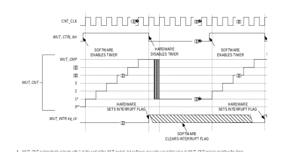
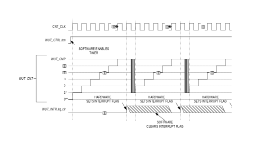

The WUT is a unique instance of a 32-bit timer.

- The wake-up timer uses the is 32.768kHz RTC source.
- Programmable prescaler with values from 1 to 4096.
- Supports three timer modes, all of which can wake the device from low-power modes:

  - One-Shot: The timer counts up to the terminal value, generates a wake-up timer event then halts.

  - Continuous: The timer counts up to the terminal value, generates a wake-up timer event then continues counting.

  - Compare: The timer counts up to the terminal value, generates a wake-up timer event, resets the count and continues counting.

- Independent interrupt handler (WUT_IRQn).

## Basic Operation
The timer modes operate by incrementing the <a href="#table20-3">WUT_CNT</a> register. The <a href="#table20-3">WUT_CNT</a>register is always readable, even while the timer is enabled and counting.

Each timer mode has a user-configurable timer period, which terminates
on the timer clock cycle following the end of the timer period
condition. The end of a timer period always sets the corresponding
interrupt flag and generates a wake-up timer interrupt (WUT_IRQn) if
enabled.

The timer peripheral automatically sets <a href="#table20-3">WUT_CNT</a> to 1 at the end of a
timer period, but <a href="#table20-3">WUT_CNT</a> is set to 0 following a system reset. This
means the first timer period following a system reset is one timer clock
longer than subsequent timer periods if <a href="#table20-3">WUT_CNT</a> is not initialized to
1 during the timer configuration step.

The timer clock frequency, *fCNT_CLK*, is a divided version
of the 32.768kHz RTC clock, as shown in [Equation 20‑1](#equation20-1).

*Equation 20-1: Wake-Up Timer Clock Frequency*

$$
f_{CNT\text{_CLK}} = \frac{f_{RTC\text{_CLK}}}{prescaler}
$$

The divisor (prescaler) can be set from 1 to 4096 using the concatenated fields <a href="#table20-7">WUT_CTRL</a>.*pres3*:<a href="#table20-7">WUT_CTRL</a>.*pres,* as shown in [Table 20‑1](#table20-1).

*Table 20-1: MAX78000 WUT Clock Period*

<table border="1" cellpadding="5" cellspacing="0">
<thead>
    <tr>
        <th><a href="#table20-7">WUT_CTRL</a>.<em>pres3</em></th>
        <th><a href="#table20-7">WUT_CTRL</a>.<em>pres</em></th>
        <th>Prescaler</th>
        <th><em>fCNT_CLK</em>(Hz)</th>
    </tr>
</thead>
<tbody>
    <tr>
        <td>0</td>
        <td>0b000</td>
        <td>1</td>
        <td>32,768</td>
    </tr>
    <tr>
        <td>0</td>
        <td>0b001</td>
        <td>2</td>
        <td>16,384</td>
    </tr>
    <tr>
        <td>0</td>
        <td>0b010</td>
        <td>4</td>
        <td>8,192</td>
    </tr>
    <tr>
        <td>0</td>
        <td>0b011</td>
        <td>8</td>
        <td>4,096</td>
    </tr>
    <tr>
        <td>0</td>
        <td>0b100</td>
        <td>16</td>
        <td>2,048</td>
    </tr>
    <tr>
        <td>0</td>
        <td>0b101</td>
        <td>32</td>
        <td>1,024</td>
    </tr>
    <tr>
        <td>0</td>
        <td>0b110</td>
        <td>64</td>
        <td>512</td>
    </tr>
    <tr>
        <td>0</td>
        <td>0b111</td>
        <td>128</td>
        <td>256</td>
    </tr>
    <tr>
        <td>1</td>
        <td>0b000</td>
        <td>256</td>
        <td>128</td>
    </tr>
    <tr>
        <td>1</td>
        <td>0b001</td>
        <td>512</td>
        <td>64</td>
    </tr>
    <tr>
        <td>1</td>
        <td>0b010</td>
        <td>1024</td>
        <td>32</td>
    </tr>
    <tr>
        <td>1</td>
        <td>0b011</td>
        <td>2048</td>
        <td>16</td>
    </tr>
    <tr>
        <td>1</td>
        <td>0b100</td>
        <td>4096</td>
        <td>8</td>
    </tr>
    <tr>
        <td>1</td>
        <td>0b101</td>
        <td>Reserved</td>
        <td>Reserved</td>
    </tr>
    <tr>
        <td>1</td>
        <td>0b110</td>
        <td>Reserved</td>
        <td>Reserved</td>
    </tr>
    <tr>
        <td>1</td>
        <td>0b111</td>
        <td>Reserved</td>
        <td>Reserved</td>
    </tr>
</tbody>
</table>

## One-Shot Mode (0)
In one-shot mode, the timer peripheral increments the <a href="#table20-3">WUT_CNT</a> register until it matches the <a href="#table20-4">WUT_CMP</a> register and then stops incrementing and disables the timer. In this mode, the timer must be re-enabled to start another one-shot mode event.

*Figure 20-1: One-Shot Mode Diagram*

### One-Shot Mode Timer Period
The timer period ends on the timer clock when <a href="#table20-3">WUT_CNT</a> = <a href="#table20-4">WUT_CMP</a>.

The timer peripheral automatically performs the following actions at the end of the timer period:

1.  <a href="#table20-3">WUT_CNT</a> is reset to 1.
2.  The timer is disabled by setting <a href="#table20-7">WUT_CTRL</a>.*ten* = 0.
3.  The timer interrupt bit <a href="#table20-6">WUT_INTR</a>.*irq_clr* is set and wakes up the device if the wake-up timer is enabled as a wake-up event, generating an interrupt.

### One-Shot Mode Configuration
Configure the timer for one-shot mode by performing the following steps:

1. Set <a href="#table20-7">WUT_CTRL</a>.*ten* = 0 to disable the timer.
2. Set <a href="#table20-7">WUT_CTRL</a>.*tmode* to 0 to select one-shot mode.
3. Set <a href="#table20-7">WUT_CTRL</a>.*pres3*:<a href="#table20-7">WUT_CTRL</a>.*pres* to determine the timer period.
4. Enable the wake-up timer as a wake-up source by setting *GCR_PM*.*wut_we* to 1.

    a. If desired, register a wake-up interrupt handler (WUT_IRQn).

5. Write an initial value to the <a href="#table20-3">WUT_CNT</a> register, if desired. This effects only the first period; subsequent timer periods always reset the <a href="#table20-3">WUT_CNT</a> register to 1.
6. Write the compare value to the <a href="#table20-4">WUT_CMP</a> register.
7. Clear the wake-up timer interrupt flag by writing 0 to <a href="#table20-6">WUT_INTR</a>.*irq_clr*.
8. Set *WUT_CTRL*.*ten* to 1 to enable the timer.
9. Enter a low-power sleep mode. See *Low-Power Modes* for details.

The timer period is calculated using the following equation:

*Equation 20-2: One-Shot Mode Timer Period*

$$
\text{One-Shot mode timer period in seconds} = 
\frac{
\text{WUT_CMP} - \text{WUT_CNT}_{\text{INITIAL VALUE}} + 1
}{
f_{\text{CNT_CLK}} \, (\text{Hz})
}
$$

### Continuous Mode (1)
In continuous mode, the wake-up timer increments <a href="#table20-3">WUT_CNT</a> until it matches <a href="#table20-4">WUT_CMP</a>, and hardware resets <a href="#table20-3">WUT_CNT</a> to 1 and continues incrementing.

*Figure 20-2: Continuous Mode Diagram*

### Continuous Mode Timer Period

The wake-up timer period ends on the timer clock following <a href="#table20-3">WUT_CNT</a> = <a href="#table20-4">WUT_CMP</a>.

The wake-up timer peripheral automatically performs the following actions at the end of the timer period:

1. <a href="#table20-3">WUT_CNT</a> is reset to 1. The wake-up timer remains enabled and continues incrementing.
2. The timer interrupt bit <a href="#table20-6">WUT_INTR</a>.*irq_clr* is set. An interrupt is generated if enabled.

### Continuous Mode Configuration
Configure the timer for continuous mode by performing the steps following:

1. Set <a href="#table20-7">WUT_CTRL</a>.*ten* = 0 to disable the timer.
2. Set <a href="#table20-7">WUT_CTRL</a>.*tmode* to 1 to select continuous mode.
3. Set <a href="#table20-7">WUT_CTRL</a>.*pres3*:<a href="#table20-7">WUT_CTRL</a>.*pres* to determine the timer period.
4. Enable the wake-up timer as a wake-up source by setting *GCR_PM*.*wut_we* to 1.

    a. If desired, register a wake-up interrupt handler (WUT_IRQn).

5. Write an initial value to the <a href="#table20-3">WUT_CNT</a> register, if desired. The initial value is only used for the first period; subsequent timer periods always reset the <a href="#table20-3">WUT_CNT</a> register to 1.
6. Write the compare value to the <a href="#table20-4">WUT_CMP</a> register.
7. Clear the wake-up timer interrupt flag by writing 0 to <a href="#table20-6">WUT_INTR</a>.*irq_clr*.
8. Set <a href="#table20-7">WUT_CTRL</a>.*ten* to 1 to enable the timer.
9. Enter a low-power sleep mode. See *Low-Power Modes* for details.

The Continuous Mode Timer Period is calculated using [Equation 20‑3](#equation20-3).

*Equation 20-3: Continuous Mode Timer Period*

$$
\text{Continuous mode timer period in seconds} = 
\frac{
\text{WUT_CMP} - \text{WUT_CNT}_{\text{INITIAL VALUE}} + 1
}{
f_{\text{CNT_CLK}} \, (\text{Hz})
}
$$

### Compare Mode (5)
In compare mode, the timer peripheral increments continually from
0x0000 0000 (after the first timer period) to the maximum value, then
rolls over to 0x0000 0000 and continues incrementing. The end of timer
period event occurs when the timer value matches the compare value, but
the timer continues to increment until the count reaches 0xFFFF FFFF.
The timer counter then rolls over and continues counting from
0x0000 0000.

The timer period ends on the timer clock following <a href="#table20-3">WUT_CNT</a> = <a href="#table20-3">WUT_CNT</a>.

The timer peripheral automatically performs the following actions when a timer period event ends:

- <a href="#table20-3">WUT_CNT</a> is reset to 0x0000 00000.
- The <a href="#table20-6">WUT_INTR</a>.*irq_clr* field is set to 1 to indicate a timer interrupt event occurred.
- The timer remains enabled and continues incrementing.

The initial compare mode timer period is calculated using [Equation 20‑4](#equation20-4). Subsequent compare mode timer periods are always 0xFFFF FFFF.

*Equation 20‑4: Compare Mode Timer Initial Period*

$$
\text{Compare mode timer period in seconds} = 
\frac{
\text{WUT_CMP} - \text{WUT_CNT}_{\text{INITIAL VALUE}} + 1
}{
f_{\text{CNT_CLK}} \, (\text{Hz})
}
$$

*Figure 20-3: Compare Mode Diagram*

Configure the timer for compare mode by doing the following:

1. Set <a href="#table20-7">WUT_CTRL</a>.*ten* = 0 to disable the timer.
2. Set <a href="#table20-7">WUT_CTRL</a>.*tmode* to 1 to select continuous mode.
3. Set <a href="#table20-7">WUT_CTRL</a>.*pres3*:<a href="#table20-7">WUT_CTRL</a>.*pres* to determine the timer period.
4. Enable the wake-up timer as a wake-up source by setting *GCR_PM*.*wut_we* to 1.

    a. If desired, register a wake-up interrupt handler (WUT_IRQn).

5. Write the compare value to the <a href="#table20-4">WUT_CMP</a> register.
6. If desired, write an initial value to <a href="#table20-3">WUT_CNT</a> register.
7. Clear the wake-up timer interrupt flag by writing 0 to <a href="#table20-6">WUT_INTR</a>.*irq_clr*.
8. Set *WUT_CTRL*.*ten* to 1 to enable the timer.
9. Enter a low-power sleep mode. See *Low-Power Modes* for details.

## Registers

See [Table 3-3](memory-register-mapping-access.md#apb-peripheral-base-address-map) for the base address of this peripheral/module. See [Table 1-1](index.md#table1-1-field-access-definitions) for an explanation of the read and write access of each field. Unless specified otherwise, all fields are reset on a system reset, soft reset, POR, and the peripheral-specific resets.

<table border="1" cellpadding="5" cellspacing="0">
<thead>
    <tr>
        <th>Offset</th>
        <th>Register Name</th>
        <th>Description</th>
    </tr>
</thead>
<tbody>
    <tr>
        <td>[0x0000]</td>
        <td><a href="#table20-3">WUT_CNT</a></td>
        <td>Wake-Up Timer Counter Register</td>
    </tr>
    <tr>
        <td>[0x0004]</td>
        <td><a href="#table20-4">WUT_CMP</a></td>
        <td>Wake-Up Timer Compare Register</td>
    </tr>
    <tr>
        <td>[0x0008]</td>
        <td><a href="#table20-5">WUT_PWM</a></td>
        <td>Wake-Up Timer PWM Register</td>
    </tr>
    <tr>
        <td>[0x000C]</td>
        <td><a href="#table20-6">WUT_INTR</a></td>
        <td>Wake-Up Timer Interrupt Register</td>
    </tr>
    <tr>
        <td>[0x0010]</td>
        <td><a href="#table20-7">WUT_CTRL</a></td>
        <td>Wake-Up Timer Control Register</td>
    </tr>
    <tr>
        <td>[0x0014]</td>
        <td><a href="#table20-8">WUT_NOLCMP</a></td>
        <td>Wake-Up Timer Non-Overlapping Compare Register</td>
    </tr>
</tbody>
</table>

### Register Details

*Table 20-3: Wake-Up Timer Count  Register*

<table border="1" cellpadding="5" cellspacing="0">
</colgroup>
<thead>
    <tr>
        <th colspan="3">Wake-Up Timer Count</th>
        <th colspan="1">WUT_CNT</th>
        <th>[0x0000]</th>
    </tr>
    <tr>
        <th>Bits</th>
        <th>Name</th>
        <th>Access</th>
        <th>Reset</th>
        <th>Description</th>
    </tr>
</thead>
<tbody>
    <tr>
        <td>31:0</td>
        <td>count</td>
        <td>R/W</td>
        <td>0</td>
        <td><strong>Timer Count Value</strong>  The current count value for the timer. This field increments as the timer counts. Reads of this register are always valid. Before writing this field, disable the timer by clearing the bit <a href="#table20-7">WUT_CTRL</a>.<em>ten</em>.
        </td>
    </tr>
</tbody>
</table>

*Table 20-4: Wake-Up Timer Compare Register*

<table border="1" cellpadding="5" cellspacing="0">
<thead>
    <tr>
        <th colspan="3">Wake-Up Timer Compare</th>
        <th colspan="1">WUT_CMP</th>
        <th>[0x0004]</th>
    </tr>
    <tr>
        <th>Bits</th>
        <th>Name</th>
        <th>Access</th>
        <th>Reset</th>
        <th>Description</th>
    </tr>
</thead>
<tbody>
    <tr>
        <td>31:0</td>
        <td>compare</td>
        <td>R/W</td>
        <td>0</td>
        <td><strong>Timer Compare Value</strong>  The value in this register is used as the compare value for the timer’s count value. The specific mode of the timer determines the
        compare field meaning. See the timer mode’s detailed configuration section for the usage of this field and its meaning.</td>
    </tr>
</tbody>
</table>

*Table 20-5: Wake-Up Timer PWM Register*

<table border="1" cellpadding="5" cellspacing="0">
<thead>
    <tr>
        <th colspan="3">Wake-Up Timer PWM</th>
        <th colspan="1">WUT_PWM</th>
        <th>[0x0008]</th>
    </tr>
    <tr>
        <th>Bits</th>
        <th>Name</th>
        <th>Access</th>
        <th>Reset</th>
        <th>Description</th>
    </tr>
</thead>
<tbody>
    <tr>
        <td>31:0</td>
        <td>-</td>
        <td>RO</td>
        <td>0</td>
        <td><strong>Reserved</strong></td>
    </tr>
</tbody>
</table>

*Table 20-6: Wake-Up Timer Interrupt Register*

<table border="1" cellpadding="5" cellspacing="0">
<thead>
    <tr>
        <th colspan="3">Wake-Up Timer Interrupt</th>
        <th colspan="1">WUT_INTR</th>
        <th>[0x000C]</th>
    </tr>
    <tr>
        <th>Bits</th>
        <th>Name</th>
        <th>Access</th>
        <th>Reset</th>
        <th>Description</th>
    </tr>
</thead>
<tbody>
    <tr>
        <td>31:1</td>
        <td>-</td>
        <td>RO</td>
        <td>0</td>
        <td><strong>Reserved</strong></td>
    </tr>
    <tr>
        <td>0</td>
        <td>irq_clr</td>
        <td>R/W</td>
        <td>0</td>
        <td><strong>Timer Interrupt Flag</strong>  If set, this field indicates a wake-up timer interrupt condition occurred. Writing any value to this bit clears the wake-up timer’s
        interrupt.
        

        0: Wake-up timer interrupt is not active. 
        1: Wake-up timer interrupt occurred.

        </td>
    </tr>
</tbody>
</table>

*Table 20-7: Wake-Up Timer Control Register*

<table border="1" cellpadding="5" cellspacing="0">
<thead>
    <tr>
        <th colspan="3">Wake-Up Timer Control</th>
        <th colspan="1">WUT_CTRL</th>
        <th>[0x0010]</th>
    </tr>
    <tr>
        <th>Bits</th>
        <th>Name</th>
        <th>Access</th>
        <th>Reset</th>
        <th>Description</th>
    </tr>
</thead>
<tbody>
    <tr>
        <td>31:9</td>
        <td>-</td>
        <td>DNM</td>
        <td>0</td>
        <td><strong>Reserved, Do Not Modify</strong></td>
    </tr>
    <tr>
        <td>8</td>
        <td>pres3</td>
        <td>R/W</td>
        <td>0</td>
        <td><strong>Timer Prescaler Select MSB</strong>  See <a href="#table20-7">WUT_CTRL</a>.<em>pres</em> for details on this field’s usage.</td>
    </tr>
    <tr>
        <td>7</td>
        <td>ten</td>
        <td>R/W</td>
        <td>0</td>
        <td><strong>Timer Enable</strong>
        0: Disabled 
        1: Enabled

        </td>
    </tr>
    <tr>
        <td>6</td>
        <td>tpol</td>
        <td>DNM</td>
        <td>0</td>
        <td><strong>Reserved, Do Not Modify</strong></td>
    </tr>
    <tr>
        <td>5:3</td>
        <td>pres</td>
        <td>R/W</td>
        <td>0</td>
        <td><strong>Timer Prescaler Select</strong> This field sets the timer’s prescaler value. The prescaler divides the RTC ‘s 32.768KHz input clock. Sets the timer’s count clock as shown in <em>Equation 20‑1</em>. The wake-up timer’s prescaler setting is a 4-bit value with <em>pres3</em> as the most significant bit and <em>pres</em> as the three least significant bits. See <em>Table 20‑1</em> for details.
        </td>
    </tr>
    <tr>
        <td>2:0</td>
        <td>tmode</td>
        <td>R/W</td>
        <td>0</td>
        <td><strong>Timer Mode Select</strong>  This field sets the timer’s operating mode.
        <table border="0">
        <tbody>
        <tr>
            <td>0:</td>
            <td>One-shot</td>
        </tr>
        <tr>
            <td>1:</td>
            <td>Continuous</td>
        </tr>
        <tr>
            <td>2 – 7:</td>
            <td>Reserved</td>
        </tr>
        </tbody>
        </table>
        </td>
        </tr>
</tbody>
</table>

*Table 20-8: Wake-Up Timer Non-Overlapping Compare Register*

<table border="1" cellpadding="5" cellspacing="0">
<thead>
    <tr>
        <th colspan="3">Wake-Up Timer Non-Overlapping Compare</th>
        <th colspan="1">WUT_NOLCMP</th>
        <th>[0x0014]</th>
    </tr>
    <tr>
        <th>Bits</th>
        <th>Name</th>
        <th>Access</th>
        <th>Reset</th>
        <th>Description</th>
    </tr>
</thead>
<tbody>
    <tr>
        <td>31:0</td>
        <td>-</td>
        <td>DNM</td>
        <td>0</td>
        <td><strong>Reserved, Do Not Modify</strong></td>
    </tr>
</tbody>
</table>