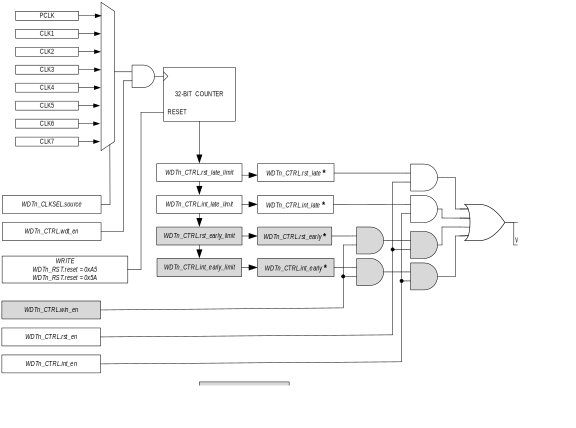
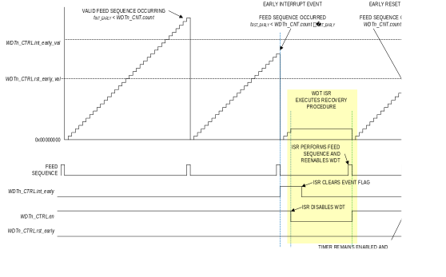
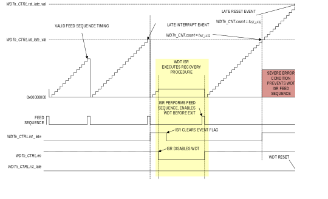

The watchdog timer (WDT) protects against corrupt or unreliable
software, power faults, and other system-level problems which may place
the IC into an improper operating state. The software must periodically
write a special sequence to a dedicated register to confirm the software
is operating correctly. Failure to reset the watchdog timer within a
user-specified time frame can first generate an interrupt allowing the
software the opportunity to identify and correct the problem. If the
software cannot regain normal operation, the watchdog timer can generate
a system reset as a last resort.

Some instances provide a windowed timer function. These instances
support an additional feature that can detect watchdog timer resets that
occur too early and too late (or never). This could happen if program
execution is corrupted and is accidentally forced into a tight loop of
code that contains a watchdog sequence. This would not be detected with
a traditional WDT because the end of the timeout periods would never be
reached. A new set of "watchdog timer early" fields are available to
support the lower limits required for windowing. Traditional watchdog
timers can only detect a loss of program control that fails to reset the
watchdog timer.

Each time the software performs a reset, as early as possible in the
software, the peripheral control register should be examined to
determine if the reset was caused by at WDT late reset event (or WDT
early reset event if the window function is supported). If so, the
software should take the desired action as part of its restart sequence.

The WDT is a critical safety feature, and most fields are reset on POR
or system reset events only.

Features:

- Single-ended (legacy) watchdog timeout.
- Windowed mode adds lower-limit timeout settings to detect loss of control in tight code loops.
- Configurable clock source.
- Configurable time-base.
- Programmable upper and lower limits for reset and interrupts from 216 to 232 time-base ticks.
- A register is provided to read the WDT counter register, simplifying code development.

[Figure 21‑1](#figure21-1) shows the block diagram of the WDT.

*Figure 21-1: Windowed Watchdog Timer Block Diagram*

## Instances
[Table 21‑1](#table21-1) shows the peripheral instances, available clock sources, and indicates which instances support the windowed watchdog functionality.

*Table 21-1: MAX78000 WDT Instances Summary*

<table border="1" cellpadding="5" cellspacing="0">
<thead>
    <tr>
        <th>Instance</th>
        <th>Register Access Name</th>
        <th>Window Support</th>
        <th>External Clock</th>
        <th>CLK0</th>
        <th>CLK1</th>
        <th>CLK2</th>
    </tr>
</thead>
<tbody>
    <tr>
        <td>WDT0</td>
        <td>WDT0</td>
        <td>Yes</td>
        <td>N/A</td>
        <td>PCLK</td>
        <td>IBRO</td>
        <td>-</td>
    </tr>
    <tr>
        <td>LPWDT0</td>
        <td>WDT1</td>
        <td>Yes</td>
        <td>N/A</td>
        <td>IBRO</td>
        <td>ERTC0</td>
        <td>INRO</td>
    </tr>
</tbody>
</table>

## Usage
When enabled, the <a href="#table21-7">WDTn_CNT</a>.*count* increments once every *tWDTCLK* period. The software periodically executes the feed sequence during correct operation and resets <a href="#table21-7">WDTn_CNT</a>.*count* to 0x0000 0000 within the target window.

The upper and lower limits of the target window are user-configurable to
accommodate different applications and non-deterministic execution times
within an application.

The WDT can generate an interrupt and a reset event in response to the
WDT activity. Interrupts are typically configured to respond first to an
event outside the target window. The approach is that a minor system
event may have temporarily delayed the execution of the feed sequence,
so the event can be diagnosed in an interrupt routine and control
returned to the system. When the WDT feed sequence occurs much earlier
than expected or not at all, a reset event can be generated that forces
the system to a known good state before continuing.

Traditional WDTs only detect execution errors that fail to perform the
WDT feed sequence. If the counter reaches the WDT late interrupt
threshold, the device attempts to regain program control by vectoring to
the dedicated WDT ISR. The ISR should reset the WDT counter, perform the
desired recovery activity, and return execution to a known good address.

If the execution error prevents the successful execution of the ISR, the
WDT continues to increment until the count reaches the WDT late reset
threshold. The WDT generates a late reset event which sets the WDT late
reset flag and generates a system interrupt.

Instances that support the window feature (<a href="#table21-4">WDTn_CTRL</a>.*win_en* = 1) can
generate a WDT early interrupt event if the WDT feed sequence occurs
earlier than expected. Analogously, the device attempts to regain
program control by vectoring to the dedicated WDT interrupt. The WDT
interrupt should reset the WDT counter, perform the desired recovery
activity, and return execution to a known good address.

A WDT feed sequence that occurs earlier than the WDT early reset
threshold indicates the execution error is significant enough to
initiate a reset of the device to correct the problem. The WDT generates
an early reset event that sets the WDT late reset flag and generates a
system interrupt.

The event flags are set regardless of the corresponding interrupt or
reset enable. This includes the early interrupt and early event flags,
even if the WDT is disabled (<a href="#table21-4">WDTn_CTRL</a>.*win_en* = 0).

### Using the WDT as a Long-Interval Timer
One use case of the WDT is as a very long interval timer in *ACTIVE*.
The timer can be configured to generate a WDT late interrupt event for
as long as 232 periods of the selected watchdog clock source.
The WDT should not be enabled to generate WDT reset events in this use
case.

### Using the WDT as a Long-Interval Wake-Up Timer
The WDT can be used as a very long internal wake-up source from *SLEEP*.
Additionally, the low power WDT can be used as a wake-up source from
*SLEEP*, *LPM*, and *UPM*. The timer can be configured to generate a WDT
wake-up event for as long as 232 periods of the selected
watchdog clock source.

## WDT Feed Sequence
The WDT feed sequence protects the system against unintentional altering
of the WDT count and unintentionally enabling or disabling the timer.

Two consecutive write instructions to the <a href="#table21-5">WDTn_RST</a>.*reset* field are
required to reset the <a href="#table21-7">WDTn_CNT</a>.*count* = 0. Global interrupts should
be disabled immediately before and re-enabled after the writes to ensure
both writes to the <a href="#table21-5">WDTn_RST</a>.*reset* field complete without
interruption.

The feed sequence must also be performed immediately before enabling the
WDT to prevent accidental triggering of the reset or interrupt as soon
as the timer is enabled. There is no timed access window for these write
operations; the operations can be separated by any length of time as
long as they occur in the required sequence

1.  Disable interrupts.
2.  In consecutive write operations:

    a. Write <a href="#table21-5">WDTn_RST</a>.*reset*: 0xA5.

    b. Write <a href="#table21-5">WDTn_RST</a>.*reset*: 0x5A.

3. If desired, enable or disable the timer.
4. Re-enable interrupts.

## WDT Events
Multiple events are supported, as shown in[ Table 21‑2](#table21-2). The corresponding event flag is set when the event occurs.

Typically the system is configured such that the late interrupt events
occur before the late reset events, and early interrupts occur when the
feed sequence has the least error from the target time, before the early
reset events.

The event flags are set even if the corresponding interrupt or reset
enable flags regardless of the state of the corresponding enable fields.
This includes the early interrupt and early event flags, even if
<a href="#table21-4">WDTn_CTRL</a>.*win_en* = 0.

Software must clear all event flags before enabling the timers.

*Table 21-2: MAX78000 WDT Event Summary*

<table border="1" cellpadding="5" cellspacing="0">
<thead>
    <tr>
        <th>Event</th>
        <th>Condition</th>
        <th>Local Interrupt Event Flag</th>
        <th>Local Interrupt Event Enable</th>
    </tr>
</thead>
<tbody>
    <tr>
        <td>Early Interrupt</td>
        <td>
Feed sequence occurs while

        
<a href="#table21-4">WDTn_CTRL</a>.<em>rst_early_val</em> ≤ <a href="#table21-7">WDTn_CNT</a>.<em>count</em>
        &lt; <a href="#table21-4">WDTn_CTRL</a>.<em>int_early_val</em>

        
<a href="#table21-4">WDTn_CTRL</a>.<em>win_en = 1</em>
</td>
        <td><a href="#table21-4">WDTn_CTRL</a>.<em>int_early</em></td>
        <td><a href="#table21-4">WDTn_CTRL</a>.<em>wdt_int_en</em></td>
    </tr>
    <tr>
        <td>Early Reset</td>
        <td>
Feed sequence occurs while

        
<a href="#table21-7">WDTn_CNT</a>.<em>count</em> &lt;
        <a href="#table21-4">WDTn_CTRL</a>.<em>rst_early_val</em>

        
<a href="#table21-4">WDTn_CTRL</a>.<em>win_en = 1</em>
</td>
        <td><a href="#table21-4">WDTn_CTRL</a>.<em>rst_early</em></td>
        <td><a href="#table21-4">WDTn_CTRL</a>.<em>wdt_rst_en</em></td>
    </tr>
    <tr>
        <td>Interrupt Late</td>
        <td><a href="#table21-7">WDTn_CNT</a>.<em>count</em> =
        <a href="#table21-4">WDTn_CTRL</a>.<em>int_late_val</em></td>
        <td><a href="#table21-4">WDTn_CTRL</a>.<em>int_late</em></td>
        <td><a href="#table21-4">WDTn_CTRL</a>.<em>wdt_int_en</em></td>
    </tr>
    <tr>
        <td>Reset Late</td>
        <td><a href="#table21-7">WDTn_CNT</a>.<em>count</em> =
        <a href="#table21-4">WDTn_CTRL</a>.<em>rst_late_val</em></td>
        <td><a href="#table21-4">WDTn_CTRL</a>.<em>rst_late</em></td>
        <td><a href="#table21-4">WDTn_CTRL</a>.<em>wdt_rst_en</em></td>
    </tr>
    <tr>
        <td>Timer Enabled</td>
        <td><a href="#table21-4">WDTn_CTRL</a>.<em>clkrdy</em> 0 → 1</td>
        <td>No event flags are set by a timer enabled event</td>
        <td></td>
    </tr>
</tbody>
</table>

### WDT Early Reset
The early reset event occurs if the software performs the WDT feed sequence while <a href="#table21-7">WDTn_CNT</a>.*count* \< <a href="#table21-4">WDTn_CTRL</a>.*rst_late_val* threshold as shown in [Table 21‑2](#table21-1). [Figure 21‑2](#figure21-2) shows the sequencing details associated with an early reset event.

*Figure 21-2: WDT Early Interrupt and Reset Event Sequencing Details*

The following occurs when a WDT early reset event occurs:

1. The hardware sets <a href="#table21-4">WDTn_CTRL</a>.*rst_early* to 1.
2. The hardware initiates a system reset:
3. The hardware resets <a href="#table21-7">WDTn_CNT</a>.*count* to 0x0000 0000 during the reset event.
4. The <a href="#table21-4">WDTn_CTRL</a>.*en* field is unaffected by a system reset. The WDT continues incrementing.
5. The <a href="#table21-4">WDTn_CTRL</a>.*rst_early* field is unaffected by a system reset, allowing the software to determine an early reset event occurred.

### WDT Early Interrupt
The early interrupt event occurs if the software performs the WDT feed sequence while <a href="#table21-4">WDTn_CTRL</a>.*rst_early_val* ≤ <a href="#table21-7">WDTn_CNT</a>.*count* \< *<a href="#table21-4">WDTn_CTRL</a>.*int_early_val* as shown in *Table 21‑2*. *Figure 21‑2* shows the sequencing details associated with an early interrupt event, including the required
functions performed by the WDT ISR.

The hardware performs the following when a WDT early interrupt event occurs:

1. The <a href="#table21-4">WDTn_CTRL</a>.*int_early* field is set to 1.
2. An interrupt occurs if enabled.

### WDT Late Reset

The late reset event occurs if the counter increments where <a href="#table21-7">WDTn_CNT</a>.*count* is equal to the <a href="#table21-4">WDTn_CTRL</a>.*rst_late_val* threshold, as shown in [Table 21‑2](#table21-2). [Figure 21‑3](#figure21-3) shows the sequencing details associated with a late reset event.

*Figure 21-3: WDT Late Interrupt and Reset Event Sequencing Details*

The following occurs when a WDT late reset event occurs:

1. The hardware sets <a href="#table21-4">WDTn_CTRL</a>.*rst_late* to 1.
2. The hardware initiates a system reset:
3. The hardware resets <a href="#table21-7">WDTn_CNT</a>.*count* to 0x0000 0000 during the reset event.
4. The <a href="#table21-4">WDTn_CTRL</a>.*en* field is unaffected by a system reset. The WDT continues incrementing.
5. The <a href="#table21-4">WDTn_CTRL</a>.*rst_late* field is unaffected by a system reset.

### WDT Late Interrupt
The late reset event occurs if the counter increments to the point where <a href="#table21-7">WDTn_CNT</a>.*count* = <a href="#table21-4">WDTn_CTRL</a>.*int_late_val* threshold, as shown in [Table 21‑2](#table21-2). [Figure 21‑3](#figure21-3) shows the sequencing details associated with a late interrupt event, including the required functions performed by the WDT interrupt handler.

The following occurs when WDT late interrupt event occurs:

1. The hardware sets <a href="#table21-4">WDTn_CTRL</a>.*int_late* to 1.
2. The hardware initiates an interrupt if enabled.

## Initializing the WDT
The full procedure for configuring the WDT is shown below:

1. Execute the WDT feed sequence and disable the WDT:

    a. Disable global interrupts

    b. Write <a href="#table21-5">WDTn_RST</a>.*reset* to 0xA5.

    c. Write <a href="#table21-5">WDTn_RST</a>.*reset* to 0x5A. Hardware will reset <a href="#table21-7">WDTn_CNT</a>.*count* = 0x0000 0000.

    d. Set <a href="#table21-4">WDTn_CTRL</a>.*en* to 0 to disable the WDT.

2. Verify the peripheral is disabled before proceeding:

    a. Poll <a href="#table21-4">WDTn_CTRL</a>.*clkrdy* until it reads 1, or

    b. Set <a href="#table21-4">WDTn_CTRL</a>.*clkrdy_ie =* 1 to generate a WDT enabled interrupt event.

3. Re-enable global interrupts.
4. Configure <a href="#table21-6">WDTn_CLKSEL</a>.*source* to select the clock source.
5. Configure the traditional/legacy thresholds:

    a. Configure <a href="#table21-4">WDTn_CTRL</a>.*int_late_val* to the desired threshold for the WDT late interrupt event.
    b. Configure <a href="#table21-4">WDTn_CTRL</a>.*rst_late_val* to the desired threshold for the WDT late reset event.

6. If using the optional windowed WDT feature:

    a. Set <a href="#table21-4">WDTn_CTRL</a>.*win_en* = 1 to enable the windowed WDT feature.

    b. Configure <a href="#table21-4">WDTn_CTRL</a>.*int_early_val* to the desired threshold for the WDT early interrupt event.

    c. Configure <a href="#table21-4">WDTn_CTRL</a>.*rst_early_val* to the desired threshold for the WDT early reset event.

    d. Set <a href="#table21-4">WDTn_CTRL</a>.*wdt_int_en* to generate an interrupt when a WDT late interrupt event occurs. If <a href="#table21-4">WDTn_CTRL</a>.*win_en* = 1, an interrupt is generated by a WDT late interrupt event and a WDT early interrupt event.

    e. Set <a href="#table21-4">WDTn_CTRL</a>.*wdt_rst_en* to generate an interrupt when a WDT late reset event occurs. If <a href="#table21-4">WDTn_CTRL</a>.*win_en* = 1, an interrupt is generated by a WDT late reset event and a WDT early reset event.

7. Execute the WDT feed sequence and enable the WDT:

    a. Disable global interrupts

    b. Write <a href="#table21-5">WDTn_RST</a>.*reset* to 0xA5.

    c. Write <a href="#table21-5">WDTn_RST</a>.*reset* to 0x5A. Hardware will reset <a href="#table21-7">WDTn_CNT</a>.*count* = 0x0000 0000.

    d. Set <a href="#table21-4">WDTn_CTRL</a>.*en* to 1 to enable the WDT.

8. Verify the peripheral is enabled before proceeding:

    a. Poll <a href="#table21-4">WDTn_CTRL</a>.*clkrdy* until it reads 1, or

    b. Set <a href="#table21-4">WDTn_CTRL</a>.*clkrdy_ie =* 1 to generate a WDT enabled event interrupt.

9. Re-enable global interrupts.

## Resets

The WDT is a critical safety feature, and most of the fields are set on POR or system reset events only.

## Registers

See [Table 3-3](memory-register-mapping-access.md#apb-peripheral-base-address-map) for the base address of this peripheral/module. If multiple instances of the peripheral are provided, each instance has its own independent set of the registers shown in [Table 21‑3](#table21-3). Register names for a specific instance are defined by replacing "n" with the instance number. As an example, a register PERIPHERALn_CTRL resolves to PERIPHERAL0_CTRL and PERIPHERAL1_CTRL for instances 0 and 1, respectively.

See [Table 1-1](index.md#table1-1-field-access-definitions) for an explanation of the read and write access of each field. Unless specified otherwise, all fields are reset on a system reset, soft reset, POR, and the peripheral-specific resets.

*Table 21-3: WDT Register Summary*

<table border="1" cellpadding="5" cellspacing="0">
<thead>
    <tr>
        <th>Offset</th>
        <th>Register</th>
        <th>Name</th>
    </tr>
</thead>
<tbody>
    <tr>
        <td>[0x0000]</td>
        <td><a href="#table21-4">WDTn_CTRL</a></td>
        <td>WDT Control Register</td>
    </tr>
    <tr>
        <td>[0x0004]</td>
        <td><a href="#table21-5">WDTn_RST</a></td>
        <td>WDT Reset Register</td>
    </tr>
    <tr>
        <td>[0x0008]</td>
        <td><a href="#table21-6">WDTn_CLKSEL</a></td>
        <td>WDT Clock Select Register</td>
    </tr>
    <tr>
        <td>[0x000C]</td>
        <td><a href="#table21-7">WDTn_CNT</a></td>
        <td>WDT Count Register</td>
    </tr>
</tbody>
</table>

### Register Details

*Table 21-4: WDT Control Register*

<table border="1" cellpadding="5" cellspacing="0">
<thead>
    <tr>
        <th colspan="3">WDT Control</th>
        <th colspan="1">WDTn_CTRL</th>
        <th>[0x0000]</th>
    </tr>
    <tr>
        <th>Bits</th>
        <th>Name</th>
        <th>Access</th>
        <th>Reset</th>
        <th>Description</th>
    </tr>
</thead>
<tbody>
    <tr>
        <td>31</td>
        <td>rst_late</td>
        <td>R/W</td>
        <td>0</td>
        <td><strong>Reset Late Event</strong>  A watchdog reset event occurred after the time specified in <a href="#table21-4">WDTn_CTRL</a>.<em>rst_late_val</em>. This flag is set even if <a href="#table21-4">WDTn_CTRL</a>.<em>win_en</em> = 0 or <a href="#table21-4">WDTn_CTRL</a>.<em>wdt_rst_en</em> = 0. The software has to clear
        the flag appropriately in case of carried-over flags from prior operations.
        

        0: Normal operation 
        1: Watchdog reset occurred after <a href="#table21-4">WDTn_CTRL</a>.<em>rst_early_val</em>.

        </td>
    </tr>
    <tr>
        <td>30</td>
        <td>rst_early</td>
        <td>R/W</td>
        <td>0</td>
        <td><strong>Reset Early Event</strong>  A watchdog reset event occurred before the time specified in <a href="#table21-4">WDTn_CTRL</a>.<em>rst_early_val</em>. This flag is set even if <a href="#table21-4">WDTn_CTRL</a>.<em>win_en</em> = 0 or <a href="#table21-4">WDTn_CTRL</a>.<em>wdt_rst_en</em> = 0. The software has to clear
        the flag appropriately in case of carried-over flags from prior operations.
        

        0: Normal operation 
        1: Watchdog reset occurred before <a href="#table21-4">WDTn_CTRL</a>.<em>rst_early_val</em>.

        </td>
    </tr>
    <tr>
        <td>29</td>
        <td>win_en</td>
        <td>R/W</td>
        <td>0</td>
        <td><strong>Window Function Enable</strong>
        

        0: Disabled. WDT recognizes interrupt late and reset late events, supporting legacy implementations. 
        1: Enabled

        </td>
    </tr>
    <tr>
        <td>28</td>
        <td>clkrdy</td>
        <td>R</td>
        <td>0</td>
        <td><strong>Clock Status</strong>  This field is cleared by the hardware when software changes the state of <a href="#table21-4">WDTn_CTRL</a>.<em>en</em>. The hardware sets the field to 1 when the change to the requested enable or disable state completes.
        

        0: WDT clock is off. 
        1: WDT clock is on.

        </td>
    </tr>
    <tr>
        <td>27</td>
        <td>clkrdy_ie</td>
        <td>R/W</td>
        <td>0</td>
        <td><strong>Clock Switch Ready Interrupt Enable</strong>  This interrupt prevents the software from needing to poll the <a href="#table21-4">WDTn_CTRL</a>.<em>clkrdy</em> all the time. When <a href="#table21-4">WDTn_CTRL</a>.<em>clkrdy</em> goes from high to low, the interrupt signals that the transition is complete.
        

        0: Disabled 
        1: Enabled

        </td>
    </tr>
    <tr>
        <td>26:24</td>
        <td>-</td>
        <td>RO</td>
        <td>0</td>
        <td><strong>Reserved</strong></td>
    </tr>
    <tr>
        <td>23:20</td>
        <td>rst_early_val</td>
        <td>R/W</td>
        <td>0</td>
        <td><strong>Reset Early Event Threshold</strong>
        

        0x0: 231 × <em>tWDTCLK</em> 
        0x1: 230 × <em>tWDTCLK</em> 
        0x2: 229 × <em>tWDTCLK</em> 
        0x3: 228 × <em>tWDTCLK</em> 
        0x4: 227 × <em>tWDTCLK</em> 
        0x5: 226 × <em>tWDTCLK</em> 
        0x6: 225 × <em>tWDTCLK</em> 
        0x7: 224 × <em>tWDTCLK</em> 
        0x8: 223 × <em>tWDTCLK</em> 
        0x9: 222 × <em>tWDTCLK</em> 
        0xA: 221 × <em>tWDTCLK</em> 
        0xB: 220 × <em>tWDTCLK</em> 
        0xC: 219 × <em>tWDTCLK</em> 
        0xD: 218 × <em>tWDTCLK</em> 
        0xE: 217 × <em>tWDTCLK</em> 
        0xF: 216 × <em>tWDTCLK</em>

        
<em>Note: The watchdog timer must be disabled (<a href="#table21-4">WDTn_CTRL</a>.<em>en</em> = 0) before changing this field.</em>
</td>
    </tr>
    <tr>
        <td>19:16</td>
        <td>int_early_val</td>
        <td>R/W</td>
        <td>0</td>
        <td><strong>Interrupt Early Event Threshold</strong>
        

        0x0: 231 × <em>tWDTCLK</em> 
        0x1: 230 × <em>tWDTCLK</em> 
        0x2: 229 × <em>tWDTCLK</em> 
        0x3: 228 × <em>tWDTCLK</em> 
        0x4: 227 × <em>tWDTCLK</em> 
        0x5: 226 × <em>tWDTCLK</em> 
        0x6: 225 × <em>tWDTCLK</em> 
        0x7: 224 × <em>tWDTCLK</em> 
        0x8: 223 × <em>tWDTCLK</em> 
        0x9: 222 × <em>tWDTCLK</em> 
        0xA: 221 × <em>tWDTCLK</em> 
        0xB: 220 × <em>tWDTCLK</em> 
        0xC: 219 × <em>tWDTCLK</em> 
        0xD: 218 × <em>tWDTCLK</em> 
        0xE: 217 × <em>tWDTCLK</em> 
        0xF: 216 × <em>tWDTCLK</em>

        
<em>Note: The watchdog timer must be disabled (<a href="#table21-4">WDTn_CTRL</a>.<em>en</em> = 0) before changing this field.</em>
</td>
    </tr>
    <tr>
        <td>15:13</td>
        <td>-</td>
        <td>RO</td>
        <td>0</td>
        <td><strong>Reserved</strong></td>
    </tr>
    <tr>
        <td>12</td>
        <td>int_early</td>
        <td>R/W</td>
        <td>0</td>
        <td><strong>Interrupt Early Flag</strong>  A feed sequence occurred earlier than the time determined by the <a href="#table21-4">WDTn_CTRL</a>.<em>int_early_val</em> field. This flag will be set even if <a href="#table21-4">WDTn_CTRL</a>.<em>win_en</em> = 0.
        

        0: No interrupt event 
        1: Interrupt event occurred. Generates a WDT interrupt if <a href="#table21-4">WDTn_CTRL</a>.<em>wdt_int_en</em> = 1.

        </td>
    </tr>
    <tr>
        <td>11</td>
        <td>wdt_rst_en</td>
        <td>R/W</td>
        <td>0</td>
        <td><strong>WDT Reset Enable</strong>
        

        0: Disabled 
        1: Enabled
</td>
    </tr>
    <tr>
        <td>10</td>
        <td>wdt_int_en</td>
        <td>R/W</td>
        <td>0</td>
        <td><strong>WDT Interrupt Enable</strong>
        

        0: Disabled 
        1: Enabled
</td>
    </tr>
    <tr>
        <td>9</td>
        <td>int_late</td>
        <td>R/W</td>
        <td>0</td>
        <td><strong>Interrupt Late Flag</strong>  A watchdog feed sequence did not occur before the time determined by the <a href="#table21-4">WDTn_CTRL</a>.<em>int_late_val</em> field.
        

        

        0: No interrupt event. 
        1: Interrupt event occurred.

        
<em>Note: A WDT interrupt is generated if the WDT interrupt is enabled
        (<a href="#table21-4">WDTn_CTRL</a>.wdt_int_en = 1).</em>
</td>
    </tr>
    <tr>
        <td>8</td>
        <td>en</td>
        <td>R/W</td>
        <td>0</td>
        <td><strong>WDT Enable</strong>  This field enables/disables the WDT peripheral clock.
        <a href="#table21-7">WDTn_CNT</a>.<em>count</em> holds its value while the WDT is  disabled. The WDT feed sequence must be performed immediately before any change to this field.
        

        0: Disabled 
        1: Enabled
</td>
    </tr>
    <tr>
        <td>7:4</td>
        <td>rst_late_val</td>
        <td>R/W</td>
        <td>0</td>
        <td><strong>Reset Late Event Threshold</strong>
        

        0x0: 231 × <em>tWDTCLK</em> 
        0x1: 230 × <em>tWDTCLK</em> 
        0x2: 229 × <em>tWDTCLK</em> 
        0x3: 228 × <em>tWDTCLK</em> 
        0x4: 227 × <em>tWDTCLK</em> 
        0x5: 226 × <em>tWDTCLK</em> 
        0x6: 225 × <em>tWDTCLK</em> 
        0x7: 224 × <em>tWDTCLK</em> 
        0x8: 223 × <em>tWDTCLK</em> 
        0x9: 222 × <em>tWDTCLK</em> 
        0xA: 221 × <em>tWDTCLK</em> 
        0xB: 220 × <em>tWDTCLK</em> 
        0xC: 219 × <em>tWDTCLK</em> 
        0xD: 218 × <em>tWDTCLK</em> 
        0xE: 217 × <em>tWDTCLK</em> 
        0xF: 216 × <em>tWDTCLK</em>

        
<em>Note: The watchdog timer must be disabled (<a href="#table21-4">WDTn_CTRL</a>.en = 0) before changing this field.</em>
</td>
    </tr>
    <tr>
        <td>3:0</td>
        <td>int_late_val</td>
        <td>R/W</td>
        <td>0</td>
        <td><strong>Interrupt Late Event Threshold</strong>
        

        0x0: 231 × <em>tWDTCLK</em> 
        0x1: 230 × <em>tWDTCLK</em> 
        0x2: 229 × <em>tWDTCLK</em> 
        0x3: 228 × <em>tWDTCLK</em> 
        0x4: 227 × <em>tWDTCLK</em> 
        0x5: 226 × <em>tWDTCLK</em> 
        0x6: 225 × <em>tWDTCLK</em> 
        0x7: 224 × <em>tWDTCLK</em> 
        0x8: 223 × <em>tWDTCLK</em> 
        0x9: 222 × <em>tWDTCLK</em> 
        0xA: 221 × <em>tWDTCLK</em> 
        0xB: 220 × <em>tWDTCLK</em> 
        0xC: 219 × <em>tWDTCLK</em> 
        0xD: 218 × <em>tWDTCLK</em> 
        0xE: 217 × <em>tWDTCLK</em> 
        0xF: 216 × <em>tWDTCLK</em>

        
<em>Note: The watchdog timer must be disabled (<a href="#table21-4">WDTn_CTRL</a>.en = 0) before changing this field.</em>
</td>
    </tr>
</tbody>
</table>

*Table 21-5: WDT Reset Register*

<table border="1" cellpadding="5" cellspacing="0">
<thead>
    <tr>
        <th colspan="3">WDT Reset</th>
        <th colspan="1">WDTn_RST</th>
        <th>[0x0004]</th>
    </tr>
    <tr>
        <th>Bits</th>
        <th>Name</th>
        <th>Access</th>
        <th>Reset</th>
        <th>Description</th>
    </tr>
</thead>
<tbody>
    <tr>
        <td>31:8</td>
        <td>-</td>
        <td>RO</td>
        <td>0</td>
        <td><strong>Reserved</strong></td>
    </tr>
    <tr>
        <td>7:0</td>
        <td>reset</td>
        <td>R/W</td>
        <td>0<em>✝</em></td>
        <td><strong>Reset Watchdog Timer Count</strong>  Writing the WDT feed sequence, in two consecutive write instructions, to this register resets the internal counter to 0x0000 0000. Perform the following steps to perform a WDT feed sequence:
        

        1. Write <a href="#table21-5">WDTn_RST</a>.<em>reset</em> = 0xA5 
        2. Write <a href="#table21-5">WDTn_RST</a>.<em>reset</em> = 0x5A 
        Writes to the <a href="#table21-4">WDTn_CTRL</a>.<em>en</em> field, which enable or
        disable the WDT, must be the next instruction following the WDT feed sequence.

        
✝<em>Note: This field is set to 0 on a POR and is not affected
        by any other form of reset.</em>
</td>
    </tr>
</tbody>
</table>

*Table 21-6: WDT Clock Source Select Register*

<table border="1" cellpadding="5" cellspacing="0">
<thead>
    <tr>
        <th colspan="3">WDT Clock Source Select</th>
        <th colspan="1">WDTn_CLKSEL</th>
        <th>[0x0008]</th>
    </tr>
    <tr>
        <th>Bits</th>
        <th>Name</th>
        <th>Access</th>
        <th>Reset</th>
        <th>Description</th>
    </tr>
</thead>
    <tbody>
        <tr>
        <td>31:3</td>
        <td>-</td>
        <td>RO</td>
        <td>0</td>
        <td><strong>Reserved</strong></td>
    </tr>
    <tr>
        <td>2:0</td>
        <td>source</td>
        <td>R/W</td>
        <td>0<em>✝</em></td>
        <td><strong>Clock Source Select</strong>  See <a href="#table21-1">Table 21‑1</a> for available clock options.
        

            0: CLK0 
            1: CLK1 
            2: CLK2 
            3: CLK3 
            4: CLK4 
            5: CLK5 
            6: CLK6 
            7: CLK7

        
✝<em>Note: This field is only reset on a POR and unaffected by other resets.
        </em>

        
<em>Note: The watchdog timer must be disabled (<a href="#table21-4">WDTn_CTRL</a>.en = 0) before changing this field.</em>
</td>
    </tr>
</tbody>
</table>

*Table 21-7: WDT Count Register*

<table border="1" cellpadding="5" cellspacing="0">
<thead>
    <tr>
        <th colspan="3">WDT Count</th>
        <th colspan="1">WDTn_CNT</th>
        <th>[0x000C]</th>
    </tr>
    <tr>
        <th>Bits</th>
        <th>Name</th>
        <th>Access</th>
        <th>Reset</th>
        <th>Description</th>
    </tr>
</thead>
<tbody>
    <tr>
        <td>31:0</td>
        <td>count</td>
        <td>R</td>
        <td>0</td>
        <td><strong>WDT Counter</strong>  This field is a mirror of the watch dog timer's counter value.
        
This register is reset by a system reset, as well as the watchdog feeding sequence.

        
<em>Note: The watchdog timer must be disabled (<a href="#table21-4">WDTn_CTRL</a>.en = 0) before reading this field.</em>
</td>
    </tr>
</tbody>
</table>